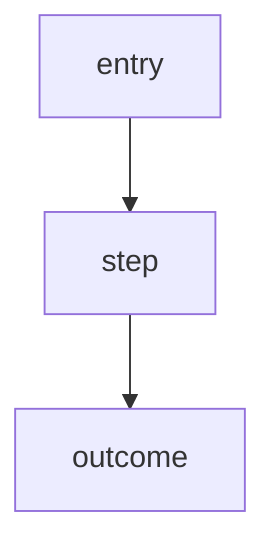

# /product:spec

Turn a Git issue into a spec.

## Clarify first (do not hand over an empty template)

Before writing `spec.md`, ask the user **3-5 clarifying questions** grounded in this issue, then write the spec from the answers. Draw from: target user, the pain point, in/out of scope, success signal, main exception paths. If the issue and its evidence already answer a question, skip it — do not ask what you can read. This is the ai-dev-tasks pattern: question → fill, never blank → fill.

## Do

1. Create `specs/<issue-id>-<slug>/spec.md`.
2. Fill the template below. `## Non-Goals` and `## Alternatives Considered` are **required** — they are what separates a usable spec from a thin one (scope control + decision archive).
3. Include at least one **Mermaid diagram** when the issue has any flow, sequence, or state (most do). Mermaid renders natively on GitHub and Obsidian, so the canonical `spec.md` is also the visual artifact — no separate file needed.
4. Keep the Git issue linked, and add the pipeline pointers (previous/next artifact) so the planning chain stays connected.

## Template

````markdown
# Spec: <title>

Issue: `<issue-id>`
Prev: <upstream artifact, e.g. opportunity / benchmark> · Next: <product:plan>

## Problem
<pain point — who hurts, when, why it matters>

## Goals
<numbered outcomes>

## Non-Goals
<explicitly out of scope — required>

## Users & Scenarios
<as a / I want / so that + main + exception paths>

## Proposed Solution
<the approach>



## Alternatives Considered
<options weighed and why rejected — required>

## Acceptance Criteria
<verifiable checks>

## Risks & Open Questions
````

## Selective depth (not every artifact on every issue)

The diagram, Non-Goals, and Alternatives belong in essentially every spec. The heavier planning artifacts — user scenario detail, IA tree, customer journey, screen plans — are produced **only when the issue warrants them** (a UX feature needs screens; a refactor does not). Reach for `/product:design` / `/product:analyze` then, not by default. See `046-planning-artifact-templates`.

## Next

- `/product:analyze` if metrics or evidence are needed
- `/product:design` if UX flow, IA, journey, or screens are warranted
- `/product:plan` when the spec is ready

## Reference

Template patterns benchmarked in `memory/evidence/2026-06-28-planning-artifact-templates-benchmark.md` (ai-dev-tasks PRD, ml-design-docs, Mermaid).
