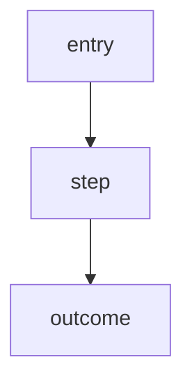

# /product:spec

Turn a Git issue into a spec.

## Clarify only when needed

Before writing `spec.md`, read the issue, linked opportunity, benchmark, inbox, and prior notes. If they already answer target user, pain point, in/out of scope, success signal, and main exception paths, write the spec without extra questions.

Ask the user only when the missing answer changes scope, priority, risk, or acceptance criteria. Default to **1-3 concise questions**, not a long interview. Preserve shaped product rationale from opportunity/issue/interview notes so execution and review do not lose the original context.

## Do

1. Create `specs/<issue-id>-<slug>/spec.md`.
2. Fill the template below. `## Non-Goals` and `## Alternatives Considered` are **required** — they are what separates a usable spec from a thin one (scope control + decision archive).
3. Include at least one **Mermaid diagram** when the issue has any flow, sequence, or state (most do). Mermaid renders natively on GitHub and Obsidian, so the canonical `spec.md` is also the visual artifact — no separate file needed.
4. Keep the Git issue linked, and add the pipeline pointers (previous/next artifact) so the planning chain stays connected.
5. **Korean reading sidecar (049, new artifacts forward).** English `spec.md` stays canonical. When authoring a *new* spec, also write `spec.ko.md` beside it — same content in Korean prose — so the 047 panel's `English / 한글` toggle can show it to a Korean reviewer. Convention, not a gate: a missing `.ko.md` simply falls back to English. Do not retro-translate existing specs; do not translate the canonical file in place.

## Template

````markdown
# Spec: <title>

Issue: `<issue-id>`
Prev: <upstream artifact, e.g. opportunity / benchmark> · Next: <product:plan>

## Problem
<pain point — who hurts, when, why it matters>

## Goals
<numbered outcomes>

## Non-Goals
<explicitly out of scope — required>

## Users & Scenarios
<as a / I want / so that + main + exception paths>

## Proposed Solution
<the approach>



## Alternatives Considered
<options weighed and why rejected — required>

## Acceptance Criteria
<verifiable checks>

## Risks & Open Questions
````

## Constitution Assumed (issue 073)

Specs assume `workspace/constitution.md` — do not restate its principles in a spec. Only constraints specific to this issue belong in the spec body; shared engineering law arrives by reference when the plan is written.

## Selective depth (not every artifact on every issue)

The diagram, Non-Goals, and Alternatives belong in essentially every spec. The heavier planning artifacts — user scenario detail, IA tree, customer journey, screen plans — are produced **only when the issue warrants them** (a UX feature needs screens; a refactor does not). Reach for `/product:design` / `/product:analyze` then, not by default. See `046-planning-artifact-templates`.

## Next

- `/product:analyze` if metrics or evidence are needed
- `/product:design` if UX flow, IA, journey, or screens are warranted
- `/product:plan` when the spec is ready

## Reference

Template patterns benchmarked in `memory/evidence/2026-06-28-planning-artifact-templates-benchmark.md` (ai-dev-tasks PRD, ml-design-docs, Mermaid).
