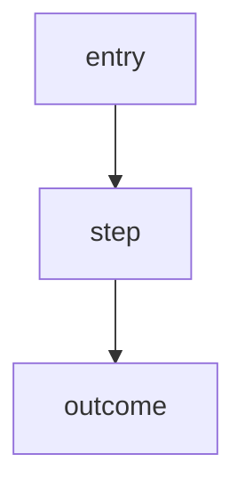

# /product:spec

Turn a Git issue into a spec.

## Clarify only when needed

Before writing `spec.md`, read the issue, linked opportunity, benchmark, inbox, and prior notes. If they already answer target user, pain point, in/out of scope, success signal, and main exception paths, write the spec without extra questions.

Ask the user only when the missing answer changes scope, priority, risk, or acceptance criteria. Default to **1-3 concise questions**, not a long interview. Preserve shaped product rationale from opportunity/issue/interview notes so execution and review do not lose the original context.

## Do

1. Create `specs/<issue-id>-<slug>/spec.md`.
2. Fill the template below. `## Non-Goals` and `## Alternatives Considered` are **required** — they are what separates a usable spec from a thin one (scope control + decision archive).
3. Include at least one **Mermaid diagram** when the issue has any flow, sequence, or state (most do). Mermaid renders natively on GitHub and Obsidian, so the canonical `spec.md` is also the visual artifact — no separate file needed.
4. Keep the Git issue linked, and add the pipeline pointers (previous/next artifact) so the planning chain stays connected.
5. **Korean reading sidecar (049, new artifacts forward).** English `spec.md` stays canonical. When authoring a *new* spec, also write `spec.ko.md` beside it — same content in Korean prose — so the 047 panel's `English / 한글` toggle can show it to a Korean reviewer. Convention, not a gate: a missing `.ko.md` simply falls back to English. Do not retro-translate existing specs; do not translate the canonical file in place.

## Template

````markdown
# Spec: <title>

Issue: `<issue-id>`
Prev: <upstream artifact, e.g. opportunity / benchmark> · Next: <product:plan>

## Problem
<pain point — who hurts, when, why it matters>

## Goals
<numbered outcomes>

## Non-Goals
<explicitly out of scope — required>

## Users & Scenarios
<as a / I want / so that + main + exception paths>

## Proposed Solution
<the approach>


```mermaid
flowchart TD
    A[entry] --> B[step] --> C[outcome]
```

## Alternatives Considered
<options weighed and why rejected — required>

## Acceptance Criteria
<verifiable checks>

## Risks & Open Questions
````

## Constitution Assumed (issue 073)

Specs assume `workspace/constitution.md` — do not restate its principles in a spec. Only constraints specific to this issue belong in the spec body; shared engineering law arrives by reference when the plan is written.

## Selective depth (not every artifact on every issue)

The diagram, Non-Goals, and Alternatives belong in essentially every spec. The heavier planning artifacts — user scenario detail, IA tree, customer journey, screen plans — are produced **only when the issue warrants them** (a UX feature needs screens; a refactor does not). Reach for `/product:design` / `/product:analyze` then, not by default. See `046-planning-artifact-templates`.

## 승인 요청 쓰는 법 (issue 129)

승인 요청은 `## Human Review Decisions`에 씁니다. 번호가 붙어도(`## 15. Human
Review Decisions`) 같은 섹션입니다.

**항목마다 둘 중 하나를 반드시 붙입니다.**

- `[확인만]` — 측정된 정답이 있거나 이미 그렇게 동작 중인 것. **한 줄이면 됩니다.**
- `[사장님 결정]` — 진짜 판단이 필요한 것. **아래 다섯 칸을 다 채웁니다.**

```markdown
- [사장님 결정] <결정할 내용>
  - 왜 이 결정이 필요한가요? …
  - 지금 무엇이 잘못되고 있나요? …
  - 실제로 측정된 예시 …
  - 다른 선택지와 그 비용 …
  - 승인하면 무엇이 달라지나요? …
```

칸 이름은 한국어입니다. 읽는 사람이 명세를 쓴 사람이 아니라 사장님이기 때문입니다 —
이슈의 `## 요약`과 같은 이유입니다.

**왜 강제하나.** 명세 112 §15는 넷을 똑같은 무게의 명사구로 늘어놓았고, 그중 하나만
진짜 결정이었습니다. 나머지 셋은 측정된 정답이 있는 교정이었습니다. 사장님은 판단할
하나를 찾으려고 셋을 읽어야 했고, 결정에 필요한 네 가지 사실은 아무도 열어 볼 이유가
없는 `evidence/SIMULATION-REPORT.md`에 있었습니다. 한 번 왕복했습니다.

이미 승인된 항목(`**[approved …]**`)과 끝난 이슈의 명세는 검사하지 않습니다.

## 처음 쓰는 말은 풀어쓴다

**쉬운 말을 본문에 쓰고, 전문용어는 괄호에 넣습니다.**

```
쉬운 말 (전문용어)
```

읽는 사람이 둘입니다. 잘 모르는 사람은 본문만 읽고 이해하고, 아는 사람은
괄호를 보고 "아 그거" 하고 넘어갑니다. **한쪽만 맞추면 다른 쪽이 막힙니다.**

용어를 아예 빼면 안 됩니다. 아는 사람이 검색도 못 하고, 나중에 코드에서
그 이름을 만났을 때 연결이 안 됩니다.

기계는 이걸 검사할 수 없습니다. 사람이 지키는 규칙입니다.

**이렇게 씁니다:**

| 이렇게 썼다 | 왜 안 통했나 | 이렇게 썼어야 했다 |
| --- | --- | --- |
| "진단이 `doctor 출력`에 나와야 하는가" | `doctor 출력`이 뭔지 안 썼습니다 | "`/moduflow 검사`를 돌리면 **항목 31개짜리 기계용 덩어리(JSON)**가 나옵니다. 사람이 읽는 화면이 아닙니다. 이 진단을 거기만 넣을지, 사람이 보는 자리까지 끌어낼지" |
| "번역기를 걷어낸다" | **없는 걸 걷어낸다**고 썼습니다. 실제로는 만드는 것이었습니다 | "지금 **도구별 번역기(호스트 어댑터, host adapter)**가 없어서 한 도구 사정이 공용 파일에 박혀 있습니다. 번역기를 만들어서 그걸 빼냅니다" |

**더 있는 예:**

- 말길 알아듣는 장치(라우터, router)
- 작업 공간을 따로 파는 것(워크트리, git worktree)
- 되돌릴 수 있게 묶어서 처리하는 것(트랜잭션, transaction)
- 지금 상태를 베껴 만든 사본(투영, projection)

두 번 다 **칸은 다 채워져 있었습니다.** 칸을 채우는 것과 읽히는 것은 다릅니다.

## Next

- `/moduflow analyze` if metrics or evidence are needed
- `/moduflow design` if UX flow, IA, journey, or screens are warranted
- `/moduflow plan` when the spec is ready

## Reference

Template patterns benchmarked in `memory/evidence/2026-06-28-planning-artifact-templates-benchmark.md` (ai-dev-tasks PRD, ml-design-docs, Mermaid).
