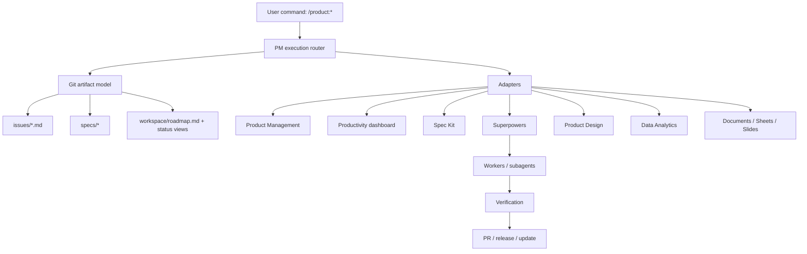

# ModuFlow Architecture

## Layers



## Rule

All durable state is Git-managed. Adapters may create views, drafts, reports, dashboards, and prototypes, but they must reference an issue ID.

## Project Artifact Tree

```text
.moduflow/
  config.json
  state.json
issues/
  001-example.md
specs/
  001-example/
    spec.md
    analysis.md
    metrics.md
    design-brief.md
    prototype.md
    plan.md
    tasks.md
    status.md
    pr.md
    release.md
    stakeholder-update.md
workspace/
  inbox.md
  opportunities.md
  roadmap.md
  dashboard.md
```

