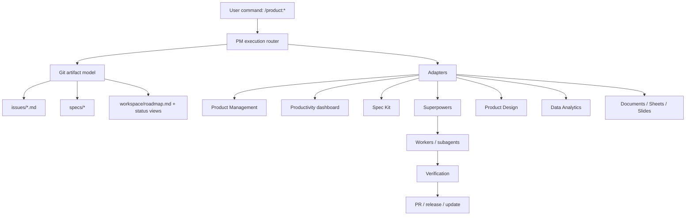
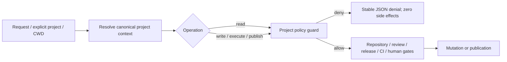

# ModuFlow Architecture

## Layers


```mermaid
flowchart TB
  U["User command: /product:*"] --> R["PM execution router"]
  R --> G["Git artifact model"]
  G --> I["issues/*.md"]
  G --> S["specs/*"]
  G --> M["workspace/roadmap.md + status views"]
  R --> A["Adapters"]
  A --> PM["Product Management"]
  A --> P["Productivity dashboard"]
  A --> SK["Spec Kit"]
  A --> SP["Superpowers"]
  A --> PD["Product Design"]
  A --> DA["Data Analytics"]
  A --> DOC["Documents / Sheets / Slides"]
  SP --> W["Workers / subagents"]
  W --> V["Verification"]
  V --> PR["PR / release / update"]
```

## Rule

All durable state is Git-managed. Adapters may create views, drafts, reports, dashboards, and prototypes, but they must reference an issue ID.

## Project Resolution and Authorization

Finding a project and authorizing an operation are separate boundaries. `project_registry` resolves one canonical project and exposes raw policy inputs plus normalized `project_status`, `policy_trust_scope`, `capabilities`, and `capability_reasons`. Resolution alone never grants a write.


```mermaid
flowchart LR
  S["Request / explicit project / CWD"] --> R["Resolve canonical project context"]
  R --> D{"Operation"}
  D -->|read| P["Project policy guard"]
  D -->|write / execute / publish| P
  P -->|deny| J["Stable JSON denial; zero side effects"]
  P -->|allow| G["Repository / review / release / CI / human gates"]
  G --> M["Mutation or publication"]
```

The explicit-root compatibility API synthesizes `active + internal` only when resolver provenance is `explicit_root`; a registry value that merely says `project-local` remains unknown policy. Registry-backed status and trust are authoritative. Unknown policy remains readable for diagnostics but denies mutation. The mutation entry-point audit is a release gate and requires every file, temporary-file, Git, network, or external write surface to have a reviewed scope, operation, and central guard owner.

Standalone control-plane transports with no selected project may use the reviewed `external-control` scope only for `publish` and only when every detected mutation is network I/O. Mixed file, Git, or project mutation cannot use that exemption. Portfolio-control and package-maintenance scopes remain separate and require their own explicit rationale.

## Local Lifecycle Transaction Boundary

Issue, lifecycle state, loop state, dashboard, optional issue index, roadmap projection, versioned Production Record, and transaction evidence changes use one lifecycle transaction boundary. The boundary provides application-level atomicity only for files in the local project filesystem. Planning and projected validation are read-only; write authorization must succeed before the boundary creates a lock, journal, staging directory, temporary file, recovery payload, or evidence file.

Private staging and recovery data live on the same filesystem as the canonical project. Under one exclusive lock, the engine rechecks canonical hashes and Production Record semantic identity, fsyncs its journal transitions, replaces targets in deterministic order, validates the installed result, and either completes or restores changed targets in exact reverse order. Public results use exactly `applied`, `noop`, `denied`, `conflict`, `rolled_back`, or `recovery_required`; evidence exposes logical roles, relative paths, hashes, counts, and stable codes rather than unrestricted payload bytes.

This local transaction does not include a Git commit, Git push, GitHub issue or pull-request change, deployment, external message, payment, or any other remote side effect. Those operations keep their existing repository, review, release, CI, capability, and human-approval gates.

Doctor inspects journal control metadata read-only. When recovery can be proven, an operator runs `python3 scripts/project_lifecycle.py <root> --recover <transaction-id>`. When evidence is ambiguous, recovery returns `recovery_required`, preserves the private journal and recovery payload, and blocks later mutation. Recovery must never guess between conflicting states, and operators must never manually delete an incomplete transaction directory.

## Project Artifact Tree

```text
.moduflow/
  config.json
  state.json
issues/
  001-example.md
specs/
  001-example/
    spec.md
    analysis.md
    metrics.md
    design-brief.md
    prototype.md
    plan.md
    tasks.md
    status.md
    pr.md
    release.md
    stakeholder-update.md
workspace/
  inbox.md
  opportunities.md
  roadmap.md
  dashboard.md
```
