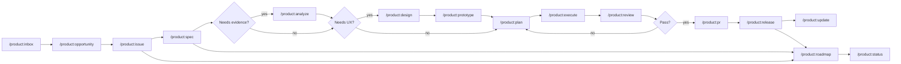

# ModuFlow Workflow

## Verification Ownership

- Main agent: orchestration, final synthesis, risk calls
- `implementation-worker`: code and task execution
- `qa-reviewer`: tests and acceptance criteria
- `ux-flow-worker`: UX flow and prototype review
- `data-reviewer`: metric integrity and analysis checks
- `release-manager`: PR, deploy, release, rollback checks

