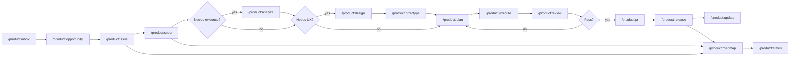

# ModuFlow Workflow

```mermaid
flowchart LR
  A["/product:inbox"] --> B["/product:opportunity"]
  B --> C["/product:issue"]
  C --> D["/product:spec"]
  D --> E{"Needs evidence?"}
  E -->|yes| F["/product:analyze"]
  E -->|no| G{"Needs UX?"}
  F --> G
  G -->|yes| H["/product:design"]
  H --> I["/product:prototype"]
  G -->|no| J["/product:plan"]
  I --> J
  J --> K["/product:execute"]
  K --> L["/product:review"]
  L --> M{"Pass?"}
  M -->|no| J
  M -->|yes| N["/product:pr"]
  N --> O["/product:release"]
  O --> P["/product:update"]
  C --> R["/product:roadmap"]
  D --> R
  O --> R
  R --> S["/product:status"]
```

## Verification Ownership

- Main agent: orchestration, final synthesis, risk calls
- `implementation-worker`: code and task execution
- `qa-reviewer`: tests and acceptance criteria
- `ux-flow-worker`: UX flow and prototype review
- `data-reviewer`: metric integrity and analysis checks
- `release-manager`: PR, deploy, release, rollback checks

## Operation Policy Gate

Every target-project mutation resolves and validates its project context, then checks the declared operation before reading unrelated project files, creating temporary files, invoking Git, or calling an external service.

| Project policy | Read | Write / Execute / Publish |
| --- | --- | --- |
| active + internal | allowed | policy-eligible; downstream gates still apply |
| archived | diagnostic read allowed | denied |
| read-only trust | diagnostic read allowed | denied |
| missing or unknown policy | diagnostic read allowed | denied |
| unresolved or ambiguous context | denied | denied |

CLI policy denials print `moduflow.project-operation-authorization.v1` JSON and return non-zero without a traceback. Publication eligibility never replaces canonical repository identity, review evidence, release checks, required status checks, or explicit human approval.

Portfolio dashboard, initialization, and recent-selection writes use a separate portfolio-control context. A selected target project's capability decision cannot authorize a portfolio write, and a portfolio decision cannot be reused to mutate that target.

A standalone non-project transport may be classified as `external-control` only when it performs network-only publication. The audit rejects that scope if the same function also creates or changes a file, temporary artifact, Git state, or project state.
