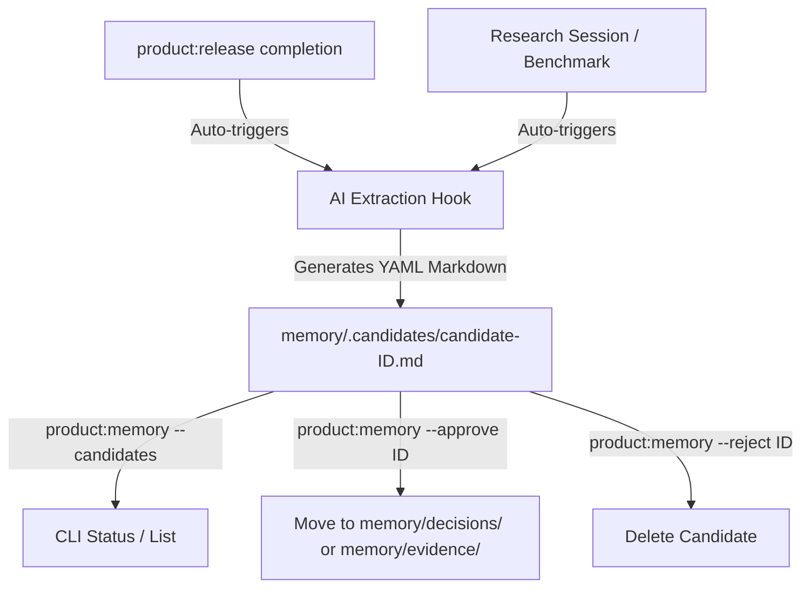

# Spec: Automatic Memory Candidate Capture

Issue: `040-automatic-memory-candidate-capture`

## Problem

ModuFlow currently supports the storage of project memory (decisions, deliverables, evidence) in a Git-tracked markdown structure under `memory/`. However, capturing these entries is largely manual. For developers and PMs, documenting decisions after every release or research session introduces significant friction, leading to "documentation debt" and stale memory logs.

## Goals

1. **Reduce Manual Toil**: Automatically extract and propose memory candidates on key events (release completion, research sessions).
2. **Reviewable Pipeline**: Enforce the **Candidate -> Approval -> Durable** lifecycle. Proposed memories live in `memory/.candidates/` and must be explicitly approved or modified.
3. **Flexible CLI Management**: Add commands to list, preview, approve, and prune candidates using `scripts/project_memory.py`.

## Proposed Architecture

### 1. The Candidate Lifecycle



### 2. Candidate Format

Each candidate is a markdown file with metadata in YAML frontmatter.

**Example**: `memory/.candidates/2026-06-27-040-completion.md`
```markdown
---
id: 2026-06-27-040-completion
kind: decision
title: Automatic Memory Candidate Capture
tags: [memory, automation, issue-completion]
summary: Implemented automatic candidate generation and approval promotion CLI.
source_event: issue_completed
source_artifacts:
  - "issues/040-automatic-memory-candidate-capture.md"
  - "specs/040-automatic-memory-candidate-capture/spec.md"
owner: Dongwon Lee
confidence: high
---

# Automatic Memory Candidate Capture

## Summary
ModuFlow now auto-captures issue completions and research artifacts into a `memory/.candidates/` staging area.

## Rationale
Reduces developer friction in document maintenance, ensuring agent context stays fresh with latest decisions.
```

### 3. CLI Interfaces

#### List Candidates
```bash
python3 scripts/project_memory.py . --candidates
# Output list:
# - [ ] 2026-06-27-040-completion (Kind: decision, Title: Automatic Memory...)
```

#### Approve & Promote
```bash
python3 scripts/project_memory.py . --approve 2026-06-27-040-completion
# Moves file to memory/decisions/2026-06-27-040-completion.md
# Replaces candidate markers with durable metadata.
```

#### Reject & Prune
```bash
python3 scripts/project_memory.py . --reject 2026-06-27-040-completion
# Deletes the candidate file.
```

## Acceptance Criteria

- [ ] `product:release` triggers the creation of a memory candidate under `memory/.candidates/` summarizing the issue goals and changes.
- [ ] Running `python3 scripts/project_memory.py . --candidates` lists all pending candidate IDs.
- [ ] Running `python3 scripts/project_memory.py . --approve <id>` moves the candidate to the appropriate subdirectory (`decisions/`, `evidence/`, etc.) based on its `kind` frontmatter, validating the structure.
- [ ] Unit tests verify candidate generation, parsing, list outputs, and approval movement.
