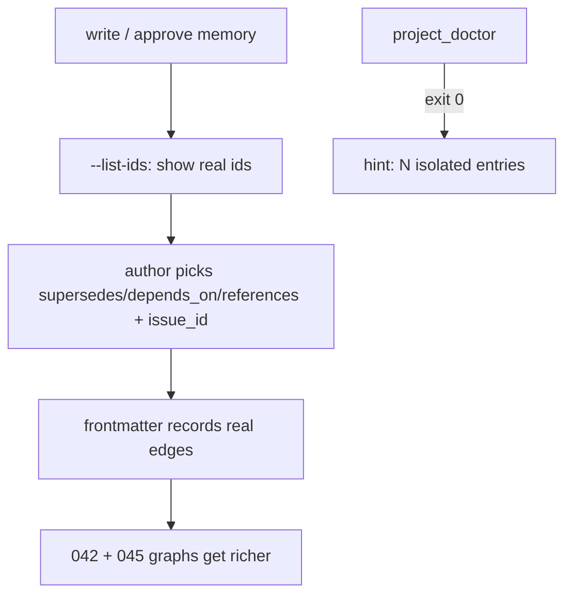

# Spec: Memory Relationship Capture at Write Time

Issue: `043-memory-relationship-capture-prompts`
Prev: `045-issue-graph-visualization` (surfaced the sparse cross-links) · `042-decision-graph-dashboard` (the graph this enriches) · Next: `product:plan 043`

## Clarify first (settled — issue + advisor)

1. Is "prompt" interactive code (`input()`)? → **No.** ModuFlow CLI is non-interactive; the AI/PM fills args. "Prompt" = a **workflow step in the command docs** that asks for relationships + `issue_id`, plus a way to offer real ids.
2. Auto-infer relationships from content? → **No** — the exact thing `042` refused. Offer candidates; a human/AI picks by reading. Never heuristic-link ("same issue / similar topic").
3. Do data model + CLI already support relationships? → **Yes.** `create_memory_entry` / `create_memory_candidate` take `supersedes`/`depends_on`/`references`; `approve` preserves them (verified). So this issue is **guidance + id candidates + a soft hint**, not new schema.

## Problem

The decision graph (042) and the new cross-links (045) are only as rich as the `supersedes`/`depends_on`/`references`/`issue_id` in memory frontmatter. Today nothing prompts the author to record them at write time, so they default to empty: 045 showed **only 5 of 8** memory entries carry `issue_id`, and relationship edges between memory nodes are nearly absent. Backfilling later means guessing — which 042 deliberately refused. The fix is to make recording *real* relationships easy and habitual at the write/approve moment.

## Goals

1. **Offer existing memory ids as candidates** at write time, so authors link to real nodes (not free-typed strings that won't match). One thin CLI affordance.
2. **Guide the write/approve workflow** (product-memory / product-knowledge docs) to ask for `supersedes` / `depends_on` / `references` **and `issue_id`** every time — issue_id directly fills 045's sparse cross-links.
3. **Soft hint for isolated nodes**: `project_doctor` surfaces memory entries with no relationships and no `issue_id` as an *informational* hint — never an error — so gaps are visible without forcing fake links.

## Non-Goals

- **Auto-inferring relationships** from content (042's explicit anti-goal). No heuristic linking; candidate ordering must not look like content inference either.
- Interactive `input()` prompts (CLI stays non-interactive).
- `fcose` layout swap; portfolio multi-project dashboard (sibling follow-ups).
- New relationship *fields* — the schema already has them.

## Users & Scenarios

- As a PM recording a decision, I run the write step; the workflow asks "what does this supersede / depend on / relate to, and which issue?" and shows the current memory ids so I pick the real ones.
- As a maintainer, I run `project_doctor` and see "3 memory entries are isolated (no links, no issue_id)" as a hint — I can choose to link them, but the check still passes (exit 0).
- Anti-scenario: the tool never says "this looks related to X, linking automatically" — it only presents, never decides.

## Proposed Solution

1. **`--list-ids` flag** on `project_memory.py`: prints existing memory entries (`id`, `kind`, `title`) as JSON — reuses `search_memory_entries(root, query="")` (which already returns all when the query is empty). The candidate list the author/AI picks from. ~Few lines; no new traversal.
2. **Command-doc guidance** (`product-memory.md`, `product-knowledge.md`): add a "capture relationships" step to the write/candidate flow — run `--list-ids`, then pass chosen `--supersedes/--depends-on/--references` and `--issue-id`. State plainly: present options, never auto-link.
3. **`project_doctor` soft hint**: count memory entries with no `supersedes`/`depends_on`/`references` and empty `issue_id`; emit an informational line (e.g. `hint: N isolated memory entries`). **Must keep exit 0** — a hint, not a failure (release_check gate depends on this).

## Alternatives Considered

- **Empty `--search ""` instead of new flag** — rejected: `main()` routes empty `--search` to the default plan action, not search. A dedicated `--list-ids` is unambiguous and trivial.
- **Auto-suggest links by topic similarity** — rejected: violates 042's anti-goal; pollutes trust (can't tell a real rationale link from a hunch).
- **Hard doctor failure on isolated nodes** — rejected: would force fake links and break `release_check` (exit 0 required). Soft hint only.
- **Interactive prompts in the CLI** — rejected: CLI is non-interactive by design; guidance lives in the command docs the AI/PM follows.

## Acceptance Criteria

1. `python3 scripts/project_memory.py <path> --list-ids` returns all memory entries' `id`/`kind`/`title` (JSON); exit 0.
2. `product-memory.md` + `product-knowledge.md` document a relationship-capture step (list ids → pass `--supersedes/--depends-on/--references/--issue-id`), explicitly "present, don't auto-link".
3. `project_doctor` emits an isolated-node **hint** and still exits 0; `release_check` passes.
4. Tests cover `--list-ids` output and the doctor hint (present vs none), including the exit-0 guarantee.
5. No auto-inference anywhere.

## Risks & Open Questions

- Risk: the soft hint accidentally fails the build. Mitigation: assert exit 0 in a test; hint is stdout only.
- Risk: scope creep into auto-suggestion. Mitigation: Non-Goal is explicit; candidate list is unordered-by-id, not by inferred relevance.
- Open: should `--list-ids` accept a `--kind` filter (e.g. only decisions)? Minor; decide in plan — `search_memory_entries` already supports `kind`.
