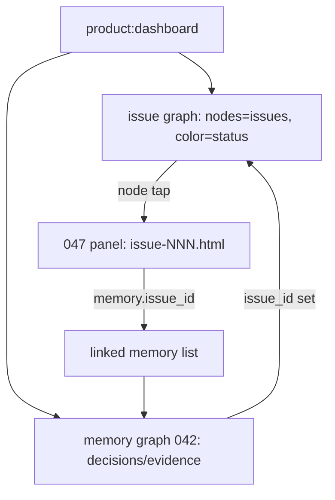

# Spec: Project View — Issue Graph + Memory Graph (cross-linked)

Issue: `045-issue-graph-visualization`
Prev: `042-decision-graph-dashboard` (memory graph + Cytoscape pattern) · `047-issue-artifact-drilldown` (the panel a node click opens) · Next: `product:plan 045`

## Clarify first (settled with the user, 2026-06-28)

1. One merged canvas, or two graphs you switch between? → **Two graphs, navigable between each other.** Not a merged single canvas (49 issues + memory = hairball), not a new app.
2. Per-project? → **Yes**, by construction (reads the project's own `issues/`, `specs/`, `memory/`).
3. Where do issue relationships come from — text or new frontmatter? → **Text parsing, reliable subset first**; no frontmatter added to issue files (024's territory).
4. What links the two graphs? → **`memory.issue_id`** (already on the records). Issue node → 047 panel; 047 panel → that issue's linked memory; memory node → source issue.
5. Language? → **Korean UI surface** (labels/help), artifact bodies unchanged.

## Problem

A human cannot see, per project, how the work hangs together. Two views exist or are planned in isolation: the **memory/decision graph** (`042`, `memory/dashboard.html`) and a **per-issue artifact panel** (`047`, `memory/issue-<id>.html`). There is **no issue graph** at all, and nothing connects decisions back to the issue that produced them — even though `memory.issue_id` already records that link. So "what issues exist, how do they relate, and what was decided for each" requires reading 49 issue files by hand. The L1 project layer of the documented L0–L3 IA is the gap.

## Goals

1. A **per-project issue graph**: nodes = issues, color = status (done / active / backlog / superseded), rendered the proven 042 way (Python → Cytoscape, one self-contained HTML).
2. **Both graphs reachable from one project surface** (`product:dashboard`) and navigable between each other — the user's "지식노드 + 이슈노드 2개 서로 확인" ask.
3. **Cross-link the two graphs** via `memory.issue_id`: issue node → opens its `047` panel; the `047` panel lists that issue's linked memory; memory node → jumps to its source issue.
4. **Korean UI surface**, matching 042's existing help tone.

## Non-Goals

- A **merged single-canvas** graph mixing issue and memory nodes — rejected (hairball; the two are different node types with different reading goals).
- Adding **frontmatter** to issue files — forbidden here; needs a `024`-scoped artifact-model decision. Cheap text-parse validates the view first.
- Dense `## Related Issues` prose edges in the **first cut** — noisy (every issue cites several; inconsistent headers). `supersedes` edges first; related edges added later, scoped/toggleable.
- Interactive editing/creation of issues (later goal stage, needs a backend).
- Translating artifact **bodies** to Korean (UI surface only).

## Users & Scenarios

- As a PM, I open the project view, see the issue graph colored by status, spot that 041→042→ (superseded chain) and that 045/047/048 cluster under visual-workbench — without opening a file.
- I click issue 047's node → its 047 artifact panel opens (spec/plan/tasks rendered).
- In that panel I see "linked memory: the visualization-library benchmark" — the decision behind the issue — and can jump to it.
- From a memory node (a decision) I jump back to the issue that produced it.
- Honest gap: only 5 of 8 memory entries carry `issue_id`, so most issues show no linked memory yet — visible sparsity, the motivation for `043`.

## Proposed Solution

Extend `scripts/project_memory.py` with an **issue-graph collector + renderer** mirroring `_collect_graph`/`render_dashboard_html`, and wire the cross-links.

- `_collect_issue_graph(root)`: scan `issues/*.md`; per file extract `id` (filename), `title` (H1), `status` + `superseded-by` target from the `**Status:**` line, and `Supersedes \`NNN\`` from the status prose. Emit nodes (status color) + `supersedes` edges. Also read `memory/*.md` frontmatter `issue_id` to attach, per issue, the list of linked memory ids (for the panel + cross-jump).
- Render an **issue-graph HTML** (Cytoscape, status-colored) the 042 way. Node tap → link to `memory/issue-<id>.html` (the 047 panel), generated on demand or pre-generated.
- **Cross-link wiring**: 047 panel gains a "Linked memory" section listing that issue's `issue_id`-matched memory entries (un-defers 047's deferred cut). Memory dashboard (042) node info gains a link to the source issue when `issue_id` is set.
- **Surface — two-tab project view (decided with user)**: one HTML with two tabs, `[이슈 그래프] [지식 그래프]`, one graph full-screen at a time. Default tab = issue graph. A tab **is** the standalone view — "just the memory graph" = one tab click; the 042 memory graph renders whole inside its tab (042 original left untouched). Deep-link via URL hash (`#issues` / `#memory`) so a single graph is bookmarkable.
- **Cross-link表현 — 3 progressive layers (decided with user)**:
  1. **Node badge** (`🧠N`) on issue nodes showing linked-memory count — at-a-glance; **toggleable** (off = pure 042-like graph); omitted when 0.
  2. **Click preview**: tapping an issue node shows, in the info box (042 pattern), its linked memory with kind icons (💡decision 📎evidence 📦deliverable) — each jumps to that memory node.
  3. **Panel list**: the 047 panel gains a "연결된 지식" section listing the issue's linked memory (un-defers 047's deferred cut).
  Required = layers 2 + 3 (data-backed by `issue_id`); badge (layer 1) is polish/toggle.
- **Standalone viewing guaranteed**: tab = full-screen single graph; previews appear only on node click; badge toggles off; hash deep-links. So "그냥 한 그래프만" never requires wading through the integration.
- **Korean**: status legend, tab labels, help text, section labels, kind icons' captions in Korean — matching 042's existing tone.

## Alternatives Considered

- **Merged single canvas (issues + memory as one graph)** — rejected: different node types, different reading goals; 49 issues + memory nodes = unreadable hairball. Two graphs cross-linked gives the navigation without the noise.
- **Frontmatter on issue files now** — rejected: artifact-model schema change (024); start with cheap text-parse, promote only if the graph earns it.
- **All `## Related Issues` edges from day one** — rejected for first cut: noisy and dense. `supersedes` first (clean, meaningful); related edges later, scoped.
- **A standalone new app / SPA** — rejected (P12): the user wants to *see* both graphs, not a platform. Reuse the zero-backend 042 path.

## Acceptance Criteria

1. `product:dashboard` generates a per-project **two-tab project view** (`[이슈 그래프] [지식 그래프]`), each tab a full-screen Cytoscape graph; default = issue tab; deep-linkable via `#issues`/`#memory`.
2. Issue graph: nodes = issues, status-colored, `supersedes` edges; an issue node click opens that issue's `047` panel.
3. Cross-link: issue node tap shows linked-memory preview (kind icons) in the info box; the `047` panel lists the issue's **연결된 지식** (via `issue_id`); a memory node links back to its source issue.
4. Node badge (`🧠N`) shows linked-memory count and is toggleable; absent when 0. Standalone viewing works (tab = single graph; no forced cross-link clutter).
5. Korean UI surface on both tabs (labels, legend, help, sections).
6. Zero-backend; generated HTML is derived/`.gitignore`d; `release_check` passes; tests cover the issue-graph collector (status + supersedes parsing) and the linked-memory attach.
7. 047 panel render (marked+mermaid) **visually confirmed** before the integration is called done (it is now the node-click detail view).

## Risks & Open Questions

- Risk: status-line / "Supersedes" prose parsing is brittle. Mitigation: parse the *reliable* subset only, test against the real 49 files, skip (don't crash on) unrecognized lines.
- Risk: 047 panel render (marked + mermaid) is still **visually unverified** (browser dialog timed out). It becomes the node-click detail view — confirm one real render before calling the integration done (042's "release_check doesn't catch render bugs" lesson).
- ~~Open: exact container shell~~ → **decided: two-tab page** (default issue tab, hash deep-links).
- Open: CLI shape — does `--dashboard` produce the two-tab view directly (memory graph becomes its 지식 tab), or a new `--project-view` flag with `--dashboard` kept memory-only for back-compat? Settle in plan; prefer evolving `--dashboard` if 042's tests don't pin the single-graph file structure.
- Open: how sparse cross-links read to a user (most issues show no memory) — acceptable as honest gap; `043` fills it.
