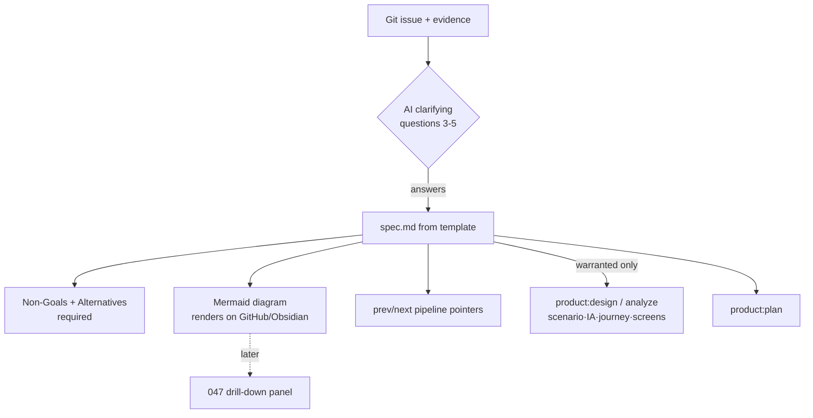

# Spec: Planning-Artifact Templates

Issue: `046-planning-artifact-templates`
Prev: `memory/evidence/2026-06-28-planning-artifact-templates-benchmark.md` (benchmark) · Next: `product:plan`

## Problem

ModuFlow defines planning commands (`product:opportunity`/`spec`/`design`/`prototype`/`analyze`), but across 32 spec folders there are **0** `design-brief.md`, **0** `prototype.md`, **0** `analysis.md`. The chain has never been exercised, so its templates are unvalidated — a PM who wants to take an issue to planning depth (requirements → solution → diagram → scenario/IA/journey/screens) has nothing proven to reach for. The decision-graph (042/044) and the planned drill-down (047) are empty without these artifacts behind them.

## Goals

1. Harden the **core 3** artifacts first — requirements, solution, diagram — by strengthening the `spec.md` template they all live in.
2. Make every spec start from an **AI clarifying-question** step (ai-dev-tasks pattern): question → fill, never blank → fill.
3. Make **Non-Goals** and **Alternatives Considered** required sections, and a **Mermaid diagram** the default when the issue has any flow — so the canonical `spec.md` is also the visual artifact (renders on GitHub/Obsidian, no separate file).
4. Keep depth **selective**: heavier artifacts (scenario detail, IA, journey, screens) are produced only when an issue warrants them, via `product:design`/`product:analyze` — never forced.

## Non-Goals

- Building all 8 benchmarked artifact types now. Scenario / IA / journey / screen templates come **after** the core 3 are validated in real use.
- Forcing any artifact on every issue (a refactor needs no screens).
- A new `templates/` directory or a parallel artifact tree — templates live where the existing commands already write (`specs/<issue>/`).
- The L2 view that renders these artifacts (→ `047`).

## Users & Scenarios

- As a PM, I want, when an issue needs design depth, to run `product:spec` and be **asked the right 3-5 questions** instead of facing a blank file, so the first draft is usable.
- As a reviewer, I want every spec to state **what it is not doing** and **what alternatives were weighed**, so I can trust scope and decisions.
- Exception: a trivial/refactor issue — the PM should not be pushed into screens/IA; the template's selective-depth note keeps it light.

## Proposed Solution

Enhance `commands/product-spec.md` (done in this issue's first commit) with four benchmarked elements, then dogfood by writing this very spec from the new template.

Validation is by dogfooding: this spec is the first artifact written under the new template, so writing it *is* the test. Once the core 3 prove out, extend to the remaining artifacts as separate, demand-driven work.

## Alternatives Considered

- **Separate `templates/` directory** — rejected: adds a new layer and a copy step; the commands already have `writes:` targets in `specs/<issue>/`. Reuse beats a parallel tree.
- **Build all 8 artifact templates at once** — rejected: produces many unvalidated templates in one go; the owner chose "core 3 first," validate, then expand.
- **Forced pipeline (every artifact on every issue)** — rejected: violates the selective-depth principle; bloats simple issues with empty sections.
- **Embed Mermaid only (the dropped "046 spec-mermaid-embed" scope)** — rejected earlier: too narrow; the real gap is the whole template quality + judgment, not just diagrams.

## Acceptance Criteria

1. `commands/product-spec.md` contains: a clarify-first step, a template with **required** `## Non-Goals` and `## Alternatives Considered`, a default Mermaid block, and prev/next pipeline pointers.
2. The template carries a selective-depth note pointing heavier artifacts to `product:design`/`analyze` and to `046`.
3. This `spec.md` follows that template (clarify done via prior questions; Non-Goals, Alternatives, Mermaid, pointers all present) — proving the template is fillable end to end.
4. `release_check` passes (validation + doctor + tests).

## Risks & Open Questions

- Risk: the clarify-first step adds friction on trivial issues — mitigated by "skip what the issue already answers" and selective depth.
- Open: should `product:design`/`product:analyze` get the same clarify-first + template treatment now, or after the core-3 proves out? Recommendation: after — keep this issue to the spec template, expand in a follow-up.
- Open: how `047` reads these artifacts (file list vs parsed sections) — deferred to `047` spec.
