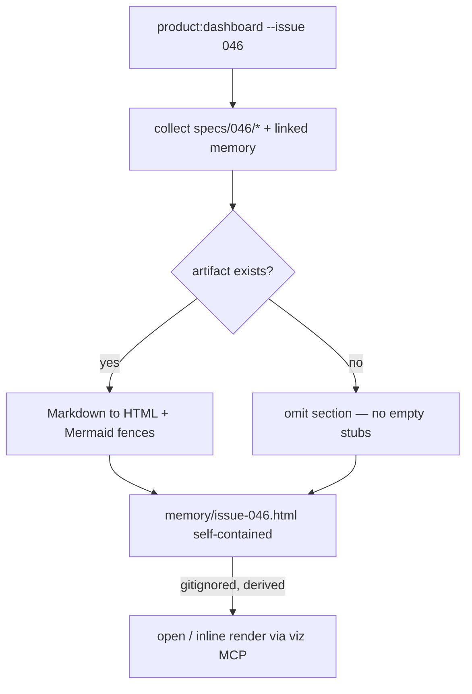

# Spec: Issue Artifact Drill-down Panel

Issue: `047-issue-artifact-drilldown`
Prev: `044-product-dashboard-command` (command surface) · `046-planning-artifact-templates` (produces the artifacts) · Next: `product:plan 047`

## Problem

A human cannot, today, see one issue's planning artifacts in one place. The artifacts live as separate files under `specs/<issue>/` (spec, plan, tasks, status, and — when warranted — design-brief, analysis, diagrams), and `memory/` holds its evidence/decisions. To review "what was decided and built for issue X" — the stated "추후 문제가 생기면 사람이 산출물 확인" purpose — you must open many files by hand. The memory graph (042/044) shows decisions; nothing shows a single issue's full artifact set.

## Goals

1. One **L2 drill-down panel** per issue: click/select an issue → see its artifacts rendered in one self-contained HTML view, per project.
2. Expose it as a **mode of `product:dashboard`** (e.g. `--issue <id>`), not a new command — reuse the 044 surface.
3. Render **only artifacts that exist** (selective, matching 046) — an issue with just `spec.md` shows just that; never force empty sections.
4. Render Markdown content inline and **Mermaid diagrams visually**, so the planning diagrams from 046 appear as pictures, not code.

## Non-Goals

- The issue **graph** across issues (→ `045`); this is the single-issue depth view, not the relationship view.
- Whole-portfolio or all-issues index in the first cut — single-issue panel first, expand after it proves out.
- Interactive editing/creation of artifacts (later goal stage, needs a backend).
- Producing the artifacts (→ `046`).

## Users & Scenarios

- As a PM/reviewer, I want to open issue 046's panel and see its spec (with the rendered flowchart), benchmark link, and status in one scroll — so I can audit the work without hunting files.
- As a maintainer debugging later, I want the panel to show exactly which artifacts exist for an issue, so absence is visible (no design-brief = it wasn't warranted, not lost).
- Exception: an issue with no `specs/<issue>/` folder → panel states "no artifacts yet" and links the issue file, rather than erroring.

## Proposed Solution

Extend `scripts/project_memory.py` with an issue-panel renderer alongside the existing dashboard renderer, surfaced via `product:dashboard --issue <id>`. Python collects the issue's existing artifact files, converts Markdown → HTML at generation time (zero-backend), and emits one self-contained `memory/issue-<id>.html`. Mermaid fences are rendered client-side via a pinned Mermaid ESM module (note: different load style from the 042 classic `<script src>` Cytoscape — documented).

Artifact policy mirrors 044: the generated `issue-<id>.html` is derived and `.gitignore`d; the generator is the committed artifact. Markdown rendering uses a Python Markdown library (decide which in plan); no JS framework. Chart.js is pulled in only if/when a `metrics.md` is present (deferred — most issues have none).

## Alternatives Considered

- **Separate `product:issue-view` command** — rejected: adds a command for what is naturally a dashboard mode; 044 already owns the visualization surface.
- **File list + links only (no embed)** — rejected for the first cut: the goal is to *see* content/diagrams in one place; a link list still forces opening files. Kept as a fallback if embedding proves heavy.
- **Open only from the 045 graph** — rejected as the sole entry: couples 047 to 045 (still backlog). A standalone `--issue` mode works now; the 045 node-click can call into it later.
- **Client-side Markdown render (marked.js)** — ~~rejected~~ **adopted at plan stage (reversed).** The original rejection ("keep output a static file, no runtime fetch") is void because Goal #4 (Mermaid rendered *inside* the panel) already forces a client-side Mermaid CDN fetch. The two coherent endpoints are all-CDN (marked + Mermaid, zero Python dep) or all-build-time-static (Python `markdown` + node `mermaid-cli`); the spec's mixed Python-`markdown`-plus-CDN-Mermaid pays both costs for neither benefit. Chose all-CDN to reuse the proven 042 render path. See `plan.md` "Architecture decision".

## Acceptance Criteria

1. `product:dashboard --issue <id>` generates `memory/issue-<id>.html` containing that issue's existing artifacts, Markdown rendered, Mermaid diagrams rendered visually.
2. Missing artifacts are omitted, not stubbed; an issue with no spec folder degrades gracefully.
3. `issue-<id>.html` is `.gitignore`d; generator + command doc are the committed artifacts.
4. Works with zero MCP (generate + open); renders inline when a visualization MCP is present.
5. `release_check` passes; a test covers the renderer (artifact present vs absent).

## Risks & Open Questions

- Risk: Markdown-library choice adds a dependency. Mitigation: prefer Python stdlib-friendly `markdown`/`markdown-it-py`; decide in plan, pin it.
- Risk: Mermaid ESM load differs from 042's pattern — document clearly so the two render paths don't confuse maintainers.
- Open: exact artifact set and order to show (spec → diagram → plan → tasks → status → linked memory?) — settle in plan.
- Open: how `045` will hand off (deep-link param) — out of scope here, noted for `045` spec.
