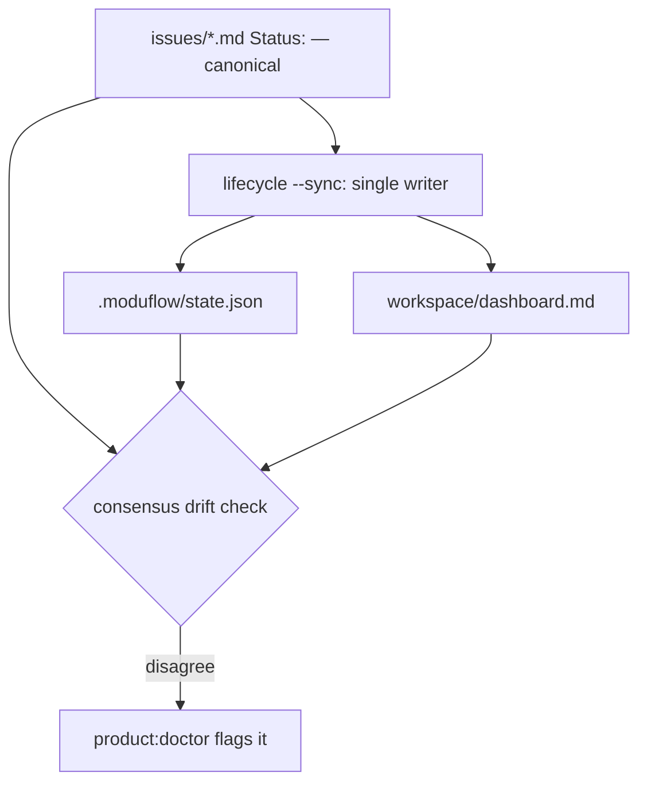

# Spec: Artifact Lifecycle Sync (drift detection + single propagation)

Issue: `048-artifact-lifecycle-sync`
Prev: surfaced repeatedly this session (dashboard.md sat stale; two state files diverged) · Next: `product:plan 048`

## Clarify first (settled — evidence + advisor)

1. What is the lifecycle **canonical**? → **The issue file `**Status:**` line.** It is Git-native, human-edited, and already what `_collect_issue_graph` reads to color the graph. Everything else is a derived view.
2. Are `.moduflow/state.json` and `workspace/loop-state.json` both live? → **No.** Evidence: `loop-state.json` last changed 2026-06-27 (issue 040, goal `business-document-workflow`; its `issue_ids` don't even include 042–049). It is written only by `project_loop --update`, which the visual-workbench flow never calls. It is **legacy/dormant**. `.moduflow/state.json` is the current summary (read by commands, portfolio, index skill) — but **no script writes it**; it's hand-updated.
3. Is this issue the schema unification (v1 vs v2)? → **No** — that touches 15+ consumers and is a separate decision/issue. 048 is **drift detection + a single propagation point + reconciling today's divergence**.

## Problem

Lifecycle changes (start / done / supersede) propagate to derived views **manually and unreliably**:

- `workspace/dashboard.md` sat frozen at issue 040 for five issues this session, caught only by a human asking.
- Two state files diverged silently: `loop-state.json` says active=040/goal=business-document-workflow; `.moduflow/state.json` says active=048/goal=visual-workbench.
- `validate_active_state_views` checks dashboard against **loop-state.json (040)** — so it "passed" by coincidence (040 appears in dashboard's Recently-Completed), while the real work (048) went unchecked. The one gate that should have caught drift was looking at the dead file.

Derived views that silently drift are worse than no views: they mislead, and the dashboard's active-issue focus (045) points at the wrong node when state is stale.

## Goals

1. **Declare the issue file `Status:` the lifecycle canonical** (de-facto already; make it explicit and the propagation source).
2. **Consensus-based drift check**: flag when the lifecycle sources don't *agree* on active issue / phase / each issue's status — across issue files, `.moduflow/state.json`, and `dashboard.md`. Agreement-based, so it works regardless of which state file is canonical.
3. **Single propagation point**: one script that regenerates the derived lifecycle fields (`.moduflow/state.json` summary + `dashboard.md` active/recently-completed/queue) **from the issue files**, so a human never hand-syncs N files again.
4. **Reconcile today's divergence**: retire `loop-state.json` from the lifecycle gate (point `validate_active_state_views` at `.moduflow/state.json`), and align/remove the dormant file. This is 048's dogfood.

## Non-Goals

- **Schema unification** of `state.v1` and `loop-state.v2`, or migrating the 15+ consumers — separate issue.
- Resurrecting `project_loop`'s execution-loop machinery (git_binding, attempts) — out of scope; that's the 021/028 execution-backend track.
- Auto-editing issue files (canonical is human-authored; propagation flows *out* of issues, never back in).
- A live daemon/watcher — propagation is an explicit command/step, zero-backend.

## Users & Scenarios

- As a PM, I mark an issue done; I run one propagation command and `dashboard.md` + `state.json` update themselves — no hand-editing four files.
- As a maintainer, `product:doctor` tells me "drift: issue 045 is done in its file but dashboard lists it active" before I push — the check that was missing this session.
- Reconcile scenario: running 048's own propagation brings `state.json`/`dashboard.md` into agreement and retires the 040 loop-state from the gate — the dogfood that proves it.

## Proposed Solution

1. **`lifecycle_state(root)`** helper (new, in a script — likely `project_loop.py` or a new `project_lifecycle.py`): read every `issues/*.md` `Status:`, return the canonical map {issue_id: status} + derived {active_issue, done[], backlog[]}.
2. **Propagation** (`--sync` mode): regenerate `.moduflow/state.json` lifecycle fields (active_issue, phase) and `dashboard.md`'s Active/Recently-Completed/Queue sections from `lifecycle_state`. Single writer. `dashboard.md`'s `## Next Command` stays `product:status` (validator rule). Idempotent.
3. **Consensus drift check** (in `project_doctor` / `validate_project_artifacts`): compare issue-file statuses ↔ `state.json.active_issue` ↔ `dashboard.md` mentions. Report disagreements.
4. **Reconcile**: switch `validate_active_state_views` to read `.moduflow/state.json` (the live summary) instead of `loop-state.json`; mark `loop-state.json` dormant/legacy (documented), removed from the lifecycle gate.

## Sequencing (critical — avoid breaking 048's own commit)

`validate_active_state_views` is a **hard gate** (appends errors). The repo is currently divergent (040 vs 048). So the order is mandatory:

1. Build the consensus drift check **as a reporter first** (doctor hint), not yet a hard gate.
2. **Reconcile the current divergence** (run `--sync`; retire loop-state from the gate) so sources agree.
3. **Only then** promote drift to a hard gate — once green, it stays green.

Reversing this (gate before reconcile) blocks the push.

## Alternatives Considered

- **Make `dashboard.md` fully generated/`.gitignore`d like `dashboard.html`** — rejected for now: it carries human prose (notes, verification narrative) that isn't derivable from issues. Propagate the *structured* sections, keep it committed. Revisit if prose proves unnecessary.
- **Unify the two state schemas now** — rejected: 15+ consumers, separate decision (Non-Goal).
- **Hand-sync but add a checklist** — rejected: that's the status quo that failed five times.
- **Compare against a chosen canonical instead of consensus** — rejected as the *check's* basis: consensus catches divergence even while canonical is being decided; canonical drives *propagation*, not detection.

## Acceptance Criteria

1. `lifecycle_state(root)` returns issue statuses + derived active/done/backlog from `issues/*.md`.
2. A `--sync` propagation regenerates `.moduflow/state.json` + `dashboard.md` structured sections from issue files; idempotent; `## Next Command` stays `product:status`.
3. `product:doctor` reports lifecycle **drift** (issue status vs state.json vs dashboard) and, post-reconcile, the gate fails on real drift while passing when in sync.
4. `loop-state.json` is retired from the lifecycle gate; `validate_active_state_views` reads `.moduflow/state.json`.
5. Current divergence is reconciled (the dogfood); `release_check` exit 0.
6. Tests: lifecycle_state parsing, propagation idempotence, drift detected vs in-sync, exit-0 sequencing.

## Risks & Open Questions

- Risk: turning drift into a hard gate before reconcile breaks the push. Mitigation: the mandatory sequencing above; reconcile is step 2.
- Risk: regenerating `dashboard.md` clobbers human prose. Mitigation: propagate only marked structured sections; preserve the rest.
- Open: does `loop-state.json` get deleted or kept as dormant-but-documented? Decide in plan (advisor leans retire; some `project_loop`/`mcp_server` reads may need a shim).
- Open: propagation as a new `project_lifecycle.py` vs a mode on existing script — decide in plan.
