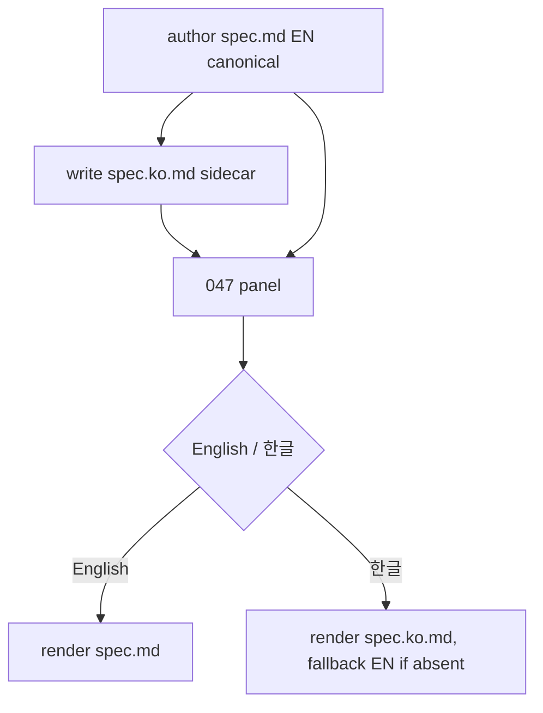

# Spec: Bilingual Artifact View (English canonical, Korean for reading)

Issue: `049-bilingual-artifact-view`
Prev: `045-issue-graph-visualization` (the panel this extends) · `047-issue-artifact-drilldown` (the panel gaining the toggle) · Next: `product:plan 049`

## Clarify first (settled with the user, 2026-06-28)

1. Which language is canonical? → **English.** "영문으로 만드는 게 맞고." Standard, external-compatible, the source of truth.
2. Where does Korean appear? → **Only in the human-facing view** (the 047 panel). "사람이 보는 것만 한글로 보여주면 될 거 같아." Not in the canonical file.
3. Retro-translate existing specs? → **No. New artifacts going forward only.** "신규부터 그렇게 하자." The 6 existing English specs stay English unless someone adds a sidecar later.
4. Machine translation in the panel? → **No** — zero-backend. The Korean is authored as a sidecar at write time, not translated at runtime.

## Problem

ModuFlow's planning artifacts (spec/plan/tasks) are written in English (canonical, by decision). When the PM opens an issue's 047 panel to review "what was planned," they read English — slower for a Korean-native reviewer. The earlier idea of a full bilingual store was rejected as over-investment; the chosen, cheaper shape is: keep English canonical, write a Korean **sidecar** alongside *new* artifacts, and let the panel show it on demand.

## Goals

1. **Sidecar convention**: a Korean translation lives beside the English file as `<name>.ko.md` (e.g. `spec.ko.md` next to `spec.md`). English remains canonical and unchanged.
2. **Panel language toggle**: the 047 panel offers `English / 한글`; when an artifact has a `.ko.md` sidecar, the toggle shows it; otherwise it falls back to English (selective — never an empty Korean view).
3. **New-artifacts-forward policy**: the `product:spec`/`plan` workflow writes the `.ko.md` sidecar when authoring new artifacts; existing English specs are not retro-translated.

## Non-Goals

- Runtime/machine translation (zero-backend constraint).
- Making Korean canonical, or translating canonical files in place.
- Retro-translating the existing 6 English specs (new-forward only; a one-off sidecar can be added later per-artifact if wanted).
- Translating the issue graph / memory graph UI chrome (already Korean via 045) or memory entry bodies.

## Users & Scenarios

- As a PM reviewing issue 049's panel, I click `한글` and read the spec in Korean; the diagram and structure are identical, only prose language differs.
- As a maintainer, I open an older issue with no `.ko.md`; the toggle quietly stays English (no broken empty Korean tab).
- Authoring: when I (the AI/PM) write a new `spec.md`, I also write `spec.ko.md` — same content, Korean prose. The English is what validators and external tools read.

## Proposed Solution

1. **Collection**: `_collect_issue_artifacts` attaches, to each artifact, its `.ko.md` sibling content when present (and does NOT list `*.ko.md` as separate artifacts). Each artifact carries `{name, label, md (en), ko (or null)}`.
2. **Panel toggle**: `render_issue_panel` adds a top-level `English / 한글` switch. Default English (canonical). Switching to 한글 re-renders each artifact from its `ko` when available, else its English (per-artifact fallback). Markdown/Mermaid render the same way (marked + mermaid) for both.
3. **Policy**: document in `product-spec.md` (and the 046 template note) that new artifacts get a `.ko.md` sidecar written alongside. Convention only — no enforcement gate (don't fail builds over a missing translation).

## Alternatives Considered

- **Full bilingual store + drift gate** — rejected (over-investment; the user explicitly chose "보는 것만 한글, 신규부터").
- **Runtime marked + translation API** — rejected: breaks zero-backend, needs a key, costs per view.
- **Make Korean canonical** — rejected: English is the interoperable source of truth.
- **Inline bilingual in one file** (EN then KO sections) — rejected: clutters the canonical file and doubles its length; a sidecar keeps canonical clean.

## Acceptance Criteria

1. `<name>.ko.md` siblings are attached to their artifact, not listed as separate artifacts.
2. The 047 panel shows an `English / 한글` toggle; 한글 renders the sidecar, falling back to English per-artifact when absent; default is English.
3. No `.ko.md` anywhere → panel behaves exactly as today (no toggle clutter or empty Korean).
4. `product-spec.md` documents the new-artifact sidecar policy (convention, not a gate).
5. `release_check` passes; tests cover sidecar attach, toggle render, and the no-sidecar fallback.

## Risks & Open Questions

- Risk: sidecars go stale when English changes (the 048 drift problem, for prose). Mitigation: out of scope to gate; note it. A future `--drift` extension could flag stale `.ko.md` (timestamp/age), but not now.
- Open: toggle granularity — one global switch vs per-artifact. Plan: global switch, simplest.
- Open: should the toggle hide entirely when zero sidecars exist? Plan: yes (no clutter when unused).
