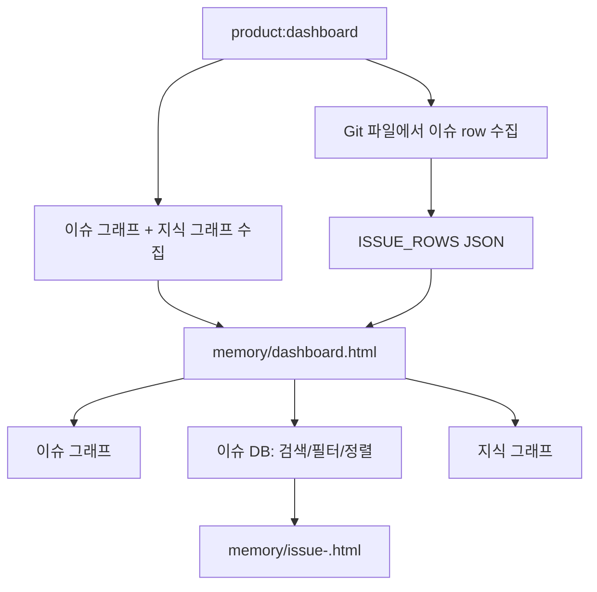

# 스펙: 대시보드 DB/리스트 뷰

> 이 파일은 영문 `spec.md`의 한글 읽기용 sidecar입니다. canonical은 영문입니다.

Issue: `056-dashboard-database-list-view`
Prev: `knowledge/benchmarks/2026-07-03-dashboard-db-list-view-benchmark.md` · Next: `product:plan 056-dashboard-database-list-view`

## 먼저 정리된 질문

이 이슈와 벤치마크에서 이미 핵심 질문은 정리되어 있습니다.

1. 주 사용자 → **Dongwon/PM**. 다음 이슈 선택, 리뷰 준비 상태 확인, 누락 산출물 확인을 빠르게 해야 합니다.
2. 핵심 문제 → **그래프만으로는 운영 스캔이 어렵다**. active/backlog/review, 산출물 누락, PR/리뷰 핸드오프 없음, 한글 sidecar 누락, 다음 명령이 한눈에 안 보입니다.
3. 제품 형태 → **현재 그래프는 유지하고 DB/리스트 뷰를 추가**합니다.
4. 범위 → **정적 HTML 생성만**. 외부 DB, Notion/Jira/Linear 동기화, 대시보드 내 편집은 v1 범위 밖입니다.
5. 벤치마크 방향 → **Notion의 한 데이터셋/여러 뷰, Jira의 상태 추적, Linear의 필터링 리스트**를 참고하되 v1은 밀도 높은 이슈 테이블부터 구현합니다.

## 문제

현재 `memory/dashboard.html`은 이슈와 메모리의 관계를 이해하는 데는 좋지만 PM이 매일 보는 운영 화면으로는 불편합니다. "다음에 뭘 해야 하지?", "리뷰 가능한 항목은?", "spec/review/PR/한글 산출물이 빠진 이슈는?" 같은 질문은 그래프 노드를 하나씩 눌러야 답이 나옵니다.

그래프는 관계를 보는 렌즈로 남기고, 같은 Git 기반 이슈 데이터 위에 스캔/필터/핸드오프용 DB 리스트 렌즈가 필요합니다.

## 목표

1. 기존 `이슈 그래프`, `지식 그래프` 옆에 `이슈 DB` 탭을 추가합니다.
2. `issues/*.md`, `specs/*`, `.moduflow/state.json`, `workspace/roadmap.md`, memory frontmatter 링크에서 테이블 데이터를 만듭니다.
3. 이슈 id, 제목, 상태, goal, 다음 명령, 산출물 커버리지, 연결 메모리 수, 관계 수, 주의 플래그, 업데이트일을 보여줍니다.
4. 정적 HTML 안에서 검색, 상태 필터, 주의 플래그 필터, 정렬을 제공합니다.
5. 행을 누르면 기존 `memory/issue-<id>.html` 상세 패널로 이동합니다.
6. zero-backend 구조와 현재 그래프 인터랙션은 유지합니다.

## 범위 밖

- 외부 DB, 호스팅 서비스, 런타임 API 없음.
- Notion/Jira/Linear/GitHub issue 동기화 없음.
- 대시보드 안에서 이슈를 편집하거나 Git에 쓰는 기능 없음.
- Git Markdown을 canonical source로 쓰는 구조 변경 없음.
- 칸반/타임라인 전체 구현은 이번 이슈 범위 밖입니다.
- 누락된 한글 sidecar의 자동 기계번역은 하지 않습니다.

## 사용자 시나리오

- Dongwon/PM은 `memory/dashboard.html`을 열고 `이슈 DB`에서 active/backlog/review/blocked/done 이슈를 바로 봅니다.
- 리뷰어는 `missing spec`, `no review`, `no PR`, `no Korean sidecar` 같은 플래그로 필터한 뒤 행에서 상세 패널을 엽니다.
- 유지보수자는 `056` 또는 `dashboard`로 검색해서 이슈 제목, 다음 명령, 연결 메모리 수, 산출물 커버리지를 파일을 열지 않고 확인합니다.
- 오래된 이슈에 상태/다음 명령/날짜가 없어도 화면은 깨지지 않고 중립값 또는 주의 플래그를 표시합니다.

## 제안 해결

기존 프로젝트 대시보드 렌더러에 이슈 테이블 데이터 수집기와 `이슈 DB` 탭을 추가합니다.

- `_collect_issue_table(root)` 같은 수집기를 추가해 `issues/*.md` 모든 파일을 안정적인 row로 만듭니다.
- 기존 파서를 최대한 재사용합니다.
  - `_collect_issue_graph(root)`: 제목, 상태 bucket, goal, 관계 수
  - `_issue_linked_memory(root)`: 연결 메모리 수와 미리보기
  - `_collect_issue_artifacts(root, issue_id)` 또는 가벼운 파일 존재 체크: 산출물 커버리지
- `## Next Command`와 알려진 메타데이터는 느슨한 regex로 읽습니다. 빠진 값은 예외가 아니라 빈 값/주의 플래그가 됩니다.
- `PROJECT_VIEW_TEMPLATE`에 `const ISSUE_ROWS = __ISSUE_ROWS__;` 형태로 JSON을 넣습니다.
- `이슈 그래프`, `이슈 DB`, `지식 그래프` 세 탭을 제공합니다. 기본 탭은 기존처럼 이슈 그래프로 두고, `#issues`, `#issue-db`, `#memory` hash deep-link를 지원합니다.
- 테이블은 vanilla JavaScript로 렌더합니다.
  - id/title/next command 검색
  - status 필터
  - attention flag 필터
  - issue id/status/updated/linked memory count 정렬
  - `issue-<id>.html` 행 링크
- `--dashboard`가 계속 이슈별 패널을 미리 생성하므로 서버 없이 row link가 열립니다.

## 이슈 Row 형태

각 row는 다음 값을 갖습니다.

- `id`: 전체 이슈 slug, 예: `056-dashboard-database-list-view`
- `number`: 숫자 prefix
- `title`: H1에서 읽은 제목
- `status`: 정규화된 bucket
- `goal`: 파싱된 goal 또는 `(기타)`
- `next_command`: `## Next Command`에서 읽은 값
- `href`: `issue-<id>.html`
- `artifact_coverage`: `issue`, `spec`, `spec_ko`, `plan`, `plan_ko`, `tasks`, `status`, `review`, `pr`, `release`, `human_review_ko` 여부
- `linked_memory_count`
- `relationship_count`
- `attention_flags`: `missing_spec`, `no_next_command`, `no_review`, `no_pr`, `no_ko_sidecar` 등
- `updated`: 신뢰 가능한 날짜가 있으면 표시, 없으면 빈 값

## 검토한 대안

- **그래프만 유지** — 관계 확인에는 좋지만 운영 스캔 문제를 해결하지 못해 기각.
- **외부 SQLite/Notion식 DB 구축** — Git Markdown canonical과 정적 HTML 원칙에 비해 과함.
- **칸반/타임라인부터 구현** — 나중에 유용하지만 v1은 테이블이 가장 빠른 가치와 낮은 리스크를 줍니다.
- **대시보드 편집 기능** — write-back, 충돌 처리, 스키마 결정이 필요하므로 보류.
- **별도 대시보드 앱 생성** — 기존 `product:dashboard`와 `memory/dashboard.html` 경로를 발전시키는 편이 맞습니다.

## 수락 기준

1. `product:dashboard`가 `이슈 그래프`, `이슈 DB`, `지식 그래프` 탭이 있는 `memory/dashboard.html`을 생성합니다.
2. `이슈 DB`는 `issues/*.md` 모든 이슈를 보여줍니다.
3. 각 행에 이슈 id, 제목, 상태, 다음 명령, 산출물 커버리지, 연결 메모리 수가 표시됩니다.
4. 정적 HTML에서 이슈 id/title 검색과 상태 필터가 됩니다.
5. 산출물 누락 같은 attention flag를 보거나 필터할 수 있습니다.
6. 행은 생성된 `memory/issue-<id>.html` 패널로 연결됩니다.
7. 기존 이슈 그래프, 지식 그래프, 관계선 토글, 지식 배지, 패널 생성은 계속 동작합니다.
8. 테스트가 테이블 추출, 산출물 커버리지, 연결 메모리 수, 탭/컨트롤 렌더링, row link를 커버합니다.
9. `python3 scripts/release_check.py .`가 통과합니다.

## 리스크와 열린 질문

- 리스크: 오래된 이슈 파일의 문체가 일정하지 않을 수 있음. 완화: 작은 안정 subset만 파싱하고 fallback을 렌더합니다.
- 리스크: 컬럼이 많아 화면이 복잡해질 수 있음. 완화: 기본 컬럼은 compact하게 두고 보조 정보는 flag/badge로 표시합니다.
- 리스크: 산출물 커버리지 계산이 무거워질 수 있음. 완화: 테이블에서는 파일 존재 체크를 우선 사용합니다.
- 리스크: HTML이 이슈 수정 후 stale해질 수 있음. 완화: 기존 `product:dashboard` 재생성 흐름에 맞춥니다.
- 열린 질문: `review`를 status bucket으로 볼지 attention flag로 볼지, 둘 다로 볼지는 plan 단계에서 현재 lifecycle 관례에 맞춰 결정합니다.
