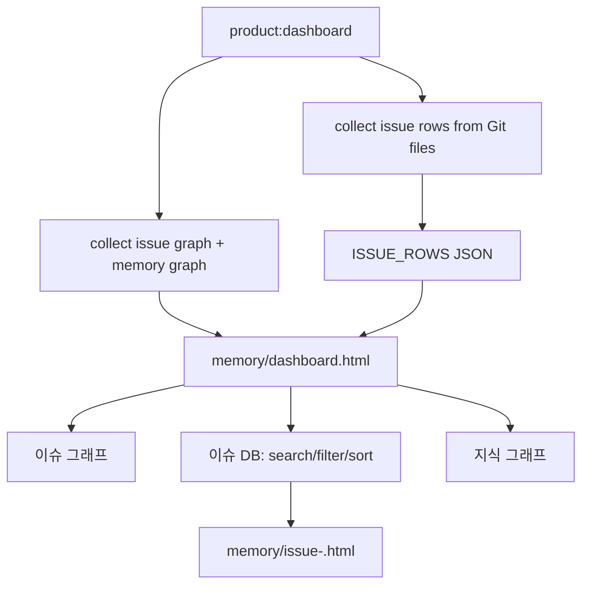

# Spec: Dashboard Database/List View

Issue: `056-dashboard-database-list-view`
Prev: `knowledge/benchmarks/2026-07-03-dashboard-db-list-view-benchmark.md` · Next: `product:plan 056-dashboard-database-list-view`

## Clarify First

The issue and benchmark already settle the key questions for this spec:

1. Primary user? → **Dongwon/PM reviewing ModuFlow work**, especially when choosing the next issue or checking review readiness.
2. Main pain? → **Graph-only navigation is poor for operational scanning**: active/backlog/review, missing artifacts, no PR/review handoff, missing Korean sidecars, and next command are hard to see.
3. Product shape? → **Keep the current graph, add a database/list view**. The dashboard becomes a workbench, not a replacement app.
4. Scope boundary? → **Static generated HTML only**. No external database, no Notion/Jira/Linear sync, no write-back editing in v1.
5. Benchmark direction? → **Notion-style saved views over one dataset, Jira-style status tracking, Linear-style filtered issue lists**. V1 implements the dense issue table first.

## Problem

The current `memory/dashboard.html` is useful for understanding issue and memory relationships, but it is not a comfortable PM triage surface. When Dongwon wants to answer "what should I do next?", "what is review-ready?", or "which issue is missing spec/review/PR/Korean artifacts?", the graph requires node-by-node inspection. That slows down review and makes the dashboard feel less like a daily operating surface.

ModuFlow needs a list/database lens over the same Git-native issue data so the graph can remain a relationship view while the table becomes the scanning, filtering, and handoff view.

## Goals

1. Add an `이슈 DB` tab to `memory/dashboard.html` beside the existing `이슈 그래프` and `지식 그래프` tabs.
2. Build the table from canonical local files: `issues/*.md`, `specs/*`, `.moduflow/state.json`, `workspace/roadmap.md`, and memory frontmatter links.
3. Show PM-useful columns: issue id, title, status, goal, next command, artifact coverage, linked memory count, relationship count, attention flags, and updated date when available.
4. Provide static client-side search, status filtering, attention-flag filtering, and sorting.
5. Let a row open the existing drill-down panel at `memory/issue-<id>.html`.
6. Preserve zero-backend behavior and the current graph interaction model.

## Non-Goals

- No external database, hosted service, or runtime API.
- No Notion, Jira, Linear, or GitHub issue sync in v1.
- No write-back editing from the dashboard.
- No replacement of Git Markdown as the source of truth.
- No full kanban/timeline implementation in this issue; those can reuse the same table data later.
- No automatic machine translation for missing Korean sidecars.

## Users & Scenarios

- As Dongwon/PM, I open `memory/dashboard.html`, switch to `이슈 DB`, and immediately see which issues are `active`, `backlog`, `review`, `blocked`, or `done`.
- As a reviewer, I filter for attention flags such as `missing spec`, `no review`, `no PR`, or `no Korean sidecar`, then open the issue panel from the row.
- As a maintainer, I search `056` or "dashboard" and see the issue title, next command, linked memory count, and artifact coverage without reading the issue file.
- Exception path: if an older issue lacks a parseable status, next command, or date, the row still renders with a neutral fallback and a visible attention flag rather than breaking the dashboard.

## Proposed Solution

Add a table-data collector and an `이슈 DB` tab to the existing project dashboard renderer.

- Add a collector such as `_collect_issue_table(root)` that returns deterministic rows for every `issues/*.md` file.
- Reuse existing issue parsing where possible:
  - `_collect_issue_graph(root)` for title, status bucket, goal, and relationship count.
  - `_issue_linked_memory(root)` for linked memory count and memory previews.
  - `_collect_issue_artifacts(root, issue_id)` or a lightweight sibling checker for artifact coverage.
- Parse `## Next Command` and known metadata from issue markdown using tolerant regexes. Missing values should become empty strings or attention flags, not exceptions.
- Add table payload JSON to `PROJECT_VIEW_TEMPLATE`, for example `const ISSUE_ROWS = __ISSUE_ROWS__;`.
- Add a third tab: `이슈 DB`. The default can remain `이슈 그래프`, with hash deep links such as `#issues`, `#issue-db`, and `#memory`.
- Render the table with vanilla JavaScript only:
  - text search over id/title/next command
  - status filter buttons/chips
  - attention-flag filter
  - sort select for issue id, status, updated date, linked memory count
  - row click or explicit link to `issue-<id>.html`
- Keep generated issue panels from `--dashboard`, so row links resolve without a server.

### Issue Row Shape

Each row should include:

- `id`: full issue slug, e.g. `056-dashboard-database-list-view`
- `number`: numeric prefix when present
- `title`: H1-derived title
- `status`: normalized bucket (`active`, `backlog`, `done`, `blocked`, `review`, `superseded`, or fallback)
- `goal`: parsed goal or `(기타)`
- `next_command`: parsed from `## Next Command`
- `href`: `issue-<id>.html`
- `artifact_coverage`: booleans for `issue`, `spec`, `spec_ko`, `plan`, `plan_ko`, `tasks`, `status`, `review`, `pr`, `release`, and `human_review_ko`
- `linked_memory_count`
- `relationship_count`
- `attention_flags`: compact labels such as `missing_spec`, `no_next_command`, `no_review`, `no_pr`, `no_ko_sidecar`
- `updated`: best available date from status line, sessions, file metadata, or blank if not reliable

## Alternatives Considered

- **Keep graph-only dashboard** — rejected because it solves relationship inspection but not daily PM scanning.
- **Build an external SQLite/Notion-like database** — rejected for v1 because Git Markdown must remain canonical and static HTML is already the product surface.
- **Start with kanban or timeline** — rejected for first implementation. They are useful later, but a dense table gives the fastest triage value and can supply the shared data model for later views.
- **Make the dashboard editable** — deferred. Editing needs write-back semantics, conflict handling, and stronger schema decisions.
- **Create a new separate dashboard app** — rejected. The current `product:dashboard` and `memory/dashboard.html` path should evolve, preserving existing graph and drill-down behavior.

## Acceptance Criteria

1. `product:dashboard` generates `memory/dashboard.html` with at least `이슈 그래프`, `이슈 DB`, and `지식 그래프` tabs.
2. `이슈 DB` lists every file in `issues/*.md`.
3. Each table row shows issue id, title, status, next command, artifact coverage, and linked memory count.
4. Users can search by issue id/title and filter by status in the static HTML.
5. Users can filter or clearly identify missing-artifact attention flags.
6. Rows link to generated `memory/issue-<id>.html` panels.
7. Existing issue graph, memory graph, relationship toggles, knowledge badges, and panel generation continue to work.
8. Tests cover table extraction, artifact coverage detection, linked memory count, rendered tab controls, and row links.
9. `python3 scripts/release_check.py .` passes.

## Risks & Open Questions

- Risk: old issue files have inconsistent prose. Mitigation: parse a small reliable subset and render fallbacks.
- Risk: too many columns make the view noisy. Mitigation: default to compact columns and use flags/badges for secondary signals.
- Risk: artifact coverage can become expensive if full files are read repeatedly. Mitigation: prefer file-existence checks for table coverage and reuse full artifact collection only when needed.
- Risk: generated HTML can become stale after issue edits. Mitigation: keep this aligned with the existing `product:dashboard` regeneration behavior.
- Open: should `review` be a status bucket, an attention flag, or both? Plan should decide based on current issue lifecycle conventions.
