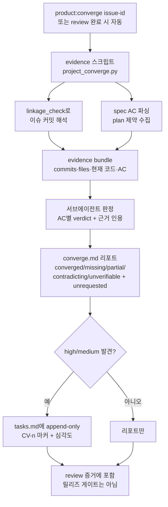

# 스펙: 스펙-코드 수렴 검사 (Spec-Code Converge Check)

이슈: `071-spec-code-converge-check`
이전: `knowledge/benchmarks/2026-07-05-competitive-gap-benchmark.md` (존재 수준 갭 확인), `memory/evidence/2026-07-06-converge-mechanism-benchmark.md` (양 업스트림 소스 직독 메커니즘 벤치마크) · 다음: `product:plan`

## 문제

출시된 코드가 스펙과 여전히 일치하는지 검사하는 것이 없다. `product:review`는 리뷰 시점에 변경을 한 번 게이트할 뿐, done 커밋 이후 스펙↔코드 정렬은 조용히 부식된다 — 구현되지 않은 AC, 스펙에 없는 동작, 원설계와 모순되는 후속 변경이 모두 미탐지. 라이프사이클 드리프트 게이트는 상태 파일만 비교하고 산출물-대-코드는 못 본다. 스펙 주도 비교 대상 양쪽이 정확히 이 기관을 키웠고(spec-kit `/speckit.converge`, OpenSpec `/opsx:verify`), ModuFlow 자신의 어댑터 노트도 converge를 "지켜보되 미흡수"로 표기해 뒀다.

누가 아픈가: 스펙이 현실을 서술한다고 믿고 후속을 계획하는 PM, 그리고 이슈 컨텍스트(스펙)가 코드의 실제 동작을 오도하는 실행 에이전트.

## 목표

1. 이슈 단위 converge 패스가 구현 현실을 `specs/<id>/` 산출물과 대조해 AC별 판정: `converged | missing | partial | contradicting | unverifiable` + 스펙이 요구하지 않은 동작의 `unrequested` 목록.
2. **하이브리드 엔진** (사용자 결정 2026-07-06): 결정적 스크립트가 증거 수집 — 075 `linkage_check`로 연결 커밋 해석, 변경 파일, 현재 코드 내용, AC 목록 파싱 — 하고 서브에이전트가 그 고정된 증거 번들에 대해서만 판정. 재현 가능한 범위 + 의미 판단.
3. 발견은 심각도 등급(high/medium/low)이 붙고 `specs/<id>/tasks.md`에 converge 출처 마커와 함께 **자동 append** (사용자 결정): append-only, 기존 태스크 수정이나 스펙/플랜 소급 편집 절대 없음.
4. **리뷰 완료 시 자동 실행** (사용자 결정): `product:review`의 마지막 증거 단계로 실행; `product:converge <issue-id>`로 언제든 단독 실행 가능 — done 커밋 한참 뒤에도 *현재* 코드 상태를 감사.
5. 리포트는 `specs/<id>/converge.md`에 영속: 증거 번들 참조, AC별 판정, 근거 인용.

## 비목표

- v1은 릴리즈 하드 게이트 아님 — 리뷰가 이미 게이트; 어긋남이 반복될 때만 승격 (이슈 스코프).
- 저장소 전체 상시 스캔 없음 — 이슈 단위, 온디맨드.
- 스펙/플랜/태스크 내용의 소급 편집 없음 — 발견은 append, 절대 재작성 안 함 (spec-kit append-only 원칙).
- `product:review` 대체 아님 — 리뷰는 *변경*의 품질·스펙 준수를 판단; converge는 *현재 코드 vs 스펙*을 감사하고 병합 후에도 재실행 가능.
- 시맨틱 diff 도구를 밑바닥부터 만들지 않음 — 판단은 스크립트가 모은 증거 위에서 서브에이전트의 몫.
- `unverifiable`은 유효한 판정 (리뷰 무결성 규칙) — converged로 반올림 금지.

## 사용자와 시나리오

- **PM으로서**, 이슈의 스펙이 여전히 코드를 서술하는지 알고 싶다 — 고고학이 아니라 현실 위에서 후속을 계획하도록.
  - 기본: `product:converge 075-...` → 증거 스크립트가 075의 커밋/파일 해석 → 서브에이전트가 AC별 판정 → converge.md 리포트 + high 심각도 갭은 tasks.md에 append.
- **리뷰 에이전트로서**, 리뷰 완료 시 converge가 자동 실행되길 원한다 — "구현에서 누락된 AC"가 인간 승인 전에 잡히도록 (048 실패 모드 — 기억해서-실행하기 — 가 대시보드 신선도를 죽였다; 자동 실행으로 재발 방지).
  - 예외: 연결 커밋 없음(미커밋 또는 연결 누락) → 아무것도 없는 데서 판정하지 않고 `no-evidence`를 명시 보고.
- **미래 세션의 에이전트로서**, `unrequested` 발견을 원한다 — 문서화 안 된 동작이 스펙화(레코드/이슈 승격)되거나 제거되도록.
  - 예외: 증거 번들 과대(거대 diff) → 스크립트가 번들당 파일 수를 제한하고 절단을 크게 보고 (조용한 캡 금지).

## 제안 솔루션

### 증거 스크립트 (`scripts/project_converge.py`)

- `--issue-id <id> [--json]`: `git log`에서 `Issue: <id>` 트레일러와 `codex/<id>-*` 브랜치 병합을 스캔해 이슈 커밋 해석(`linkage_check` import; 병합 후 브랜치는 삭제될 수 있지만 트레일러는 생존 — 브랜치명을 언급하는 병합 커밋 제목도 인정), 변경 파일 수집, **현재** 내용 읽기(converge는 과거 diff가 아닌 지금을 감사), spec.md의 `## Acceptance Criteria`와 plan.md의 Global Constraints 파싱. `specs/<id>/converge-evidence.json` 출력.
- 캡: 번들당 최대 파일/바이트 + 명시적 `truncated` 필드 — 절단은 converge.md에 보고, 절대 조용히 안 함.
- git 실패는 크게 에러 (075 Global Constraint 2 승계).

### 판정 (서브에이전트)

- converge 실행당 서브에이전트 1개 (모델 티어 정책상 검증 계열; 호스트가 허용하면 해당 이슈의 구현 에이전트는 판정자가 될 수 없음).
- 입력: 증거 JSON만 — 고정 범위, 재현 가능. 출력 스키마: AC별 `{ac, verdict, severity, evidence_quote, note}` + `unrequested: [{behavior, file, severity}]` + `bundle_gaps`(검증 불가 항목과 사유).
- 추측보다 `unverifiable`을 선호하도록 프롬프트.

### 출력

- `specs/<id>/converge.md`: 날짜별 실행 섹션(재실행은 새 섹션 append — 파일 자체가 이력), 판정 표, unrequested 목록, 절단/번들 갭.
- `specs/<id>/tasks.md`: high/medium 발견을 `## Converge Findings (auto)` 아래 `- [ ] CV-<n> [<심각도>] <발견> — <AC#k|plan-제약>, from converge <날짜>`로 append (출처 참조는 spec-kit의 `per <source-ref>` 차용; dedup 키에 포함). 기존 내용 불변. low는 리포트만.
- `commands/product-converge.md` (신규 명령; 026 원칙대로 기본 멘탈 모델에는 미포함) + `commands/product-review.md`에 자동 실행 단계 추가.

### 가드레일 (spec-kit 문구 거의 그대로 채택)

- converge 패스의 **유일한** 쓰기는 `converge.md` append와 (발견이 있을 때만) tasks.md의 `## Converge Findings (auto)` 섹션 append다. `spec.md`/`plan.md`를 어떤 식으로든 수정하거나, 기존 태스크를 재작성·재번호·재정렬·삭제하는 것을 금지한다.
- 완전 수렴 실행 → tasks.md는 **바이트 단위로 불변**; 빈 발견 헤더를 만들지 않는다.
- `missing` vs `no-evidence` 구분: 커밋은 해석됐는데 AC를 충족하는 코드가 없으면 그 AC는 `missing`(spec-kit의 실패-금지 규칙); 해석 가능한 커밋 자체가 없으면 `no-evidence` 리포트, 판정 안 함.
- **단일 파서 원칙** (OpenSpec #498 교훈 — 검증기 2개는 판정이 갈라진다): AC 파싱은 증거 스크립트 한 곳에서만; 판정자·리포트·append가 같은 파싱 결과를 소비.
- **exit code 계약** (OpenSpec #1311 교훈 — 게이트 실패인데 exit 0): `project_converge.py`는 git/번들 실패 시 JSON·human 모드 동일하게 비-0 종료.
- 방출 순서: high 먼저; plan.md Global Constraints 위반(이 저장소의 constitution 유사물)은 자동 high + 최우선.

## 검토한 대안

- **전부 에이전트 (증거 스크립트 없음)** — 빨리 만들 수 있지만 실행/모델마다 증거 범위가 달라져 판정 재현 불가. 기각 (사용자 결정, 하이브리드 채택).
- **결정적 검사기만** — "이 코드가 이 AC를 충족하는가"를 의미론적으로 판단 불가; 파일명/키워드 매칭의 거짓 확신으로 퇴화. 기각.
- **릴리즈 하드 게이트** — 이슈가 v1 게이트 아님을 명시; 리뷰가 이미 변경을 게이트하고 075 연결 게이트가 귀속을 커버. 메커니즘 벤치마크가 전제를 교정: OpenSpec의 `verify` 자체가 선택적·비차단이고(archive를 막는 건 결정적 아티팩트 검증기이며 그마저 exit-0 버그가 있었음) — 즉 어느 업스트림도 에이전트 판정으로 게이트하지 않는다. 승격 조건 명시하고 유보: 어긋남 발견 반복 시.
- **리포트만, 수동 태스크 채택** — 더 보수적이지만 아무도 안 읽는 리포트는 048 실패의 반복; 출처 마커 붙은 append-only는 어차피 plan/execute에서 사람이 통제. 기각 (사용자 결정).
- **수동 트리거만** — 같은 048 기억해서-실행하기 실패 모드. 기각 (사용자 결정, 리뷰 완료 자동 + 단독 실행).
- **현재 코드 대신 과거 diff 비교** — 제2의 리뷰가 될 뿐; 이슈의 요점은 "*done 커밋 이후에도 검사 가능*"이고 그건 현재 상태 감사를 요구. 기각.

## 벤치마크

양 업스트림 소스 직독(2026-07-06, 서브에이전트): `memory/evidence/2026-07-06-converge-mechanism-benchmark.md`. 071이 앞선 3개 지점 확인 — 결정적 증거 번들(양쪽 다 코드 증거는 프롬프트-only), 판정 상위집합(+unrequested — 그 부재가 OpenSpec #1073의 실증된 구멍; +unverifiable), dedup(spec-kit은 없이 출시). 조정 6건 채택(출처 참조, 가드레일 원문, missing/no-evidence 구분, 단일 파서, exit code, 방출 순서) — 위 제안 솔루션에 반영. 전제 교정 1건: OpenSpec verify는 의무 아카이브 게이트가 아님.

## 수용 기준

- [ ] 코드가 스펙 AC를 누락한 픽스처 → `missing` 보고; 스펙에 없는 동작을 추가한 픽스처 → `unrequested` 보고 (이슈 AC 원문).
- [ ] 증거 스크립트가 done 이슈의 커밋을 트레일러와 병합-브랜치명 양쪽으로 해석(075 자체가 도그푸드 픽스처), 명시적 `truncated`로 번들 캡, git 실패 시 크게 에러.
- [ ] 판정 서브에이전트는 증거 번들만 수신; 판정에 `unverifiable` 포함되고 최소 1개 픽스처에서 실제 발생.
- [ ] high/medium 발견이 `## Converge Findings (auto)` 아래 `CV-<n> [<심각도>] … — <출처참조>` 마커로 tasks.md에 append; 기존 태스크 라인 바이트 동일; 완전 수렴 실행은 tasks.md 바이트 불변 + 빈 헤더 금지; low는 리포트만.
- [ ] `project_converge.py`가 git/번들 실패 시 양쪽 출력 모드에서 비-0 종료; Global Constraint 위반은 자동 high.
- [ ] 재실행은 converge.md에 날짜 섹션 append, 이전 실행 덮어쓰기 금지.
- [ ] `product:review` 문서에 converge 자동 실행 단계 포함; 이미 릴리즈된 이슈에도 단독 `product:converge` 작동.
- [ ] `python3 scripts/release_check.py .` 통과 (이슈 AC).
- [ ] 집중 테스트: AC 파싱, 커밋 해석(FakeRunner), 번들 캡, tasks.md append 멱등성(재실행이 동일 미해결 CV 항목을 중복 추가하지 않음).

## 리스크와 열린 질문

- **판정 분산**: 같은 증거에 실행/모델별 다른 판정 — 고정 증거 번들과 `unverifiable` 편향으로 완화하되 제거는 불가; converge.md 실행 이력으로 분산을 가시화. v1 수용.
- **AC 파싱 가능성**: 옛 스펙의 AC는 체크박스가 아닌 산문 불릿 — 파서는 양쪽 처리; 파싱 불가 AC 라인은 조용한 탈락이 아니라 `unverifiable` 항목화.
- **실행 간 CV 중복**: 재실행이 이미 열려 있는 발견을 재추가하면 안 됨 — 정규화된 발견 텍스트로 dedup; 정확한 규칙은 플랜에서.
- **서브에이전트 가용성**: 세션 한도(2026-07-06 목격)가 디스패치를 막을 수 있음 — 명령 문서에 인라인 폴백(코디네이터 판정 + 제약 기록) 정의, product:review 규칙과 동일.
- **병합 커밋 해석**: squash 병합은 트레일러를 잃음 — 이 저장소는 병합 커밋 사용(보존)이지만, squash 기반 저장소를 위한 한계 명시 필요.
