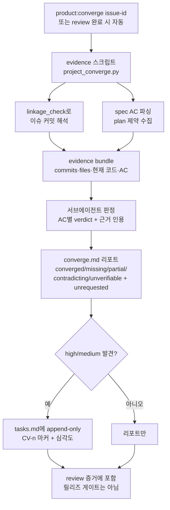

# Spec: Spec-Code Converge Check

Issue: `071-spec-code-converge-check`
Prev: `knowledge/benchmarks/2026-07-05-competitive-gap-benchmark.md` (gap 3, existence-level), `memory/evidence/2026-07-06-converge-mechanism-benchmark.md` (mechanism-level source reading of both upstreams) · Next: `product:plan`

## Problem

Nothing checks that shipped code actually matches its spec. `product:review` gates the change once, at review time, by human/agent reading; after the done commit, spec↔code alignment silently decays — an AC that was never implemented, a behavior the spec never asked for, a later change that contradicts the original design all go undetected. The lifecycle drift gate compares state files, not artifact-vs-code. Both major spec-driven comparators grew exactly this organ (spec-kit `/speckit.converge`, OpenSpec `/opsx:verify`), and ModuFlow's own adapter notes flagged converge as watched-but-unabsorbed.

Who hurts: the PM who believes the spec describes reality when planning follow-ups on top of it, and the executing agent whose issue context (spec) misleads it about what the code does.

## Goals

1. A converge pass for one issue compares implementation reality against `specs/<id>/` artifacts and grades each acceptance criterion: `converged | missing | partial | contradicting | unverifiable`, plus an `unrequested` list for behavior the spec never asked for.
2. **Hybrid engine** (user decision 2026-07-06): a deterministic script collects evidence — linked commits via 075's `linkage_check` (trailer/branch resolution), files they touched, current file contents, the parsed AC list — and a subagent judges each AC against that fixed evidence bundle. Reproducible scope, semantic judgment.
3. Findings are severity-graded (high/medium/low) and **auto-appended** to `specs/<id>/tasks.md` under a converge-origin marker (user decision): append-only, never editing existing tasks or retro-editing spec/plan.
4. **Auto-run after review** (user decision): `product:review` runs converge as its final evidence step; also runnable standalone anytime via `product:converge <issue-id>` — including long after the done commit, against the *current* code state.
5. Report persisted to `specs/<id>/converge.md` with the evidence bundle reference, per-AC verdicts, and quotes.

## Non-Goals

- Not a release hard gate in v1 — review already gates; promote later only if divergence recurs (issue scope).
- No whole-repo continuous scanning — per-issue, on demand.
- No retroactive edits to spec/plan/tasks content — findings append, never rewrite (spec-kit append-only principle).
- Not a replacement for `product:review` — review judges quality and spec compliance of the *change*; converge audits *current code vs spec* and stays re-runnable after merge.
- No semantic-diff tooling built from scratch — judgment is the subagent's job on script-collected evidence.
- `unverifiable` is a valid verdict (review-integrity rule) — never rounded up to converged.

## Users & Scenarios

- **As the PM**, I want to know whether an issue's spec still describes the code, **so that** I can plan follow-ups on reality, not archaeology.
  - Main: `product:converge 075-...` → evidence script resolves 075's commits/files → subagent grades each AC → converge.md report + high-severity gaps appended to tasks.md.
- **As the reviewing agent**, I want converge to run automatically at review completion, **so that** "AC omitted from implementation" is caught before the human approves (the 048 failure mode — remember-to-run — killed the dashboard freshness; auto-run avoids repeating it).
  - Exception: no linked commits found (work not yet committed or linkage missing) → converge reports `no-evidence` explicitly rather than judging from nothing.
- **As a future session's agent**, I want `unrequested` findings, **so that** undocumented behavior gets either specced (promote to record/issue) or removed.
  - Exception: evidence bundle too large (huge diff) → script caps files per bundle and reports the truncation loudly (no silent caps).

## Proposed Solution

### Evidence script (`scripts/project_converge.py`)

- `--issue-id <id> [--json]`: resolves the issue's commits by scanning `git log` for `Issue: <id>` trailers and `codex/<id>-*` branch merges (imports `linkage_check`; branch may be deleted post-merge, trailers survive — merge-commit subjects mentioning the branch also count), collects touched files, reads their **current** contents (converge audits now, not the historical diff), parses `## Acceptance Criteria` from spec.md and Global Constraints from plan.md. Emits `specs/<id>/converge-evidence.json`.
- Caps: max files/bytes per bundle with explicit `truncated` field — truncation is reported in converge.md, never silent.
- Git failures error loudly (075 Global Constraint 2 carries over).

### Judgment (subagent)

- One subagent per converge run (per model-tier policy: verification-class task; the implementing agent of the issue must not be the judge where the host allows).
- Input: the evidence JSON only — fixed scope, reproducible. Output schema: per-AC `{ac, verdict, severity, evidence_quote, note}` + `unrequested: [{behavior, file, severity}]` + `bundle_gaps` (what it could not verify and why).
- Prompted to prefer `unverifiable` over guessing.

### Outputs

- `specs/<id>/converge.md`: dated run section (multiple runs append new sections — the file is its own history), verdict table, unrequested list, truncation/bundle gaps.
- `specs/<id>/tasks.md`: high/medium findings appended under `## Converge Findings (auto)` as `- [ ] CV-<n> [<severity>] <finding> — <AC#k|plan-constraint>, from converge <date>` (source-ref borrowed from spec-kit's `per <source-ref>`; the dedup key includes it). Existing content never edited. Low-severity stays report-only.
- `commands/product-converge.md` (new command; not added to the default mental model per 026) + `commands/product-review.md` gains the auto-run step.

### Guardrails (spec-kit wording adopted near-verbatim)

- The converge pass's **only** write is appending to `converge.md` and (findings permitting) the `## Converge Findings (auto)` section of `tasks.md`. It MUST NOT modify `spec.md` or `plan.md` in any way, nor rewrite, renumber, reorder, or delete any existing task.
- Fully converged run → `tasks.md` stays **byte-for-byte unchanged**; never emit an empty findings header.
- `missing` vs `no-evidence` split: commits resolved but no code satisfies an AC → that AC is `missing` (spec-kit's don't-fail rule); no resolvable commits at all → `no-evidence` report, no judging.
- **Single-parser principle** (OpenSpec #498 lesson — dual validators diverge): the AC list is parsed once, in the evidence script; the judge, the report, and the append step all consume that same parsed output.
- **Exit-code contract** (OpenSpec #1311 lesson — gate failed with exit 0): `project_converge.py` exits non-zero on git or bundle failure, identically in JSON and human modes.
- Emission order: high severity first; violations of plan.md Global Constraints (this repo's constitution analog) are automatically high and emitted first.

## Alternatives Considered

- **Full-agent (no evidence script)** — faster to build, but evidence scope would vary per run and per model; irreproducible verdicts. Rejected (user decision) for hybrid.
- **Deterministic-only checker** — cannot judge "does this code satisfy this AC" semantically; would degrade into filename/keyword matching with false confidence. Rejected.
- **Release hard gate** — v1 explicitly not a gate per the issue; review already gates changes, and 075's linkage gate covers attribution. Mechanism benchmark corrected our premise here: OpenSpec's `verify` is itself optional and non-blocking (the blocking part of `archive` is a deterministic artifact validator, which even shipped an exit-0-on-failure bug) — so neither upstream actually gates on agent judgment. Deferred with a stated promotion condition: recurring divergence findings.
- **Report-only, manual task adoption** — more conservative, but a report nobody reads repeats the 048 stale-dashboard failure; append-only with origin markers keeps the human in control at plan/execute time anyway. Rejected (user decision).
- **Manual-trigger-only** — same 048 remember-to-run failure mode. Rejected (user decision) for auto-run at review completion + standalone.
- **Comparing historical diff instead of current code** — would make converge a second review; the issue's point is "*stays checkable after the done commit*", which requires auditing current state. Rejected.

## Benchmark

Mechanism-level source reading of both upstreams (2026-07-06, subagent): `memory/evidence/2026-07-06-converge-mechanism-benchmark.md`. Confirmed 071 ahead of upstream on three counts — deterministic evidence bundle (both upstreams are prompt-only on code evidence), verdict superset (+`unrequested`, whose absence is OpenSpec's empirical hole #1073; +`unverifiable`), and dedup (spec-kit ships without it). Adopted six adjustments (source-refs on CV lines, verbatim guardrails, missing/no-evidence split, single-parser, exit codes, emission order) — folded into Proposed Solution above. Corrected one premise: OpenSpec verify is not a mandatory archive gate.

## Acceptance Criteria

- [ ] Fixture where code omits a spec AC → converge reports `missing`; fixture where code adds unspecified behavior → reported in `unrequested` (issue AC, verbatim).
- [ ] Evidence script resolves commits via trailer and via merged-branch name for a done issue (075 itself is the dogfood fixture), caps bundles with explicit `truncated`, and errors loudly on git failure.
- [ ] Judgment subagent receives only the evidence bundle; verdicts include `unverifiable` and it is exercised in at least one fixture.
- [ ] High/medium findings append to tasks.md under `## Converge Findings (auto)` with `CV-<n> [<severity>] … — <source-ref>` markers; existing task lines byte-identical; fully-converged run leaves tasks.md byte-for-byte unchanged with no empty header; low severity report-only.
- [ ] `project_converge.py` exits non-zero on git/bundle failure in both output modes; Global-Constraint violations grade high automatically.
- [ ] Repeat runs append dated sections to converge.md, never overwrite prior runs.
- [ ] `product:review` doc includes the converge auto-run step; standalone `product:converge` works on already-released issues.
- [ ] `python3 scripts/release_check.py .` passes (issue AC).
- [ ] Focused tests: AC parsing, commit resolution (FakeRunner), bundle caps, tasks.md append idempotency (re-run does not duplicate identical open CV items).

## Risks & Open Questions

- **Judgment variance**: same evidence, different verdicts across runs/models — mitigated by fixed evidence bundles and `unverifiable` bias, but not eliminated; converge.md keeps run history so variance is visible. Accept for v1.
- **AC parseability**: older specs' AC sections are prose bullets, not checkboxes — parser must handle both; unparseable AC lines become `unverifiable` entries, not silent drops.
- **Duplicate CV tasks across runs**: re-running converge must not re-append findings already open in tasks.md — dedup on normalized finding text; exact rule in plan.
- **Subagent availability**: session limits (seen 2026-07-06) can block dispatch — command doc must define the inline fallback (coordinator judges, records the limitation), mirroring product:review's rule.
- **Merge-commit resolution**: squash merges would lose trailers — this repo uses merge commits (preserved), but the resolver should note the limitation for squash-based repos.
