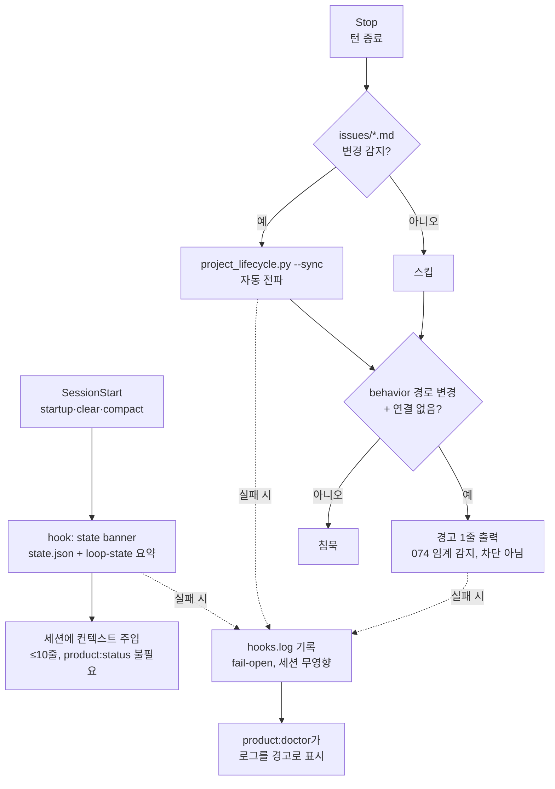

# 스펙: 라이프사이클 훅 자동화 (Lifecycle Hooks Automation)

이슈: `072-lifecycle-hooks-automation`
이전: `knowledge/benchmarks/2026-07-05-competitive-gap-benchmark.md` (갭 4: superpowers의 SessionStart 패턴 대비 훅 표면 0), 075 핸드오프(세션 중 연결 감지를 이쪽으로 이관) · 다음: `product:plan`

## 문제

라이프사이클 전파가 "기억해서 실행하기" 규율이고, 같은 방식으로 계속 실패한다: 048의 대시보드는 이슈 5개 동안 조용히 낡아 있었고, 065는 활성화 드리프트를 기록했으며, 이 스펙을 쓴 당일(2026-07-06)에도 조율 에이전트 본인이 `lifecycle drift` 검증 에러를 두 번(071 활성화, 075 상태) 내고 수동 `--sync`로 고쳤다. 전부 같은 부류다: 누군가 이슈 파일을 바꿨는데 누군가 기억할 때까지 아무것도 전파되지 않는다.

오늘 더 날카로운 갭이 하나 추가됐다: 075가 릴리즈 시점 연결 게이트를 출시하면서 **세션 중** 임계 감지("임계를 넘는 *그 순간* 워크플로우가 알려줘야 한다" — 074의 원래 아픔)를 이 이슈로 명시 이관했다. 지금은 에이전트가 이슈 연결 없이 `scripts/`를 한 세션 내내 고쳐도 릴리즈 전까지 아무 소리도 안 난다.

누가 아픈가: 낡은 대시보드를 읽는 PM, 매번 `product:status`를 수동 실행해야 상태를 아는 새 세션, 074의 조용한 임계 통과를 반복할 에이전트.

## 목표

1. **SessionStart 컨텍스트 주입**: 플러그인 훅(`startup|clear|compact` 매처)이 압축 상태 배너 — 목표, 활성 이슈, 단계, 다음 명령, 미승격 레코드 수 — 를 내보내 새 세션이 `product:status` 없이 프로젝트 상태를 안다.
2. **Stop 훅 일괄 lifecycle sync**: 턴이 끝날 때 `issues/*.md`가 (마지막 sync 대비) 변경됐으면 훅이 `project_lifecycle.py --sync` 실행 — 전파가 규율이 아닌 구조적 보장이 된다 (사용자 결정 2026-07-06: 포함).
3. **Stop 훅 세션 중 연결 경고** (075 이관분, 사용자 결정 2026-07-06: 포함): 같은 훅이 import 가능한 `linkage_check`를 dirty/현 브랜치 behavior 경로에 호출; 미연결 동작 변경은 **세션 내 경고 1줄** — 074의 임계 통과가 일어나는 순간 들리게 된다. 경고 전용; 하드 게이트는 릴리즈에 유지(075 결정 불변).
4. **전면 fail-open**: 훅은 항상 성공 종료, 하드 타임아웃(5초), 실패는 `.moduflow/logs/hooks.log`에 기록 — 훅 실패가 세션을 막거나 눈에 띄게 늦춰선 절대 안 된다.
5. **doctor가 훅 건강 표시** (사용자 결정: 로그만): `product:doctor`가 hooks.log를 읽어 최근 실패를 경고로 보고; 이번 이슈에서 더 깊은 통합은 없음.

## 비목표

- 파일 워처 데몬 없음 — 훅은 Claude Code 플러그인 이벤트에서만 발화.
- 훅 주도 자동 커밋 없음 (061 흐름은 에이전트 주도·게이트 검증 유지).
- 어떤 종류의 차단도 없음: 훅은 세션·툴콜·정지를 게이트하지 않는다 — 연결 경고는 정보성이고 강제는 `release_check`(075)에 남는다.
- 훅에서 converge 자동 실행 없음 — 그건 `product:review` 소관(071).
- Codex 호스트 훅 표면 없음 — Claude Code 플러그인 훅 이벤트 대상; 다른 호스트는 오늘의 동작으로 우아하게 퇴화.
- sync/연결 로직 재작성 없음 — 훅은 기존 스크립트(`project_lifecycle.py`, `linkage_check.py`) 위의 얇은 트리거일 뿐.

## 사용자와 시나리오

- **돌아온 사용자로서**, 새 세션이 프로젝트 상태와 함께 열리길 원한다 — "지금 뭐 하고 있었지"에 수동 status 호출이 필요 없도록.
  - 기본: 세션 시작 → SessionStart 훅이 `.moduflow/state.json` + `workspace/loop-state.json` 읽음 → ≤10줄 배너 주입.
  - 예외: 상태 파일 없음/손상 → 훅은 아무것도 출력 안 하고 hooks.log 기록, 세션 무영향.
- **PM으로서**, 이슈 파일 편집이 누가 기억하지 않아도 전파되길 원한다 — 048 낡은-대시보드 부류가 죽도록.
  - 기본: 에이전트가 Status 라인 수정 → 턴 종료 → Stop 훅이 변경 감지 → `--sync` → 다음 턴 전에 state.json/대시보드 최신.
  - 예외: sync 자체 실패 → 로그 기록, 세션 계속; doctor가 나중에 경고.
- **운영 에이전트로서**, "behavior 경로가 연결 없이 변경됨"을 세션 중에 듣고 싶다 — 074의 조용한 통과가 반복 불가능하도록.
  - 기본: 미커밋/브랜치 변경이 `scripts/` 터치 + `codex/<id>` 브랜치도 트레일러도 없음 → Stop 훅이 경로를 지목하는 경고 1줄.
  - 예외: 연결이 해석됨 → 침묵; 같은 미변경 상태는 다음 턴에 재경고하지 않음(잔소리 금지).

## 제안 솔루션

### 구성 요소

- `hooks/hooks.json` (플러그인 훅 매니페스트): SessionStart(`startup|clear|compact`) → `hooks/session_start.py`; Stop → `hooks/on_stop.py`. 정확한 매니페스트 스키마는 플랜 단계에서 현행 Claude Code 플러그인 문서로 검증(아래 리스크).
- `hooks/session_start.py`: state.json + loop-state + 보존 카운트(저비용 경로)를 읽어 배너 출력. 예외 발생 → 로그 + exit 0.
- `hooks/on_stop.py`: ① 변경 감지 — 마지막 sync 마커 대비 `issues/*.md` 해시/mtime 비교; 변경 시 `--sync`. ② 연결 퀵체크 — `git status --porcelain`의 behavior 경로 + 브랜치/트레일러 해석(`linkage_check`); 미연결 → 경고 1줄, 직전 턴 경고 지문과 dedup. 통상 1초 미만, 5초 하드 타임아웃, 항상 exit 0.
- `.moduflow/logs/hooks.log`: append-only 타임스탬프 로그; `product:doctor`가 tail(최근 N줄/7일)을 경고로 표시.
- 트리거 이상의 로직은 전부 기존 스크립트에 — 훅은 호출만, 재구현 금지(071 단일 파서 원칙의 sync/연결판).

## 검토한 대안

- **PostToolUse 편집별 sync** — Edit/Write마다 발화; 턴 중간 지연만 늘리고 이득 없음. Stop 일괄이 같은 보장을 턴당 1회로. 기각.
- **파일 워처 데몬** — 호스트 이벤트 밖 상주 프로세스; 이슈 명시 비목표. 기각.
- **차단형 연결 훅** (미연결 시 정지 거부) — 075가 의도적으로 정당화한 탐색 흐름을 처벌; 강제는 릴리즈 전용이라는 075 결정 기존재. 경고 전용. 기각.
- **훅 대신 스킬 지시 리마인더** ("이슈 편집 후 --sync 실행할 것") — 그게 바로 현행 설계고, 048 + 오늘의 드리프트 에러 2건이 그 실패 기록이다. 훅은 하네스가 실행하고, 지시는 기억에 의존한다. 기각.
- **연결 경고를 별도 이슈로 분리** — 072가 작아지지만, 경고는 같은 Stop 훅 안에서 이미 import된 모듈 호출 ~30줄; 분리는 이슈 하나의 오버헤드만 산다. 기각 (사용자 결정).
- **doctor 훅-건강 풀 모듈 (065 스코프)** — 유보; 이번엔 로그 tail 경고만 (사용자 결정).

## 수용 기준

- [ ] ModuFlow 프로젝트의 새 세션이 수동 `product:status` 없이 목표/활성 이슈/다음 명령을 표시 (이슈 AC 원문).
- [ ] 이슈 Status 라인 수정 후 정지하면 수동 sync 호출 없이 state.json/대시보드 전파 (이슈 AC 원문) — 픽스처 검증: Status 변경 → Stop 훅 스크립트 직접 호출 → state.json 갱신 확인.
- [ ] 연결 없는 미커밋 behavior 변경이 턴 종료 시 정확히 경고 1줄 생성; 동일 미변경 상태는 다음 턴 재경고 없음; 연결된 변경은 침묵.
- [ ] 훅 실패는 조용히 퇴화(세션 무영향)하고 `.moduflow/logs/hooks.log`에 기록 (이슈 AC + 로그 경로).
- [ ] `product:doctor`가 최근 hooks.log 항목을 경고로 보고; 로그 없음/빈 로그 → 출력 없음.
- [ ] 훅은 항상 exit 0, 5초 타임아웃 준수, 기존 스크립트 재사용(중복 sync/연결 로직 없음).
- [ ] `python3 scripts/release_check.py .` 통과 (이슈 AC).
- [ ] 집중 테스트: 픽스처 상태 파일 기반 배너 내용, 변경 감지 마커, 경고 dedup 지문, 손상 상태/git 실패 시 fail-open, doctor 로그 표시.

## 리스크와 열린 질문

- **훅 매니페스트 스키마 정확성**: Claude Code 플러그인의 정확한 이벤트명/매처 문법을 플랜 단계에서 공식 문서로 검증해야 한다(superpowers가 출시한 훅이 읽어볼 참조 구현). 틀리면 조용히 실패한다 — 플랜의 첫 태스크는 코드가 아니라 스키마 검증.
- **Stop 훅 지연 예산**: 매 턴 종료마다 보존 카운트 + git status + 연결 해석; 체감 불가(통상 <1초) 유지. 보존 경로가 느리면 세션을 늦추지 말고 배너에서 빼라.
- **경고 피로**: dedup 지문(같은 미연결 경로 집합 → 1회 경고)이 방어선; 도그푸드에서 잔소리로 판명되면 지문 윈도를 넓혀 조정.
- **플러그인 캐시 vs 저장소 훅**: 사용자는 설치된 플러그인 캐시에서 ModuFlow를 실행 — 훅은 플러그인 자신의 저장소가 아니라 *작업 디렉토리* 프로젝트 경로를 해석해야 함(026/065과 같은 경계).
- **Codex 패리티**: 이번엔 없음; Codex에 동등한 훅 표면이 생기면 후속으로 `on_stop` 미러링.
