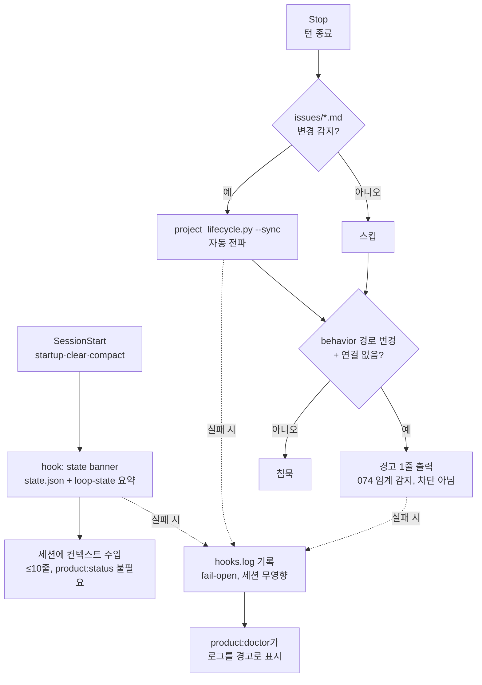

# Spec: Lifecycle Hooks Automation

Issue: `072-lifecycle-hooks-automation`
Prev: `knowledge/benchmarks/2026-07-05-competitive-gap-benchmark.md` (gap 4: zero hook surface vs superpowers' SessionStart pattern), 075 handoff (session-time linkage detection deferred here) · Next: `product:plan`

## Problem

Lifecycle propagation is a remember-to-run discipline, and it keeps failing the same way: 048's dashboard sat silently stale across five issues; 065 documented activation drift; and on 2026-07-06 — the day this spec was written — the coordinating agent itself hit `lifecycle drift` validation errors twice (071 activation, 075 state) and fixed them with manual `--sync` calls. Every occurrence is the same class: a human or agent changed an issue file and nothing propagated until someone remembered.

A second, sharper gap landed today: 075 shipped the release-time linkage gate but explicitly deferred **session-time** threshold detection ("the workflow should flag the crossing *while it happens*", the original 074 pain) to this issue. Right now an agent can modify `scripts/` for a full session with no issue linkage and hear nothing until release.

Who hurts: the PM reading stale dashboards; every new session that starts blind (running `product:status` manually to learn the active issue); the agent that repeats 074's silent threshold crossing.

## Goals

1. **SessionStart context injection**: a plugin hook (`startup|clear|compact` matchers) emits a compact state banner — goal, active issue, phase, next command, unpromoted-record count — so a new session knows the project state without running `product:status`.
2. **Stop-hook batched lifecycle sync**: when a turn ends and `issues/*.md` changed (vs last sync), the hook runs `project_lifecycle.py --sync` — propagation becomes an architectural guarantee, not a discipline (user decision 2026-07-06: included).
3. **Stop-hook session-time linkage warning** (075 handoff, user decision 2026-07-06: included): the same hook calls the importable `linkage_check` on dirty/committed-this-branch behavior paths; unlinked behavior changes produce a **warning line in the session** — the 074 threshold crossing becomes audible while it happens. Warn-only; the hard gate stays at release (075 decision unchanged).
4. **Fail-open everywhere**: hooks always exit success, hard timeout (5s), failures append to `.moduflow/logs/hooks.log` — a hook failure must never block or slow a session noticeably.
5. **Doctor surfaces hook health** (user decision: log-only): `product:doctor` reads `hooks.log` and reports recent failures as warnings; no deeper integration this issue.

## Non-Goals

- No file-watcher daemon — hooks fire on Claude Code plugin events only.
- No hook-driven auto-commit (061's flow stays agent-driven and gate-checked).
- No blocking behavior of any kind: hooks never gate a session, a tool call, or a stop — the linkage warning is informational; enforcement remains `release_check` (075).
- No converge auto-run in hooks — `product:review` owns that (071).
- No Codex-host hook surface — this targets Claude Code's plugin hook events; other hosts degrade to today's behavior gracefully.
- No retroactive rewriting of sync/linkage logic — hooks are thin triggers over existing scripts (`project_lifecycle.py`, `linkage_check.py`).

## Users & Scenarios

- **As a returning user**, I want each new session to open with the project state, **so that** "지금 뭐 하고 있었지" never needs a manual status call.
  - Main: session starts → SessionStart hook reads `.moduflow/state.json` + `workspace/loop-state.json` → injects ≤10-line banner (goal, active issue, phase, next command).
  - Exception: state files missing/corrupt → hook emits nothing, logs to hooks.log, session unaffected.
- **As the PM**, I want issue-file edits to propagate without anyone remembering, **so that** the 048 stale-dashboard class dies.
  - Main: agent edits `issues/072-… .md` Status line → turn ends → Stop hook detects the change → `--sync` runs → state.json/dashboard current before the next turn.
  - Exception: sync itself fails → logged, session continues; doctor warns later.
- **As the operating agent**, I want to hear "behavior paths changed with no issue linkage" during the session, **so that** 074's silent crossing cannot repeat.
  - Main: uncommitted/branch changes touch `scripts/` with no `codex/<id>` branch or trailer → Stop hook emits one warning line naming the paths.
  - Exception: linkage resolves (branch/trailer present) → silent; warning appears at most once per unchanged state (no nagging every turn).

## Proposed Solution

### Components

- `hooks/hooks.json` (plugin hook manifest): SessionStart (matchers `startup|clear|compact`) → `hooks/session_start.py`; Stop → `hooks/on_stop.py`. Exact manifest schema verified against current Claude Code plugin docs at plan time (risk below).
- `hooks/session_start.py`: reads `.moduflow/state.json` + `workspace/loop-state.json` + retention count (`project_retention.py` status, cheap path); prints the banner to the hook context channel. Any exception → log + exit 0.
- `hooks/on_stop.py`: ① change detection — compare `issues/*.md` hashes/mtimes against a marker written at last sync (`.moduflow/state/.last-sync` or equivalent); changed → run `project_lifecycle.py --sync`. ② linkage quick-check — `git status --porcelain` behavior paths + current branch/trailer resolution via `linkage_check`; unlinked → one warning line, deduped against the previous turn's warning fingerprint (no nagging). Total budget < 1s typical, 5s hard timeout, always exit 0.
- `.moduflow/logs/hooks.log`: append-only, timestamped failures/warnings; `product:doctor` tails it (last N lines / last 7 days) as warnings.
- All logic beyond triggering lives in the existing scripts — hooks import/invoke, never reimplement (071's single-parser principle applied to sync/linkage).

## Alternatives Considered

- **PostToolUse per-edit sync** — fires on every Edit/Write; sync would run dozens of times per turn for no benefit and add latency where it hurts (mid-turn). Stop-batched sync gets the same guarantee once per turn. Rejected.
- **File-watcher daemon** — background process outside host events; explicit issue Non-Goal (lifetime/portability cost). Rejected.
- **Blocking linkage hook** (deny the stop / fail the turn on unlinked changes) — punishes the exploratory flow 075 deliberately legitimized; 075 already decided enforcement lives at release only. Warn-only here. Rejected.
- **Skill-instruction reminders instead of hooks** ("always run --sync after editing issues") — that *is* the current design, and 048 + today's two drift errors are its failure record. The harness executes hooks; instructions depend on memory. Rejected.
- **Deferring the linkage warning to a separate issue** — smaller 072, but the warning is one extra call into an already-imported module inside the same Stop hook; splitting it buys a second issue's overhead for ~30 lines. Rejected (user decision).
- **Full doctor hook-health module (065 scope)** — deferred; log-tail warnings only this issue (user decision).

## Acceptance Criteria

- [ ] New session in a ModuFlow project surfaces goal/active-issue/next-command without running `product:status` manually (issue AC, verbatim).
- [ ] Editing an issue's Status line then stopping propagates state.json/dashboard without a manual sync call (issue AC, verbatim) — verified by fixture: mutate a Status line, invoke the Stop hook script directly, assert state.json updated.
- [ ] Uncommitted behavior-path changes with no branch/trailer linkage produce exactly one warning line at turn end; the same unchanged state does not re-warn next turn; linked changes stay silent.
- [ ] Hook failure degrades silently (session unaffected), appended to `.moduflow/logs/hooks.log` (issue AC + log path).
- [ ] `product:doctor` reports recent hooks.log entries as warnings; empty/absent log → no output.
- [ ] Hooks always exit 0, respect the 5s timeout, and reuse existing scripts (no duplicated sync/linkage logic — code-reviewable).
- [ ] `python3 scripts/release_check.py .` passes (issue AC).
- [ ] Focused tests: banner content from fixture state files, change-detection marker behavior, linkage warning dedup fingerprint, fail-open on corrupt state/git failure, doctor log surfacing.

## Risks & Open Questions

- **Hook manifest schema accuracy**: the exact `hooks/hooks.json` event names/matcher syntax for Claude Code plugins must be verified against current official docs at plan time (superpowers' shipped hooks are the working reference implementation to read first). Getting this wrong fails silently — the plan's first task is schema verification, not code.
- **Stop-hook latency budget**: retention count + git status + linkage resolution every turn end; must stay imperceptible (<1s typical). If the retention path is slow, drop it from the banner rather than slow the session.
- **Warning fatigue**: the dedup fingerprint (same unlinked path set → warn once) is the guard; if it still nags in practice, the fingerprint window widens — tune in dogfood.
- **Plugin-cache vs repo hooks**: users run ModuFlow from the installed plugin cache; hooks must resolve project paths from the *working directory's* project, not the plugin's own repo — same boundary 026/065 dealt with.
- **Codex parity**: none this issue; if Codex adds an equivalent hook surface, a follow-up mirrors `on_stop`.
