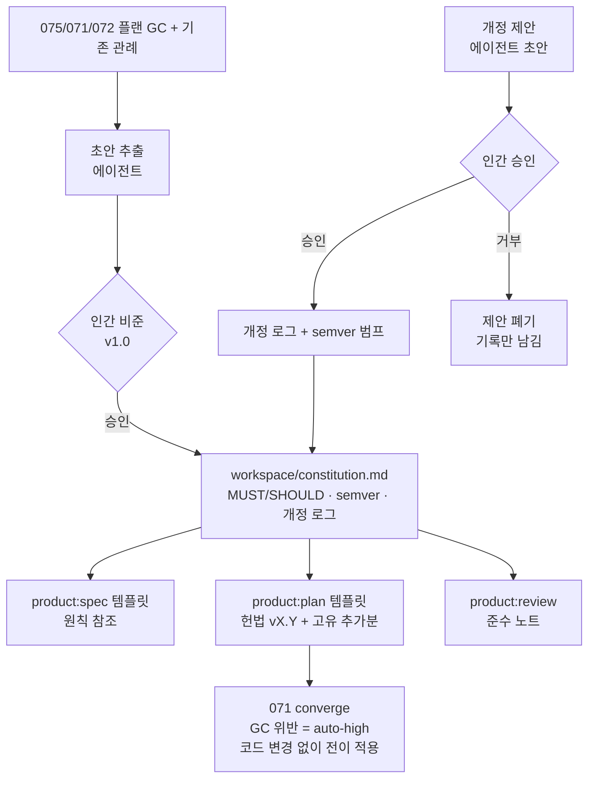

# 스펙: 프로젝트 헌법 스티어링 (Project Constitution Steering)

이슈: `073-project-constitution-steering`
이전: `knowledge/benchmarks/2026-07-05-competitive-gap-benchmark.md` (갭 5/5, 마지막 미해결) · 다음: `product:plan`

## 문제

모든 플랜이 프로젝트의 상비 엔지니어링 규칙을 자기 Global Constraints로 재작성한다. 2026-07-06 세션이 측정된 증거다: 세 플랜(075/071/072)이 각각 8·10·9개의 GC를 실었고, 상당수가 같은 하우스 룰의 재진술이었다 — runner 주입 패턴, TDD 순서, fail-open 규율, 조용한 예외 금지, 모델 티어 정책, canonical 마크다운 규칙, canonical 전환의 인간 게이트. 재진술마다 표현이 흐르고, 조용히 누락될 수 있고, 플랜 작성 주의력을 소모한다. 한편 `071`의 converge는 이미 "plan GC 위반 = 자동 high"로 동작하며 스펙에 plan GC를 "이 저장소의 constitution 유사물"로 명시했다 — 집행 슬롯은 있는데, 집행 대상이 통치되는 원천이 아니라 플랜별 사본이다.

누가 아픈가: 플랜 작성자(재유도), 리뷰어(미묘하게 다른 N개 규칙 집합 대조), 그리고 규칙 자체(무버전, 무개정, 드리프트 취약).

## 목표

1. **`workspace/constitution.md`**: MUST/SHOULD 강도가 명시된 번호 원칙, semver 버전, 개정 로그(날짜·변경·승인자). 초대 v1.0 내용은 075/071/072 플랜 GC와 기존 관례(모델 티어 067, 인간 게이트 원칙 075, 단일 파서 071)에서 **추출** — 새 법을 발명하지 않고 실행된 법을 성문화.
2. **인간 게이트 개정** (사용자 결정 2026-07-07): 에이전트는 개정을 초안/제안만 할 수 있고, 채택(v1.0 비준 포함)은 개정 로그에 기록되는 명시적 인간 승인 필요. 헌법은 저장소에서 가장 canonical한 문서 — 075의 인간 게이트 원칙이 여기에 가장 먼저 적용된다.
3. **템플릿은 참조, 플랜은 확장** (사용자 결정: 템플릿+문서 범위): `product:spec`/`product:plan` 지침 변경으로 플랜 GC가 "헌법 vX.Y 적용; 플러스 이 플랜 고유 추가분"이 된다 — 공유 규칙은 절대 재진술하지 않고 델타 규칙만 플랜별 작성.
4. **리뷰에 준수 노트**: `product:review` 판정과 리뷰 핸드오프 템플릿에 헌법 점검 라인(대조한 버전, 위반 유무) 포함.
5. **converge는 공짜로 상속**: 코드 변경 없음 — 플랜이 헌법을 참조하면 `071`의 기존 "GC 위반 = auto-high"가 플랜이 적용하는 곳 어디서든 헌법 원칙을 전이적으로 집행한다.

## 비목표

- Kiro식 조건부/glob/시맨틱 로딩 없음 — 단일 파일, 상시 적용 (이슈 v1 범위).
- 조직/MDM 다계층 스코핑 없음.
- 이번 이슈에 기계 파싱/집행 코드 없음 (사용자 결정): `spec_consistency`/converge/release_check 무변경; 분석기-헌법 검사 통합은 070 후속 영역.
- 출시된 플랜 소급 편집 없음 (075/071/072의 인라인 GC는 역사로 보존; 템플릿 변경은 전방 적용).
- AGENTS.md 대체 아님 (060 경계: AGENTS.md는 에이전트 출력/형식 관례, 헌법은 엔지니어링 원칙).

## 사용자와 시나리오

- **플랜 작성자(에이전트)로서**, 플랜 고유 제약만 쓰고 싶다 — 공유 규칙은 하나의 canonical 표현으로 참조되도록.
  - 기본: `product:plan 076-x` → 플랜 GC 섹션이 "Constitution v1.0 적용 (workspace/constitution.md); 추가분:"으로 열리고 이슈 고유 규칙 2-3개만.
- **인간 PM으로서**, 규칙 변경이 나를 거치길 원한다 — 기반 규칙이 에이전트 편의로 드리프트하지 않도록.
  - 기본: 에이전트가 개정 초안(예: 포스트모템에서 나온 새 MUST) → diff+근거 제시 → 인간 승인 → 개정 로그에 날짜·승인자 기입, 버전 범프(major: 원칙 추가/삭제/강도 변경; minor: 표현 명확화).
  - 예외: 로그된 인간 승인 없는 에이전트의 헌법 편집 → 리뷰어는 그 개정을 무효로 취급; 되돌림 경로를 파일 헤더에 문서화.
- **리뷰어로서**, 규칙을 대조할 단일 위치를 원한다 — 준수 노트가 고고학이 아니라 조회가 되도록.
  - 기본: review.md 판정에 `Constitution: v1.0 checked — no violations` (또는 위반 목록).

## 제안 솔루션

### 헌법 파일 형태 (`workspace/constitution.md`)

- 헤더: 버전(semver), 비준일, 승인자, 개정 절차(에이전트 제안 → 인간 승인 → 로그 기입), 무효 개정 규칙(미기록 편집은 무효).
- 번호 원칙 `C1..Cn`, 각: 강도(MUST/SHOULD), 한 문장 규칙, 한 줄 근거, 출처 참조(어느 이슈/플랜이 확립했는지). v1.0 후보 집합(비준용 초안, 실행된 법에서 추출): runner 주입(071/075), 게이트 경로 조용한 예외 금지(075 GC2), 집중 테스트 동반 TDD(플랜들, 067 브리지), 훅 fail-open(072), byte 불변 no-op & append-only 발견(071), canonical 전환 인간 게이트(075), 모델 티어 디스패치(067 관례), 단일 파서(071 GC1), 한국어 사이드카 관례(049), 커밋↔이슈 연결(075).
- 개정 로그 표: 날짜 · 버전 · 변경 · 제안자 · **승인자(인간)**.
- 049에 따라 `constitution.ko.md` 사이드카.

### 템플릿/문서 접점 (구현 표면 전부)

- `commands/product-plan.md`: GC 블록 지침 → "헌법 버전 참조 + 플랜 고유 추가분만 작성".
- `commands/product-spec.md`: 스펙은 헌법을 전제하며 스펙 고유 제약만 담는다는 노트.
- `commands/product-review.md` + `scripts/project_execution.py`의 리뷰 핸드오프 템플릿: 헌법 점검 라인 추가.
- `commands/product-converge.md`: plan GC가 헌법 유래라는 한 문장 (집행 무변경).

## 검토한 대안

- **플랜별 GC 유지 (현상)** — 이번 세션 측정 비용: 세 플랜 27개 GC 항목, 높은 중복과 표현 드리프트. 기각.
- **지금 기계 집행** (파서 + spec_consistency/converge 통합) — 범위 커지고, converge가 플랜 GC 경유로 이미 전이 집행 중; 문서가 개정 몇 번을 거쳐 안정되기 전엔 성급. 유보 (사용자 결정); 070 분석기 통합이 자연스러운 후속.
- **조건부/glob 스티어링 (Kiro 모델)** — 필요 없는 권력: 이 저장소 원칙은 프로젝트 전역; 경로 스코프 원칙이 실제로 생기면 그때. 이슈에 따라 제외.
- **`.moduflow/constitution.md` 위치** — `.moduflow/`는 기계 상태로 읽힘; 헌법은 `workspace/goal.md`/`roadmap.md` 옆의 인간 거버넌스 문서. `workspace/` 선택.
- **일반 PR 리뷰만으로 개정 승인** — 기각 (사용자 결정): 헌법은 가장 canonical한 산출물; 075 자신의 원칙(canonical 전환 인간 게이트)이 그 원칙을 실을 문서에 가장 먼저 적용돼야 한다.
- **AGENTS.md에 통합** — 관할이 다름 (060): 출력 형식 관례 vs 엔지니어링 원칙; 합치면 둘 다 흐려짐.

## 수용 기준

- [ ] `workspace/constitution.md` (+ `.ko.md`) 존재: semver 버전, 근거+출처 딸린 MUST/SHOULD 원칙, 개정 절차, 첫 항목이 **인간 승인 v1.0 비준**인 개정 로그 (이슈 AC: 버전+개정 이력).
- [ ] v1.0 모든 원칙이 기존 실행 규칙으로 소급 가능 (출처 참조가 실재 이슈/플랜/관례로 해소) — 발명된 법 없음.
- [ ] `product-plan.md`가 헌법 참조+추가분만 지시; `product-spec.md`가 전제 노트 포함 (이슈 AC: 플랜이 재진술 대신 참조).
- [ ] 리뷰 핸드오프 템플릿과 `product-review.md`에 헌법 점검 라인 (이슈 AC 원문).
- [ ] `product-converge.md`에 전이 집행 관계 노트; 이번 이슈에서 스크립트 코드 무변경.
- [ ] 무기록 편집 무효 규칙이 파일 헤더에 되돌림 경로와 함께 명시.
- [ ] `python3 scripts/release_check.py .` 통과 (이슈 AC).
- [ ] 073 이후 첫 실행 이슈의 플랜 GC 섹션이 참조 형식 사용 (첫 실소비 — 도그푸드 증거를 status.md에 기록).

## 리스크와 열린 질문

- **비준 품질**: v1.0 추출이 과잉 포함할 수 있음(프로젝트 법이 아니라 한 플랜의 맥락이던 규칙) — 인간 비준 패스가 필터; 초안은 각 후보에 출처를 달아 가지치기가 정보에 기반하게 해야 한다.
- **사문화 위험** (075 벤치마크의 ADR 실패 모드): 아무도 참조 안 하는 헌법은 죽는다. 완화는 구조적: 플랜 템플릿이 참조 라인을 *요구*하고 리뷰가 준수 노트를 *요구* — 참조가 최고 트래픽 경로 둘에 내장.
- **버전 규율**: 에이전트가 범프/로그를 잊을 수 있음 — 무기록 편집 무효 규칙 + 리뷰 준수 노트가 방어선; 기계 검증은 의도적 유보.
- **표현 권한**: 플랜이 한 이슈에 한해 헌법 규칙을 *강화*해야 할 때 그건 추가분이지 개정이 아니다 — 플랜 템플릿 문구가 이 구분을 명확히 하지 않으면 모든 플랜이 개정 논쟁이 된다.
