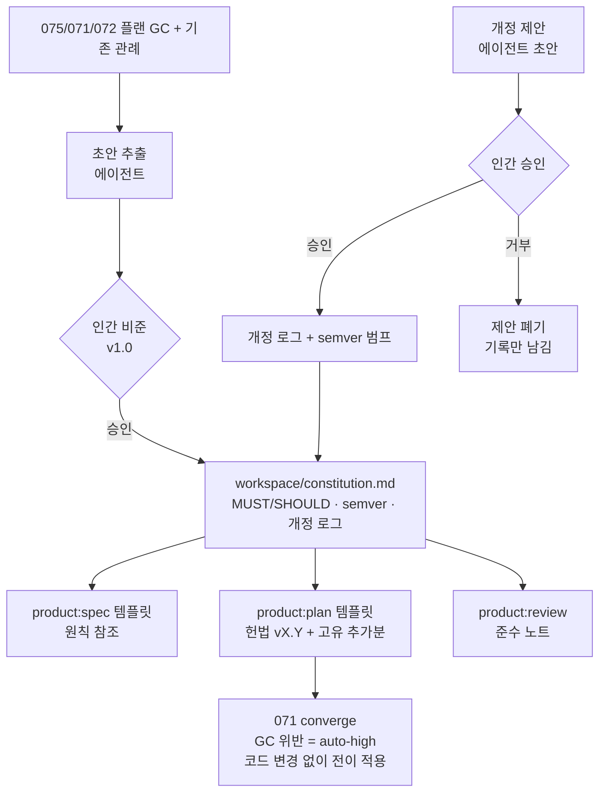

# Spec: Project Constitution Steering

Issue: `073-project-constitution-steering`
Prev: `knowledge/benchmarks/2026-07-05-competitive-gap-benchmark.md` (gap 5 of 5, final one open) · Next: `product:plan`

## Problem

Every plan re-authors the project's standing engineering rules as its own Global Constraints. The 2026-07-06 session is the measured evidence: three plans (075/071/072) carried 8, 10, and 9 GCs respectively, and a large fraction were restatements of the same house rules — injectable-runner pattern, TDD order, fail-open discipline, no-silent-except, model-tier policy, canonical-Markdown rule, human gates on canonical transitions. Each restatement drifts in wording, can be silently omitted, and costs plan-authoring attention. Meanwhile `071`'s converge already treats "plan Global Constraint violation = auto-high severity" and its spec explicitly calls plan GCs "this repo's constitution analog" — the enforcement slot exists, but the thing it should enforce is a per-plan copy, not a governed source.

Who hurts: the plan author (re-derivation), reviewers (checking against N slightly-different rule sets), and the rules themselves (unversioned, amendment-less, drift-prone).

## Goals

1. **`workspace/constitution.md`**: numbered principles with explicit MUST/SHOULD force, semver version, and an amendment log (date, change, approver). Initial v1.0 content is *extracted* from the 075/071/072 plan GCs plus existing repo conventions (model-tier policy 067, human-gate principle 075, single-parser 071) — codifying practiced law, not inventing new rules.
2. **Human-gated amendments** (user decision 2026-07-07): the agent may draft/propose amendments; adopting one (including v1.0 ratification itself) requires explicit human approval recorded in the amendment log. The constitution is the repo's most canonical document — 075's human-gate principle applies to it first.
3. **Templates reference, plans extend** (user decision: template+doc scope): `product:spec`/`product:plan` guidance changes so plan Global Constraints become "constitution vX.Y applies; plus these plan-specific additions" — shared rules never restated, only delta rules authored per plan.
4. **Review carries a compliance note**: `product:review` verdicts and the review-handoff template include a constitution-check line (version checked against, violations found or none).
5. **Converge inherits for free**: no code changes — plans referencing the constitution means `071`'s existing "GC violation = auto-high" now transitively enforces constitution principles wherever a plan applies them.

## Non-Goals

- No Kiro-style conditional/glob/semantic loading — single file, always applicable (issue v1 scope).
- No org/MDM multi-tier scoping.
- No machine parsing/enforcement code this issue (user decision): `spec_consistency`/converge/release_check are untouched; the analyzer-checks-constitution integration is 070-follow-up territory.
- No retro-editing of shipped plans (075/071/072 keep their inline GCs — history is history; the template change applies forward).
- Not a replacement for AGENTS.md (060 boundary: AGENTS.md governs output/format conventions for agents; the constitution governs engineering principles).

## Users & Scenarios

- **As the plan author (agent)**, I want to write only plan-specific constraints, **so that** shared rules arrive by reference with one canonical wording.
  - Main: `product:plan 076-x` → plan GC section opens with "Constitution v1.0 applies (workspace/constitution.md); additions:" followed by 2-3 issue-specific rules.
- **As the human PM**, I want rule changes to pass through me, **so that** the ground rules can't drift by agent convenience.
  - Main: agent drafts amendment (e.g. new MUST from a post-mortem) → presents diff + rationale → human approves → amendment log gains a dated, approver-attributed entry, version bumps (major: principle added/removed or force changed; minor: clarification).
  - Exception: agent-committed constitution edit without a logged human approval → reviewers treat the amendment as invalid; revert path documented in the file header.
- **As a reviewer**, I want one place to check rules against, **so that** the compliance note is a lookup, not archaeology.
  - Main: review.md verdict includes `Constitution: v1.0 checked — no violations` (or the violation list).

## Proposed Solution

### Constitution file shape (`workspace/constitution.md`)

- Header: version (semver), ratified date, approver, amendment procedure (agent proposes → human approves → log entry), invalid-amendment rule (unlogged edits are void).
- Numbered principles `C1..Cn`, each: force (MUST/SHOULD), one-sentence rule, one-line rationale, origin reference (which issue/plan established it). Candidate v1.0 set (draft for ratification, extracted from practiced law): injectable-runner (071/075), no-silent-except in gate paths (075 GC2), TDD-with-focused-tests (plans, 067 bridge), fail-open for hooks (072), byte-for-byte no-op & append-only findings (071), human gate on canonical transitions (075), model-tier dispatch (067 convention), single-parser (071 GC1), Korean sidecar convention (049), commit↔issue linkage (075).
- Amendment log table: date · version · change · proposer · **approver (human)**.
- Korean sidecar `constitution.ko.md` per 049.

### Template/doc touchpoints (the whole implementation surface)

- `commands/product-plan.md`: Global Constraints block instruction becomes "reference constitution version + author only plan-specific additions".
- `commands/product-spec.md`: note that specs assume the constitution; only spec-specific constraints belong in the spec.
- `commands/product-review.md` + `scripts/project_execution.py`'s review-handoff template: add the constitution-check line.
- `commands/product-converge.md`: one sentence noting plan GCs are constitution-derived (enforcement unchanged).

## Alternatives Considered

- **Keep per-plan GCs (status quo)** — measured cost this session: 27 GC entries across three plans with heavy overlap and wording drift. Rejected.
- **Machine-enforced constitution now** (parser + spec_consistency/converge integration) — larger scope, and converge already enforces transitively via plan GCs; premature until the document itself stabilizes through a few amendments. Deferred (user decision); 070 analyzer integration is the natural follow-up.
- **Conditional/glob steering (Kiro model)** — power without need: this repo's principles are project-wide; path-scoped rules can arrive when a real path-scoped principle exists. Out per issue.
- **`.moduflow/constitution.md` location** — `.moduflow/` reads as machine state; the constitution is a human-governance document alongside `workspace/goal.md`/`roadmap.md`. Chose `workspace/`.
- **Agent-approvable amendments with PR review only** — rejected (user decision): the constitution is the most canonical artifact; 075's own principle (human gate on canonical transitions) must apply to the document that will carry that principle.
- **Fold into AGENTS.md** — different jurisdiction (060): output-format conventions vs engineering principles; merging would blur both.

## Acceptance Criteria

- [ ] `workspace/constitution.md` (+ `.ko.md`) exists with semver version, MUST/SHOULD principles each carrying rationale + origin, amendment procedure, and an amendment log whose first entry is the **human-approved v1.0 ratification** (issue AC: version + amendment history).
- [ ] Every v1.0 principle traces to an existing practiced rule (origin reference resolves to a real issue/plan/convention) — no invented law.
- [ ] `product-plan.md` instructs constitution-reference + additions-only; `product-spec.md` notes the assumption (issue AC: plans reference instead of restating).
- [ ] Review-handoff template and `product-review.md` include the constitution-check line (issue AC verbatim).
- [ ] `product-converge.md` notes the transitive enforcement relationship; no script code changed anywhere in this issue.
- [ ] Unlogged-edit invalidity rule stated in the file header with the revert path.
- [ ] `python3 scripts/release_check.py .` passes (issue AC).
- [ ] The next issue executed after 073 produces a plan whose GC section uses the reference form (first real consumption — dogfood evidence recorded in status.md).

## Risks & Open Questions

- **Ratification quality**: v1.0 extraction may over-include (rules that were one plan's context, not project law) — the human ratification pass is the filter; the draft must mark each candidate with its origin so pruning is informed.
- **Dead-letter risk** (the ADR failure mode from the 075 benchmark): a constitution nobody consults dies. Mitigation is structural: plan template *requires* the reference line, review *requires* the compliance note — consultation is built into the two highest-traffic paths.
- **Version discipline**: agents may forget to bump/log — the unlogged-edit-void rule plus review compliance note are the guards; machine validation deliberately deferred.
- **Wording authority**: when a plan needs to *tighten* a constitution rule for one issue, that's an addition, not an amendment — the plan template wording must make this distinction or every plan becomes an amendment debate.
