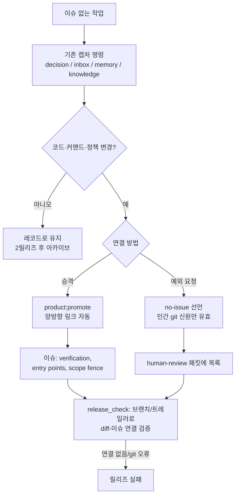

# 스펙: 이슈 없는 작업의 추적성 (v2, 재조정)

이슈: `075-issue-less-context-capture`
이전: `memory/decisions/2026-07-06-promote-and-linkage-over-new-capture-tier.md` (결정, v1 계층 결정을 대체), `specs/075-issue-less-context-capture/adversarial-review.md` (v1 해체 리뷰), `memory/evidence/2026-07-06-issue-less-context-benchmark.md` + `memory/evidence/2026-07-06-ai-native-context-benchmark.md` (벤치마크 2건) · 다음: `product:plan`

> 이 스펙의 v1은 신규 5타입 캡처 계층과 `product:capture` 명령을 제안했다. 3-서브에이전트 패널(인간 도구 벤치마크, AI 네이티브 벤치마크, 적대적 리뷰)이 이 저장소의 운영자 모델에서 전제가 틀렸음을 보였고, v1의 설계와 기각 사유는 `adversarial-review.md`에 보존되어 있다. 이 v2는 074 문제를 실제로 푸는 재조정된 최소해다.

## 문제

이 저장소의 운영자는 AI 에이전트다(24일간 이슈 약 75개, 이슈+스펙+플랜 당일 작성). 이 운영자에게 이슈 생성 비용은 초 단위다 — "이슈가 무겁다"는 애초에 진짜 문제가 아니었다. 074가 실증한 진짜 실패는:

1. **변경과 이슈를 잇는 기계 검증 가능한 연결이 없다.** diff가 어느 이슈 소속인지 검증할 수단이 없다 — 브랜치/트레일러 규약이 강제되지 않고, `release_check.py`는 `git diff` 실패를 조용히 삼켜(51/61행) CI에서 공허 통과하며, main 직커밋은 게이트를 통째로 우회한다.
2. **자기승인 루프.** 작업한 에이전트가 이슈 필요 여부를 스스로 판정하고 복구 서류까지 작성한다. 소급 생성된 완벽한 형태의 이슈(074)는 계획된 작업과 구별 불가 — 인간 PM에게 기술적으로 요구되는 결정 지점이 없다.
3. **캡처는 이미 있고, 승격이 없다.** `product:decision`, `product:inbox`, `product:memory`, `product:knowledge`가 이미 이슈 없는 컨텍스트를 캡처한다(v1이 제안한 5타입 중 4개). 없는 것은 레코드→이슈의 1급 경로(링크 보존)와 그것이 의무가 되는 규칙이다.

## 목표

1. **연결 규약**: 코드·커맨드·정책을 바꾸는 모든 커밋은 브랜치명(`codex/<issue-id>-*`, 기존 관행의 규범화) 또는 커밋 트레일러(`Issue: <id>`)로 이슈에 귀속 — 기계 검증 가능.
2. **수리된 릴리즈 게이트**: `release_check`가 명시적 merge-base로 릴리즈 diff의 연결을 검증하고, git 실패 시 조용히 통과하는 대신 **에러**를 낸다. main 직커밋도 커버.
3. **`product:promote <record>`**: 기존 레코드(decision/inbox/memory/knowledge)를 이슈로 변환. 레코드에 `promoted_to`, 이슈에 `Promoted-from`을 자동으로 양방향 기록, 파일은 제자리.
4. **인간 신원 승인**: no-issue 선언은 마커 라인의 git blame이 인간 신원이거나 인간의 PR 승인이 있을 때만 유효. 릴리즈의 모든 선언은 `human-review.ko.md`(인간이 실제로 읽는 표면)에 나열.
5. **AI 우선 이슈 필드**: 이슈 템플릿에 `Verification`(실행 에이전트의 자가 검증 커맨드), `Entry points`(시작 파일), `Scope fence`(변경 금지) 추가. 승격 준비 기준 = "이슈가 AI 프롬프트로 작동하는가" (Copilot PR 3,180건 실증: 조건 충족 시 머지율 77% vs 46%).
6. **기존 캡처 명령 정규화**: 공유 frontmatter(`kind`, `date`, `summary`, `retrieval_trigger`, 선택적 `promoted_to`/`superseded_by`)와 ADD/UPDATE/SUPERSEDE/NOOP 쓰기 규율(생성 전 기존 레코드 대조)을 4개 명령에 문서화. 새 명령·새 계층 없음.

## 비목표

- 신규 `product:capture` 명령 또는 신규 컨텍스트 계층 — 기존 4개 명령이 캡처 레이어다 (v1 번복, 2026-07-06 결정).
- 세션 중 실시간 임계 감지 — `072-lifecycle-hooks-automation`의 산출물. 075는 072의 훅이 호출할 연결 규약과 게이트를 제공한다.
- 단계적 강도 설정(`notice`→`warn`→`error`) — 이 저장소엔 YAGNI이고 에이전트가 편집 가능한 우회 표면. 게이트는 `error`로 출시.
- 벽시계 기준 아카이브(v1의 90일) — 보존은 **릴리즈 횟수**로 계산(기본: 2릴리즈 경과 미승격 레코드 아카이브). 에이전트 속도에 정합.
- 커밋 시점 차단; DB/SaaS 동기화; 075 이전 레코드 소급 정규화.

## 사용자와 시나리오

- **인간 PM으로서**, 내가 승인하지 않은 변경이 조용히 출시되는 게 불가능하길 원한다 — 감사 추적이 에이전트의 서류가 아니라 내 결정을 반영하도록.
  - 기본: 에이전트가 이슈 없는 코드 변경 완료 → 릴리즈 게이트가 미연결 diff 발견 → 레코드를 이슈로 승격(PM이 리뷰 패킷에서 확인)하거나 **PM에게** no-issue 선언을 요청(인간 git 신원) → 패킷에 선언 목록.
  - 예외: CI에서 git 배관 실패 → 게이트가 크게 에러. 공허 통과 절대 없음.
- **운영 에이전트로서**, 이미 쓴 레코드를 이슈로 싸게 변환하고 싶다 — 074식 복구가 링크 보존된 명령 하나가 되도록.
- **승격된 이슈의 실행 에이전트로서**, 이슈 안에 검증 커맨드·시작 파일·변경 금지 영역이 있길 원한다 — 컨텍스트 재유도 없이 자가 검증하고 경계를 지키도록.

## 제안 솔루션

### 연결 규약 (하중을 받는 핵심)

- 1차: 브랜치 `codex/<issue-id>-*` (기존 관행의 규범화). 2차: main 직커밋용 커밋 트레일러 `Issue: <issue-id>`.
- `release_check`는 명시적 merge-base(shallow면 main fetch)로 릴리즈 diff를 계산하고, 변경 경로를 분류(`scripts/`, `commands/`, `skills/`, `templates/`, 워크플로 설정)해 해당 커밋 전부가 브랜치 또는 트레일러로 이슈에 귀속되는지 요구한다. `commands/*.md`는 문서가 아니라 **동작**으로 분류 — 이 저장소의 커맨드는 실행되는 프롬프트다(074의 수정 자체가 커맨드 문서였다).
- 게이트 내 git 서브프로세스 실패는 전부 게이트 **에러**, 절대 조용한 통과 아님. `release_check.py`의 기존 `except Exception: pass` 구멍 2개도 이때 수리.

### 승격

- `product:promote <레코드 경로/id>`: 레코드에서 이슈 생성(요약/출처/링크 사전 기입), 레코드 frontmatter에 `promoted_to: <issue-id>` 제자리 기입, 이슈에 `Promoted-from: <record-id>`. 레코드는 이동하지 않음; 대체는 삭제가 아닌 `superseded_by`(Zep 패턴).
- 승격 **의무**(언제 해야 하는가): 코드/커맨드/정책 변경 또는 실행 추적 필요. 승격 **준비**(언제 만들 가치가 있는가): 스코프 + 검증 가능한 수용 기준 + 시작 포인터 확정 — "AI 프롬프트로 작동". 의무인데 미준비면 빈 이슈를 만들지 말고 레코드를 준비될 때까지 다듬는다(미성형 조기 이슈는 머지율을 실측으로 깎는다).
- 에이전트는 승격을 자유롭게 **제안**할 수 있다. canonical 전환의 인간 게이트는 릴리즈(선언)와 PR 리뷰에 있다 — 캡처가 아닌 canonical 전이만 게이트하는 Cursor/Devin/Linear 패턴.

### no-issue 선언의 인간 신원 승인

- 선언 형식: 릴리즈 노트 소스(또는 전용 승인 파일 — 플랜에서 결정)의 마커 라인 + 사유. `git blame`이 인간 작성자 신원(설정: 인간 git 신원 목록)을 가리키거나 동등한 인간 PR 승인이 있을 때**만** 유효.
- 릴리즈별 `human-review.ko.md`가 모든 선언을 사유와 함께 나열. 에이전트는 선언을 요청할 수 있을 뿐, 발행할 수 없다.

### 기존 명령 정규화

- 4개 캡처 명령이 공유 frontmatter 채택: `kind`, `date`, `summary`, `retrieval_trigger`(언제 다시 읽을지 — Devin 패턴), 선택적 `promoted_to`/`superseded_by`.
- 쓰기 규율을 각 명령에 문서화: 생성 전 UPDATE/SUPERSEDE 대상 기존 레코드 확인, 새 정보 없으면 NOOP(Mem0 패턴) — AI 작성자 아래의 append-only 폴더는 반드시 스팸화된다.
- `product:status`가 미승격 레코드 수와 최고령 표시. 2릴리즈 경과 미승격 레코드는 자동 아카이브(목록 조회 가능, 재활성화는 명시적).

## 검토한 대안

- **v1: 신규 5타입 계층 + `product:capture`** — 적대적 리뷰 후 기각: 5타입 중 4개가 기존 명령과 중복, frontmatter 전이 전제가 현 이슈 템플릿에서 거짓, 자기승인 루프 미해결. 전체 해체는 `adversarial-review.md`.
- **v1 유지 + 보수** — 기각: 필요한 수정(캡처 명령 삭제, 계층 삭제, 신원 게이트, 연결 규약)이 곧 재조정이다. 보수는 죽은 스코프를 보존할 뿐.
- **075a(게이트)/075b(정리) 분할** — 가능하나 계층을 버리면 정규화 작업이 작아져 한 이슈 유지. 게이트가 첫 마일스톤.
- **커밋 시점 차단** — 여전히 기각 (이 이슈가 정당화하려는 탐색 흐름을 처벌).
- **신뢰 기반 자기선언 (v1의 릴리즈 노트 노출)** — 기각: 사회적 책임은 인간 동료를 전제한다. 1인+AI 팀에선 에이전트가 선언과 노출 표면을 둘 다 작성한다.

## 수용 기준

- [ ] `release_check`: 동작 영향 변경(`scripts/`, `commands/`, `skills/`, 워크플로 설정)이 브랜치/트레일러로 이슈 귀속 안 되면 실패; 귀속되면 통과; git 실패 시 통과가 아닌 **에러**; merge-base로 main 직커밋 커버.
- [ ] `release_check.py`의 조용한 `except Exception: pass` 구멍 2개 제거; CI가 충분한 fetch 깊이로 게이트 실행.
- [ ] `product:promote`가 4종 레코드 각각을 이슈로 변환하며 `promoted_to`/`Promoted-from` 자동 양방향 기록; 레코드 파일 제자리 유지.
- [ ] 에이전트 git 신원이 작성한 no-issue 선언은 게이트가 거부; 설정된 인간 신원 작성/승인 선언은 통과; 릴리즈의 모든 선언이 `human-review.ko.md`에 표시.
- [ ] 이슈 템플릿에 `Verification`, `Entry points`, `Scope fence` 섹션; `product:promote`가 채우거나 실행-차단 TODO로 표시.
- [ ] 4개 캡처 명령에 공유 frontmatter + ADD/UPDATE/SUPERSEDE/NOOP 규율 문서화; 신규 레코드에 `retrieval_trigger` 존재.
- [ ] `product:status`가 미승격 수·최고령 표시; 2릴리즈 경과 미승격 레코드 아카이브 + 조회 가능 목록.
- [ ] 074 사례를 v2 메커니즘에 대입한 문서화 (연결 게이트가 미연결 브랜치를 릴리즈에서 잡았을 것; promote로 복구가 명령 하나).
- [ ] 집중 테스트: 게이트 실패/통과/에러 경로, 트레일러·브랜치 해석, 인간 신원 검증, promote 링크 기록, 아카이브 임계.

## 리스크와 열린 질문

- **인간 신원 설정**: 인간 git 신원 목록을 어디에 저장하고 에이전트 편집에서 어떻게 보호할지(예: 설정 파일 자체의 blame이 인간일 때만 유효) — 재귀는 에이전트가 작성할 수 없는 지점에서 접지해야 한다. 플랜에서 메커니즘 결정.
- **선언 파일 위치**: 릴리즈 노트 소스 vs 전용 승인 파일 — 플랜에서 결정.
- **트레일러 도입**: 기존 main 직커밋엔 트레일러가 없음. 전방 적용만(075 출시 다음 릴리즈부터 게이트 적용).
- **072 접점**: 세션 시점 훅이 같은 연결 검사기를 호출하게 됨 — release_check의 main에 묻지 말고 import 가능하게.
- **승격 이슈의 한국어 사이드카**: 049 관례 — 플랜에서 확정.
