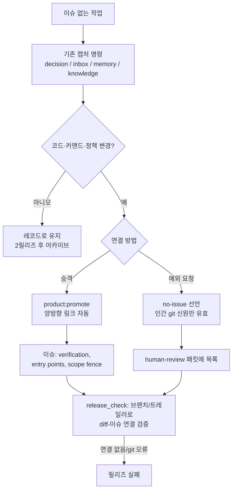

# Spec: Issue-Less Work Traceability (v2, rescoped)

Issue: `075-issue-less-context-capture`
Prev: `memory/decisions/2026-07-06-promote-and-linkage-over-new-capture-tier.md` (decision, supersedes the v1 tier decision), `specs/075-issue-less-context-capture/adversarial-review.md` (v1 teardown), `memory/evidence/2026-07-06-issue-less-context-benchmark.md` + `memory/evidence/2026-07-06-ai-native-context-benchmark.md` (benchmarks) · Next: `product:plan`

> v1 of this spec proposed a new 5-type capture tier and a `product:capture` command. A three-subagent panel (human-tool benchmark, AI-native benchmark, adversarial review) showed the premise was wrong for this repo's operator model; v1's design and its rejection are archived in `adversarial-review.md`. This v2 is the rescoped minimum that actually solves the 074 problem.

## Problem

The operator of this repo is an AI agent (~75 issues in 24 days; issue+spec+plan authored same-day). For that operator, creating an issue costs seconds — "issues are too heavy" was never the real problem. The real failures, demonstrated by the 074 case:

1. **No machine-checkable link between changes and issues.** Nothing in the repo can verify that a diff belongs to an issue — no branch/trailer convention is enforced, and `release_check.py` swallows `git diff` failures silently (lines 51/61), so even the existing gate passes vacuously in CI and is bypassed entirely by direct commits to main.
2. **Self-approval loop.** The same agent does the work, judges whether it needed an issue, and writes the recovery paperwork. A retroactively generated perfect-looking issue (074) is indistinguishable from planned work — the human PM has no technically required decision point.
3. **Capture already exists, promotion doesn't.** `product:decision`, `product:inbox`, `product:memory`, `product:knowledge` already capture issue-less context (4 of v1's 5 proposed types). What's missing is a first-class path from record → issue with links preserved, and a rule for when that must happen.

## Goals

1. **Linkage convention**: every code/command/policy-changing commit is attributable to an issue via branch name (`codex/<issue-id>-*`, existing practice) or commit trailer (`Issue: <id>`), machine-checkable.
2. **Repaired release gate**: `release_check` verifies linkage on the release diff using an explicit merge-base, and **errors on git failure** instead of passing silently; direct-to-main commits are also covered.
3. **`product:promote <record>`**: converts an existing record (decision/inbox/memory/knowledge) into an issue; writes `promoted_to` on the record and `Promoted-from` on the issue automatically, in place, both directions.
4. **Human-identity approval**: a no-issue declaration is valid only when its marker line is authored (git blame) or approved (PR review/comment) by a human Git identity; all declarations in a release are listed in `human-review.ko.md` — the surface the human actually reads.
5. **AI-first issue fields**: the issue template gains `Verification` (commands the executing agent runs to self-check), `Entry points` (starting files), and `Scope fence` (do-not-touch); promotion readiness = "the issue works as an AI prompt" (Copilot 3,180-PR study: all-conditions merge rate 77% vs 46%).
6. **Normalize existing capture commands**: shared frontmatter (`kind`, `date`, `summary`, `retrieval_trigger`, optional `promoted_to`/`superseded_by`) and a write discipline of ADD / UPDATE / SUPERSEDE / NOOP (check existing records before creating) documented across the four commands. No new command, no new tier.

## Non-Goals

- A new `product:capture` command or new context-type tier — the four existing commands are the capture layer (v1 reversal, decision 2026-07-06).
- Real-time threshold detection during a session — that is `072-lifecycle-hooks-automation`'s deliverable; 075 provides the linkage convention and gate that 072's hooks will invoke.
- Staged severity config (`notice`→`warn`→`error`) — YAGNI for this repo and an agent-editable bypass surface; the gate ships at `error`.
- Wall-clock archival (v1's 90 days) — retention counts **releases** (default: unpromoted records older than 2 releases are archived), matching agent velocity.
- Commit-time blocking; DB/SaaS sync; retro-normalizing all pre-075 records.

## Users & Scenarios

- **As the human PM**, I want changes I never approved to be impossible to ship silently, **so that** the audit trail reflects my decisions, not the agent's paperwork.
  - Main: agent finishes issue-less code change → release gate finds unlinked diff → agent must either promote a record to an issue (PM sees it in review packet) or request a no-issue declaration **from the PM** (human git identity) → packet lists the declaration.
  - Exception: git plumbing fails in CI → gate errors loudly; never passes vacuously.
- **As the operating agent**, I want a cheap conversion from a record I already wrote to an issue, **so that** recovery like 074 is one command with links intact.
  - Main: `product:promote memory/decisions/<id>.md` → issue created pre-filled, bidirectional links written, roadmap updated.
- **As the executing agent on a promoted issue**, I want verification commands, entry points, and a scope fence in the issue, **so that** I can self-check and stay in bounds without re-deriving context.

## Proposed Solution

### Linkage convention (the load-bearing piece)

- Primary: branch `codex/<issue-id>-*` (existing practice, now normative). Secondary: commit trailer `Issue: <issue-id>` for direct-to-main work.
- `release_check` computes the release diff from an explicit merge-base (fetching `main` if shallow), classifies changed paths (`scripts/`, `commands/`, `skills/`, `templates/`, workflow-affecting config), and requires every such commit to resolve to an issue via branch or trailer. `commands/*.md` count as behavior, not docs — this repo's commands are executable prompts (the 074 fix itself was command docs).
- Any git subprocess failure in the gate is a gate **error**, never a silent pass. This also fixes the two existing `except Exception: pass` holes in `release_check.py`.

### Promotion

- `product:promote <record-path-or-id>` creates the issue from the record (summary/source/links pre-filled), writes `promoted_to: <issue-id>` into the record frontmatter in place, and `Promoted-from: <record-id>` into the issue. Records are never moved; supersession uses `superseded_by`, never deletion (Zep pattern).
- Promotion **requirement** (when it must happen): the work changes code/command/policy, or needs execution tracking. Promotion **readiness** (when the issue is worth creating): scope + verifiable acceptance checks + entry points are known — "works as an AI prompt". If required but not ready, the agent shapes the record until ready rather than creating a hollow issue (early unshaped issues measurably lower agent merge rates).
- Agent may **propose** promotion freely; the canonical transition needs no separate approval beyond normal issue-flow review, because the human gate sits at release (declarations) and PR review — matching the Cursor/Devin/Linear pattern of gating canonical transitions, not capture.

### Human-identity approval for no-issue declarations

- Declaration format: a marker line + reason in the release notes source (or a dedicated approvals file — plan decides the file), valid **only** if `git blame` attributes the line to a human author identity (config: list of human git identities), or an equivalent human PR approval exists.
- `human-review.ko.md` for each release lists every declaration with reasons. The agent can request a declaration; it cannot mint one.

### Existing-command normalization

- The four capture commands adopt shared frontmatter: `kind`, `date`, `summary`, `retrieval_trigger` (when to re-read — Devin pattern), optional `promoted_to` / `superseded_by`.
- Write discipline documented in each command: before creating, check for an existing record to UPDATE or SUPERSEDE; NOOP when nothing new (Mem0 pattern) — append-only folders under an AI writer become spam.
- `product:status` shows unpromoted-record count and oldest age; records unpromoted after 2 releases auto-archive (list stays queryable; reactivation is explicit).

## Alternatives Considered

- **v1: new 5-type tier + `product:capture`** — rejected after adversarial review: 4/5 types duplicated existing commands, the frontmatter-transition premise was false for the current issue template, and it left the self-approval loop untouched. Full teardown in `adversarial-review.md`.
- **Keep v1 with amendments** — rejected: the fixes (drop capture command, drop tier, add identity gate, add linkage convention) *are* the rescope; amending would preserve dead scope.
- **Split into 075a (gate) / 075b (context cleanup)** — viable but the normalization work is small once the tier is dropped; kept as one issue with the gate as the first milestone.
- **Commit-time blocking** — still rejected (punishes the exploratory flow this exists to legitimize).
- **Trust-based self-declaration (v1's release-notes exposure)** — rejected: social accountability assumes human peers; in a 1-human+AI team the agent would author both the declaration and its exposure surface.

## Acceptance Criteria

- [ ] `release_check` fails when the release diff contains behavior-affecting changes (`scripts/`, `commands/`, `skills/`, workflow config) not attributable to an issue via branch name or commit trailer; passes when attributable; **errors** (not passes) on any git failure; covers direct-to-main commits via merge-base.
- [ ] The two silent `except Exception: pass` holes in `release_check.py` are removed; CI runs the gate with sufficient fetch depth.
- [ ] `product:promote` converts each of the four record kinds into an issue with `promoted_to`/`Promoted-from` written automatically both ways; record file stays in place.
- [ ] A no-issue declaration authored by the agent's git identity is rejected by the gate; one authored/approved by a configured human identity passes; all declarations in a release appear in `human-review.ko.md`.
- [ ] Issue template includes `Verification`, `Entry points`, `Scope fence` sections; `product:promote` populates them or marks them TODO-blocking-execution.
- [ ] The four capture commands document shared frontmatter + ADD/UPDATE/SUPERSEDE/NOOP discipline; `retrieval_trigger` present in newly created records.
- [ ] `product:status` surfaces unpromoted-record count and oldest; records unpromoted after 2 releases are archived with a queryable list.
- [ ] The 074 case is written up against the v2 mechanisms (linkage gate would have caught the unlinked branch at release; promote makes recovery one command).
- [ ] Focused tests: gate fail/pass/error paths, trailer and branch resolution, human-identity validation, promote link writing, archive threshold.

## Risks & Open Questions

- **Human-identity config**: how the list of human git identities is stored and protected from agent edits (e.g. only valid if the config file's own blame is human) — plan decides the mechanism; the recursion has to ground out in something the agent cannot author.
- **Declaration file location**: release notes source vs dedicated approvals file — plan decides.
- **Trailer adoption**: direct-to-main commits currently carry no issue trailers; migration is forward-only (gate applies from the release after 075 ships).
- **072 interplay**: session-time hooks will want to call the same linkage checker; keep it importable, not buried in release_check's main.
- **Korean sidecar for promoted issues**: per 049 convention — confirm scope in plan.
