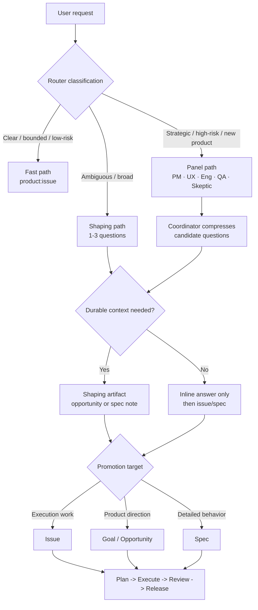

# Spec: Fast Path Shaping Router

Issue: `076-product-context-interview-and-readiness-loop`
Prev: `/Users/dongwon.lee/workhub/company/projects/modu-charge/docs/moduflow-benchmark-ouroboros-meshkit-2026-07-08.md` (Ouroboros/MeshKit benchmark) · Next: `product:plan`

## Problem

ModuFlow's current strength is that a user can say "이슈 만들어줘" and quickly get a durable, repo-versioned work item. That path must stay fast. The improvement opportunity is narrower: when a request is vague, broad, risky, or strategic, ModuFlow should shape it before creating brittle issues, specs, or execution plans.

The 2026-07-08 Ouroboros benchmark showed the appeal of Socratic question loops: multiple perspectives can expose hidden assumptions before implementation starts. But if ModuFlow applies that pattern to every request, the product becomes slower and more human-burdensome than the issue-first flow users already expect.

The router must therefore choose the smallest useful path:

```text
clear request       -> product:issue
ambiguous request   -> 1-3 shaping questions -> issue/spec/goal
strategic request   -> compact LLM panel questions -> opportunity/goal/spec
```

## Goals

1. **Preserve the fast path**: clear, specific issue requests go straight to `product:issue` without an interview.
2. **Add shaping only when useful**: ambiguous, broad, high-risk, or strategic requests trigger at most 1-3 concise questions by default.
3. **Use panel thinking without exposing noise**: a Socratic LLM panel may generate candidate questions, but the user sees only a compressed, high-signal set.
4. **Store context only when it matters**: durable shaping artifacts are written only when the answers change reusable product context or materially affect execution.
5. **Promote into existing artifacts**: shaped context must flow into the current ModuFlow chain: opportunity, goal, issue, spec, plan, review, release.
6. **Explain the method**: user-facing docs should describe ModuFlow as a product-context execution loop that uses spec-first planning, issue-driven execution, review-gated completion, evidence-based decisions, and Git-versioned memory.

## Non-Goals

- Making interviews mandatory before issue creation.
- Replacing existing `product:*` commands.
- Creating a new SaaS, database, or external state store.
- Showing raw panel output, hidden chain-of-thought, or every subagent question.
- Implementing `product:execute` readiness gates; that belongs to `077-implementation-readiness-gate`.
- Adding frontend QA templates; that belongs to `078-frontend-qa-template-pack`.
- Building the `product:plan` skill matrix; that belongs to `079-plan-discipline-skill-matrix`.

## Users & Scenarios

- **As a user with a clear task**, I want to say "이슈 만들어줘: README에 설치법 추가" and get an issue immediately, so that ModuFlow does not punish clarity.
  - Main: the router detects a concrete deliverable, bounded scope, and no unusual risk -> direct `product:issue`.
  - Exception: if a near-duplicate issue exists, ModuFlow recommends updating or linking it before creating a new one.

- **As a user with an ambiguous request**, I want ModuFlow to ask only the missing questions, so that the issue is useful without becoming a workshop.
  - Main: "모두플로 인기가 없는 이유 개선해줘" -> ask 1-3 questions about audience, adoption evidence, and success metric -> promote to opportunity/goal/issue.
  - Exception: if the user says "일단 이슈만 만들어", create a bounded discovery issue with explicit unknowns instead of blocking.

- **As a user shaping product direction**, I want multiple expert perspectives compressed into a short decision surface, so that I benefit from panel reasoning without reading six agents' raw notes.
  - Main: strategy request -> internal panel roles generate questions -> coordinator deduplicates and ranks them -> user sees the top 1-3 questions plus a recommended next artifact.

- **As an executing agent**, I want the shaped answers embedded in the issue/spec, so that implementation, review, and release do not lose the original product context.

## Proposed Solution



### Router Classification

The router classifies a request using explicit signals:

- **Fast path** when the request names a concrete deliverable, target artifact, or bounded change; has low ambiguity; and can be verified with existing project context.
- **Shaping path** when the request has missing audience, goal, scope, success metric, ownership, priority, or acceptance criteria.
- **Panel path** when the request affects positioning, product strategy, onboarding, architecture, trust/safety, release policy, or cross-issue roadmap direction.

The router should prefer the fast path when in doubt and the work can safely be captured as a discovery or implementation issue.

### Question Policy

- Default maximum: 1-3 user-facing questions.
- Ask only questions that change routing, scope, priority, or acceptance criteria.
- Avoid asking for information already available in repo artifacts.
- When the user wants speed, create an issue with explicit unknowns rather than blocking.
- Panel questions are never shown raw; the coordinator compresses duplicates and rewrites them into user-facing Korean when the session is Korean.

### Durable Shaping Artifact

Durable shaping is created only when at least one condition is true:

- The answer should be reused across multiple issues.
- The answer changes product positioning, target users, roadmap priority, or acceptance criteria.
- The answer explains why a feature exists, not merely what to do next.
- The request is strategic enough that future agents must see the decision trail.

Allowed destinations:

- `workspace/opportunities.md` or a future opportunity artifact for raw product opportunity shaping.
- `specs/<issue-id>/interview.md` when the shaping belongs to one issue/spec.
- Issue sections (`Source`, `Opportunity`, `Acceptance Criteria`, `Scope Fence`) when the context is short and issue-specific.

### Existing Command Touchpoints

- `skills/pm-execution-router/SKILL.md`: add the fast/shaping/panel routing rule.
- `commands/product-issue.md`: state that clear requests bypass interview; ambiguous requests may carry explicit unknowns.
- `commands/product-opportunity.md`: use for product-direction shaping before issues when needed.
- `commands/product-goal.md`: promote strategic shaped context into durable goals.
- `commands/product-spec.md`: consume shaped context and preserve product rationale.
- `commands/product-loop.md`: recommend fast issue creation, short shaping, or panel shaping as the next step.
- `README.md`: keep the positioning/method section aligned with actual adapters and repo-versioned artifacts.

## Acceptance Criteria

- [ ] Clear requests like "이슈 만들어줘: <specific task>" route directly to `product:issue` without extra questions.
- [ ] Ambiguous or broad requests trigger at most 1-3 concise questions unless the user explicitly asks for deeper discovery.
- [ ] Strategic/high-risk requests can invoke a panel path, but only compressed user-facing questions are shown.
- [ ] Router guidance states when to create a durable shaping artifact and when to keep the shaping inline.
- [ ] Shaped answers can be promoted into existing ModuFlow artifacts without duplicating context.
- [ ] `product:loop` can recommend one of three next actions: create issue now, ask short shaping questions, or run panel shaping.
- [ ] README/docs describe the product-context method and actual adapter sources: Spec Kit, Superpowers, Anthropic Knowledge Work Plugins, and Codex Product Design/Data Analytics/Documents workflows.
- [ ] Validation passes: `python3 scripts/validate_moduflow.py .`, `python3 scripts/validate_project_artifacts.py .`, and `python3 scripts/release_check.py .`.

## Risks & Open Questions

- **Over-questioning risk**: the router could still feel slow if it asks questions for normal implementation work. Mitigation: fast path is the default when the task is bounded.
- **Panel theater risk**: multiple perspectives can produce plausible but low-value questions. Mitigation: expose only compressed questions that alter product decisions.
- **Artifact sprawl risk**: every short answer could become a file. Mitigation: durable artifacts are conditional and tied to reuse or decision value.
- **Duplicate with 075**: issue-less context capture already handles records and promotion. 076 should use those mechanics, not create another capture tier.
- **Boundary with 079/077**: 076 shapes before issue/spec creation; 079 improves planning discipline; 077 checks execution readiness. Keep these staged.
