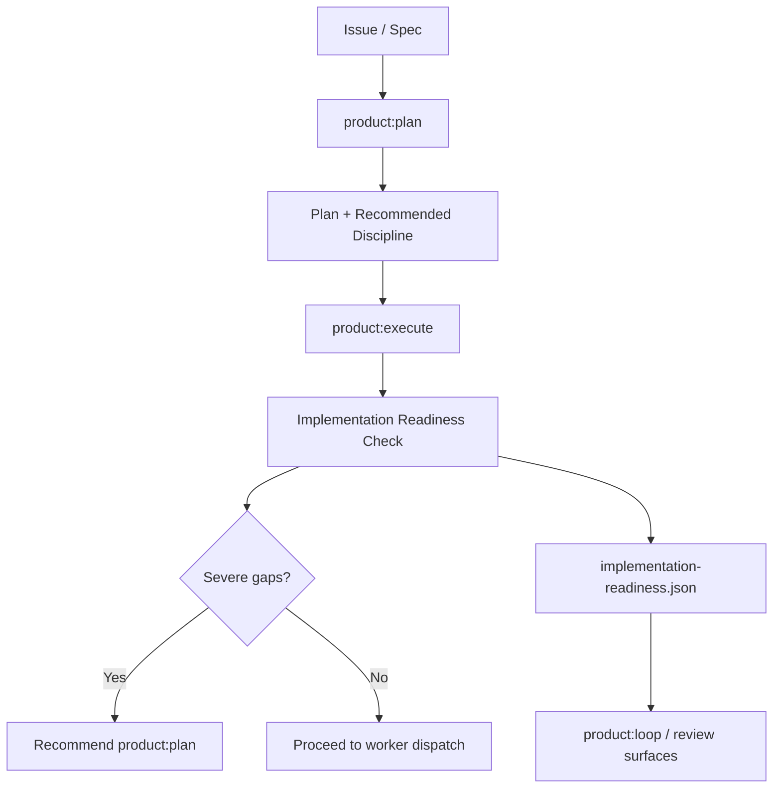

# Spec: Implementation Readiness Gate

Issue: `077-implementation-readiness-gate`
Prev: `079-plan-discipline-skill-matrix` · Next: `product:plan`

## Problem

ModuFlow already has a strong issue → spec → plan → execute loop, and issue 079 makes the recommended execution discipline visible during planning. The next weak point is the handoff into `product:execute`.

Today an agent can begin implementation even when the plan does not state the concrete contracts needed for reliable work. That creates drift: API shapes get invented during implementation, frontend states are guessed, tests are added after the fact, and permission assumptions stay implicit until review.

Issue 077 adds an implementation-readiness gate before execution. The first version should be report-only: it identifies concrete gaps and recommends returning to `product:plan` when the gaps are severe, without making all execution impossible.

## Goals

1. **Pre-execute readiness check**: `product:execute` checks whether implementation inputs are concrete enough before worker dispatch.
2. **Concrete gap reporting**: missing readiness items are named as specific gaps, not vague "needs more detail" warnings.
3. **Conditional frontend checks**: Storybook, MSW, and Playwright checks apply only when UI/API-backed browser flows are in scope.
4. **Machine-readable result**: readiness status is saved in a nearby artifact so `product:loop`, future MCP surfaces, and reviews can read it.
5. **Report-only v1**: readiness gaps warn and route; they do not hard-block every execution unless the user explicitly approves a stricter mode later.
6. **Plan feedback loop**: severe gaps recommend `product:plan <issue>` instead of letting execution continue with invented assumptions.

## Non-Goals

- Do not make Storybook, MSW, or Playwright mandatory for non-frontend work.
- Do not add the reusable frontend QA templates here; that belongs to `078-frontend-qa-template-pack`.
- Do not replace `product:review`, release checks, or convergence checks.
- Do not run browser tests inside this issue.
- Do not introduce framework-specific assumptions.
- Do not rename existing commands.

## Users & Scenarios

- **As a user**, I want ModuFlow to tell me when execution is under-specified, so I can fix the plan before agents overbuild.
  - Main: `product:execute 077...` reports missing API contract mapping and recommends `product:plan`.
  - Exception: a docs-only issue does not require Storybook, MSW, Playwright, or permission-model detail.

- **As an executing agent**, I want a checklist before worker dispatch, so I know which assumptions are approved versus which must be clarified.
  - Main: code work with API changes requires API contract mapping and test strategy.
  - Exception: if the spec explicitly states "no API change," the API mapping can be marked not applicable with evidence.

- **As a reviewer**, I want readiness evidence preserved, so I can compare the plan, execution, and review surface.
  - Main: `implementation-readiness.json` records each check, severity, evidence, and recommendation.

## Proposed Solution



### Readiness Dimensions

The first gate checks these dimensions:

| Dimension | Required When | Good Enough Evidence |
| --- | --- | --- |
| API contract mapping | backend, integration, data fetch, or API-backed UI work | endpoints, request/response shapes, error states, or explicit "no API change" statement |
| Test strategy | any behavior-affecting work | unit/integration/smoke targets and what they prove |
| Storybook required states | frontend component or UI state work | required states listed, or explicit not-applicable reason |
| MSW fixture baseline | frontend work depends on mocked/remote API behavior | fixture names, covered states, or explicit not-applicable reason |
| Playwright smoke matrix | user-visible browser flow or regression-sensitive UI work | route/path, primary action, assertion, and viewport/device scope |
| Permission/role model | auth, admin, visibility, billing, team, or role-sensitive work | roles, allowed/denied actions, and edge cases |
| Release/rollback verification | release-affecting work | post-change check and rollback/disable path |

### Result Shape

Save the result next to the issue artifacts:

```json
{
  "schema": "moduflow.implementation-readiness.v1",
  "issue_id": "077-implementation-readiness-gate",
  "status": "ready|warning|not_ready",
  "mode": "report-only",
  "checks": [
    {
      "id": "api_contract",
      "state": "pass|warn|fail|not_applicable",
      "severity": "low|medium|high",
      "evidence": "plan.md names the endpoints...",
      "gap": "",
      "recommendation": ""
    }
  ],
  "next_command": "product:execute 077-implementation-readiness-gate"
}
```

Recommended file: `specs/<issue>/implementation-readiness.json`.

`status.md` should summarize the latest readiness status in human-readable form, but JSON remains the machine-readable source.

### Status Semantics

- `ready`: all required dimensions pass or are explicitly not applicable.
- `warning`: gaps exist but execution can proceed with clear risk.
- `not_ready`: high-severity gaps exist; recommend returning to `product:plan`.

In v1, `not_ready` does not forcibly block execution. The agent must report the risk and ask for explicit approval before continuing if the user still wants execution.

### Command Touchpoints

- `commands/product-execute.md`: add readiness preflight before worker dispatch.
- `commands/product-plan.md`: tell plans to include enough detail for the readiness dimensions when applicable.
- `commands/product-loop.md`: if latest readiness is `not_ready`, recommend `product:plan <issue>` before `product:execute`.
- `skills/superpowers-execution-bridge/SKILL.md`: connect readiness with writing-plans, TDD, Storybook/MSW, Playwright/QA, review, and verification-before-completion.
- `scripts/`: implement a small deterministic checker if the plan can be inspected locally without model judgment.

## Acceptance Criteria

- [ ] `product:execute` guidance includes an implementation-readiness step before worker dispatch.
- [ ] The readiness result names concrete missing contracts and their severity.
- [ ] Frontend-specific checks apply only when UI/API-backed browser work is in scope.
- [ ] A machine-readable `implementation-readiness.json` artifact is produced or specified clearly enough for automation.
- [ ] `product:loop` can recommend returning to `product:plan` when readiness status is `not_ready`.
- [ ] `product:plan` guidance nudges plans to include readiness evidence without duplicating 078's template pack.
- [ ] Validation passes: `python3 scripts/validate_moduflow.py .`, `python3 scripts/validate_project_artifacts.py .`, and `python3 scripts/release_check.py .`.

## Risks & Open Questions

- **Too much process**: users worried this will make simple issues feel long. Mitigation: report-only v1 and conditional checks.
- **False negatives**: text-only checking may miss valid evidence with different wording. Mitigation: start with explicit checklist guidance and add deterministic parsing only where stable.
- **077/078 overlap**: frontend templates belong to 078. 077 only defines the gate dimensions and references template categories.
- **Stacked dependency**: 077 builds on 079's plan discipline matrix. If 079 changes during review, re-check command wording before merging 077.
