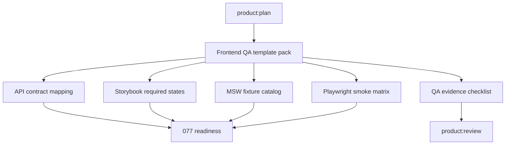

# Spec: Frontend QA Template Pack

Issue: `078-frontend-qa-template-pack`
Prev: `077-implementation-readiness-gate` · Next: `product:plan`

## Problem

Issue 077 added an implementation-readiness gate that asks whether API contracts, frontend states, fixtures, browser smoke paths, permissions, and release evidence are explicit enough before execution. The gate can now detect gaps, but users and agents still need concrete reusable template surfaces to fill those gaps quickly.

Without templates, every frontend plan has to invent the shape of Storybook states, MSW fixtures, API mapping, Playwright smoke coverage, and QA evidence. That makes frontend readiness feel heavier than it needs to be, and it increases the chance that each agent writes a different kind of evidence.

Issue 078 adds a lightweight, framework-agnostic frontend QA template pack that plans can link to or copy from.

## Goals

1. **Reusable template pack**: create frontend QA templates under an established `templates/` location.
2. **Readiness alignment**: templates cover the dimensions checked by issue 077.
3. **Traceability**: every template includes issue/spec links and owner/reviewer fields.
4. **Conditional use**: guidance explains when each template is required, optional, or not applicable.
5. **Framework-agnostic examples**: templates use common web-app concepts, not project-specific dependencies.
6. **Plan/review integration**: command docs explain how plans and reviews should reference the templates.

## Non-Goals

- Do not install Storybook, MSW, Playwright, or any frontend dependency.
- Do not write project-specific stories, handlers, tests, or fixtures.
- Do not make the templates mandatory for backend-only or docs-only work.
- Do not build a UI editor for templates.
- Do not change the 077 readiness checker logic unless a validation list needs to know the new files exist.

## Users & Scenarios

- **As a user**, I want a frontend plan to include a clear QA pack, so I can see what UI states and smoke flows will be verified before coding starts.
  - Main: a dashboard feature plan links to Storybook states, MSW fixtures, API mapping, Playwright smoke matrix, and QA evidence checklist.
  - Exception: a docs-only issue marks these templates not applicable.

- **As an agent**, I want templates with stable headings, so I can fill the same sections every time and avoid inventing a new evidence shape.
  - Main: copy `templates/frontend-qa/playwright-smoke-matrix.md` into `specs/<issue>/frontend-qa/playwright-smoke-matrix.md`.

- **As a reviewer**, I want QA evidence tied back to the issue/spec, so I can review behavior without hunting through chat history.
  - Main: `product:review` asks whether the QA evidence checklist is present for frontend work.

## Proposed Solution

### Template Location

Create:

- `templates/frontend-qa/api-contract-mapping.md`
- `templates/frontend-qa/storybook-required-states.md`
- `templates/frontend-qa/msw-fixture-catalog.md`
- `templates/frontend-qa/playwright-smoke-matrix.md`
- `templates/frontend-qa/qa-evidence-checklist.md`
- `templates/frontend-qa/README.md`

### Required / Optional / Not Applicable Guidance

| Template | Required When | Optional When | Not Applicable When |
| --- | --- | --- | --- |
| API contract mapping | API-backed UI, backend integration, data-fetching UI | static UI documents external assumptions | no API or data contract changes |
| Storybook required states | component or screen state work | visual review needs repeatable examples | no UI/component work |
| MSW fixture catalog | API-backed UI needs mockable states | existing fixtures are reused unchanged | no mocked API behavior |
| Playwright smoke matrix | browser-visible user flow or regression path | low-risk visual-only UI | no browser flow |
| QA evidence checklist | frontend implementation or review | design/prototype quality review | backend-only/docs-only work |

### Command Touchpoints

- `commands/product-plan.md`: reference the template pack when frontend readiness inputs are needed.
- `commands/product-design.md` and `commands/product-prototype.md`: mention Storybook states and evidence checklist as design/prototype handoff surfaces.
- `commands/product-review.md`: ask reviewers to check template-derived evidence for frontend work.
- `skills/design-prototype-bridge/SKILL.md`: point UX/prototype work to the frontend QA pack when implementation handoff is expected.

## Acceptance Criteria

- [ ] Frontend QA template files exist under `templates/frontend-qa/`.
- [ ] Each template includes issue/spec traceability fields.
- [ ] Templates cover API contract mapping, Storybook required states, MSW fixture catalog, Playwright smoke matrix, and QA evidence checklist.
- [ ] Command docs explain when to use the templates.
- [ ] The guidance distinguishes required, optional, and not-applicable cases.
- [ ] Validation includes or otherwise tolerates the new template files.
- [ ] Validation passes: `python3 scripts/validate_moduflow.py .`, `python3 scripts/validate_project_artifacts.py .`, and `python3 scripts/release_check.py .`.

## Risks & Open Questions

- **Template sprawl**: too many files can feel heavy. Mitigation: keep each file short and copyable.
- **Framework drift**: project teams may use different component/test stacks. Mitigation: use framework-agnostic concepts and avoid imports or dependency-specific syntax.
- **077 overlap**: readiness checker owns gate behavior; 078 owns reusable evidence shapes only.
- **Review burden**: reviewers may skip template evidence if it is not surfaced. Mitigation: add command guidance in plan/review docs.
