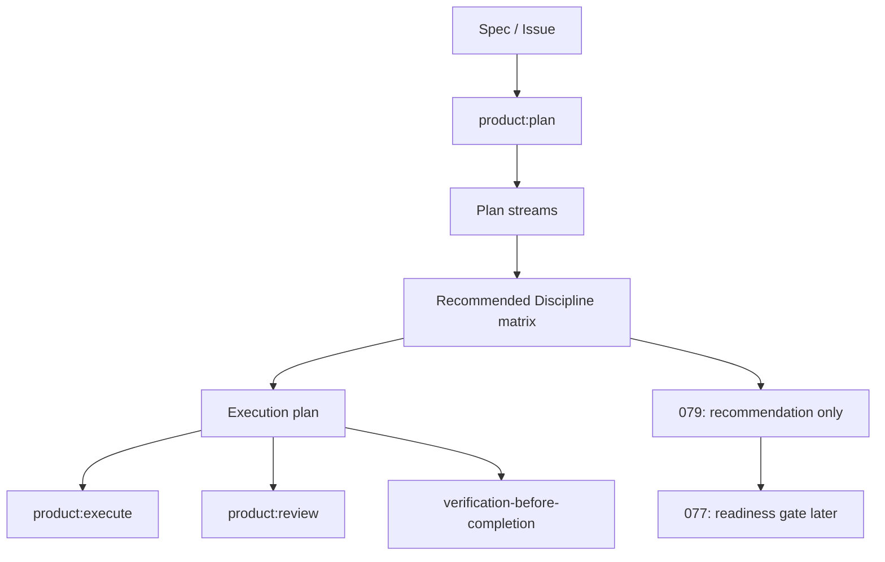

# Spec: Plan Discipline and Skill Matrix

Issue: `079-plan-discipline-skill-matrix`
Prev: `076-product-context-interview-and-readiness-loop` · Next: `product:plan`

## Problem

ModuFlow already connects Spec Kit, Superpowers, product design, data analytics, documents, and other workflow adapters. The user should not have to remember which discipline to activate at each point in development planning.

Today `product:plan` says to write a plan, split streams, define gates, and use Superpowers-style planning quality. It does not consistently surface which disciplines should be applied to a given issue or task. That makes the system feel powerful but implicit: the capabilities are present, yet users and agents still need to know when to turn them on.

Issue 076 solved request routing before issue/spec creation. Issue 079 should solve the next moment: once a spec is ready and `product:plan` is being written, the plan should show the recommended discipline for the work ahead.

## Goals

1. **Visible discipline matrix**: every new plan has a `Recommended Discipline` or equivalent section.
2. **Per-stream guidance**: recommendations can be listed by task, stream, or artifact type, not just as a global note.
3. **Adapter-aware planning**: the matrix can name Superpowers disciplines and ModuFlow adapter skills such as product design, data analysis, Storybook/MSW, Playwright/QA, review, and verification.
4. **Non-binding recommendations**: the matrix informs the coordinator and workers; it does not automatically dispatch subagents or block execution.
5. **Host-agnostic wording**: recommendations avoid hardcoded model names and stay portable across Codex, Claude, and other hosts.
6. **Data-backed tuning habit**: future tuning of recommendation rules should use multiple real issue/task examples and regression tests when the logic becomes executable.

## Non-Goals

- Do not implement `product:execute` readiness gates; that belongs to `077-implementation-readiness-gate`.
- Do not add frontend QA template files; that belongs to `078-frontend-qa-template-pack`.
- Do not automatically dispatch subagents.
- Do not hardcode model names or vendor-specific model tiers.
- Do not require every discipline on every issue.
- Do not build an external recommendation service or database.

## Users & Scenarios

- **As a user**, I want a plan to show which methods will be used, so that I can see why ModuFlow is more than a generic issue list.
  - Main: `product:plan 079...` includes a matrix explaining which streams use writing-plans, TDD, review, verification, or adapter workflows.
  - Exception: for a docs-only issue, the matrix stays small and does not recommend frontend QA or TDD.

- **As an executing agent**, I want each task to name its discipline, so that I do not forget to apply TDD for behavior changes or verification-before-completion before handoff.
  - Main: a code stream recommends TDD, focused tests, review, and verification.
  - Exception: a pure governance/doc stream recommends writing-plans, review, and release checks instead.

- **As a reviewer**, I want the plan to show what evidence should exist later, so that I can judge whether execution followed the right method.
  - Main: review checks that streams with UI changes included product-design or frontend QA guidance.

## Proposed Solution



### Matrix Shape

Plans should include a section like:

```markdown
## Recommended Discipline

| Stream | Discipline / Adapter | Reason |
| --- | --- | --- |
| A — intake router | Superpowers TDD + ModuFlow PM router | Behavior change needs tests first. |
| B — docs | Spec Kit docs + review | User-facing prompt docs must match behavior. |
| C — verification | verification-before-completion | Completion claim needs fresh evidence. |
```

The wording can vary by issue, but the section should be visible and structured.

### Recommendation Catalog

The initial catalog is documentation-level guidance:

- **writing-plans**: multi-step implementation, cross-file changes, or worker handoff.
- **TDD**: behavior changes, bug fixes, routing logic, parsers, validators, and command behavior.
- **product-design**: UX flows, screen decisions, IA, prototypes, visual review, or image-to-code work.
- **data-analysis**: KPI design, metric diagnostics, dashboard/report work, market sizing, or evidence-backed decisions.
- **Storybook/MSW**: frontend states, component contracts, API fixtures, mocked edge cases, or repeatable UI QA.
- **Playwright/QA**: browser-visible workflows, smoke tests, regression paths, or release evidence.
- **review**: any non-trivial implementation or plan that changes behavior, commands, templates, or product-facing docs.
- **verification-before-completion**: every completion claim, PR handoff, release, or done-state transition.

### Command Touchpoints

- `commands/product-plan.md`: require the visible matrix in new plans.
- `skills/superpowers-execution-bridge/SKILL.md`: define the initial discipline catalog and recommendation triggers.
- `skills/pm-execution-router/SKILL.md`: note that `product:plan` should surface recommended disciplines after spec creation.
- Existing plan examples can remain historical; do not rewrite old plans.

### Boundary With 077

Issue 079 recommends disciplines. It does not block execution.

Issue 077 can later turn some recommendations into readiness checks, for example:

- API contract known?
- Test strategy known?
- Storybook/MSW states known?
- Playwright smoke path known?
- Permission/role model known?

That gate should consume the matrix but not be implemented here.

## Acceptance Criteria

- [ ] `commands/product-plan.md` instructs new plans to include a visible `Recommended Discipline` section.
- [ ] `skills/superpowers-execution-bridge/SKILL.md` lists the initial discipline catalog and when to recommend each item.
- [ ] `skills/pm-execution-router/SKILL.md` notes that planning should expose recommended disciplines after spec creation.
- [ ] The guidance distinguishes planning, implementation, frontend QA, product design, data analysis, review, and verification.
- [ ] The wording is host-agnostic and avoids hardcoded model names.
- [ ] At least one new or updated plan artifact dogfoods the matrix.
- [ ] Validation passes: `python3 scripts/validate_moduflow.py .`, `python3 scripts/validate_project_artifacts.py .`, and `python3 scripts/release_check.py .`.

## Risks & Open Questions

- **Over-recommendation**: if every plan recommends every discipline, the section becomes noise. Mitigation: recommend only disciplines that match files, artifact types, or risk.
- **False precision**: a static matrix can look more authoritative than it is. Mitigation: call recommendations non-binding and explain the reason per stream.
- **077 coupling**: readiness gates may later need a stricter schema. Mitigation: keep 079's v1 matrix human-readable and avoid locking a parser too early.
- **Template drift**: if only docs change, agents may forget the matrix. Mitigation: dogfood it in 079's own plan and add future regression tests when generation becomes executable.
