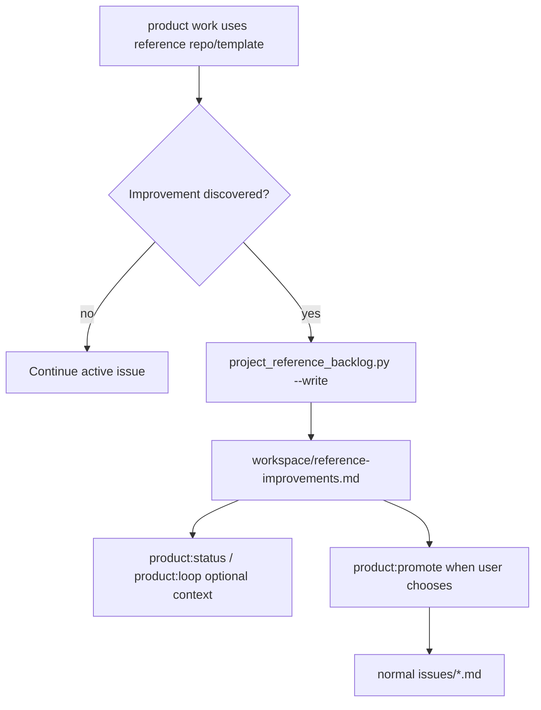

# Spec: Reference Improvement Backlog

Issue: `080-reference-improvement-backlog`
Prev: `078-frontend-qa-template-pack` · Next: `product:plan`

## Problem

ModuFlow work often uses reference repositories, templates, and upstream examples to accelerate product decisions. During that work, agents discover useful improvements for those references. Today those observations either disappear into chat history or get mixed into the active product issue, even when the current issue should stay focused on the user's product.

Issue 080 adds a lightweight reference-improvement backlog. The backlog preserves the source context, observed gap, recommendation, and promotion state without opening external GitHub issues or mutating reference repositories automatically.

## Goals

1. **Separate capture surface**: provide a project-local backlog for reference repo/template improvement candidates.
2. **Traceable records**: each record links to the source reference, originating issue/spec/session, observed gap, recommendation, priority, and promotion status.
3. **Promotion-ready shape**: records can later become normal `issues/*.md` work when the user chooses to act.
4. **Command visibility**: planning, execution, review, status, and loop docs explain when to capture or surface these records.
5. **Package coverage**: the backlog template and capture script are part of the distributable ModuFlow surface.

## Non-Goals

- Do not open GitHub issues in external reference repositories.
- Do not mutate reference repositories automatically.
- Do not make reference-improvement entries release blockers.
- Do not replace `memory/`, `workspace/opportunities.md`, or normal product issues.
- Do not build a dashboard or cross-repo sync service in this issue.

## Proposed Solution



## Backlog Location

Use:

```text
workspace/reference-improvements.md
```

This keeps records close to project operating state while staying separate from active product issues and release gates.

## Record Fields

Each appended record uses stable Markdown fields:

- `ID`
- `Status`: `candidate`, `accepted`, `promoted`, `closed`
- `Priority`: `p0`, `p1`, `p2`, `p3`
- `Source reference`
- `Origin issue`
- `Origin spec`
- `Observed gap`
- `Suggested improvement`
- `Promotion target`
- `Created`

## CLI Contract

Create:

```bash
python3 scripts/project_reference_backlog.py <project-path> \
  --title "<title>" \
  --source "<repo/path/template>" \
  --gap "<observed gap>" \
  --recommendation "<suggested improvement>" \
  --issue-id "<issue id>" \
  --write
```

Without `--write`, the command prints the candidate entry JSON and does not mutate files.

## Command Touchpoints

- `product:plan`: if planning exposes a reusable reference repo/template improvement, capture it separately.
- `product:execute`: if implementation reveals a reference improvement outside the active issue, write a backlog record instead of expanding scope.
- `product:review`: check whether reference improvements were discovered and either capture them or explicitly say none were found.
- `product:status` / `product:loop`: surface pending entries as optional context only.
- `product:promote`: when a user chooses to act, promote an entry into a normal issue.

## Acceptance Criteria

- [ ] `templates/workspace/reference-improvements.md` exists and documents the backlog shape.
- [ ] `scripts/project_reference_backlog.py` can dry-run and write candidate records.
- [ ] Records include source reference, originating issue/spec, observed gap, suggested improvement, priority, status, and promotion target.
- [ ] Duplicate title/source pairs do not append duplicate records.
- [ ] Command docs explain capture, status/loop visibility, and promotion path.
- [ ] Validation includes the new template/script surface.
- [ ] Validation passes: `python3 scripts/validate_moduflow.py .`, `python3 scripts/validate_project_artifacts.py .`, and `python3 scripts/release_check.py .`.

## Risks & Open Questions

- **Backlog clutter**: records can pile up. Mitigation: statuses include `closed`, and status/loop surfaces them as optional context only.
- **Scope creep**: current product issues may absorb unrelated reference work. Mitigation: docs instruct agents to capture separately rather than expand execution scope.
- **Promotion ambiguity**: a record may not yet deserve an issue. Mitigation: `Promotion target` starts empty and only changes when a user chooses to act.
