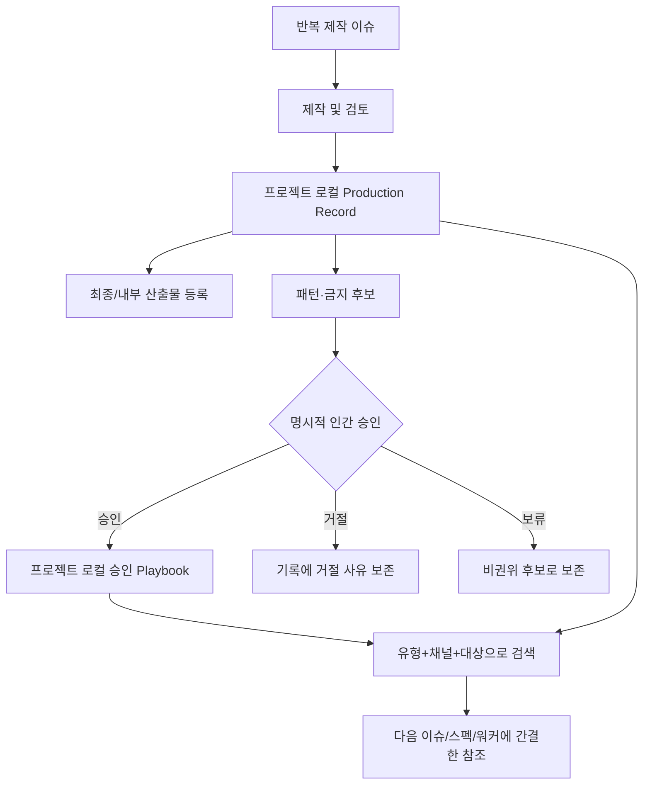

# 스펙: 프로젝트별 제작 기록과 플레이북

Issue: `085-project-production-records-and-playbooks`
Prev: `issues/085-project-production-records-and-playbooks.md`에 기록된 사용자 제품 방향 · Next: `product:plan 085-project-production-records-and-playbooks`

## 사전 결정

이슈와 합의된 대화에서 핵심 제품 방향은 이미 확정했습니다.

1. 별도 서비스가 아니라 **ModuFlow의 선택형 프로젝트 메모리 기능**으로 만듭니다.
2. 실제 제작 기록과 플레이북은 **각 프로젝트 저장소가 소유**합니다. ModuFlow 본체는 스키마, 템플릿, 명령, 파서, 검증과 파생 화면만 제공합니다.
3. 기존 이미지·문서 폴더는 이동시키지 않습니다. Production Record가 프로젝트 상대 경로나 외부 URL을 등록합니다.
4. Production Record는 한 번의 제작 업무 기록이고, Playbook은 하나 이상의 기록에서 도출되어 사람이 승인한 재사용 지식입니다.
5. 프로젝트 간 공유나 복사는 자동으로 하지 않으며 명시적인 인간 승인을 요구합니다.
6. 이벤트 페이지, 배너, 홈팝업, PR/보도자료, 광고 소재, 제휴 제안서, 알림톡, SMS, Push부터 지원하되 채널을 고정된 목록으로 제한하지 않습니다.

## 문제

ModuFlow 이슈는 무엇을 요청하고 실행·검토·완료했는지는 잘 남기지만, 반복 제작 업무에서 다음 제작자가 알아야 할 최종 선택 이유, 실패한 시도, 재사용 문구·레이아웃, 반복 금지 사항은 구조적으로 남기지 못합니다.

현재는 Work Log나 일반 메모리에 적을 수 있지만, `휴대폰 안 작은 한글은 깨진다`, `승인된 회사 소개 문구`, `점검 영향과 시간을 CTA보다 먼저 쓴다` 같은 지식을 비슷한 작업 시작 시 안정적으로 찾거나 플레이북으로 승격하기 어렵습니다. 그 결과 같은 실패를 반복하고 매번 기준을 다시 발견하게 됩니다.

## 목표

1. 반복 제작 건마다 프로젝트 로컬 `Production Record`를 남깁니다.
2. `Artifacts`, `Source Inputs`, `Decisions`, `Failed Attempts`, `Reusable Patterns`, `Do Not Repeat`, `Playbook Updates` 7개 학습 섹션을 표준화합니다.
3. 제작물 유형, 채널, 대상, 외부 배포용 문장과 내부 보고용 문장을 구분합니다.
4. 기존 위치의 최종 산출물을 링크로 등록합니다.
5. 사람이 승인한 패턴과 금지 규칙만 프로젝트 로컬 플레이북에 반영합니다.
6. 별도 데이터베이스 없이 기록과 플레이북을 검색하고 다음 작업에서 불러올 수 있게 합니다.
7. Git Markdown을 canonical로 유지하면서 링크, 관계, 필수 섹션과 승인 근거를 검증합니다.
8. 다음 작업에는 전체 기록이 아니라 관련성이 높은 플레이북과 기록만 간결하게 전달합니다.

## 비목표

- 중앙 호스팅 데이터베이스나 필수 벡터 저장소를 만들지 않습니다.
- 기존 이미지, 문서, 캠페인 폴더를 강제로 이동하거나 마이그레이션하지 않습니다.
- 한 번의 기록을 자동으로 플레이북에 승격하지 않습니다.
- 브랜드 문구나 내부 학습을 프로젝트 간 자동 공유하지 않습니다.
- 이미지·문서·메시지 제작 엔진을 새로 만들지 않습니다.
- 대시보드 구현은 이 이슈에 포함하지 않습니다. `086`이 이 스키마를 사용합니다.
- 기존 모든 메모리와 Work Log를 소급 변환하지 않습니다.
- 프로젝트별 새 유형·채널·대상을 막는 폐쇄형 분류 체계를 만들지 않습니다.

## 사용자와 시나리오

- **제작자**: 리뷰 또는 완료 시 최종 산출물과 제작 학습을 등록해 다음 업무가 실제 프로젝트 지식에서 시작하게 합니다.
  - 기본: 배너 최종 PNG, 원본 자료, 레이아웃 선택 이유, 실패한 캐릭터 생성 시도, 재사용 규칙, 플레이북 후보를 한 기록에 남깁니다.
  - 예외: 파일이 Google Drive 등에 있으면 복사하지 않고 외부 URL과 라벨을 저장합니다.
- **리뷰어/프로젝트 책임자**: 제안된 플레이북 변경을 출처와 함께 승인·거절·보류합니다.
  - 기본: 여러 기록에서 반복된 모바일 텍스트 실패를 확인하고 `Do Not Repeat` 규칙을 승인합니다.
  - 예외: 아직 근거가 약하면 Production Record 후보로만 남기고 플레이북은 바꾸지 않습니다.
- **다음 제작자/에이전트**: 비슷한 이슈가 시작될 때 승인된 플레이북과 최근 관련 사례를 받아 같은 실패를 피합니다.
  - 예외: 승인 플레이북이 없으면 과거 기록을 비권위 근거로 명확히 표시합니다.
- **내·외부 커뮤니케이터**: 외부 배포 문장과 내부 가정·성과 보고 문장이 섞이지 않도록 별도 섹션으로 관리합니다.
- **프로젝트 관리자**: 동일한 스키마를 사용해도 프로젝트 A와 B의 기록·승인·검색 결과가 완전히 분리되기를 원합니다.

## 제안 솔루션

### 프로젝트 로컬 구조

```text
<project-root>/
├── issues/
├── memory/
│   └── production-records/
│       └── <date>-<slug>.md
├── playbooks/
│   └── <scope-slug>.md
└── <기존 산출물 폴더는 그대로 유지>
```

- `memory/production-records/`: 제작 건별 히스토리와 근거
- `playbooks/`: 다음 작업에서 실제로 재사용하는 승인 지침
- 산출물은 기존 폴더에 두고 Production Record에 라벨이 있는 링크로 등록합니다.
- Git Markdown이 canonical이며 검색 인덱스, MCP, 대시보드는 재생성 가능한 파생물입니다.

### Production Record 계약

모든 기록은 기존 프로젝트 메모리 관례와 호환되는 frontmatter를 사용합니다.

```yaml
---
schema: moduflow.production-record.v1
id: 2026-07-10-summer-banner
kind: production_record
title: 여름 충전 이벤트 배너
issue_id: 123-summer-charging-event
deliverable_type: banner
channel: home-popup
audiences: [customer, internal]
lifecycle: published
owner: marketing
created: 2026-07-08
updated: 2026-07-10
playbook_refs: [banner-mobile]
retrieval_trigger: 모바일 배너나 홈팝업에서 UI와 문자를 함께 제작할 때
---
```

필수 필드는 `schema`, `id`, `kind`, `title`, `deliverable_type`, `channel`, `audiences`, `lifecycle`, `created`, `updated`, `retrieval_trigger`입니다. 이슈에서 시작한 업무는 `issue_id`가 필수이며, 이슈 없이 시작한 기록은 Issue 075 기준의 inbox/note/decision 출처가 있어야 합니다. 분류 값은 권장 어휘를 제공하되 프로젝트가 확장할 수 있습니다. 생명주기는 `draft`, `review`, `approved`, `published`, `archived`입니다.

본문은 다음 순서를 고정합니다.

1. `Artifacts`
2. `Source Inputs`
3. `Decisions`
4. `Failed Attempts`
5. `Reusable Patterns`
6. `Do Not Repeat`
7. `Playbook Updates`
8. `External Copy`
9. `Internal Reporting Copy`

앞의 7개는 사용자가 요청한 공통 구조이며 마지막 2개는 외부/내부 문장 혼합을 방지합니다. 내용이 없을 때도 섹션은 남기되 `None recorded`로 표시하고 내용을 발명하지 않습니다.

### 산출물 링크

```markdown
- [최종 모바일 배너](../../marketing/events/summer/banner-final.png) — final · customer
- [내부 검토본](https://example.com/review) — review · internal
```

프로젝트 상대 파일이 없으면 오류, 외부 URL은 오프라인 검증에서 접속하지 않습니다. 절대 로컬 경로는 레거시 링크로 보존할 수 있으나 비이식성 경고를 냅니다.

### 플레이북 계약

플레이북은 전체 기록 모음이 아니라 현재 적용할 승인 지식입니다. `moduflow.playbook.v1` frontmatter에 적용 유형·채널·대상, 버전, 승인자·승인일, 출처 기록, 재검토일과 supersede 관계를 둡니다. `approved_by`는 `.moduflow/humans.json`의 `name` 또는 `email`과 정확히 일치해야 합니다. 본문은 `Reusable Patterns`, `Do Not Repeat`, `Approved Copy Blocks`, `Approved Structures`, `Evidence`, `Revision History`로 구성합니다. 모든 규칙은 최소 하나의 출처 기록과 연결합니다.

### 캡처·승격·재사용 흐름



캡처는 같은 이슈·제작물·변형에 대해 중복 추가보다 업데이트/NOOP을 우선합니다. 플레이북 반영은 `.moduflow/humans.json`에 등록된 인간의 승인자·승인일·출처 기록을 요구합니다. 거절과 보류도 삭제하지 않고 원본 기록에 남깁니다. 다음 작업에는 승인 플레이북을 우선하고 제한된 수의 관련 최근 기록을 보냅니다. 제한이 있으면 숨기지 않고 표시합니다.

자연어 표면 예시는 `이 작업 제작 기록으로 남겨줘`, `이 배너 실패와 재사용 패턴 등록해줘`, `PR 플레이북 후보 보여줘`, `이 패턴을 프로젝트 플레이북에 반영해줘`, `새 Push 작업에 적용할 플레이북과 최근 사례 찾아줘`입니다. 최종 명령 이름은 계획 단계에서 정하되 기존 `product:memory`/`product:promote`와 파서를 공유합니다.

### 검증과 검색

- 하나의 canonical 파서가 검증, 검색, 대시보드, 향후 프롬프트 주입에 동일한 객체를 제공합니다.
- 오류: 필수 메타데이터/섹션 누락, 프로젝트 상대 산출물 누락, dangling 이슈·플레이북·출처 링크, 인간 승인 없는 승인 플레이북, 중복 ID.
- 경고: 절대 로컬 경로, 출처 없는 기록, 지난 `review_after`, 빈 학습 섹션, 약한 단일 근거만 가진 승인 규칙.
- 검색 대상: 제목, 유형, 채널, 대상, 결정, 실패, 패턴, 금지 규칙, 이슈, 플레이북.
- 검색은 선택 프로젝트 내부에서만 수행하며 프로젝트 간 검색·복사는 명시적 인간 승인 없이는 실행하지 않습니다.

## 검토한 대안

- **이슈 Work Log만 사용**: 이전 이슈 번호를 알아야 하고 재사용 지침과 세션 기록을 구분할 수 없어 기각했습니다.
- **일반 메모리 엔트리만 사용**: 산출물·판단·실패·패턴·금지·승격 상태를 강제하지 못해 기각했습니다.
- **별도 제작 지식 앱**: 이슈·결정·프로젝트 맥락이 분리되므로 기각했습니다.
- **ModuFlow 본체에 중앙 플레이북 저장**: 브랜드와 내부 문맥은 프로젝트별이므로 기각했습니다.
- **모든 산출물을 `artifacts/`로 이동**: 기존 폴더와 외부 시스템을 깨므로 기각했습니다.
- **반복 패턴 자동 승격**: 반복은 근거이지 승인 권한이 아니므로 기각했습니다.
- **모든 기록에 이슈 강제**: Issue 075의 이슈 없는 캡처 경로를 보존하되, 출처 없음은 경고하고 이슈가 존재할 때는 링크를 필수로 합니다.

## 수용 기준

1. 초기화가 기존 산출물 폴더를 변경하지 않고 선택형 Production Record/Playbook 위치와 템플릿을 만듭니다.
2. 단일 파서가 필수 메타데이터, 9개 섹션, 산출물 링크와 플레이북 상태를 읽습니다.
3. 동일 스키마로 시각 산출물 1건과 메시징/PR 산출물 1건을 등록합니다.
4. 상대 파일과 외부 URL을 지원하고 누락 상대 파일은 오류, 절대 로컬 경로는 경고합니다.
5. 외부/내부 문장을 별도 필수 섹션으로 검색·표시합니다.
6. 유효한 인간 승인자·일자·출처 기록 없이는 플레이북을 `approved`로 만들 수 없습니다.
7. 승인·거절·보류 후보가 원본 기록에서 감사 가능합니다.
8. 유형, 채널, 대상, 이슈, 결정, 실패, 패턴, 금지, 플레이북으로 검색할 수 있습니다.
9. 선택 프로젝트의 승인 플레이북과 제한된 관련 기록만 반환하고 truncation을 표시합니다.
10. 같은 이슈·제작물·변형을 다시 캡처하면 조용한 중복 대신 업데이트/NOOP을 안내합니다.
11. 프로젝트 A/B fixture가 기록·검색·승인 혼합이 없음을 증명합니다.
12. 기존 project-memory 동작은 호환되며 레거시 변환은 필수가 아닙니다.
13. 집중 테스트, 프로젝트 검증, `python3 scripts/release_check.py .`가 통과합니다.

## 리스크와 열린 질문

- **과잉 기록**: 사소한 변형마다 긴 기록을 만들 수 있습니다. 리뷰/완료 시점 캡처와 업데이트/NOOP 우선으로 완화합니다.
- **성급한 규칙화**: 단일 결과가 보편 규칙처럼 보일 수 있습니다. 승인 전 후보는 비권위 상태로 두고 출처 수와 근거를 표시합니다.
- **분류 표현 드리프트**: `PR`, `press-release`, `media`가 갈릴 수 있습니다. 권장 alias와 slug 정규화를 제공합니다.
- **민감한 내부 문장**: 외부 화면에 노출될 수 있습니다. 대상 분리와 086 표시 규칙을 사용하고, 계획에서 공유용 출력의 redaction을 확정합니다.
- **링크 이식성**: 절대 로컬 경로는 이동 시 깨집니다. 상대 경로와 안정적 외부 URL을 우선합니다.
- **플레이북 노후화**: `review_after`, 개정 이력, 삭제 대신 supersede로 관리합니다.
- **계획 단계 결정**: 새 `product:production` alias를 둘지 `product:memory` 모드로 둘지 확정하되 파서와 스키마는 공유해야 합니다.
