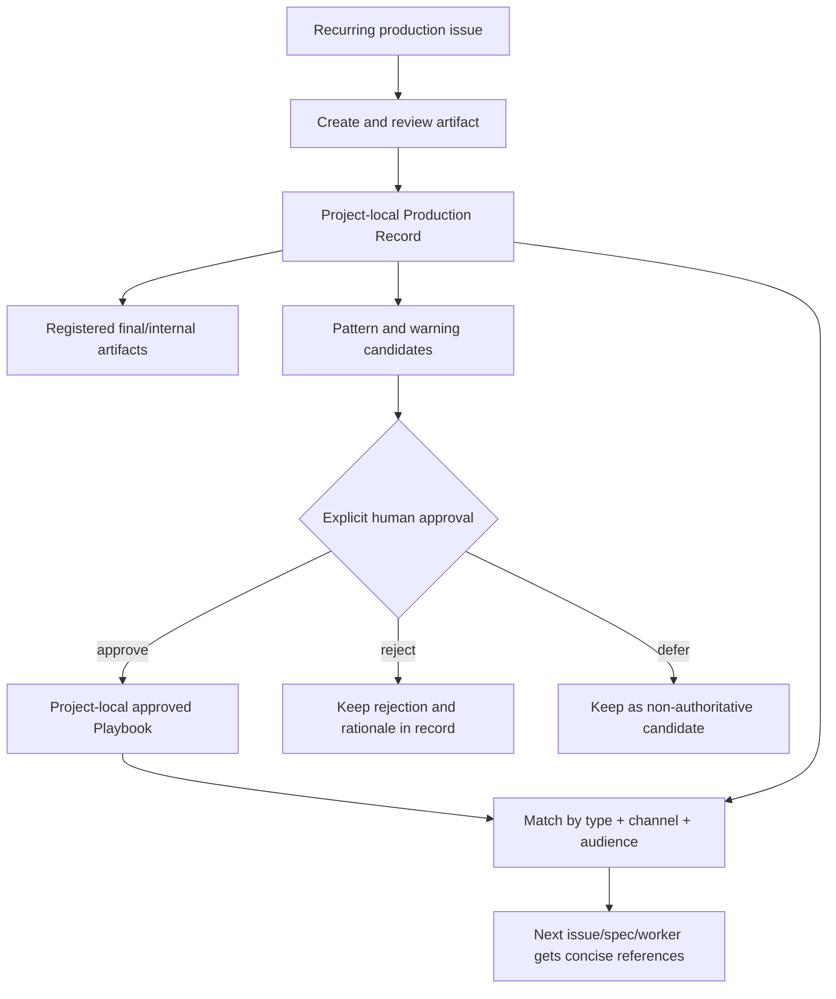

# Spec: Project Production Records and Playbooks

Issue: `085-project-production-records-and-playbooks`
Prev: user product direction recorded in `issues/085-project-production-records-and-playbooks.md` · Next: `product:plan 085-project-production-records-and-playbooks`

## Clarify First

The issue and approved conversation settle the product-shaping questions:

1. Product boundary? **Inside ModuFlow as an optional project-memory capability**, not a separate service.
2. Ownership boundary? **Each project repository owns its records and playbooks**. The ModuFlow package owns only schema, templates, commands, parsing, validation, and derived views.
3. Existing asset folders? **Preserve them.** A Production Record registers project-relative files or external URLs; it never forces assets into a ModuFlow folder.
4. Record versus playbook? **A record describes one production job; a playbook contains human-approved reusable knowledge derived from one or more records.**
5. Cross-project sharing? **Never automatic.** Copying or promoting a pattern across projects is a canonical transition requiring explicit human approval.
6. Supported work? The model is channel-neutral and starts with event pages, banners, home popups, PR/press, ad creatives, partnership proposals, Alimtalk, SMS, and Push.

## Problem

ModuFlow's issue lifecycle records what was requested, implemented, reviewed, and completed. That is insufficient for recurring production work. When a banner, press release, message, or proposal is completed, the next producer also needs the reasoning behind the final choice, failed attempts, reusable copy/layout patterns, and explicit warnings about what not to repeat.

Today those learnings can be placed in a work log or generic memory note, but they are not consistently structured or promoted into an active playbook. Future agents cannot reliably retrieve "small Korean text inside a phone image breaks", "approved company introduction copy", or "put service impact and maintenance time before the CTA" at the moment a similar task starts. The result is repeated mistakes and re-discovery.

## Goals

1. Introduce a durable, project-local `Production Record` for each recurring production job.
2. Standardize the seven learning sections: `Artifacts`, `Source Inputs`, `Decisions`, `Failed Attempts`, `Reusable Patterns`, `Do Not Repeat`, and `Playbook Updates`.
3. Distinguish deliverable type, channel, audience, external-facing copy, and internal-reporting copy.
4. Preserve links to final artifacts wherever the project already stores them.
5. Introduce project-local playbooks containing only human-approved reusable patterns and warnings.
6. Make records and playbooks searchable and retrievable for future planning/production without requiring a new database.
7. Validate links, relationships, required sections, and approval evidence while keeping Git Markdown canonical and portable.
8. Provide concise matched playbook/record context to future work without injecting an entire production history.

## Non-Goals

- No central hosted database or mandatory vector store.
- No forced migration or relocation of existing images, documents, campaign folders, or external-drive files.
- No automatic promotion from one record into a playbook.
- No automatic sharing of brand copy, internal reporting language, or failed attempts between projects.
- No new image, document, or messaging authoring engine.
- No dashboard implementation in this issue; Issue 086 consumes this schema.
- No retroactive conversion of every existing memory or work log.
- No hardcoded closed taxonomy that prevents a project from adding a new deliverable type, channel, or audience.

## Users & Scenarios

- **Producer**: As a designer, marketer, PR writer, or operator, I want to register the final artifact and production learnings when work reaches review or completion, so the next job starts with real project knowledge.
  - Main: register a banner with its final PNG, source references, selected layout rationale, failed generated-character attempts, reusable layout rule, and a playbook-update candidate.
  - Exception: the asset lives in Google Drive or another external system; the record stores an external URL and label without copying the file.
- **Reviewer / project owner**: I want to approve or reject proposed playbook changes with source evidence, so one weak attempt cannot become project policy.
  - Main: review two records that repeat the same mobile-text failure, approve a `Do Not Repeat` rule, and record approver/date/source records in the playbook.
  - Exception: a candidate is plausible but unproven; leave it in the Production Record as a candidate and do not alter the playbook.
- **Future producer / agent**: I want relevant patterns and warnings when a similar issue/spec starts, so I can reuse proven structures without reading every prior issue.
  - Main: a new PR issue retrieves the approved PR playbook plus a small set of recent matching Production Records.
  - Exception: no approved playbook matches; show matching records as evidence, clearly labeled as non-authoritative.
- **Internal/external communicator**: I want externally approved copy separated from internal reporting language, so internal assumptions or performance commentary are never copied into customer/media messaging by accident.
- **Project maintainer**: I want Project A and Project B to use the same schema without sharing content, so project boundaries remain trustworthy.

## Proposed Solution

### Project-Local Layout

```text
<project-root>/
├── issues/
├── memory/
│   └── production-records/
│       └── <date>-<slug>.md
├── playbooks/
│   └── <scope-slug>.md
└── <existing asset folders remain unchanged>
```

- `memory/production-records/` holds job-specific history and evidence.
- `playbooks/` holds active project guidance intended for reuse during future work.
- Artifact files stay where the project already keeps them. Production Records contain labeled links.
- Git-tracked Markdown is canonical. Search indexes, MCP projections, dashboards, and other databases are rebuildable derived views.

### Production Record Contract

Every record uses one parser and starts with frontmatter compatible with the existing project-memory conventions:

```yaml
---
schema: moduflow.production-record.v1
id: 2026-07-10-summer-banner
kind: production_record
title: Summer charging event banner
issue_id: 123-summer-charging-event
deliverable_type: banner
channel: home-popup
audiences: [customer, internal]
lifecycle: published
owner: marketing
created: 2026-07-08
updated: 2026-07-10
playbook_refs: [banner-mobile]
retrieval_trigger: when creating a mobile banner or home popup with embedded UI/text
---
```

Contract rules:

- `schema`, `id`, `kind`, `title`, `deliverable_type`, `channel`, `audiences`, `lifecycle`, `created`, `updated`, and `retrieval_trigger` are required.
- `issue_id` is required when the work came from an issue. Issue-less capture is allowed only when the record carries the originating inbox/note/decision reference according to Issue 075's promotion model.
- `deliverable_type`, `channel`, and `audiences` use recommended vocabulary but accept project-defined values. Values are normalized slugs, not provider/product-specific enums.
- `lifecycle` is one of `draft`, `review`, `approved`, `published`, or `archived`.
- `playbook_refs` must resolve to project-local playbook IDs.
- An absolute local path may be preserved as a legacy/non-portable artifact link with a warning; new local-file links should be project-relative. `https` URLs are allowed and are not fetched during validation.

Every record body contains these headings in this order:

1. `## Artifacts` — labeled final/internal/source outputs with Markdown links and optional variant/audience labels.
2. `## Source Inputs` — references, briefs, approved source copy, data, and constraints.
3. `## Decisions` — selected option, rationale, alternatives rejected, and decision owner when relevant.
4. `## Failed Attempts` — attempted approach, observed failure, and evidence; not merely "did not like it".
5. `## Reusable Patterns` — candidate structures, copy, prompts, or layouts that may be reused.
6. `## Do Not Repeat` — candidate warnings scoped to the conditions in which they failed.
7. `## Playbook Updates` — proposed/approved/rejected playbook changes and their approval state.
8. `## External Copy` — customer/media/partner-facing copy or `Not applicable`.
9. `## Internal Reporting Copy` — internal context or `Not applicable`.

The first seven headings are the cross-channel standard requested by the user. The final two headings make audience separation mechanically visible. Empty sections are retained with an explicit `None recorded`; writers must not invent content to fill them.

### Artifact Link Shape

Each `Artifacts` item uses a parseable line while staying readable Markdown:

```markdown
- [Final mobile banner](../../marketing/events/summer/banner-final.png) — final · customer
- [Internal review deck](https://example.com/review) — review · internal
```

The parser extracts label, target, variant/state, and audience from the standard line. A missing project-relative target is an error; an unreachable external URL is not checked by offline validation.

### Playbook Contract

A playbook is active guidance, not a dump of all prior records:

```yaml
---
schema: moduflow.playbook.v1
id: banner-mobile
title: Mobile banner production
applies_to_types: [banner, home-popup]
applies_to_channels: [mobile-web, app]
audiences: [customer]
version: 1.0
status: approved
approved_by: Dongwon Lee
approved_at: 2026-07-10
source_records: [2026-07-08-summer-banner]
review_after: 2026-10-10
superseded_by: []
---
```

Required body sections are `Reusable Patterns`, `Do Not Repeat`, `Approved Copy Blocks`, `Approved Structures`, `Evidence`, and `Revision History`. Every rule links to at least one source record. Playbook changes are append-visible through revision history and normal Git history.

### Capture, Promotion, and Reuse Flow



1. `product:memory` or a focused natural-language alias registers/updates a Production Record.
2. Capture prefers update/no-op over duplicate add for the same issue + deliverable + variant.
3. `Playbook Updates` remain candidates until an identified human in `.moduflow/humans.json` approves them.
4. Approval creates or revises a project-local playbook with `approved_by`, `approved_at`, source record IDs, and revision history.
5. Rejection/defer stays visible in the source record; automation never silently discards it.
6. Future planning/production retrieves approved playbooks first, then a bounded list of matching recent records. Any cap reports itself, consistent with Constitution C11.

### Suggested Natural-Language Surface

- `이 작업 제작 기록으로 남겨줘`
- `이 배너의 실패와 재사용 패턴 등록해줘`
- `PR 플레이북 후보 보여줘`
- `이 패턴을 프로젝트 플레이북에 반영해줘` → approval gate
- `새 Push 작업에 적용할 플레이북과 최근 사례 찾아줘`

Command naming is finalized in the plan, but it should extend `product:memory`/`product:promote` semantics rather than create a disconnected subsystem.

### Validation and Retrieval

- One canonical parser returns normalized record/playbook objects for validator, search, dashboard, and future prompt injection.
- Validation errors: missing required metadata/section, unresolved project-relative artifact, dangling issue/playbook/source-record reference, approved playbook without valid human approval metadata, or duplicate canonical ID.
- Validation warnings: absolute local artifact path, record with no issue/context source, stale `review_after`, empty learning sections, or approved playbook rule with only one weak source.
- Search covers title, type, channel, audience, decisions, failures, patterns, warnings, source issue, and playbook references.
- Retrieval ranks exact project + type + channel + audience matches first. It never searches another project unless an explicit cross-project action has human approval.

## Alternatives Considered

- **Keep all learning in issue work logs** — rejected because future users must know the old issue number and cannot distinguish reusable guidance from session history.
- **Use only generic memory entries** — rejected because the current entry shape does not require artifact/decision/failure/pattern/warning sections or playbook promotion state.
- **Create a separate production-knowledge application** — rejected because issue, artifact, decision, and project context would split across systems; ModuFlow already has Git-native memory and dashboard foundations.
- **Store playbooks centrally in the ModuFlow plugin** — rejected because company wording, brand rules, internal context, and approval ownership are project-specific.
- **Put final assets under a mandatory `artifacts/` folder** — rejected because projects already have working folder structures and external source systems.
- **Auto-promote repeated patterns** — rejected because repetition is evidence, not authorization; project policy changes require human approval.
- **Make every Production Record require an issue** — rejected to preserve Issue 075's issue-less capture path, but missing source context remains a validation warning and issue linkage is required when an issue exists.

## Acceptance Criteria

1. Initialization creates optional project-local Production Record and playbook template locations without modifying existing asset folders.
2. A record parser reads the required metadata, nine body sections, artifact links, and playbook update states into one normalized object.
3. A project can register one visual artifact and one messaging/PR artifact using the same schema.
4. Project-relative files and external URLs render as artifacts; missing relative files fail validation, while absolute local paths warn as non-portable.
5. External and internal copy are stored in separate required sections and remain separately addressable in search/output.
6. A playbook cannot reach `approved` without valid human approver/date/source-record evidence.
7. Approved, rejected, and deferred playbook candidates remain auditable from the source record.
8. Search can find records by type, channel, audience, issue, decision, failed attempt, reusable pattern, warning, and playbook.
9. Retrieval returns only the selected project's approved playbooks plus bounded matching records and reports any truncation.
10. Duplicate capture of the same issue/deliverable/variant produces update or no-op guidance instead of a silent duplicate.
11. Project A and Project B fixtures prove that identical schema use does not mix records, playbooks, search results, or approvals.
12. Existing project-memory behavior remains backward compatible; no migration of legacy entries is required.
13. Focused tests, project validation, and `python3 scripts/release_check.py .` pass.

## Risks & Open Questions

- **Over-capture**: producers may create verbose records for trivial variants. Mitigation: capture at review/completion, prefer update/no-op, and keep only durable decisions/failures/patterns.
- **Premature policy**: a single outcome may be mistaken for a universal rule. Mitigation: candidates stay non-authoritative until explicit approval; source count and evidence remain visible.
- **Vocabulary drift**: `PR`, `press-release`, and `media` may fragment search. Mitigation: provide recommended aliases and normalize slugs while allowing project-defined values.
- **Sensitive internal copy**: records may contain internal context that should not appear in an external-facing view. Mitigation: audience-separated sections and Issue 086 view rules; plan must define redaction/export behavior for any shareable output.
- **Link portability**: absolute local paths break when a repository moves. Mitigation: warn and prefer project-relative paths or stable external URLs.
- **Playbook staleness**: approved rules can outlive campaigns or brand policy. Mitigation: `review_after`, revision history, and supersession rather than deletion.
- **Planning decision**: finalize whether the focused command is a new `product:production` alias or a mode under `product:memory`; the underlying parser/schema must stay shared either way.
