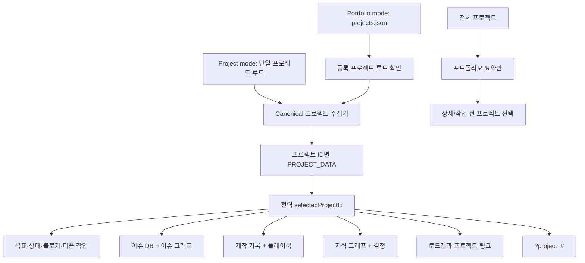

# 스펙: 프로젝트 인식형 제작 라이브러리 대시보드

Issue: `086-project-aware-production-library-dashboard`
Prev: `specs/085-project-production-records-and-playbooks/spec.md`와 승인된 대시보드 컨셉 · Next: `product:design 086-project-aware-production-library-dashboard`

## 사전 결정

1. 별도 앱을 만들지 않고 기존 ModuFlow 생성형 대시보드와 포트폴리오 기반을 확장합니다.
2. 상단 프로젝트 선택 하나가 Production Records뿐 아니라 모든 대시보드 화면을 제어합니다.
3. 프로젝트마다 폴더가 달라도 UI 계약에는 영향이 없습니다. canonical 이슈·메모리·Production Record 파서가 정규화 데이터를 제공하고 대시보드는 임의 폴더를 탐색하지 않습니다.
4. 다중 프로젝트는 기존 `projects.json` (`moduflow.projects.v1`)을 재사용합니다. 단일 프로젝트는 포트폴리오 설정 없이 계속 동작합니다.
5. `전체 프로젝트`는 읽기 전용 요약만 제공하며 상세 열기·프로젝트 작업은 특정 프로젝트 선택 후 가능합니다.
6. v1은 읽기 중심 정적 대시보드이며 등록/수정은 ModuFlow 자연어와 명령으로 수행합니다.
7. 프로젝트와 활성 화면을 URL에 남겨 새로고침과 링크 공유 시 문맥을 유지합니다.

## 문제

현재 대시보드는 한 프로젝트의 이슈와 메모리를 보여줄 수 있지만, 반복 제작 지식이 추가되면 등록 산출물, 실패 사례, 승인 패턴, 플레이북 검토 대기도 운영 화면에서 봐야 합니다. 프로젝트 선택이 제작 탭에만 있으면 이슈 DB·그래프·상태·지식은 다른 프로젝트를 가리킬 수 있습니다. 이런 혼합 문맥은 프로젝트 선택 기능이 없는 것보다 위험합니다.

또한 프로젝트별 산출물 폴더와 외부 도구가 다르므로 공통 물리 폴더를 전제로 할 수 없습니다. 명시적으로 등록된 프로젝트 루트를 선택하고 그 프로젝트의 canonical 기록을 정규화해 모든 화면과 링크에 동일하게 적용해야 합니다.

## 목표

1. 대시보드 헤더에 전역 프로젝트 문맥을 둡니다.
2. 등록된 포트폴리오 프로젝트를 재사용하면서 단일 프로젝트 무설정 사용을 유지합니다.
3. 선택 프로젝트를 이슈 DB, 이슈 그래프, 제작 기록, 플레이북, 지식 그래프, 결정, 목표, 로드맵, 상태, 블로커, 다음 명령에 모두 적용합니다.
4. Production Records와 Playbooks를 1급 대시보드 화면으로 추가합니다.
5. 저장 경로를 몰라도 제작 지식을 검색·스캔할 수 있게 합니다.
6. 프로젝트 변경 시 이전 상세 선택과 유효하지 않은 필터를 정리합니다.
7. 프로젝트와 화면을 URL에 유지합니다.
8. 상세 데이터를 섞지 않는 `전체 프로젝트` 요약을 제공합니다.
9. Git Markdown canonical과 정적 생성 HTML을 v1 전달 방식으로 유지합니다.

## 비목표

- v1에서 브라우저가 Git에 직접 쓰지 않습니다.
- 중앙 호스팅 DB, 필수 로컬 서버, 인증·동기화 서비스를 만들지 않습니다.
- 여러 프로젝트의 Production Record/Playbook 본문을 합쳐 보여주지 않습니다.
- 임의 폴더를 자동 탐색해 미등록 산출물을 찾지 않습니다.
- 기존 이슈 DB, 이슈/지식 그래프, 상세 패널을 대체하지 않습니다.
- 민감 문장을 자동 redaction하지 않습니다. 각 화면이 허용한 필드만 렌더링합니다.
- 공개 웹 배포 계약을 만들지 않습니다.
- 파일시스템 탐색으로 프로젝트 목록을 만들지 않고 명시적 등록만 신뢰합니다.

## 사용자와 시나리오

- **단일 프로젝트 사용자**: `product:dashboard` 실행 시 포트폴리오 설정 없이 현재 프로젝트가 기본 선택됩니다. Production Record가 없어도 기존 이슈/지식 화면은 정상 동작합니다.
- **다중 프로젝트 PM**: 상단에서 프로젝트를 한 번 선택한 뒤 이슈 DB, 제작 기록, 지식 그래프를 오가도 모든 화면이 같은 프로젝트를 유지합니다. 기록 상세를 연 상태에서 프로젝트를 바꾸면 이전 상세를 먼저 닫습니다.
- **제작자/리뷰어**: 유형, 채널, 대상, 생명주기, 플레이북 상태로 검색하고 산출물·결정·실패·패턴·외부/내부 문장을 확인합니다.
- **플레이북 리뷰어**: 승인 상태와 출처 기록을 보고 근거로 이동합니다.
- **포트폴리오 책임자**: `전체 프로젝트`에서 요약과 주의 항목을 비교하고 특정 프로젝트를 선택한 뒤 상세로 들어갑니다.
- **링크 수신자**: URL의 프로젝트·화면 문맥으로 열고, 프로젝트가 더 이상 등록되지 않았으면 명확한 fallback을 봅니다.
- **관리자**: 한 프로젝트가 누락/손상되어도 다른 프로젝트 대시보드는 정상 렌더링됩니다.

## 제안 솔루션

### 두 생성 모드, 하나의 화면 계약

1. **Project mode**: 프로젝트 루트 하나에서 수집하고 해당 프로젝트를 기본 선택합니다.
2. **Portfolio mode**: 포트폴리오 `projects.json`을 읽고 명시적으로 등록된 프로젝트 경로별 제한된 스냅샷을 수집합니다.

두 모드는 동일한 프로젝트 payload를 만들고 기존 canonical 파서를 재사용합니다. 브라우저는 임의 경로를 탐색하지 않습니다.



### 프로젝트 payload

정적 문서는 `moduflow.dashboard-projects.v1` payload를 프로젝트 ID별로 포함합니다. 각 프로젝트에는 이름, 상태, 이슈, 이슈 그래프, Production Records, Playbooks, 지식 그래프, 결정, 로드맵, 경고가 들어갑니다. 프로젝트 ID는 `projects.json`을 우선하고 단일 모드에서는 프로젝트 프로필 ID 또는 루트 slug를 사용합니다.

브라우저 payload에는 정규화된 표시 데이터와 안전하게 해석된 링크만 넣고 임의 파일 내용이나 파일시스템 API를 노출하지 않습니다. 기존 이슈/메모리 파서와 085 파서를 단일 파싱 소스로 사용합니다. 프로젝트별 수집 제한은 `truncated`와 누락 수를 표시해야 합니다.

### 전역 프로젝트 상태

`selectedProjectId` 하나가 모든 탭의 프로젝트 문맥을 소유합니다. 프로젝트 변경은 대상 ID 검증 → 이전 이슈/기록/메모리 선택과 유효하지 않은 필터 정리 → 헤더와 모든 데이터 루트 교체 → 활성 화면 렌더링 → URL 갱신 순서의 원자적 전환입니다. 탭별 별도 project ID는 금지합니다.

`selectedProjectId=all`은 요약 상태이며 프로젝트 상세 링크와 작업을 비활성화합니다.

### URL 계약

- 프로젝트: `?project=<registered-project-id>`
- 화면: `#issue-db`, `#issues`, `#production-records`, `#playbooks`, `#memory`
- 예: `memory/dashboard.html?project=modu-charge#production-records`
- 잘못된 ID는 기본 프로젝트로 fallback하고 비차단 경고를 표시합니다.
- hash가 없으면 기본 운영 화면 `#issue-db`를 엽니다(디자인 검증에서 변경 가능).
- 모든 링크는 신뢰된 등록 루트를 사용하는 단일 resolver로 생성하고 브라우저 자유 입력으로 경로를 조합하지 않습니다.

### 헤더와 화면

```text
[Project: 모두의충전 ▼]   Goal · phase · blocker · next action

[Issue DB] [Issue Graph] [Production Records] [Playbooks] [Knowledge Graph]
```

상단 프로젝트 선택이 탭보다 위에 있고 헤더의 상태·목표·블로커·다음 작업도 함께 변경됩니다. Production Records는 유형·채널·대상·상태·플레이북 반영 상태로 검색/필터하며, 상세에서 085 전체 섹션을 보여줍니다. 외부 배포 문장과 내부 보고 문장은 시각적으로 분리합니다.

Playbooks는 적용 유형/채널/대상, 버전, 승인 상태, 승인자/일자, 재검토 상태, 출처 수, supersede 상태를 보여줍니다. `approved`만 현재 재사용 지침으로 표시하고 후보는 정책처럼 보이지 않게 합니다.

### 전체 프로젝트 요약

프로젝트별 이슈 상태, Production Record 생명주기 수, 플레이북 후보/재검토 예정, 링크·검증 경고 수, 블로커와 다음 명령만 보여줍니다. 기록 본문, 내부 문장, 전체 결정이나 통합 검색 결과는 보여주지 않습니다. 프로젝트 행을 선택하면 구체 프로젝트 문맥으로 전환합니다.

### 오류와 빈 상태

- `projects.json`이 없어도 단일 프로젝트 모드는 동작합니다.
- 등록 프로젝트가 없거나 읽히지 않으면 해당 ID에 경고하고 다른 프로젝트는 계속 표시합니다.
- Production Record/Playbook이 없으면 빈 화면 대신 등록 명령을 보여줍니다.
- URL 프로젝트가 제거됐으면 기본 프로젝트와 경고로 fallback합니다.
- 산출물 링크가 없으면 기록을 숨기지 않고 attention flag를 표시합니다.
- 대형 프로젝트는 조용히 생략하지 않고 truncation과 재생성 안내를 표시합니다.

## 검토한 대안

- **제작 탭에만 프로젝트 선택**: 다른 탭과 문맥이 섞여 기각했습니다.
- **프로젝트별 별도 대시보드만 유지**: 단일 모드 fallback으로는 유지하지만 다중 프로젝트 편의성을 해결하지 못합니다.
- **모든 프로젝트 상세를 통합**: 브랜드·내부 지식이 섞이고 작업 대상이 모호해져 기각했습니다.
- **파일시스템 자동 탐색**: 안전성·성능·일관성 문제로 기각하고 명시적 포트폴리오 등록을 사용합니다.
- **새 React/Next 앱**: 기존 정적 대시보드가 테이블/그래프를 지원하고 무백엔드 이식성을 유지하므로 v1에서는 기각했습니다.
- **브라우저 write-back**: 충돌·권한·Git 커밋 계약이 필요하므로 후속으로 미룹니다.
- **중앙 DB canonical**: 프로젝트 로컬 Git 이식성 원칙과 충돌해 기각했습니다.

## 수용 기준

1. 단일 프로젝트 모드가 `projects.json` 없이 정상 대시보드를 생성합니다.
2. 포트폴리오 모드가 `moduflow.projects.v1`의 유효 프로젝트와 잘못된 항목의 경고를 모두 렌더링합니다.
3. 전역 선택 하나가 헤더, 이슈 DB/그래프, 제작 기록, 플레이북, 지식/결정, 로드맵, 다음 작업을 동일 프로젝트로 갱신합니다.
4. 프로젝트 변경 전에 이전 상세 선택을 정리합니다.
5. 어떤 탭도 별도 project ID를 소유하지 않습니다.
6. `?project=<id>#<view>`가 새로고침 후 복원되고 잘못된 ID는 명확하게 fallback합니다.
7. `전체 프로젝트`는 요약만 표시하고 상세/작업 전 특정 프로젝트를 요구합니다.
8. Production Records를 유형, 채널, 대상, 생명주기, 플레이북 상태로 검색/필터합니다.
9. 상세에서 085 필수 섹션과 분리된 외부/내부 문장을 표시합니다.
10. Playbook이 승인·범위·버전·재검토·출처 정보를 표시하며 후보를 승인 지침처럼 보이지 않게 합니다.
11. 프로젝트별 기존 폴더가 달라도 Production Record 등록 링크로 일관되게 표시합니다.
12. 누락 프로젝트, 빈 제작 라이브러리, 오래된 URL 프로젝트, 누락 산출물 링크가 각각 비충돌 상태를 냅니다.
13. 기존 이슈 DB/그래프, 지식 그래프, 프로젝트 상세 동작이 회귀 테스트됩니다.
14. 데스크톱/모바일에서 선택기, 탭, 필터, 테이블, 상세 텍스트가 겹치거나 잘리지 않습니다.
15. 정적 결과에는 브라우저 mutation 경로가 없고 외부 DB/런타임 서버가 필요하지 않습니다.
16. 집중 테스트, 프로젝트 검증, `python3 scripts/release_check.py .`가 통과합니다.

## 리스크와 열린 질문

- **payload 크기**: 프로젝트가 많으면 HTML이 커집니다. 제한과 truncation을 명시하고 프로젝트별 상세 생성을 활용합니다.
- **민감한 내부 내용**: 포트폴리오 HTML에 여러 프로젝트 내용이 모일 수 있습니다. 전체 프로젝트는 요약만 제공하고 상세 payload는 신뢰된 프로젝트에 대해 명시적으로 생성합니다.
- **프로젝트 간 링크**: 포트폴리오 디렉터리에서 상대 링크가 달라질 수 있습니다. 단일 trusted resolver와 fixture로 검증합니다.
- **생성 결과 노후화**: generated-at과 재생성 명령을 표시하며 실시간 동기화를 주장하지 않습니다.
- **필터 누수**: 프로젝트 변경 시 유효하지 않은 필터는 원자적 전환에서 초기화합니다.
- **브라우저 history**: 필터/상세는 `replaceState`, 명시적 프로젝트/화면 이동만 `pushState`를 쓰는 방향을 디자인에서 결정합니다.
- **디자인 결정**: 단일 프로젝트 모드에서 disabled selector 또는 compact label 중 하나를 검증합니다. 전역 상태 계약은 동일합니다.
- **계획 결정**: 프로젝트별 payload 제한과 상세 데이터를 eager embed할지 프로젝트별 파일로 연결할지 정합니다. 사용자 계약은 바뀌지 않아야 합니다.

