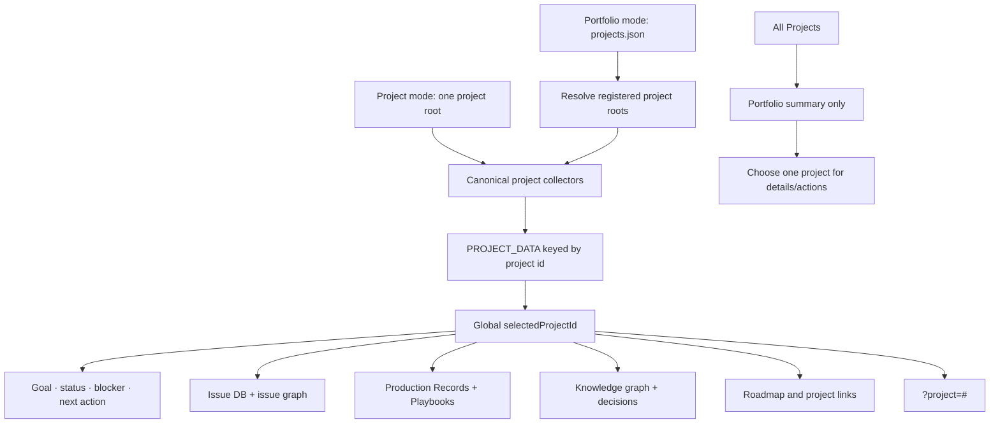

# Spec: Project-Aware Production Library Dashboard

Issue: `086-project-aware-production-library-dashboard`
Prev: `specs/085-project-production-records-and-playbooks/spec.md` and the approved dashboard concept · Next: `product:design 086-project-aware-production-library-dashboard`

## Clarify First

The user decisions and existing dashboard architecture settle the main questions:

1. Separate app? **No. Extend the existing generated ModuFlow dashboard and portfolio foundation.**
2. Project scope? **One global project selector controls all dashboard views**, not only Production Records.
3. Different project folders? **Irrelevant to the UI contract.** Each project's canonical issue/memory/Production Record parsers expose normalized data; the dashboard does not crawl arbitrary asset folders.
4. Multi-project source? **Reuse portfolio `projects.json` (`moduflow.projects.v1`)**. A single-project invocation still works without portfolio setup.
5. `All Projects` behavior? **Read-only summary only.** A concrete project is required before opening project details or running a project action.
6. Editing? **Read-oriented static dashboard in v1.** Registration and updates continue through ModuFlow natural language/commands.
7. Persistence? **Selected project and view live in the URL**, so refresh and shared local links retain context.

## Problem

The current dashboard can show issue and memory views for one project, but recurring production knowledge introduces another operational lens: what artifacts are registered, what failed, which patterns are approved, and which playbook changes are waiting for review. If project selection exists only inside the production tab, the Issue DB, graph, status, and knowledge views can silently point at a different project. That mixed context would be more dangerous than having no selector.

Projects also use different asset folders and external tools. A useful dashboard cannot rely on a shared physical asset layout. It must select one registered project root, collect that project's normalized canonical records, and apply that selection consistently to every view and link.

## Goals

1. Add one global project context to the dashboard header.
2. Reuse registered portfolio projects while retaining zero-setup single-project behavior.
3. Apply the selected project to Issue DB, issue graph, production records, playbooks, knowledge graph, decisions, goal, roadmap, status, blockers, and next command.
4. Add Production Records and Playbooks as first-class dashboard views.
5. Make registered production knowledge searchable and scannable without knowing repository paths.
6. Clear stale selection/detail state whenever the project changes.
7. Persist project and active view in the URL.
8. Provide an `All Projects` portfolio summary without mixing detailed project data.
9. Keep Git Markdown canonical and static generated HTML as the v1 delivery surface.

## Non-Goals

- No browser write-back to Git in v1.
- No hosted central database, mandatory local server, authentication system, or project-content sync service.
- No cross-project merged Production Record or Playbook detail view.
- No automatic crawling of arbitrary folders for unregistered assets.
- No replacement of the existing Issue DB, issue graph, knowledge graph, or issue/memory drill-down panels.
- No automatic redaction of sensitive content; only fields explicitly allowed by the selected view are rendered.
- No public-web publishing contract. The generated dashboard is a project/portfolio operating surface.
- No project selector populated from filesystem discovery; only explicitly registered portfolio projects are trusted.

## Users & Scenarios

- **Single-project user**: As a PM working in one repository, I run `product:dashboard` and see the current project selected by default without setting up a portfolio.
  - Exception: the project has no Production Records; production views render an empty state while Issue/Knowledge views continue working.
- **Multi-project PM**: I open a portfolio dashboard, choose a project once, and every tab immediately represents that project.
  - Main: select `modu-charge`, open Production Records, switch to Issue DB, then Knowledge Graph; every view and header remains `modu-charge`.
  - Exception: switch project while a record detail is open; the old detail closes before the new project renders.
- **Producer/reviewer**: I filter records by type, channel, audience, lifecycle, or playbook state, then inspect artifacts, decisions, failures, reusable patterns, and external/internal copy.
- **Playbook reviewer**: I open a project playbook, see approval state and source records, and follow links back to evidence.
- **Portfolio owner**: I select `All Projects` to compare summary counts and attention states, then choose one project before opening details.
- **Link recipient**: I open a URL containing project and view state and land on the same allowed project/view, or on a clear fallback if the project is no longer registered.
- **Maintainer**: One registered project is missing or malformed; the dashboard reports that project's warning without preventing other projects from rendering.

## Proposed Solution

### Two Generation Modes, One View Contract

1. **Project mode**: `product:dashboard <project-root>` collects one project. The selected project defaults to that root; the selector may render as a compact single option.
2. **Portfolio mode**: the dashboard generator receives a portfolio root, reads `projects.json`, and collects a bounded snapshot for each explicitly registered project path.

Both modes produce the same project payload shape and reuse existing canonical parsers. The browser never discovers or reads arbitrary filesystem paths.



### Project Payload Contract

The generated static document embeds a JSON-safe payload keyed by stable project ID:

```json
{
  "schema": "moduflow.dashboard-projects.v1",
  "default_project_id": "modu-charge",
  "projects": {
    "modu-charge": {
      "name": "모두의충전",
      "status": {},
      "issues": [],
      "issue_graph": {},
      "production_records": [],
      "playbooks": [],
      "knowledge_graph": {},
      "decisions": [],
      "roadmap": {},
      "warnings": []
    }
  }
}
```

- Project IDs come from portfolio `projects.json`; project mode uses the project profile ID or root slug fallback.
- Browser payloads contain normalized display data and resolved links, not raw arbitrary file contents or a browsable filesystem API.
- Each project collector reads only canonical ModuFlow artifacts under that registered root.
- Existing issue/memory parsers and Issue 085's Production Record/Playbook parser remain the single parsing sources.
- Any collection cap is per project and reports `truncated` plus dropped counts.

### Global Project State

- A single state value, `selectedProjectId`, owns project context.
- Every tab renders from `PROJECT_DATA.projects[selectedProjectId]`.
- Changing project performs one atomic transition:
  1. validate the target ID against embedded registered projects;
  2. clear selected issue/record/memory nodes and tab-local filters that refer to absent values;
  3. update header/status and all view data roots;
  4. render the active view;
  5. update the URL.
- No tab may maintain an independent project ID.
- `All Projects` uses a separate summary state (`selectedProjectId=all`) and disables project-detail links/actions until a concrete project is selected.

### URL Contract

- Query parameter: `?project=<registered-project-id>`.
- Hash: one of `#issue-db`, `#issues`, `#production-records`, `#playbooks`, or `#memory`.
- Example: `memory/dashboard.html?project=modu-charge#production-records`.
- Invalid/unregistered project IDs fall back to the configured default and show a non-blocking warning.
- A missing hash opens the project's default operational view (`#issue-db` unless design validation changes it).
- Project-local dashboard links and portfolio links use a single resolver; links are generated from trusted registered roots, never concatenated from free-form browser input.

### Header and View Structure

The selected project is a first-level header control, above all tabs:

```text
[Project: 모두의충전 ▼]   Goal · phase · blocker · next action

[Issue DB] [Issue Graph] [Production Records] [Playbooks] [Knowledge Graph]
```

- **Issue DB / Issue Graph**: existing views scoped to selected project.
- **Production Records**: table/list with search and filters for deliverable type, channel, audience, lifecycle, and playbook update state.
- **Playbooks**: approved/stale/review-due views with source-record counts and approval metadata.
- **Knowledge Graph**: existing memory/decision view scoped to selected project.
- Header status, goal, blockers, and next action update together with the tabs.

### Production Record List and Detail

List columns prioritize scanning:

- title / updated date
- deliverable type
- channel
- audience
- lifecycle
- artifact presence
- learning counts (decision/failure/pattern/warning)
- playbook state (`none`, `candidate`, `approved`, `rejected`, `deferred`)
- source issue

Selecting a row opens a detail surface with the Issue 085 sections and links. External and Internal copy are visibly separate and never combined into one copy block. A project switch closes the detail first.

### Playbook View

- List playbook title, scope (type/channel/audience), version, approval state, approver/date, review due state, source record count, and supersession state.
- Only `approved` playbooks are labeled as reusable guidance.
- Candidate changes remain linked to source Production Records and are not presented as current policy.
- Source-record links open the record detail in the same selected project.

### All Projects Summary

The portfolio summary may show per-project counts and attention states:

- active/backlog/review issues
- production records by lifecycle
- playbook candidates/review-due playbooks
- broken-link/validation warning count
- blocker and next command

It does not display record bodies, internal copy, full decisions, or merged search results. Choosing a row sets a concrete project and opens the requested project view.

### Error and Empty States

- Missing `projects.json`: project mode still works; portfolio mode shows setup guidance.
- Missing/unreadable registered project: show warning for that ID; do not abort other projects.
- No Production Records or Playbooks: show an empty state with the relevant ModuFlow registration command, not a blank panel.
- Selected project removed after generation: URL fallback to default with warning.
- Missing artifact link: show the validation/attention flag; do not remove the record.
- Large project: report truncated counts and provide regeneration guidance rather than silently omitting data.

## Alternatives Considered

- **Project selector only inside Production Records** — rejected because Issue/Knowledge/status views could show a different project and create false context.
- **One separate dashboard file per project only** — retained as project-mode fallback but insufficient for convenient portfolio switching.
- **Merge all projects into every view** — rejected because project-specific brand/internal knowledge would mix and detail actions would become ambiguous.
- **Filesystem auto-discovery** — rejected because arbitrary folder scanning is unsafe, slow, and inconsistent; portfolio registration is explicit and already exists.
- **New React/Next.js dashboard app** — rejected for v1. The current generated static dashboard already supports client-side tables/graphs and preserves zero-backend portability.
- **Browser write-back** — deferred because it requires conflict, authorization, validation, and Git commit semantics. Natural-language/command registration remains the v1 mutation surface.
- **Central database as source of truth** — rejected because project-local Git portability is a core ModuFlow contract.

## Acceptance Criteria

1. Project mode generates a valid dashboard for one project without `projects.json` setup.
2. Portfolio mode reads `moduflow.projects.v1` and renders every valid registered project plus warnings for invalid entries.
3. One global project selector updates header status, Issue DB, issue graph, Production Records, Playbooks, Knowledge Graph, decisions, roadmap, and next action from the same project payload.
4. Switching projects clears stale selected issue/record/memory details before rendering the target project.
5. No view owns or persists a separate project ID.
6. `?project=<id>#<view>` restores a valid project and view after refresh; invalid IDs fall back visibly and safely.
7. `All Projects` renders summary counts/attention states only and requires a concrete project before any record detail or project action.
8. Production Records supports search and filtering by type, channel, audience, lifecycle, and playbook state.
9. Record detail renders all required Issue 085 sections, with External Copy and Internal Reporting Copy visibly separated.
10. Playbooks show approval/scope/version/review/source metadata and never label candidates as approved guidance.
11. Registered artifact links work regardless of the project's existing asset-folder layout because links come from Production Records.
12. A missing/unreadable project, empty production library, stale URL project, and missing artifact each produce a useful non-crashing state.
13. Existing Issue DB, issue graph, knowledge graph, and project-local drill-down behavior remain regression-covered.
14. Desktop and mobile visual checks confirm no overlapping selector, tabs, filters, table text, or detail content.
15. Static output contains no browser mutation path and requires no external database/runtime server.
16. Focused tests, project validation, and `python3 scripts/release_check.py .` pass.

## Risks & Open Questions

- **Payload size**: embedding many projects can make static HTML large. Mitigation: bounded summaries, explicit truncation, and detailed project generation; plan should set measured caps.
- **Sensitive internal content**: a portfolio HTML file can aggregate private project material. Mitigation: `All Projects` contains summaries only; detail payload generation must be opt-in per registered/trusted project and must not include fields outside the view contract.
- **Cross-project links**: local file links may resolve differently from a portfolio directory. Mitigation: one trusted link resolver with fixtures for project-relative, project-dashboard, and external URLs.
- **Stale generation**: project files can change after dashboard generation. Mitigation: retain generated-at timestamps and current regeneration commands; no claim of live synchronization.
- **Filter leakage**: a filter value from one project may hide all rows in another. Mitigation: retain only valid universal filter dimensions or reset invalid values during the atomic project transition.
- **Browser history**: frequent project/tab changes can create noisy history. Design should choose `replaceState` for filter/detail changes and `pushState` only for intentional project/view navigation.
- **Design decision**: confirm whether project-local mode shows a disabled selector or a compact project label. Either must preserve the same global-state contract.
- **Plan decision**: define safe payload-size caps and whether portfolio generation embeds project details eagerly or generates linked per-project detail files. The user-facing contract must remain unchanged.

