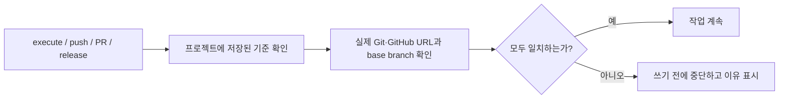

# 한글 검토 패킷: 088-canonical-repository-remote-identity-gate

> 영어 산출물은 canonical입니다. 이 파일은 사람이 PR을 검토하기 위한 한국어 읽기용 패킷입니다.

## 한 줄 결론

모두플로가 **잘못된 GitHub 저장소를 보고 있으면 실행·커밋·푸시·PR·릴리스 전에 멈추게 하는 안전장치**입니다.

## 무엇이 달라지나

| 구분 | 기존 | 개선 후 |
| --- | --- | --- |
| 저장소 확인 | `origin`, `main` 같은 이름을 주로 확인 | 실제 fetch/push URL과 GitHub 저장소까지 확인 |
| 기준 정보 | 실행 시점 Git 상태에서 추정 | 프로젝트에 canonical repo·base branch·상태를 명시적으로 저장 |
| 잘못된 저장소 | 이름이 같으면 통과할 가능성 | URL이 다르면 쓰기 전에 즉시 중단 |
| legacy 저장소 | 상태가 불분명 | `active`, `read_only`, `archived`로 구분 |
| 문제 대응 | 뒤늦게 발견하거나 수동 확인 | 중단 이유와 예상값·실제값을 doctor/status에 표시 |

## 실제 동작

## 사람이 결정할 것

- [ ] 잘못된 저장소를 바라볼 때 자동 진행하지 않고 중단하는 정책에 동의합니다.
- [ ] 모두플로가 remote를 자동 변경하거나 저장소를 삭제하지 않고, 안전하게 멈추기만 하는 범위에 동의합니다.
- [ ] 현재 canonical 기준 `dongwonlee222/moduflow` · `main` · `active`가 맞습니다.

이 세 항목이 맞으면 구현 세부사항을 모두 읽지 않아도 승인할 수 있습니다. 하나라도 다르면 보류하고 수정 요청합니다.

## 바로 볼 것

- GitHub PR: https://github.com/dongwonlee222/moduflow/pull/25
- 대시보드: `memory/dashboard.html#issue-db`
- 이슈 상세: `memory/issue-088-canonical-repository-remote-identity-gate.html`
- 브랜치: `codex/088-canonical-repository-remote-identity-gate`

## 이슈 요약

- 제목: canonical 저장소·remote 신원 확인 게이트
- 목적: 실행 전에 “지금 보고 있는 저장소가 이 프로젝트의 진짜 저장소가 맞는가?”를 확인하고, 다르면 외부 쓰기를 막습니다.

## 사람이 확인할 내용

- 정책 판단은 위의 `사람이 결정할 것` 세 항목만 확인합니다.
- 기술 검토가 필요하면 PR diff에서 identity gate와 테스트 변경을 확인합니다.
- 테스트나 GitHub CI가 실패했거나 변경 범위가 088을 벗어나면 승인하지 않습니다.

## 산출물 체크

| 산출물 | 용도 | 원문 | 한글 보기 |
| --- | --- | --- | --- |
| `spec.md` | 스펙 | `specs/088-canonical-repository-remote-identity-gate/spec.md` | 가능 |
| `plan.md` | 계획 | `specs/088-canonical-repository-remote-identity-gate/plan.md` | 요약/상세 한글 개요로 대체 |
| `tasks.md` | 작업 | `specs/088-canonical-repository-remote-identity-gate/tasks.md` | 요약/상세 한글 개요로 대체 |
| `design.md` | 화면/설계 | 없음 | 요약/상세 한글 개요로 대체 |
| `status.md` | 상태/검증 | `specs/088-canonical-repository-remote-identity-gate/status.md` | 요약/상세 한글 개요로 대체 |
| `review.md` | 리뷰 | `specs/088-canonical-repository-remote-identity-gate/review.md` | 요약/상세 한글 개요로 대체 |
| `pr.md` | PR 핸드오프 | `specs/088-canonical-repository-remote-identity-gate/pr.md` | 요약/상세 한글 개요로 대체 |
| `human-review.ko.md` | 한글 검토 패킷 | `specs/088-canonical-repository-remote-identity-gate/human-review.ko.md` | 가능 |

## 검증 요약

- `python3 -m unittest discover -s tests -p 'test_*.py'` — 528 tests passed.
- Focused identity/link/issue suites — 40 tests passed after the generic-provider capability fix.
- Focused identity/Git handoff suites — 35 tests passed after Git-root and API-fallback fixes.
- `python3 -m unittest tests.test_project_git_handoff -v` — 8 tests passed after the linked-worktree fix.
- `python3 scripts/spec_consistency.py . --issue-id 088-canonical-repository-remote-identity-gate` — 0 errors, 0 warnings.
- `python3 scripts/validate_moduflow.py .` — passed, 137 required files checked.
- `python3 scripts/validate_project_artifacts.py .` — valid, 0 errors.
- `python3 scripts/release_check.py .` — valid; validation, linkage, lint, security, version bump, tests, and doctor checks passed.
- Live `release` identity decision — `allowed: true`, status `match`, project root and provider repository/default branch/archive/fork evidence matched.

## no-issue 선언 (issue 075)

- 선언 없음 — 모든 동작 변경이 이슈에 연결되어 있습니다.

## 리뷰 결과

1. GitHub이 아닌 일반 저장소가 GitHub 쓰기·릴리스 가능으로 표시되던 문제를 수정했습니다.
2. 상위 폴더의 다른 Git 저장소를 현재 프로젝트로 오인할 수 있던 문제를 수정했습니다.
3. 로컬 전용 저장소가 GitHub API 우회 커밋을 선택할 수 있던 문제를 수정했습니다.
4. Git worktree를 로컬 쓰기 불가로 잘못 판단하던 문제를 수정했습니다.

해결되지 않은 치명적·중요 리뷰 항목은 없습니다.

## 보류 조건

- 테스트 또는 release check가 실패했습니다.
- 대시보드/상세 페이지가 생성되지 않았거나 최신 변경을 반영하지 않습니다.
- PR diff가 이슈 범위를 벗어났습니다.
- 사람이 이해할 수 있는 한글 개요 또는 검토 패킷이 없습니다.
- 검토 패킷이 최신 PR diff 또는 로컬 변경 범위를 반영하지 않습니다.
- merge/release 승인자와 승인 근거가 명확하지 않습니다.

## 승인 체크리스트

- [ ] 대시보드 DB에서 이슈 상태와 설명을 확인했습니다.
- [ ] 이슈 상세 페이지의 `한글` 탭을 확인했습니다.
- [ ] PR diff 또는 로컬 변경 범위를 확인했습니다.
- [ ] 검증 결과가 통과했거나 실패 사유를 이해했습니다.
- [ ] release 대상이면 rollback/post-release check와 승인 기록을 확인했습니다.
- [ ] 보류 조건에 해당하지 않습니다.

## 다음 액션

- 승인 가능하면 PR에서 approve 또는 로컬에 승인 기록을 남깁니다.
- 보류하면 `product:review 088-canonical-repository-remote-identity-gate`로 되돌려 수정합니다.
