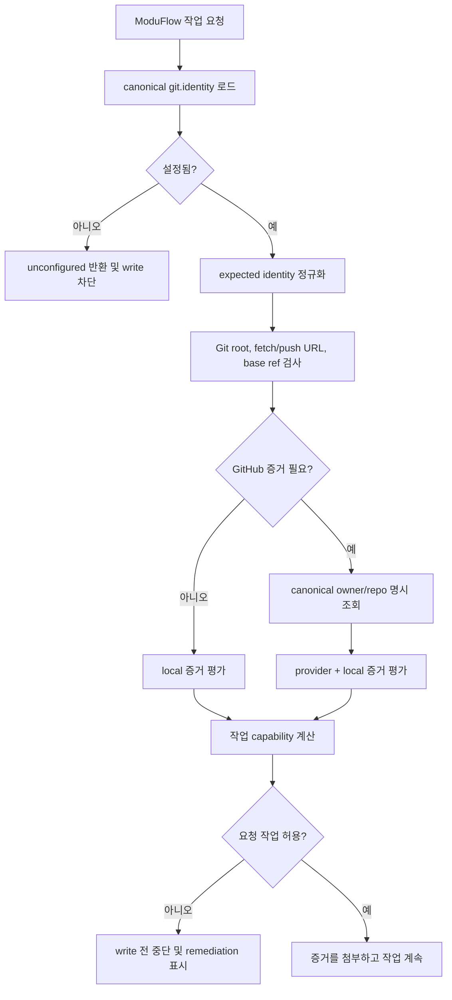

# 스펙: Canonical Repository/Remote Identity Gate

이슈: `088-canonical-repository-remote-identity-gate`
이전: `issues/088-canonical-repository-remote-identity-gate.md`에 기록된 사용자 방향 · 다음: `product:plan 088-canonical-repository-remote-identity-gate`

## 문제

ModuFlow는 현재 폴더가 Git 저장소이고 `origin`이라는 remote가 있다는 사실을 확인할 수 있지만, 그것이 프로젝트가 의도한 저장소라는 사실까지 증명하지는 못한다. 복사된 checkout, 이름만 정상인 잘못된 remote, fork, legacy archive, 잘못 연결된 workspace도 기본 Git 검사를 통과한 뒤 실행 변경, commit, push, PR, release, GitHub issue projection의 대상이 될 수 있다.

프로젝트 소유자에게는 하나의 지속 가능한 canonical identity가 필요하다. ModuFlow는 무엇을 기대했고 무엇을 관찰했는지, 그리고 요청된 작업이 허용되는지를 결정적으로 보여줘야 한다. 읽기 명령은 불일치를 설명하고, 쓰기 명령은 첫 write 이전에 중단해야 한다.

## 목표

1. canonical repository identity, base branch, operating mode, lifecycle을 프로젝트 설정에 기계 판독 가능하게 저장하고 project profile에 사람이 읽을 수 있게 표시한다.
2. credential을 노출하지 않고 일반적인 HTTPS/SSH Git URL을 정규화한다.
3. 하나의 identity 모듈에서 Git root, fetch URL, push URL, base branch, GitHub repository state를 검사한다.
4. doctor/status가 expected identity, observed identity, reason code, operation capability를 포함한 안정적인 결과 스키마를 반환한다.
5. identity 증거가 없거나 충돌하면 execute, commit, push, GitHub issue sync, PR, release를 write 이전에 차단한다.
6. 명시적인 local-only 모드와 `active`, `read_only`, `archived` lifecycle을 지원한다.
7. 기존 프로젝트가 현재 관찰된 remote를 canonical truth로 자동 채택하지 않도록 안전하게 마이그레이션한다.

## 비목표

- Git remote, base branch, repository 설정, archive 상태, branch protection을 자동 변경하지 않는다.
- 폴더명, remote명, 로그인된 GitHub 계정, 네트워크 redirect로 의도한 저장소를 추론하지 않는다.
- v1에서 모든 Git provider API를 지원하지 않는다. GitHub는 provider 검증을 제공하고, 기타 provider는 정규화 URL과 Git ref 검증을 제공한다.
- 기존 repo sync, lifecycle drift, permission, release gate를 대체하지 않는다.
- identity mismatch를 무시하는 범용 `--force` 우회 옵션을 제공하지 않는다.
- `local_only`로 명시된 프로젝트에 remote를 요구하지 않는다.

## 사용자와 시나리오

### 정상 active 저장소

ModuFlow 운영자로서 canonical repository와 checkout의 실제 fetch/push identity를 비교해 정상 프로젝트에서만 작업이 계속되기를 원한다.

### 잘못된 remote

프로젝트 소유자로서 `origin`과 `main`이라는 이름이 정상이어도 다른 owner/repository를 바라보면 execute, commit/push, PR, release, GitHub issue sync가 write 이전에 중단되기를 원한다.

### Fork

기여자로서 fork는 명시된 정책으로만 허용되기를 원한다. parent가 canonical이라는 이유만으로 fork 자체를 통과시키지 않으며, 요청된 작업에 사용하는 fetch/push identity가 설정과 일치해야 한다.

### Legacy 저장소

오래된 프로젝트를 관리하는 운영자로서 저장소를 `read_only` 또는 `archived`로 선언해 status/knowledge 조회는 유지하면서 실행과 모든 write를 막고 싶다.

### Local-only

remote 없이 일하는 사용자로서 `mode: local_only`가 정책상 허용된 로컬 읽기/실행은 지원하되 GitHub PR/release가 가능한 것처럼 표시하지 않기를 원한다.

### Provider 확인 불가

오프라인 사용자로서 local identity와 provider identity 증거가 구분되기를 원한다. 로컬 읽기는 유지하고 archive/default branch 검증이 필요한 GitHub write는 provider 확인 전까지 차단한다.

## 제안 해법

### 1. Canonical 설정

`.moduflow/config.json`을 기계 source of truth로 유지하고 `git.identity`를 추가한다. 기존 `git.remote`는 마이그레이션 동안 읽을 수 있지만 write gate를 통과시키는 근거로는 부족하다.

```json
{
  "git": {
    "required": true,
    "github_sync": "optional",
    "issue_source": "git-files",
    "remote": "https://github.com/dongwonlee222/moduflow",
    "identity": {
      "mode": "remote",
      "provider": "github",
      "canonical_repository": "github.com/dongwonlee222/moduflow",
      "remote_name_hint": "origin",
      "base_branch": "main",
      "lifecycle": "active"
    }
  }
}
```

`remote_name_hint`는 먼저 검사할 remote를 알려줄 뿐 identity가 아니다. `.moduflow/project-profile.md`는 동일한 canonical repository, base branch, mode, lifecycle을 표시하지만 JSON을 덮어쓰지 않는다.

- `mode`: `remote`, `local_only`
- `provider`: `github`, `generic`
- `lifecycle`: `active`, `read_only`, `archived`

`local_only`에서는 canonical repository와 remote hint를 생략하고 base branch와 lifecycle은 명시한다.

### 2. 단일 identity 모듈

`scripts/project_repository_identity.py`를 유일한 config parser, URL normalizer, inspector, policy evaluator로 만든다. 모든 Git/subprocess 접근은 injected runner를 사용한다.

- `load_repository_identity(root)` — canonical 설정 파싱/검증
- `normalize_git_url(value, provider)` — credential 없는 비교용 host/path 반환
- `inspect_repository_identity(root, runner, provider_check)` — expected/observed 증거 수집
- `operation_decision(result, operation)` — write 없이 허용/차단과 reason code 계산

모든 consumer는 설정이나 remote 출력을 다시 파싱하지 않고 versioned result를 사용한다.

### 3. URL 정규화

다음 형식을 같은 GitHub 저장소로 인식한다.

- `https://github.com/Owner/Repo.git`
- `ssh://git@github.com/Owner/Repo.git`
- `git@github.com:Owner/Repo.git`
- credential이 포함된 HTTPS 입력은 사용자 정보를 결과와 로그에서 제거한다.

규칙은 다음과 같다.

1. URL과 SCP-style SSH를 shell 호출 없이 파싱한다.
2. host를 소문자로 만들고 기본 port를 제거한다.
3. 앞 slash 하나, 뒤 slash, 마지막 `.git` 하나를 제거한다.
4. GitHub는 두 path component를 소문자 `owner/repo`로 비교한다.
5. generic provider는 path 대소문자를 유지해 `host/path`를 정확히 비교한다.
6. malformed URL, GitHub의 추가 path, remote 모드의 local path, 정규화 불가능 값을 거절한다.
7. password/token/user information을 결과나 로그에 반환하지 않는다.

### 4. 증거 수집

각 gate는 다음을 새로 수집한다.

- `git rev-parse --show-toplevel`의 Git root
- `git remote get-url --all REMOTE_HINT`의 fetch URL 전체
- `git remote get-url --push --all REMOTE_HINT`의 push URL 전체
- 보고용 current branch
- local/remote ref의 base branch 존재 여부
- provider 검증이 필요한 경우 명시적 `gh repo view OWNER/REPO`로 GitHub default branch, archive, fork, `nameWithOwner`
- issue, spec, plan, status, review, PR, release의 저장소 URL과 canonical/mirror/reference/mismatch 분류

feature branch는 정상이다. current branch가 base branch와 같을 필요는 없다. 작업이 사용하는 모든 fetch/push identity는 canonical identity와 일치해야 한다. fetch는 맞고 push만 다른 경우 commit/push/PR/release에 대해 hard mismatch다.

### 5. 결과 스키마

모든 검사는 `moduflow.repository-identity.v1`을 반환한다.

```json
{
  "schema": "moduflow.repository-identity.v1",
  "status": "match",
  "expected": {
    "mode": "remote",
    "repository": "github.com/dongwonlee222/moduflow",
    "base_branch": "main",
    "lifecycle": "active"
  },
  "observed": {
    "git_root": "/path/to/moduflow",
    "fetch_repositories": ["github.com/dongwonlee222/moduflow"],
    "push_repositories": ["github.com/dongwonlee222/moduflow"],
    "provider_repository": "github.com/dongwonlee222/moduflow",
    "provider_default_branch": "main",
    "provider_archived": false,
    "artifact_link_mismatches": []
  },
  "capabilities": {
    "read": true,
    "execute": true,
    "commit": true,
    "push": true,
    "github_write": true,
    "release": true
  },
  "reasons": []
}
```

`status`는 `match`, `mismatch`, `unconfigured`, `unverifiable`, `local_only`, `read_only`, `archived` 중 하나다. 이유는 `canonical_identity_missing`, `fetch_remote_mismatch`, `push_remote_mismatch`, `base_branch_missing`, `provider_repository_mismatch`, `provider_unavailable`, `repository_read_only`, `repository_archived` 같은 안정적 code와 설명을 함께 가진다.

### 6. 작업 정책

| 작업 | 필요한 증거 | 실패 시 동작 |
| --- | --- | --- |
| `product:doctor`, `product:status` | config + local Git, 가능하면 provider | expected/observed와 remediation 반환, write 없음 |
| artifact validation | canonical identity + artifact URL + link role | mirror/reference 누락 경고, write handoff가 non-canonical repo면 오류 |
| `product:execute` | config, Git root, fetch identity 일치, base ref, `active` | worker dispatch/file mutation 전 중단 |
| commit handoff | remote 모드: execute 조건 + push identity 일치, local-only: 명시적 local commit 정책 | stage/commit 전 중단 |
| push handoff | fetch/push 일치, base ref, `active` | push 전 중단 |
| GitHub issue sync | local match + GitHub repository/default/archive 검증 | API write 전 중단 |
| `product:pr` | full local/GitHub match, base branch, `active` | PR 생성/갱신 전 중단 |
| `product:release` | PR 증거 + active repository | tag/release/publish 전 중단 |

`read_only`와 `archived`는 읽기만 허용한다. `local_only`는 정책상 로컬 실행과 commit을 허용할 수 있지만 push, GitHub write, PR, release capability는 항상 false다.

gate는 이전 doctor 결과를 cache해 신뢰하지 않는다. write boundary 직전에 실행하고 그 증거를 handoff artifact에 포함한다.

### 7. 데이터 흐름



### 8. 마이그레이션과 복구

- 새 프로젝트는 사용자가 canonical repository를 제공하거나 확인했을 때 `product:start`/`product:profile`이 identity를 기록한다.
- `git.remote`만 있는 기존 프로젝트는 doctor/status에서 `unconfigured`와 명시적 확인 명령을 받는다.
- 관찰된 remote를 사용자 확인 없이 canonical config에 복사하지 않는다.
- 기존 GitHub 링크를 감사하고 canonical/mirror/reference 분류안을 제시하지만 URL을 자동 수정하지 않는다.
- remote-mode write는 identity 확인 전 `canonical_identity_missing`으로 차단한다.
- `product:profile`은 write 전 normalized identity, base branch, lifecycle의 proposed diff를 보여준다.
- archive/read-only 변경은 명시적 사용자 지시가 필요한 profile 변경이다. ModuFlow가 repository를 자동 unarchive하지 않는다.

### 9. 오류 처리와 출력

- Git/CLI 오류는 명시적 reason code로 반환하며 gate path에서 예외를 삼키지 않는다.
- doctor/status는 lifecycle, expected repo/base, observed fetch/push/provider, 허용 capability, 다음 조치를 compact panel로 표시한다.
- write 명령은 거절된 operation과 mismatch를 credential 없이 표시한다.
- 여러 remote/push URL을 silent truncation 없이 보고한다.
- provider unavailable과 repository mismatch를 구분한다. provider 확인이 필요한 GitHub API write는 검증 불가 시 차단한다.

## 검토한 대안

### A. `origin`과 `origin/main` 신뢰

거절. remote/branch 이름은 로컬 alias일 뿐 owner/repository identity가 아니다.

### B. GitHub CLI 또는 로그인 계정에서 동적 추론

거절. 선택 계정, default repository, fork parent, current directory가 바뀔 수 있다. 관찰 상태를 의도 상태로 바꾸는 오류가 된다.

### C. `project-profile.md`에만 저장

거절. 사람 검토에는 좋지만 파싱이 모호하고 consumer별 중복 구현을 만든다. machine policy는 config에 두고 Markdown은 projection으로 사용한다.

### D. `git push` wrapper만 추가

거절. unsafe write는 execute, staging, commit, issue projection, PR update, tag, release에서 더 일찍 시작된다.

### E. 권장안: canonical config + 단일 pre-write evaluator

선택. 의도를 명시하고 single-parser 원칙을 지키며 deterministic test가 가능하고 작업별 필요한 증거만 요청할 수 있다.

## 수용 기준

1. `.moduflow/config.json`이 identity 필드를 지원하고 `product:profile`이 unrelated content를 보존하며 proposed diff 후 쓸 수 있다.
2. human profile이 config에서 canonical repository, base branch, mode, lifecycle을 표시한다.
3. GitHub HTTPS, SSH URL, SCP-style SSH가 같은 owner/repo로 정규화되고 credential이 제거된다.
4. generic provider는 path case를 보존하고 malformed/ambiguous remote를 거절한다.
5. inspector가 모든 fetch/push identity, base ref, provider evidence를 versioned schema로 반환한다.
6. 이름이 `origin`이어도 다른 repo면 `fetch_remote_mismatch`가 되고 execute/write를 할 수 없다.
7. fetch는 같고 push가 다르면 commit/push/PR/release 전에 `push_remote_mismatch`가 된다.
8. canonical identity가 없으면 `unconfigured`이며 doctor/status만 읽을 수 있고 remote write는 중단된다.
9. `read_only`/`archived`는 inspection만 허용하고 실행 및 모든 write를 막는다.
10. `local_only`는 remote를 요구하지 않고 push/GitHub write/PR/release capability를 제공하지 않는다.
11. GitHub issue/PR/release는 canonical owner/repo를 명시적으로 사용하고 provider repo/default/archive가 충돌하거나 검증 불가하면 차단한다.
12. base branch가 존재하고 identity가 맞으면 feature branch는 정상이다.
13. 모든 gate consumer가 shared module을 사용하고 중복 parser를 만들지 않는다.
14. injected runner 테스트가 URL 일치, wrong repo, wrong push URL, missing remote/base, fork, provider unavailable, credential redaction, local-only, read-only, archived를 포함한다.
15. ModuFlow validation, project artifact validation, release check가 통과한다.
16. doctor/status가 명시적 mirror/reference 역할 없이 non-canonical repo를 가리키는 issue, plan, review, PR, release 링크를 식별한다.
17. GitHub write는 stale artifact URL을 사용하지 않고 explicit canonical owner/repo만 사용한다.

## 위험과 열린 질문

- provider마다 repository path 대소문자 정책이 다르다. v1은 GitHub owner/repo를 소문자로 비교하고 generic path는 case를 보존한다.
- 여러 push URL이 가능한 Git 설정이 있다. v1은 실제 사용 대상을 추측하지 않고 후보 중 하나라도 불일치하면 차단한다.
- provider API가 오프라인일 수 있다. local read는 유지하되 provider-dependent write는 차단한다.
- repository transfer/rename은 redirect를 자동 수용하지 않고 명시적으로 확인하는 profile migration으로 처리한다.
- worktree는 shared repository root를 가리킨다. linked worktree가 accidental parent workspace로 오판되지 않도록 테스트한다.
