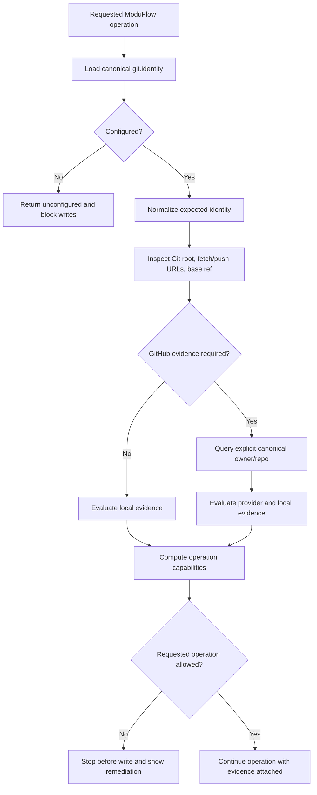

# Spec: Canonical Repository/Remote Identity Gate

Issue: `088-canonical-repository-remote-identity-gate`
Prev: user direction recorded in `issues/088-canonical-repository-remote-identity-gate.md` · Next: `product:plan 088-canonical-repository-remote-identity-gate`

## Problem

ModuFlow can confirm that a directory is a Git repository and that a remote named `origin` exists, but those facts do not prove that the repository is the project’s intended repository. A copied checkout, renamed remote, fork, legacy archive, or incorrectly configured workspace can still pass basic Git checks and then receive local execution changes, commits, pushes, pull requests, releases, or GitHub issue projections.

The project owner needs one durable canonical identity and deterministic evidence showing what ModuFlow expected, what it observed, and whether a requested operation is allowed. Read-only commands should explain mismatches; write commands must stop before the first write.

## Goals

1. Store a machine-readable canonical repository identity, base branch, operating mode, and lifecycle state in the project configuration, with a human-readable projection in the project profile.
2. Normalize common HTTPS and SSH Git URL forms without exposing embedded credentials.
3. Inspect the actual Git root, fetch URL, push URL, base branch, and GitHub repository state through one shared identity module.
4. Give doctor/status a stable result schema containing expected identity, observed identity, reason codes, and operation capabilities.
5. Block execute, commit, push, GitHub issue sync, PR, and release workflows before writes when identity evidence is missing or contradictory.
6. Preserve explicit local-only operation and explicit `active`, `read_only`, and `archived` repository lifecycle states.
7. Migrate existing projects without silently adopting the currently observed remote as canonical truth.

## Non-Goals

- Automatically changing Git remotes, base branches, repository settings, archive state, or branch protection.
- Discovering the intended repository from folder names, remote names, authenticated GitHub accounts, or network redirects.
- Supporting every provider-specific repository API in v1; GitHub receives provider verification, while other Git servers receive normalized URL and Git-ref verification.
- Replacing existing repo-sync freshness checks, lifecycle drift checks, permission checks, or release gates.
- Allowing a generic `--force` bypass for an identity mismatch.
- Requiring a remote for a project explicitly configured as `local_only`.

## Users & Scenarios

### Main scenario: correct active repository

As a ModuFlow operator, I want doctor/status and write workflows to compare the configured canonical repository with the checkout’s actual fetch/push identities, so that normal work continues only in the intended repository.

### Wrong remote scenario

As a project owner, I want `product:execute`, commit/push handoff, PR, release, and GitHub issue sync to stop before writes when `origin` points to a different owner/repository, even if the remote and branch names look normal.

### Fork scenario

As a contributor, I want a fork to be treated according to explicit policy. A fork is not accepted merely because its parent is canonical; its fetch/push identities must match the configured repository for the requested operation.

### Legacy repository scenario

As an operator maintaining old projects, I want a repository to be declared `read_only` or `archived`, so that status and knowledge retrieval still work while execution, commits, pushes, PRs, releases, and issue projection are blocked.

### Local-only scenario

As a user working without a remote, I want `mode: local_only` to allow local read and execution capabilities defined by policy without pretending that GitHub PR/release features are available.

### Unverifiable provider scenario

As an offline user, I want local identity evidence separated from provider evidence. Local read commands remain useful; GitHub operations that require archive/default-branch verification stay blocked until provider evidence is available.

## Proposed Solution

### 1. Canonical configuration

`.moduflow/config.json` remains the machine source of truth. Add an optional `git.identity` object; after migration it is required for repository-writing workflows.

```json
{
  "git": {
    "required": true,
    "github_sync": "optional",
    "issue_source": "git-files",
    "remote": "https://github.com/dongwonlee222/moduflow",
    "identity": {
      "mode": "remote",
      "provider": "github",
      "canonical_repository": "github.com/dongwonlee222/moduflow",
      "remote_name_hint": "origin",
      "base_branch": "main",
      "lifecycle": "active"
    }
  }
}
```

`git.remote` remains readable during migration but is not sufficient for a write gate. `remote_name_hint` tells ModuFlow which remote to inspect first; it is never treated as identity. `.moduflow/project-profile.md` displays the same canonical repository, base branch, mode, and lifecycle for human review but does not override JSON.

Allowed values:

- `mode`: `remote`, `local_only`
- `provider`: `github`, `generic`
- `lifecycle`: `active`, `read_only`, `archived`

For `mode: local_only`, `canonical_repository` and `remote_name_hint` are omitted, while `base_branch` and lifecycle remain explicit.

### 2. One identity module

Create `scripts/project_repository_identity.py` as the only parser, normalizer, inspector, and policy evaluator. All Git/subprocess access uses an injected runner.

Core interfaces:

- `load_repository_identity(root)` — parse and validate canonical configuration.
- `normalize_git_url(value, provider)` — return a credential-free comparable host/path identity.
- `inspect_repository_identity(root, runner, provider_check)` — collect expected and observed evidence.
- `operation_decision(result, operation)` — return allowed/blocked plus reason codes without performing the write.

Consumers do not reparse configuration or remote output. They use this module’s versioned result.

### 3. URL normalization

The normalizer accepts:

- `https://github.com/Owner/Repo.git`
- `ssh://git@github.com/Owner/Repo.git`
- `git@github.com:Owner/Repo.git`
- credential-bearing HTTPS inputs, with user information removed from results and logs

Normalization rules:

1. Parse URL and SCP-style SSH forms without invoking the shell.
2. Lowercase the host and remove default ports.
3. Remove one leading slash, trailing slashes, and one terminal `.git` suffix.
4. For GitHub, compare the two path components as lowercase `owner/repo`.
5. For `generic`, preserve path case and compare normalized `host/path` exactly.
6. Reject malformed URLs, unexpected extra path components for GitHub, local filesystem remotes in `remote` mode, and values that cannot be normalized.
7. Never return or log passwords, tokens, or URL user information.

### 4. Evidence collection

The inspector gathers fresh evidence for every gated operation:

- current Git root from `git rev-parse --show-toplevel`
- configured remote fetch URLs from `git remote get-url --all REMOTE_HINT`
- configured remote push URLs from `git remote get-url --push --all REMOTE_HINT`
- current branch for reporting only
- base branch existence from local/remote refs
- GitHub default branch, archive state, fork state, and canonical `nameWithOwner` through an explicit `gh repo view OWNER/REPO` call when provider verification is required
- repository-bearing URLs found in issue, spec, plan, status, review, PR, and release artifacts, classified as canonical, mirror, reference, or mismatch

Feature branches are valid; the current branch does not need to equal the base branch. Every observed fetch and push identity used by the operation must match the canonical identity. A matching fetch URL with a different push URL is a hard mismatch for commit/push/PR/release flows.

### 5. Result schema

Every check returns `moduflow.repository-identity.v1`:

```json
{
  "schema": "moduflow.repository-identity.v1",
  "status": "match",
  "expected": {
    "mode": "remote",
    "repository": "github.com/dongwonlee222/moduflow",
    "base_branch": "main",
    "lifecycle": "active"
  },
  "observed": {
    "git_root": "/path/to/moduflow",
    "fetch_repositories": ["github.com/dongwonlee222/moduflow"],
    "push_repositories": ["github.com/dongwonlee222/moduflow"],
    "provider_repository": "github.com/dongwonlee222/moduflow",
    "provider_default_branch": "main",
    "provider_archived": false,
    "artifact_link_mismatches": []
  },
  "capabilities": {
    "read": true,
    "execute": true,
    "commit": true,
    "push": true,
    "github_write": true,
    "release": true
  },
  "reasons": []
}
```

`status` is one of `match`, `mismatch`, `unconfigured`, `unverifiable`, `local_only`, `read_only`, or `archived`. Reasons are stable codes plus human text, such as `canonical_identity_missing`, `fetch_remote_mismatch`, `push_remote_mismatch`, `base_branch_missing`, `provider_repository_mismatch`, `provider_unavailable`, `repository_read_only`, and `repository_archived`.

### 6. Operation policy

| Operation | Required evidence | Behavior on failure |
| --- | --- | --- |
| `product:doctor`, `product:status` | Config + local Git; provider check when available | Return complete expected/observed result and remediation; no writes |
| artifact validation | Canonical identity plus repository-bearing artifact URLs and declared link roles | Warn on mirror/reference omissions; error when a write handoff resolves to a non-canonical repository |
| `product:execute` | Config, Git root, matching fetch identity, base ref, lifecycle `active` | Hard stop before worker dispatch or file mutation |
| commit handoff | Remote mode: same as execute plus matching push identity; local-only mode: explicit local commit policy | Hard stop before staging/commit |
| push handoff | Matching fetch/push identity, base ref, lifecycle `active` | Hard stop before push |
| GitHub issue sync | Full local match plus verified GitHub `nameWithOwner`, default branch, not archived | Hard stop before label/issue/API write |
| `product:pr` | Full local and GitHub match, matching base branch, lifecycle `active` | Hard stop before PR create/update |
| `product:release` | Full PR evidence plus verified active repository | Hard stop before tag, release, or publish |

`read_only` and `archived` allow read-only inspection. `local_only` allows doctor/status and local execution only when local policy permits; commit capability may exist, but push, GitHub write, PR, and release capabilities are false.

No operation may rely on a previously cached doctor result. The gate executes immediately before the write boundary and returns its evidence with the handoff artifact.

### 7. Data flow



### 8. Migration and remediation

- New projects write `git.identity` during `product:start`/`product:profile` when the user supplies or confirms the canonical repository.
- Existing projects with only `git.remote` receive `unconfigured` on doctor/status and a command to inspect the observed remote and explicitly confirm it.
- Migration never copies the observed remote into canonical configuration without an explicit `product:profile` write confirmed by the user.
- Migration audits existing GitHub links and proposes canonical/mirror/reference classifications; it never rewrites URLs silently.
- Existing write commands block with `canonical_identity_missing` until remote-mode identity is confirmed.
- `product:profile` can render a proposed diff showing normalized identity, base branch, and lifecycle before writing.
- Archive/read-only remediation is a profile change requiring explicit human direction; ModuFlow does not unarchive a repository.

### 9. Error handling and output

- Git/CLI errors are returned as explicit reason codes; gate paths never swallow exceptions.
- Doctor/status show a compact identity panel: lifecycle, expected repository/base, observed fetch/push/provider values, allowed capabilities, and exact next action.
- Write commands show the denied operation and mismatch without printing credentials.
- Multiple remotes or multiple push URLs are reported without silent truncation.
- Provider unavailability is distinct from repository mismatch. GitHub API writes remain blocked when provider verification is required and unavailable.

## Alternatives Considered

### A. Trust `origin` and `origin/main`

Rejected. Remote and branch names are local aliases; they carry no owner/repository identity and are exactly the failure mode this issue addresses.

### B. Infer identity dynamically from GitHub CLI or the authenticated account

Rejected. The selected account, default repository, fork parent, or current directory can change. Dynamic inference would turn observed state into intended state and could validate the wrong repository.

### C. Store canonical identity only in human-readable `project-profile.md`

Rejected. Markdown is useful for review but creates ambiguous parsing and duplicates behavior across consumers. Machine policy belongs in `.moduflow/config.json`; the Markdown profile is a projection.

### D. Require a wrapper only around `git push`

Rejected. Unsafe writes begin earlier: execution, staging, commits, GitHub issue projection, PR updates, tagging, and releases can all target or mutate the wrong project.

### E. Recommended: canonical config plus one shared pre-write evaluator

Selected. It keeps intent explicit, centralizes parsing under the single-parser constitution rule, supports deterministic tests, and lets each operation request only the evidence it needs.

## Acceptance Criteria

1. `.moduflow/config.json` supports the specified identity fields and `product:profile` can propose and write them without overwriting unrelated profile content.
2. The human project profile shows canonical repository, base branch, mode, and lifecycle derived from configuration.
3. URL normalization treats GitHub HTTPS, SSH URL, and SCP-style SSH forms for the same owner/repo as equal and redacts credentials.
4. Generic providers preserve case-sensitive paths and reject malformed or ambiguous remotes.
5. The inspector reports all fetch and push identities, base-ref evidence, and provider evidence through `moduflow.repository-identity.v1`.
6. A remote called `origin` that points to a different repository produces `fetch_remote_mismatch` and cannot execute or write.
7. A matching fetch URL with a different push URL produces `push_remote_mismatch` before commit/push/PR/release handoff.
8. Missing canonical identity produces `unconfigured`; doctor/status remain readable, while remote-mode write operations stop.
9. `read_only` and `archived` repositories allow inspection but block execution and all write capabilities.
10. `local_only` projects do not require a remote and never advertise push, GitHub write, PR, or release capability.
11. GitHub issue, PR, and release operations use the explicit canonical owner/repo and block when provider repository/default-branch/archive evidence contradicts configuration or is unavailable.
12. Current feature branches remain valid when the configured base branch exists and identity matches.
13. Every gated consumer uses the shared identity module; no duplicate URL/config parser is introduced.
14. Focused tests cover matching URLs, wrong repo, wrong push URL, missing remote, missing base branch, fork, provider unavailable, credential redaction, local-only, read-only, and archived cases using injected runners.
15. `python3 scripts/validate_moduflow.py .`, `python3 scripts/validate_project_artifacts.py .`, and `python3 scripts/release_check.py .` pass.
16. Doctor/status identify stale issue, plan, review, PR, and release links that target a non-canonical repository without an explicit mirror/reference role.
17. GitHub write workflows ignore or block stale artifact URLs and always resolve the explicit canonical owner/repo.

## Risks & Open Questions

- Some Git providers treat repository path case differently. The v1 policy is explicit: GitHub compares lowercase owner/repo; generic providers preserve path case. Provider-specific extensions can be added later.
- Multiple push URLs are uncommon but valid Git configuration. V1 blocks if any candidate used by the operation does not match rather than guessing which one will be selected.
- Provider APIs can be unavailable offline. The spec deliberately keeps read-only/local evidence useful while blocking provider-dependent writes.
- A repository can be transferred or renamed. This is treated as a canonical profile migration requiring explicit confirmation, not an automatically accepted redirect.
- Worktree Git roots resolve to the shared repository root. Tests must cover linked worktrees so a legitimate issue worktree is not mistaken for an accidental parent workspace.
