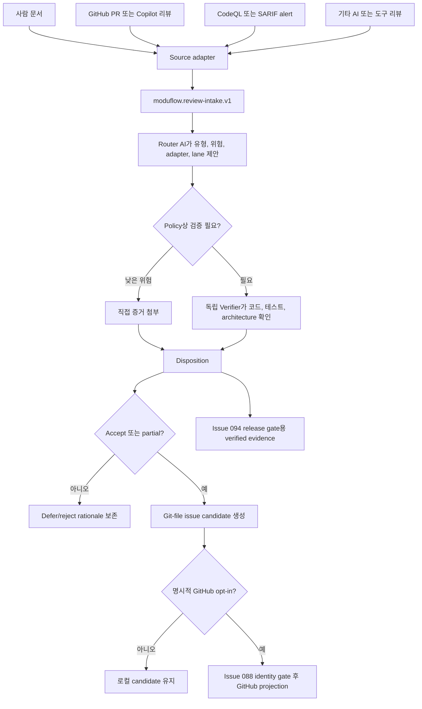

# 스펙: 검증된 코드리뷰 접수와 개선 작업 라우팅

이슈: `089-verified-code-review-intake-and-remediation-routing`
이전: `issues/089-verified-code-review-intake-and-remediation-routing.md`에 기록된 사용자 방향과 벤치마크 · 다음: 사용자 스펙 검토 후 `product:plan 089-verified-code-review-intake-and-remediation-routing`

## 문제

ModuFlow에는 구현 리뷰 요청과 Git-native 이슈 생성 기능이 있지만, 사람·AI·GitHub PR·보안 도구에서 들어오는 리뷰 의견을 검증해서 접수하는 지속 가능한 경계가 없다. 리뷰 문장은 관찰 사실, 권장 수정, 원인 가설, 근거 없는 위험 주장, 아키텍처 선호를 섞을 수 있다. 그대로 구현하면 위험하고, 채팅이나 PR 댓글에만 두면 출처와 개선 이력이 사라진다.

해법은 ModuFlow의 어댑터 중심 구조도 지켜야 한다. GitHub 리뷰 처리, Superpowers 리뷰 수용 원칙, CodeQL/SARIF finding identity, Spec Kit 계획 기능은 교체 가능한 upstream으로 유지한다. ModuFlow는 이 결과를 공통 형식으로 바꾸고, 증거를 검증하고, 위험을 분류하고, Git 파일 이슈 후보로 만드는 안정적인 계약만 소유한다. 설치된 어댑터는 관련 이벤트나 정책 gate가 있을 때만 실행해 일반 작업을 무겁게 만들지 않는다.

## 목표

1. 사람, AI, GitHub, 보안 도구 의견을 어떤 reviewer도 증거 그 자체로 취급하지 않는 하나의 versioned review packet으로 정규화한다.
2. 외부 리뷰는 기본적으로 `reference + SHA-256`으로 보관하며 작성자, 대상 저장소/commit, retention, source integrity를 보존한다.
3. finding마다 관찰, 권장안, 원인 가설, 검증 증거, disposition, remediation route를 분리한다.
4. 코드리뷰·PR thread·보안 스캔·계획 엔진을 새로 만들지 않고 교체 가능한 adapter로 재사용한다.
5. Router AI가 분류하고 필요한 경우 독립 Verifier가 증거를 확인하며, 안전 결정은 deterministic policy가 담당한다.
6. trigger, 변경 경로, finding 유형, release 단계에 필요한 adapter만 실행한다.
7. GitHub write 전에 priority, dependency, CognitiveDemand, finding trace가 있는 로컬 Git 이슈 후보를 만든다.
8. Issue 094가 추후 배포/보안 gate로 소비할 verified evidence를 제공하되, 089에서 최종 gate는 구현하지 않는다.

## 비목표

- 모든 ModuFlow 명령에서 모든 리뷰·보안 플러그인을 실행하지 않는다.
- GitHub PR review, Copilot review, CodeQL, SARIF, Superpowers, Spec Kit, ruleset을 대체하지 않는다.
- AI confidence만으로 release 승인, high-risk finding 거절, policy override를 허용하지 않는다.
- 수용된 권장안을 자동 구현하지 않는다.
- GitHub review thread에 자동 답변하거나 자동 resolve하지 않는다.
- 명시적 opt-in 없이 GitHub Issue를 자동 생성하지 않는다.
- reference와 hash로 충분한 외부/민감 리뷰 원문을 자동 복사하지 않는다.
- 최종 배포 전 보안·품질 gate는 구현하지 않는다. 이는 Issue 094 범위다.

## 사용자 시나리오

### 외부 사람이 준 리뷰 문서

다른 사람이 준 Markdown 또는 문서 리뷰를 받으면 작성자, 원본 reference, SHA-256, 대상 저장소/commit, stable finding ID를 기록한다. 원문은 자동 복사하지 않으며 실제 프로젝트에서 검증한 뒤 개선 작업을 제안한다.

### GitHub PR 또는 Copilot 리뷰

GitHub review adapter가 unresolved thread, 파일/라인, outdated/resolved 상태, reviewer provenance를 읽는다. AI 댓글은 승인으로 취급하지 않는다. actionable feedback을 묶어 로컬 disposition packet을 만들며, 사용자 요청 전에는 reply/resolve하지 않는다.

### 보안 도구 finding

CodeQL 또는 SARIF 도구 결과는 rule identity, severity, fingerprint, tool version, location, alert state, dismissal history를 보존한다. 확인된 high-risk finding은 `security`로 보내며 AI confidence만으로 reject하거나 안전하다고 판단하지 않는다.

### 낮은 위험의 일반 의견

사용하지 않는 import 제거처럼 테스트로 행동 변화가 없음을 확인할 수 있으면 Router AI가 low risk로 분류하고 Spec Kit이나 deep security scan 없이 작은 로컬 후보를 만들 수 있다.

### 아키텍처 충돌

리뷰 권장안이 기록된 architecture decision 또는 import boundary와 충돌하면 관찰은 `partial_accept`하고 remedy는 defer/reject할 수 있다. 충돌과 증거를 함께 보존한다.

### 근거 없는 “무위험” 주장

사람 또는 AI가 중복이나 refactor를 risk-free라고 해도 관련 테스트와 import-boundary 증거 전에는 `unverified`로 둔다.

## 제안 해법

### 1. Adapter-first 구조

| 어댑터 | 재사용 upstream | ModuFlow 역할 |
| --- | --- | --- |
| `manual-review-document` | 파일, 붙여넣은 리뷰, 문서 링크 | source reference/hash, provenance, finding 정규화 |
| `github-review` | Codex GitHub plugin과 thread-aware `gh` read | PR thread/comment를 finding으로 변환; 승인 없는 write 금지 |
| `superpowers-review` | `receiving-code-review` | verify-before-implement를 evidence/state 규칙으로 매핑 |
| `security-review` | GitHub CodeQL/SARIF | rule/fingerprint/severity/location/dismissal 매핑 |
| `spec-kit` | 기존 spec/plan/task 구조 | accepted candidate가 설계/계획을 요구할 때만 실행 |

source/version은 `vendor.lock.json`, mapping은 `adapters/`, 회사별 retention·approval·risk·release 정책은 `overlays/`에 둔다. upstream 파일은 ModuFlow 동작을 위해 직접 수정하지 않는다.

Renovate Dependency Dashboard는 runtime dependency가 아니라 candidate queue와 explicit promotion을 참고하는 benchmark다.

### 2. 하나의 canonical review packet

기계 source of truth는 `moduflow.review-intake.v1` JSON이다. 사람이 보는 Korean-first Markdown은 projection이며 별도 source of truth가 아니다.

packet은 다음을 가진다.

- `review_id`
- `source`: `human|ai|tool`, reviewer/provider, 받은 날짜, retention, locator, SHA-256, model/tool/policy version
- `target`: canonical repository, full commit SHA, base branch
- `trigger`: manual intake, PR review, security alert, release preflight, scheduled scan과 reason code
- `adapter_run`: 호출/생략 adapter와 이유
- `findings`: stable identity, 내용, 검증, disposition, route

source reviewer와 verifier는 서로 다른 identity/role로 기록한다.

retention은 다음과 같다.

- `copy` — 허용된 자료를 packet 또는 artifact로 복사한다.
- `reference` — locator와 SHA-256이 canonical이다. 외부 리뷰의 기본값이다.
- `hash_only` — integrity와 비민감 설명만 남긴다.

### 3. Finding identity와 내용 분리

각 finding은 `F-001` 같은 packet-local ID와 cross-run fingerprint를 가진다. fingerprint는 provider/rule, normalized repository/path, 가능한 semantic anchor를 사용한다. target commit은 provenance지만 유일한 finding identity는 아니므로 line 이동과 re-review 후에도 같은 문제를 추적할 수 있다.

finding은 다음 필드를 분리한다.

- `observation`: 실제 관찰 내용
- `recommendation`: reviewer가 제안한 수정
- `root_cause_hypothesis`: 아직 검증이 필요한 설명
- `locations`: normalized path와 anchor
- `verification`: state, verifier, 파일, 재현, 테스트, architecture/import-boundary 증거, contradiction, timestamp
- `risk`: severity, release impact, no-risk claim 검증 여부
- `disposition`: 최종 결정과 rationale
- `route`: lane, candidate state, CognitiveDemand, dependency, issue reference

exact fingerprint만 자동 deduplicate한다. semantic overlap은 merge/link 후보로만 보여주고 자동 병합하지 않는다.

### 4. 검증과 disposition lifecycle

finding은 `pending_verification`으로 시작한다. verification state는 `unverified`, `confirmed`, `contradicted`, `inconclusive`다. finalized packet은 finding마다 다음 중 하나를 가져야 한다.

- `accept`: observation과 remedy가 현재 코드베이스에 적합하다.
- `partial_accept`: 일부 observation/scope는 맞지만 remedy 또는 원인 주장이 부적합하거나 불완전하다.
- `defer`: 타당하거나 가능성이 있지만 owner/조건/review date를 기록하고 미룬다.
- `reject`: evidence가 반박하거나 요구사항·architecture·compatibility·YAGNI와 충돌한다.

모든 disposition은 rationale과 evidence가 필요하다. `accept`, `partial_accept`는 검증 증거가 필요하다. high-risk/security finding의 `reject`는 deterministic contradiction 또는 사람 승인이 필요하다. release-blocking finding을 `defer`해도 release가 안전해지는 것은 아니다.

### 5. Router AI, Verifier, Policy Gate

#### Router AI

- actionable/informational/duplicate/outdated/ambiguous 분류
- 영향 component/file 제안
- security/pre-release/post-release-refactor lane 제안
- 검증 방법, priority, dependency, CognitiveDemand 제안
- 필요한 adapter 추천
- 확신할 수 없을 때 `inconclusive` 반환

#### Verifier

실제 코드, 테스트, architecture decision, import boundary, supported platform, current usage를 확인한다. medium/high-risk 또는 이견이 있는 finding은 source reviewer 및 Router와 논리적으로 분리된 Verifier가 확인한다. 다른 AI run/model, 도구, 사람이 될 수 있다.

#### 결정 규칙

- 인증, 권한, 결제, 개인정보, 비밀정보, upload, deployment, security workflow 변경은 security path 필수
- confirmed `critical/high` security finding은 release-blocking evidence
- target commit mismatch는 re-verification
- 테스트/boundary evidence가 없으면 no-risk는 unverified
- 리뷰 간 충돌이나 architecture conflict는 explicit escalation
- high-risk reject, release bypass, GitHub write는 사람 승인과 사유 필요

policy는 rule ID를 기록해 AI 문장이 바뀌어도 같은 설명을 제공한다.

### 6. 위험 기반 lazy invocation

| 단계 | Trigger | 동작 |
| --- | --- | --- |
| L0 — 일반 | 리뷰/보안 이벤트 없는 일반 로컬 작업 | canonical repo와 기존 fast check만; review plugin 미호출 |
| L1 — 조건부 | 리뷰 접수, PR thread, dependency/security-sensitive 변경 | 해당 review/security adapter만 호출 |
| L2 — 배포 증거 | pre-release | 기존 packet/result를 읽어 missing/blocking evidence 보고; 최종 차단은 094 |
| L3 — 정기 deep scan | scheduled 또는 명시적 요청 | extended CodeQL/SARIF/Scorecard 결과를 비동기로 접수 |

`product:execute`는 모든 review adapter를 기본 로드하지 않는다. 수동 진입점은 `product:review --intake`다. 보안 도구는 native 환경에서 실행하고 ModuFlow는 전체 로그 대신 결과/alert metadata를 접수한다.

GitHub required check는 workflow-level path filter 때문에 Pending으로 남지 않게 해야 한다. Issue 094는 항상 결과를 보고하는 aggregate gate 안에서 job만 조건부 실행하는 방향을 사용한다.

### 7. 개선 작업과 이슈 후보

`accept`와 `partial_accept`는 다음으로 route한다.

- `security`: 보안·개인정보·credential 또는 policy sensitive path
- `pre_release`: 의도한 release 전에 필요한 correctness, regression, accessibility, operability
- `post_release_refactor`: release를 막지 않는 가치 있는 cleanup

Git 파일 후보에는 finding ID, packet link, title/problem/scope/acceptance evidence, priority, dependency, CognitiveDemand와 이유, overlap suggestion, lane/release impact, next command가 포함된다.

candidate state는 `candidate`, `linked_existing`, `approved`, `published`다. finding 하나가 여러 후보로 분리될 수 있고 여러 finding이 한 후보로 묶일 수 있다. trace matrix가 모든 mapping을 보존한다. GitHub 게시 전에는 Issue 088 canonical repository gate를 통과한다.

### 8. 명령과 artifact

v1 진입점은 `product:review --intake <source>`다. post-implementation verdict와 섞지 않고 전용 intake module을 사용한다.

- `workspace/reviews/<review-id>.json`: machine source of truth
- `workspace/reviews/<review-id>.md`: Korean-first human projection
- `workspace/review-candidates.md` 또는 동등한 generated queue
- `adapters/github-review.yaml`, `adapters/security-review.yaml`, updated `adapters/superpowers.yaml`
- `overlays/review-policy.yaml`

issue의 provisional `scripts/project_review.py`보다 정확한 script 이름을 계획 단계에서 선택할 수 있지만, intake normalization과 post-implementation review verdict는 분리하고 shared schema/parser는 하나만 둔다.

### 9. 데이터 흐름

### 10. 오류와 감사 기록

- source를 읽을 수 없으면 `source_unavailable`; 기존 packet을 verified로 바꾸지 않는다.
- hash mismatch는 `source_integrity_mismatch`이며 재접수가 필요하다.
- target repository/commit이 없으면 `target_unverifiable`; disposition finalization을 막는다.
- adapter가 없으면 `adapter_unavailable`을 기록하고 unrelated adapter는 skip한다.
- thread state가 필요할 때 flat GitHub comment를 완전한 근거로 취급하지 않는다.
- 알 수 없는 AI/tool identity/version을 추측하지 않고 unknown으로 둔다.
- decision 변경 시 이전 disposition event 또는 append-only history를 보존한다.
- log와 human projection은 credential, secret, 민감 원문을 redaction한다.

## 검토한 대안

### A. 모든 구현에서 모든 플러그인 실행

거절. latency, context, cost, false positive, failure coupling을 늘린다.

### B. 배포 직전에만 리뷰와 스캔

거절. 문제 발견이 늦고 수정 비용이 커지며 release pressure가 unsafe defer를 만든다.

### C. 리뷰를 하나의 Markdown에 모두 저장

거절. 읽기는 쉽지만 stable identity, dedup, 자동 route, retention policy, tool integration이 약하다.

### D. 모든 분기를 AI가 결정하고 확정

거절. AI는 분류에는 유용하지만 deterministic safety, high-risk self-approval, exception authorization을 제공할 수 없다.

### E. 권장: thin adapter + normalized packet + bounded AI + lazy gate

선택. 교체 가능한 upstream 구조를 지키고 일반 작업을 가볍게 유지하며 classification, verification, authorization을 분리한다.

## 수용 기준

1. `moduflow.review-intake.v1`이 사람, AI, GitHub, 보안 도구 source와 target repo/commit을 표현한다.
2. 외부 리뷰 문서는 기본 `reference + SHA-256`이며 `copy`, `reference`, `hash_only`가 명시적으로 검증된다.
3. finding마다 stable ID/fingerprint와 observation, recommendation, root-cause hypothesis가 분리된다.
4. verification이 파일, 재현, 테스트, architecture/import boundary, verifier, state, timestamp를 기록한다.
5. finalized finding은 rationale이 있는 `accept|partial_accept|defer|reject`를 가지며 미완료 intake는 `pending_verification`으로 보인다.
6. 테스트와 import-boundary evidence 없이 “무위험”이 verified가 되지 않는다.
7. Router AI는 classification, adapter, route, priority, dependency, CognitiveDemand를 제안하고 `inconclusive`를 반환할 수 있지만 policy를 override하지 않는다.
8. medium/high-risk 또는 disputed finding은 논리적으로 독립된 Verifier를 요구할 수 있고 source/Router/Verifier provenance가 구분된다.
9. deterministic policy가 sensitive path와 confirmed high/critical finding을 security로 보내고 high-risk reject/bypass는 사람 승인을 요구한다.
10. adapter invocation이 invoked/skipped와 reason code를 기록하며 L0에서 trigger 없이 GitHub/security/Spec Kit을 로드하지 않는다.
11. Superpowers `receiving-code-review`, thread-aware GitHub review, CodeQL/SARIF security adapter가 각각 필요한 정보를 보존한다.
12. `vendor.lock.json`, `adapters/`, `overlays/`가 source-adapter policy를 따르고 upstream 파일을 수정하지 않는다.
13. accepted/partial finding이 `security|pre_release|post_release_refactor`로 route되고 Git-file candidate를 만든다.
14. candidate가 finding ID, evidence, scope, priority, dependency, CognitiveDemand, lane, release impact, next command, overlap hint를 포함한다.
15. exact duplicate는 link하고 semantic overlap은 검토 전 자동 grouping하지 않는다.
16. 모든 accepted/partial finding과 candidate/existing issue 사이 trace가 양방향으로 남는다.
17. GitHub comment/reply/resolve/issue publish는 명시적 write이고 Issue 088 identity gate를 통과한다.
18. 089는 verified evidence를 만들지만 Issue 094의 최종 pre-deployment gate는 구현하지 않는다.
19. focused test가 retention/hash, source kind, field separation, verification/disposition, no-risk, dedup, lazy invocation, AI/policy precedence, route, trace를 검증한다.
20. `validate_moduflow`, `validate_project_artifacts`, `release_check`가 통과한다.

## 벤치마크 근거

- GitHub Code Scanning disposition/audit: <https://docs.github.com/en/code-security/how-tos/manage-security-alerts/manage-code-scanning-alerts/resolve-alerts>
- GitHub SARIF fingerprint: <https://docs.github.com/en/code-security/reference/code-scanning/sarif-files/sarif-support>
- GitHub Copilot review 권한 한계: <https://docs.github.com/en/copilot/how-tos/use-copilot-agents/request-a-code-review/use-code-review>
- GitHub Dependency Review: <https://docs.github.com/en/code-security/concepts/supply-chain-security/dependency-review>
- CodeQL default/security-extended: <https://docs.github.com/en/code-security/concepts/code-scanning/codeql/codeql-query-suites>
- GitHub reusable workflows: <https://docs.github.com/en/actions/concepts/workflows-and-actions/reusing-workflow-configurations>
- required check와 path filter 주의: <https://docs.github.com/en/pull-requests/collaborating-with-pull-requests/collaborating-on-repositories-with-code-quality-features/troubleshooting-required-status-checks>
- Renovate candidate promotion: <https://docs.renovatebot.com/key-concepts/dashboard/>
- OpenSSF Scorecard 실제 scheduled/main pattern: <https://github.com/ossf/scorecard/blob/main/.github/workflows/scorecard-analysis.yml>

## 위험과 열린 질문

- provider마다 thread/identity 정보가 다르다. v1은 unknown과 adapter limitation을 보존한다.
- semantic dedup은 unrelated finding을 잘못 묶을 수 있다. exact fingerprint만 auto-link한다.
- Router/Verifier 독립은 논리적 독립이며 꼭 다른 vendor일 필요는 없다. high-risk 결정에는 policy와 필요한 사람 승인이 남는다.
- private repo에 GitHub Code Security/CodeQL이 없을 수 있다. 가능한 scanner/test evidence로 degrade하되 secure하다고 선언하지 않는다.
- 정기 deep scan은 release 후 오래된 문제를 찾을 수 있다. 새 intake event로 만들고 추후 094 policy가 critical finding을 처리한다.
- candidate queue 직렬화는 plan에서 정교화할 수 있지만 canonical packet과 trace 계약은 유지한다.
