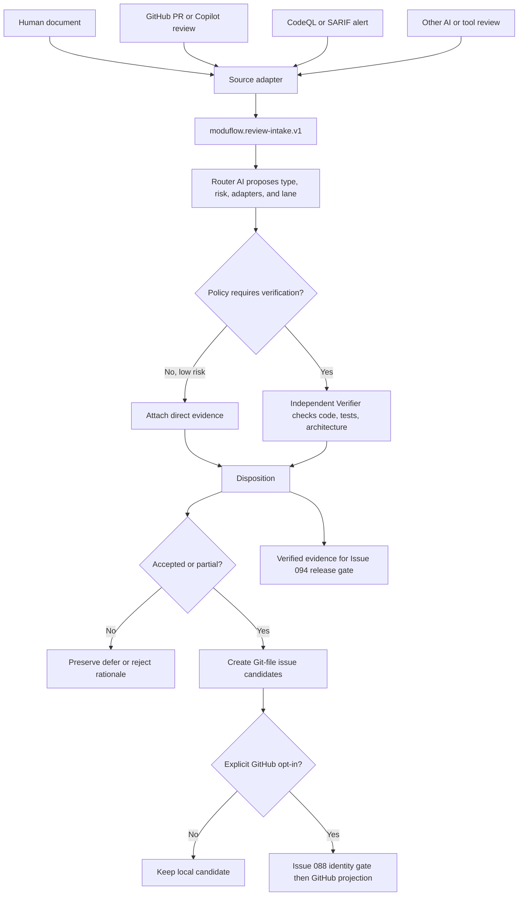

# Spec: Verified Code-Review Intake and Remediation Routing

Issue: `089-verified-code-review-intake-and-remediation-routing`
Prev: user direction and benchmark evidence recorded in `issues/089-verified-code-review-intake-and-remediation-routing.md` · Next: human spec review, then `product:plan 089-verified-code-review-intake-and-remediation-routing`

## Problem

ModuFlow can request implementation review and can create Git-native issues, but it does not have a durable intake boundary for review feedback that arrives from a person, an AI reviewer, GitHub pull-request threads, or a security scanner. Review prose can mix observed facts, suggested remedies, root-cause guesses, unsupported risk claims, and architecture preferences. Blindly implementing it is unsafe; keeping it only in chat or a pull-request thread loses provenance and remediation history.

The solution must also preserve ModuFlow's adapter-first architecture. GitHub review handling, Superpowers review-reception discipline, CodeQL/SARIF finding identity, and Spec Kit planning should remain replaceable upstream capabilities. ModuFlow should own only the stable contract that normalizes their outputs, verifies evidence, routes risk, and creates Git-file issue candidates. Installed adapters must remain idle until a relevant event or policy gate invokes them, so routine work does not become slow or context-heavy.

## Goals

1. Normalize human, AI, GitHub, and security-tool feedback into one versioned review-intake packet without treating any reviewer as proof.
2. Preserve reviewer/source ownership, target repository and commit, retention choice, and source integrity while defaulting externally owned review text to `reference + SHA-256`.
3. Separate each finding's observation, recommendation, root-cause hypothesis, verification evidence, disposition, and remediation route.
4. Reuse upstream capabilities through replaceable adapters rather than rebuilding code-review, PR-thread, security-scanning, or planning engines.
5. Use a Router AI for classification, an independent Verifier role for evidence checks when needed, and deterministic policy for safety-critical decisions.
6. Keep routine execution light by invoking only adapters justified by the trigger, changed paths, finding type, or release phase.
7. Produce human-reviewable local issue candidates with priority, dependencies, CognitiveDemand, and finding traceability before any GitHub write.
8. Provide verified evidence that Issue 094 can later consume as a release/security gate without implementing that gate in Issue 089.

## Non-Goals

- Running every review or security plugin on every ModuFlow command.
- Replacing GitHub pull-request review, Copilot review, CodeQL, SARIF, Superpowers, Spec Kit, or repository rulesets.
- Allowing AI confidence alone to approve a release, dismiss a high-risk finding, or override deterministic policy.
- Automatically implementing accepted suggestions.
- Automatically replying to or resolving GitHub review threads.
- Automatically creating GitHub issues without explicit opt-in.
- Copying externally owned or sensitive review material when a reference and integrity hash are sufficient.
- Implementing the final pre-deployment security and quality gate; that remains Issue 094.

## Users & Scenarios

### External human review document

A project owner receives a Markdown or document review from another person. ModuFlow records the author when known, source reference, SHA-256, target repository/commit, and stable finding IDs. The source text is not silently copied. Each finding is verified against the actual project before remediation is proposed.

### GitHub PR or Copilot review

A pull request has unresolved inline threads. The GitHub review adapter reads thread-aware state, file and line anchors, outdated/resolved status, and reviewer provenance. AI-authored comments remain comments, not approval. ModuFlow clusters actionable feedback and creates a local disposition packet without replying or resolving threads unless the user explicitly requests it.

### Security scanner finding

CodeQL or another SARIF producer reports a security alert. The security adapter retains rule identity, severity, fingerprint, tool version, location, alert state, and dismissal history. A high-risk confirmed finding routes to `security`; it cannot be rejected or marked safe solely by AI confidence.

### Low-risk routine feedback

A review suggests removing an unused import and tests prove no behavior change. Router AI can classify it as low risk and create a small local remediation candidate without invoking Spec Kit or a deep security scan.

### Architecture conflict

A reviewer proposes a cleaner abstraction that conflicts with a recorded architecture decision or import boundary. ModuFlow can `partial_accept` the observation while deferring or rejecting the proposed remedy, with the conflict and evidence preserved.

### Unsupported “no risk” claim

A reviewer or AI labels a duplication or refactor as risk-free. ModuFlow records the claim but leaves risk verification `unverified` until relevant tests and import-boundary evidence are attached.

## Proposed Solution

### 1. Adapter-first architecture

ModuFlow owns a thin review-intake contract and keeps upstream sources replaceable.

| Adapter | Upstream capability reused | ModuFlow responsibility |
| --- | --- | --- |
| `manual-review-document` | Files, pasted review text, document links | Source reference/hash, finding normalization, provenance |
| `github-review` | Codex GitHub plugin and thread-aware `gh` reads | Map PR threads/comments into findings; never write without approval |
| `superpowers-review` | `receiving-code-review` verification discipline | Map verify-before-implement steps into required evidence and state |
| `security-review` | GitHub CodeQL/SARIF alert model | Map rule/fingerprint/severity/location/dismissal into security findings |
| `spec-kit` | Existing spec/plan/task structure | Activate only when an accepted candidate requires design/planning |

`vendor.lock.json` records source/version metadata. Mapping logic lives in `adapters/`; Dongwon/company-specific retention, approval, risk, and release policies live in `overlays/`. Vendored or installed upstream files are not edited for ModuFlow behavior.

Renovate Dependency Dashboard is a benchmark pattern, not a required runtime dependency. ModuFlow borrows its candidate-queue and explicit-promotion model without installing Renovate for review intake.

### 2. One canonical review-intake packet

Create a machine-readable packet with schema `moduflow.review-intake.v1`. A Korean-first Markdown projection is generated for human review; it is not a second source of truth.

```json
{
  "schema": "moduflow.review-intake.v1",
  "review_id": "2026-07-16-modu-biz-external-review",
  "source": {
    "kind": "human",
    "provider": "external-reviewer",
    "identity": "unknown",
    "received_at": "2026-07-16",
    "retention": "reference",
    "locator": "/path/to/code-review.md",
    "sha256": "..."
  },
  "target": {
    "repository": "github.com/owner/repository",
    "commit": "full-sha",
    "base_branch": "main"
  },
  "trigger": {
    "event": "manual_intake",
    "reason_codes": ["external_review_received"]
  },
  "adapter_run": {
    "invoked": ["manual-review-document", "superpowers-review"],
    "skipped": ["github-review", "security-review", "spec-kit"]
  },
  "findings": []
}
```

Required source kinds are `human`, `ai`, and `tool`. AI/tool sources additionally record provider, model or tool version when available, and checklist/policy version when available. The source reviewer and the verifier are separate identities/roles.

Retention modes are:

- `copy` — allowed material is copied into the packet or an attached artifact.
- `reference` — locator plus SHA-256 is canonical; this is the default for externally owned review files.
- `hash_only` — only integrity metadata and a non-sensitive description are retained.

### 3. Finding identity and content separation

Each finding has a packet-local stable ID such as `F-001` plus a cross-run fingerprint. The fingerprint uses source provider/rule identity, normalized repository, normalized path, and a semantic anchor when available. Target commit remains review provenance but is not the sole finding identity, so the same issue can survive line movement or re-review.

Every finding separates:

- `observation` — what was observed in the target.
- `recommendation` — what the reviewer suggests doing.
- `root_cause_hypothesis` — an explanation that still requires evidence.
- `locations` — normalized repository paths and anchors.
- `verification` — state, verifier, files checked, reproduction, tests, architecture/import-boundary evidence, contradictions, and timestamp.
- `risk` — severity, release impact, and whether a “no risk” claim remains unverified.
- `disposition` — final decision and rationale.
- `route` — remediation lane, candidate state, CognitiveDemand, dependencies, and issue references.

Exact fingerprint matches are deduplicated. Semantic overlaps are shown as merge/link suggestions and never merged automatically.

### 4. Verification and disposition lifecycle

Imported findings begin in `pending_verification`. Verification state is one of `unverified`, `confirmed`, `contradicted`, or `inconclusive`. A finalized packet requires one disposition per finding:

- `accept` — observation and proposed remedy are suitable for this codebase.
- `partial_accept` — some observation or scope is valid, but the remedy or claimed cause is unsuitable or incomplete.
- `defer` — valid or plausible, but intentionally postponed with owner/condition/review date when known.
- `reject` — evidence contradicts the finding or the remedy violates current requirements, architecture, compatibility, or YAGNI.

Every disposition records rationale and evidence. `accept` and `partial_accept` require verification evidence. `reject` of a high-risk or security finding requires deterministic contradictory evidence or human approval; an AI may recommend rejection but cannot finalize it alone. `defer` of a release-blocking finding does not make the release safe.

### 5. Router AI, Verifier role, and deterministic policy

AI is used where judgment is helpful, but its authority is bounded.

#### Router AI

The Router AI can:

- classify actionable, informational, duplicate, outdated, or ambiguous feedback;
- propose affected components and files;
- distinguish security, pre-release, and post-release-refactor lanes;
- recommend verification steps, priority, dependencies, and CognitiveDemand;
- decide which adapters appear relevant;
- emit `inconclusive` rather than forcing a low-confidence answer.

#### Verifier role

The Verifier checks the real codebase, tests, architecture decisions, import boundaries, supported platforms, and current usage. For medium/high-risk or disputed findings, the verifier must be independent from the source reviewer and logically separate from the Router run. It may be another AI run/model, a tool, or a human.

#### Policy engine

Deterministic rules override AI routing:

- authentication, authorization, payment, personal data, secrets, uploads, deployment, and security-workflow changes require the security path;
- confirmed `critical` or `high` security findings remain release-blocking evidence;
- target commit mismatch requires re-verification;
- missing relevant test/boundary evidence keeps “no risk” unverified;
- conflicting review instructions or architecture decisions require explicit escalation;
- a high-risk rejection, release-gate bypass, or GitHub write requires human approval and a recorded reason.

The policy result records rule IDs so the same evidence produces a deterministic explanation even when AI wording changes.

### 6. Risk-based lazy invocation

Installed adapters are capabilities, not always-running middleware. The intake router records why each adapter was invoked or skipped.

| Level | Trigger | Required behavior |
| --- | --- | --- |
| L0 — routine | Normal local work, no review/security event | Canonical repository and existing fast checks only; no review plugin load |
| L1 — conditional | Review received, PR threads present, dependency/security-sensitive paths changed | Invoke only the matching review/security adapters |
| L2 — release evidence | Pre-release check | Read existing verified packet/results and report missing or blocking evidence; Issue 094 owns final gate enforcement |
| L3 — scheduled deep scan | Scheduled or explicitly requested security health review | Ingest extended CodeQL/SARIF/Scorecard-style results asynchronously |

`product:execute` does not load every review adapter by default. `product:review --intake` is the explicit/manual entry point, while PR/security events may recommend it. Security scanners run in their native environment; ModuFlow ingests the result or alert metadata instead of placing full scanner output into the agent context.

GitHub required-check implementations must avoid workflow-level path filters that can leave a required check pending. Issue 094 should later use an always-reporting aggregate gate with conditionally executed internal jobs.

### 7. Remediation routing and issue candidates

Accepted and partially accepted findings route to one of:

- `security` — security/privacy/credential findings or policy-mandated sensitive paths.
- `pre_release` — correctness, regression, accessibility, or operability work required before the intended release.
- `post_release_refactor` — worthwhile cleanup with recorded rationale for not blocking release.

The router creates canonical Git-file candidates first. Each candidate includes:

- finding IDs and review packet link;
- proposed issue title, problem, scope, acceptance evidence, and next command;
- priority and dependency hints;
- CognitiveDemand and reason codes;
- existing-issue overlap/link suggestions;
- lane and release impact;
- state: `candidate`, `linked_existing`, `approved`, or `published`.

One finding may split into multiple candidates and multiple related findings may group into one candidate. The trace matrix records every mapping. GitHub issue publication is a separate, explicit action protected by Issue 088's canonical repository identity gate.

### 8. Command and artifact surface

The v1 entry point is `product:review --intake <source>`, implemented through a dedicated review-intake module rather than overloading post-implementation verdict logic.

Expected canonical artifacts:

- `workspace/reviews/<review-id>.json` — machine source of truth.
- `workspace/reviews/<review-id>.md` — Korean-first human projection.
- `workspace/review-candidates.md` or equivalent generated queue — reviewable candidate list.
- `adapters/github-review.yaml`, `adapters/security-review.yaml`, and updated `adapters/superpowers.yaml` — replaceable mappings.
- `overlays/review-policy.yaml` — local retention, risk, approval, and release-routing policy.

The implementation may choose a more precise script name than the issue's provisional `scripts/project_review.py`, but it must keep intake normalization separate from post-implementation review verdicts and reuse one shared schema/parser.

### 9. Data flow



### 10. Error handling and auditability

- Missing or unreadable source references produce `source_unavailable`; existing packets are not rewritten as verified.
- Hash mismatch produces `source_integrity_mismatch` and requires re-intake.
- Missing target repository or commit produces `target_unverifiable`; disposition finalization is blocked.
- Adapter unavailability is recorded with `adapter_unavailable`; unrelated adapters remain skipped rather than failing the whole intake.
- GitHub flat comments are not treated as complete thread state when resolution/outdated context is required.
- AI/tool identity or version unavailable is recorded as unknown, never fabricated.
- Packets retain previous disposition events or an append-only decision history when decisions change.
- Logs and human projections redact credentials, secrets, and sensitive copied material.

## Alternatives Considered

### A. Run every plugin on every implementation

Rejected. It increases latency, context use, cost, false-positive exposure, and failure coupling. Installed capability does not justify unconditional invocation.

### B. Review and scan only immediately before release

Rejected. Feedback arrives too late, remediation becomes expensive, and release pressure encourages unsafe deferral.

### C. Store all review prose in one Markdown file

Rejected. It is readable but weak for stable identity, deduplication, automated routing, source retention policy, and cross-tool integration.

### D. Let AI decide and finalize every branch

Rejected. AI is useful for classification but cannot provide deterministic safety guarantees, self-approve high-risk findings, or replace human authorization for exceptions.

### E. Recommended: thin adapters + normalized packet + bounded AI + lazy gates

Selected. It follows ModuFlow's replaceable-upstream architecture, keeps routine work light, preserves evidence, and separates classification from verification and authorization.

## Acceptance Criteria

1. A versioned `moduflow.review-intake.v1` packet represents human, AI, GitHub, and security-tool sources with target repository and commit provenance.
2. Externally owned review documents default to `reference` plus SHA-256; `copy`, `reference`, and `hash_only` are explicit and validated.
3. Each finding has a stable packet ID and cross-run fingerprint plus separate observation, recommendation, and root-cause-hypothesis fields.
4. Verification records files, reproduction, tests, architecture/import-boundary evidence, verifier identity/role, state, and timestamp.
5. Finalized findings use `accept`, `partial_accept`, `defer`, or `reject` with rationale; incomplete intake remains visibly `pending_verification` rather than receiving a fabricated decision.
6. “No risk” cannot become verified without relevant test and import-boundary evidence.
7. Router AI can propose classification, adapters, route, priority, dependency, and CognitiveDemand but can return `inconclusive` and cannot override policy.
8. Medium/high-risk or disputed findings can require a logically independent Verifier role; source reviewer, Router, and Verifier provenance remain distinguishable.
9. Deterministic policy routes sensitive paths and confirmed high/critical security findings to security handling and requires human approval for high-risk rejection or bypass.
10. Adapter invocation records invoked/skipped adapters and reason codes; routine L0 work does not load GitHub review, security, or Spec Kit adapters without a trigger.
11. The Superpowers adapter maps `receiving-code-review`; a GitHub review adapter preserves thread-aware state; a security adapter preserves CodeQL/SARIF identity and severity.
12. `vendor.lock.json`, `adapters/`, and `overlays/` follow the source-adapter policy without editing upstream files.
13. Accepted and partially accepted findings route to `security`, `pre_release`, or `post_release_refactor` and create human-reviewable Git-file candidates.
14. Candidates include finding IDs, evidence, scope, priority, dependency hints, CognitiveDemand, lane, release impact, next command, and overlap hints.
15. Exact duplicate fingerprints link instead of recreating candidates; semantic overlaps require human/AI review before grouping.
16. Every accepted/partial finding maps to one or more candidates or an existing issue, and every candidate lists its source finding IDs.
17. GitHub comments, thread resolution, issue creation, and issue publication remain explicit writes; GitHub issue projection passes Issue 088's canonical identity gate.
18. Issue 089 emits verified review/release evidence but does not implement Issue 094's final pre-deployment gate.
19. Focused tests cover source retention/hash integrity, all source kinds, finding separation, verification states, all dispositions, no-risk claims, deduplication, adapter lazy invocation, AI/policy precedence, routing, and candidate traceability.
20. `python3 scripts/validate_moduflow.py .`, `python3 scripts/validate_project_artifacts.py .`, and `python3 scripts/release_check.py .` pass.

## Benchmark Basis

- GitHub Code Scanning alert dispositions and audit comments: <https://docs.github.com/en/code-security/how-tos/manage-security-alerts/manage-code-scanning-alerts/resolve-alerts>
- GitHub SARIF fingerprint support: <https://docs.github.com/en/code-security/reference/code-scanning/sarif-files/sarif-support>
- GitHub Copilot code review authority limits: <https://docs.github.com/en/copilot/how-tos/use-copilot-agents/request-a-code-review/use-code-review>
- GitHub dependency review severity-based enforcement: <https://docs.github.com/en/code-security/concepts/supply-chain-security/dependency-review>
- GitHub CodeQL default versus security-extended suites: <https://docs.github.com/en/code-security/concepts/code-scanning/codeql/codeql-query-suites>
- GitHub reusable workflows: <https://docs.github.com/en/actions/concepts/workflows-and-actions/reusing-workflow-configurations>
- GitHub required-check behavior when workflows are path-filtered: <https://docs.github.com/en/pull-requests/collaborating-with-pull-requests/collaborating-on-repositories-with-code-quality-features/troubleshooting-required-status-checks>
- Renovate Dependency Dashboard candidate promotion: <https://docs.renovatebot.com/key-concepts/dashboard/>
- OpenSSF Scorecard scheduled/main-branch pattern: <https://github.com/ossf/scorecard/blob/main/.github/workflows/scorecard-analysis.yml>

## Risks & Open Questions

- Different review providers expose different thread and identity detail. V1 preserves unknown values and adapter limitations rather than pretending feature parity.
- Semantic deduplication can over-group unrelated findings. V1 auto-links only exact fingerprints and treats semantic matches as suggestions.
- AI Router and Verifier independence is logical, not necessarily a different vendor. High-risk decisions still require policy and, where specified, human approval.
- Private repositories may not have GitHub Code Security or CodeQL features. The adapter must degrade to available scanner/test evidence without declaring the project secure.
- Scheduled deep scans can discover old issues after release. Those become new intake events; confirmed critical findings may trigger Issue 094 policy later.
- The exact candidate queue serialization can be refined during planning, but the canonical packet and traceability contract must remain stable.
