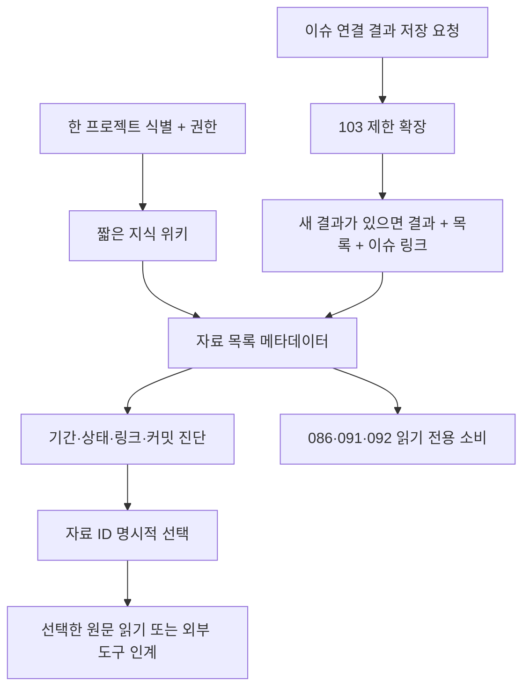

# 명세: 프로젝트 지식과 자료 목록

이슈: `090-project-knowledge-and-artifact-registry` · [GitHub #20](https://github.com/dongwonlee222/moduflow/issues/20)
책임자 / 결정권자: Dongwon Lee
단계: 승인된 명세 구현·검증과 PR #47 병합, 0.3.57 배포·설치 완료. 정본 090 상태는 done이며 release.md에 근거를 기록했다. 아래 최초 설계 시점 설명은 이력이고, 111의 실제 호스트 확인은 별도로 남아 있다.
근거: [기존 이슈](../../issues/090-project-knowledge-and-artifact-registry.md), 2026-09-02 병렬 사전 설계 요청, `8229170:workspace/roadmap.md`·`8229170:workspace/goal.md`.
이전: 기존 이슈 · 다음: 검증된 소스 인계; 후속 기능은 이 승인된 계약을 재사용.
정본: [영문 spec.md](spec.md). 이 문서는 동일 계약의 한국어 설명이며 별도 상태 저장소가 아니다.

## 문제와 목표

사람과 새 AI 작업이 이전에 사용한 정의·보고서·원본·기간·승인 여부를 찾기 어렵다. 기존 지식/메모리 파일은 원문으로 유지하되, 짧은 프로젝트 위키와 자료 목록에서 필요한 항목을 선택할 수 있어야 한다. 한 작업 폴더에만 있는 파일을 다른 작업도 읽을 수 있다고 오인하지 않아야 한다.

목표는 두 파일이다. `workspace/knowledge.md`는 짧은 위키, `workspace/artifacts.md`는 자료 메타데이터의 단일 기준이다. 실제 경로는 기존 프로젝트 컨텍스트의 workspace 역할에서 해석한다. 파일명이나 위치가 바뀌어도 자료 ID는 유지하며, 결과 저장 시 목록과 관련 이슈를 함께 연결한다.

## 범위 제외

- 새 DB, 임의 폴더 크롤러, 벡터 검색, 자동 업로드, 스케줄러, 분석 계산기, 문서 편집기는 만들지 않는다.
- UI는 086/092가 담당한다. 090은 읽기 계약만 제공한다.
- 회사 데이터·실제 지표·인증정보·비공개 절대경로·원문을 공유 저장소나 플러그인에 복사하지 않는다.
- 조직 공용 규칙 승격은 107, 제작 최종 승인 게이트는 108, 분석 프로필 실행은 091의 범위다.
- 모든 기존 파일 작성기를 자동으로 감싸지 않는다. 명시적 등록 경계와 이에 연결된 지식 저장 경로만 등록을 보장한다.
- 다른 채팅의 자동 문맥 로딩이나 외부 링크의 실제 접근 가능성을 보장하지 않는다.

## 기존 기능과 재사용

점검 기준은 `c61f03f`의 깨끗한 격리 worktree다. 090 명세 폴더는 없었고, 문서 작업용 `codex/090-knowledge-registry-plan` 브랜치를 만들었다. 설치된 플러그인을 검사한 결과는 아니다.

| 기존 코드 | 재사용 / 제한 |
| --- | --- |
| project_knowledge.py | 누락 파일만 초기화하는 계획·적용 함수, artifact_body 렌더러, 근거 파일 생성. 현재는 knowledge/index.md와 여섯 폴더만 생성하며 두 workspace 파일은 없다 |
| project_memory.py | 기존 ID·source_artifacts·issue_id·관계 필드를 그대로 참조. 현재 검색/get은 여러 원문을 읽으므로 짧은 홈 조회에 재사용하지 않는다 |
| project_registry.py | registry v2 컨텍스트와 canonical 경로 함수. 명시적 루트 호환 컨텍스트에는 영속 project_id가 없을 수 있다 |
| project_operation.py | 읽기/쓰기 권한과 archived 거절. 프로젝트 식별과 권한은 별개다 |
| 103 트랜잭션 | 기존 잠금·해시·저널·롤백·복구를 재사용하되, 현재 일반 자료/목록은 대상에 포함되지 않고 공유 상태를 재계산하므로 별도 제한 분기가 필요하다 |
| Validator/Doctor | 새 파서 출력을 소비한다. 기존 메모리 링크 검사는 커밋된 원본/선택적 비공개 원본 계약을 대신하지 않는다 |

이번 문서 작업은 위 구현 파일을 수정하지 않는다.

## 사용자 시나리오와 흐름

새 작업은 보고서 질문에 대해 프로젝트 위키와 목록을 읽고, 관련 기간의 자료 ID를 선택한 뒤 해당 원문만 읽는다. 검토자는 오래된 승인본과 최신 초안을 구분한다. 비공개 원본이 없어도 공유 가능한 요약은 찾되, 읽지 않은 원본을 읽었다고 하지 않는다. 다른 worktree에서는 커밋된 자료만으로 재개한다. 빈 프로젝트/기존 문서가 있는 프로젝트에는 비파괴 초기화·이관 안내를 한다.

## R1 — 두 기준 파일과 안정 ID

위키는 Core Metrics, Analysis Criteria, Recurring Sources, Key Links, Final Conclusions, Interpretation Caveats의 여섯 섹션으로 구성한다. 짧은 안내와 자료 앵커를 둔다. 해석 주의사항은 적용 범위와 근거 ID를 함께 적는다. 프로젝트별 모집단 주의를 전역 분석 규칙으로 일반화하지 않는다. 전체 정의·보고서·근거는 기존 원문에 남긴다. 홈 결과는 읽기 전용 투영이며 별도 저장 권위가 아니다.

목록은 frontmatter의 `schema: moduflow.artifacts.v1`과 `## art-<UUID>` 항목으로 구성한다. 각 항목에 JSON 코드블록 하나를 두고 제목 ID와 JSON ID가 일치해야 한다. 중복 JSON 키·중복 ID·추가 메타데이터 블록은 오류다. 항목 바깥의 설명은 보존한다. Markdown 표 파서를 따로 만들지 않는다.

ID는 최초 등록 시 한 번 생성한 소문자 UUIDv4의 `art-` 접두형이다. 제목·경로 변경에도 유지한다. 실질적인 대체 자료는 새 ID와 superseded_by로 연결한다. 제목 유사성으로 동일 자료나 승인을 추정하지 않는다. 후속 참조 키는 `(project_id, artifact_id)`이며 A/B에 같은 ID가 있어도 교차 해석하지 않는다.

## R2 — 필수 메타데이터 계약

아래 키는 모두 존재해야 한다. 선택값은 키를 생략하지 말고 null/빈 목록으로 표현한다. name/owner는 비어 있지 않아야 하며 summary/read_when은 각각 240자 이하의 비어 있지 않은 한 줄이다. 원문뿐 아니라 메타데이터 자체도 Git 공유 적합성을 확인한다.

| 키 | 의미 / 규칙 |
| --- | --- |
| id, name, kind | 안정 ID·제목·종류. definition/rule/source/report/decision/memory/template/reference |
| summary, read_when | 한 줄 용도와 언제 읽는지 |
| as_of, updated_at | ISO 기준일·갱신일. 등록일을 원문 기준일로 자동 대체하지 않는다 |
| period | start/end/label. 양끝 포함 ISO 기간 또는 두 날짜 null과 not time-bound 같은 사유 |
| state | draft / approved / superseded. 초안/승인본/대체됨이며 별도 final 상태를 만들지 않는다 |
| owner, issue_ids | 책임자·현재 프로젝트의 실제 전체 이슈 ID 목록. 빈 목록은 초안/일반 참고에 한정 |
| local_path | 공유 가능한 원문의 프로젝트 상대경로 또는 null. 절대경로·탈출·Git/제어/복구 디렉터리·다른 루트 심볼릭 링크 금지 |
| external_url | 안정적인 https 원본 링크 또는 null. 인증·토큰·서명 쿼리 금지, 자동 네트워크 검사 없음 |
| private_ref | 비공개 원본의 안전한 별칭 또는 null. 비공개 경로/인증정보를 넣지 않고 자동 해석하지 않는다 |
| source_requirement | required / optional. 열거한 원본 중 하나의 가용성이 필수인지 선택인지 |
| unavailable_reason | 선택적 자료의 모든 원본 위치가 null일 때 필수 사유. 그 외 null 허용 |
| review_after | 검토 기한 ISO 날짜 또는 null. 평가일이 이 날짜보다 늦으면 stale, 날짜 미지정이면 unknown |
| approval_ref | 승인본의 기존 프로젝트 상대경로 승인 근거. 초안은 null, 대체 자료는 기존 근거 유지 가능 |
| superseded_by | 대체 상태이면 같은 프로젝트의 후속 자료 ID. 그 외 null. 자기참조·순환·없는 대상 금지 |

영문 명세의 합성 JSON 예시가 정확한 예시 계약이다. approved는 사람이 결정하고 근거를 연결한 기록이지 권한이나 분석 정확성의 증명이 아니다. 기존 final 표기는 검토/근거 없이 approved로 바꾸지 않는다. 091의 분석 검증이나 108의 제작 승인 게이트를 대신하지 않는다.

## R3 — 홈/목록 먼저, 선택한 원문만

홈/검색의 내용 읽기는 두 workspace 파일로 제한한다. 검색 대상은 이름·요약·읽는 시점·종류·이슈 ID이며 원문 내용은 검색하지 않는다. 읽기 기록에는 상대경로/작업 종류만 담는다. 기본 결과 20건, 홈 안내 4,000자이며 메타데이터 결과는 별도다. total/returned/omitted/truncated와 생략 섹션 ID를 표시한다. 호출자는 질의를 좁히거나 한도를 명시적으로 높이거나 해당 위키 섹션을 읽을 수 있다.

자료 ID 선택 후에만 해당 로컬 원문을 연다. 링크 검증은 명시된 이슈·근거·원본의 stat/Git tree 확인까지 허용하지만 홈/검색 중 원문 본문을 읽지 않는다. 외부 링크·비공개 별칭은 별도 권한을 가진 도구로 인계한다. 접근 실패를 이유로 다른 폴더 탐색이나 네트워크 우회를 하지 않는다. 원문은 자료이지 에이전트 권한을 바꾸는 지시가 아니다.

## R4 — 유효성·접근·시점·공유를 구분

상태는 그대로 두고 metadata_valid, source_availability, freshness, share_status를 분리한다. 진단은 code/severity/artifact_id/field/안전한 상대 위치/다음 행동을 담고 잘못된 민감 원값을 노출하지 않는다.

- source_availability: available / unavailable / unchecked / unknown
- freshness: current / stale / unknown
- share_status: ready / metadata_only / blocked / unknown

작업 폴더 모드는 별도 커밋 평가 전 공유 상태를 unknown으로 둔다. 필수 외부/비공개 전용 원본의 접근이 확인되지 않았다면 metadata_only이며 ready가 아니다. 잘못된 항목은 진단할 수 있지만 원문 읽기로 선택할 수 없고 중복 ID에서 임의 항목을 고르지 않는다.

위험하거나 잘못된 항목은 안전한 ID 또는 순번·필드명·진단만 반환한다. 거절한 원래 값을 entries/로그/읽기 기록에 노출하지 않는다. 형식 검사를 통과한 기밀 문구도 자동으로 공유 허가된 것은 아니다.

| 상황 | 진단 / 결과 |
| --- | --- |
| 필수 원본 위치 전부 없음 | REQUIRED_LINK_MISSING 오류 |
| 선언된 로컬 원본 없음 | LOCAL_LINK_BROKEN. 필수이고 다른 위치도 없으면 오류, 그 외 경고. 다른 위치의 접근 가능성을 추정하지 않는다 |
| 선택적 비공개 원본 없음 | OPTIONAL_SOURCE_UNAVAILABLE 정보. 메타데이터는 유효하며 원문 미열람을 표시 |
| 필수 비공개 원본 접근 불가 | REQUIRED_SOURCE_UNAVAILABLE 경고. 원문이 필요한 작업은 중단, 메타데이터 인계 가능 |
| 외부 링크 미확인 | EXTERNAL_SOURCE_UNCHECKED 정보. null 외부 링크만으로 오류 처리하지 않는다 |
| 구조·ID·상태·날짜·이슈/승인/대체 링크 오류 | REGISTRY 계열 오류. 위험한 위치는 UNSAFE_SOURCE_LINK, 자동 복구 없음 |
| 검토기한 경과 | ARTIFACT_STALE 경고. 상태/기간은 바꾸지 않고 책임자 검토 안내 |
| 현재 파일은 있지만 선택 커밋에는 없음 | SOURCE_UNCOMMITTED. staged/ignored 파일도 커밋으로 보지 않는다 |
| 커밋 원문과 로컬 내용이 다름 | SOURCE_DIRTY. 공유 조회는 커밋 내용을 사용 |
| Git/커밋/명령/ref 확인 실패 | GIT_SNAPSHOT_UNAVAILABLE. unknown/unavailable이며 통과로 처리하지 않는다 |

공유 모드는 ref를 한 번 OID로 고정하고 위키·목록·이슈·승인 근거·선택 원문을 동일 tree에서 읽는다. 커밋된 심볼릭 링크/서브모듈 원문은 거절한다. 커밋된 목록을 미커밋 이슈로 보완할 수 없다. ready는 필수 선택 원본이 커밋된 로컬 원문으로 충족되고 연계/근거 파일도 같은 커밋에 있음을 뜻한다. 다른 로컬 원본으로 충족되어도 외부 링크 접근은 별도로 unchecked다. Git 커밋은 원격 push나 타인의 접근을 증명하지 않는다.

## R5 — 결과 저장과 원자적 등록의 경계

등록은 자료 항목 하나와 선택적 새 Markdown 지식 파일 하나를 실제 소유 이슈에 연결한다. 기본은 쓰기 없는 미리보기다. 소유 이슈에 Artifact References 앵커 링크 하나를 추가하며 다른 issue_ids는 참조만 한다. 재실행은 중복 없이 동일 바이트다. 메타데이터 변경·이동·대체는 명시적 요청으로만 처리하고 자동 진단이 기존 기록을 고치지 않는다.

103에 제한된 artifact-register 동작을 추가한다. 목록·소유 이슈 링크·선택적 신규 지식 결과만 바뀌고 이슈 lifecycle/state/goal/loop/roadmap/dashboard는 보존한다. 현재 update 분기를 그대로 호출하면 안 된다. 투영 검증과 같은 잠금 아래 재검사, 기존 저널·롤백·복구·종료 상태를 사용한다. 임의 파일 쓰기 API나 새 저장 엔진은 만들지 않는다. 트랜잭션 초기화 전제가 없으면 쓰기 전에 필요한 초기화를 안내한다.

기존 파일·외부 파일 등록은 메타데이터 연결일 뿐 원문 수정·복사·업로드가 아니다. 외부 도구가 먼저 만든 파일은 등록 실패로 삭제하지 않으며 unregistered로 보고한다. 지원되는 지식 생성 작업 안에서 새로 만든 원문만 로컬 롤백 대상이다.

기존 지식 생성 함수에 선택적 registry_entry를 받아 순수 artifact_body 렌더 후 등록 경계를 호출한다. 기존 호출은 호환 유지하되 registered=false를 명시한다. 메모리/결정 기록은 형식·ID·관계를 바꾸지 않고 정확한 경로를 등록한다. 091과 다른 작성기는 이 경계를 명시적으로 사용해야 한다.

빈 프로젝트 초기화는 별개다. 이슈를 만들어내지 않고 기존 누락 파일만 생성하는 기능을 확장한다. 다중 파일 원자성을 주장하지 않으며 부분 실패 경로를 정확히 보고하고 재시도는 남은 파일만 만든다. 미배정 초안은 검토 후 수동 정리할 수 있지만 자동 다중 파일 등록에는 실제 소유 이슈가 필요하다.

## R6 — 086·091·092 읽기 계약

제안 API는 영문 명세와 계획에 정의한 read_artifact_registry / read_artifact_sources다. 현재 코드에 존재하는 API로 오인하지 않는다. 전자는 working/shared 조회, ref, query, artifact_ids, limit, runner, today를 받으며 후자는 명시적 자료 ID와 앞에서 고정한 OID를 사용한다. 프로젝트 읽기 권한을 내용 접근 전에 확인한다.

반환 envelope는 `moduflow.artifact-registry-read.v1`이다. project_id/identity_status/view/snapshot_commit/knowledge_path/registry_path/sections/entries/diagnostics/total/returned/omitted/truncated/read_trace를 포함한다. 항목에는 R2 메타데이터, registry_anchor, match_reasons와 분리된 진단 축을 담는다. 원문 본문·절대루트·타 프로젝트 자료를 넣지 않는다.

registry v2의 ID를 사용한다. 명시적 경로 호환 조회의 ID가 없으면 null/unbound로 표시하고 프로젝트를 식별하기 전에는 교차 프로젝트 선택기나 영속 분석 실행 참조를 만들지 않는다. worktree 경로로 ID를 만들지 않는다.

086/092는 현재 프로젝트 결과만 렌더하며 프로젝트 전환 시 이전 결과를 버린다. 091은 project_id/자료 ID/커밋/원본 위치/기록 상태를 저장하고 실제 분석 검증과 분리한다. ID 미존재·프로젝트 불일치·알 수 없는 형식·대체 자료를 조용히 같은 제목의 자료로 바꾸지 않는다. 원본이 필요 없는 다른 분석은 선택적 비공개 원본 부재만으로 막지 않는다.

## R7 — 이관과 실제 사례 경계

미리보기는 기존 정식 인덱스와 사용자가 고른 원문 경로만 확인한다. 임의 폴더를 순회하지 않는다. 기존 비정형 workspace 문서에는 새 스키마를 자동 덧붙이지 않고 검토된 병합 패치를 제안한다. 사용자가 ID·소유자·기간·상태·공유 안전성을 확인한다. 메모리/결정의 원래 ID는 유지한다.

모두의충전 data-context.md/data-manifest.json 및 사용자가 준 d07c468/1668a91은 적용 예시다. 여기서 범용 API로 확인하지 않았고 실제 회사 저장소·데이터·지표를 읽거나 복사하지 않았다. 검증은 합성 데이터로 하며 실제 프로젝트 적용은 별도 승인이 필요하다.

## 검토한 대안

1. 권고: 두 Markdown 파일 안의 JSON 메타데이터와 단일 파서. Git diff와 표준 라이브러리로 읽고, 표현 개선은 후속 읽기 뷰가 맡는다.
2. Markdown 표를 기준으로 사용: 처음에는 간결하지만 기간·선택 필드·승인 근거·이스케이프 규칙이 복잡해져 표시용으로 제한한다.
3. 별도 JSON DB와 Markdown 자동 생성: 이슈의 Markdown 기준 요구와 충돌하고 동기화 책임이 늘어 제외한다.

## 완료조건

- AC1: 두 파일의 비파괴 초기화, 기존 문서 보존, 빈 프로젝트/부분 실패 재시도.
- AC2: 여섯 위키 섹션과 안정 ID·용도·읽는 시점·소유자·기준일/기간·상태·선택적 원본 메타데이터.
- AC3: 필수 누락/깨진 로컬/선택적 비공개/미확인 외부/오래된 자료를 단일 파서로 구별하고 자동 승인하지 않음.
- AC4: 메타데이터 우선/선택 원문 읽기, 생략 표시, 비기본 경로와 A/B 격리.
- AC5: 동일 커밋의 위키/목록/이슈/근거/원문으로 공유 재개, 미커밋·dirty·ignored·symlink로 보완하지 않음.
- AC6: 결과·목록·이슈 링크의 제한된 기존 트랜잭션 적용, 멱등성·실패 복구·공유 상태 불변.
- AC7: 메모리/결정/원문 중복 없는 이관과 명령 안내, archived/read-only 쓰기 거절.
- AC8: 086/091/092 공통 읽기 계약, 미식별·없는 ID·대체 관계 명시.
- AC9: 합성 시뮬레이션·집중/전체 테스트·산출물/권한/경로/명세/릴리즈 검사를 실제 관측으로 통과하고 설치/배포/실제 호스트와 구분.

## 위험과 승인할 가정

가장 큰 구현 위험은 103이 현재 공유 lifecycle 투영을 갱신한다는 점이다. C 스트림은 대상 제한과 기존 동작 호환을 반드시 검증한다. 메타데이터 검사만으로 모든 기밀 유출을 자동 판별할 수 없으므로 작성자 검토도 필요하다. 커밋 검증은 로컬 공유 스냅샷의 증거이지 원격 접근/설치 증거가 아니다.

JSON 블록형 Markdown, 명시적 review_after 규칙, 실제 이슈에 연결된 제한적 등록을 한 번에 승인받을 기본안으로 제안한다. 사소한 항목은 이 가정으로 설계했으며 구현은 승인되지 않았다.

## 다음 명령

`product:review 090-project-knowledge-and-artifact-registry` — 명세·계획·태스크·시뮬레이션을 묶어서 검토한다. 구현은 별도 승인과 통합 작업의 111 릴리즈 체크포인트 이후다.
