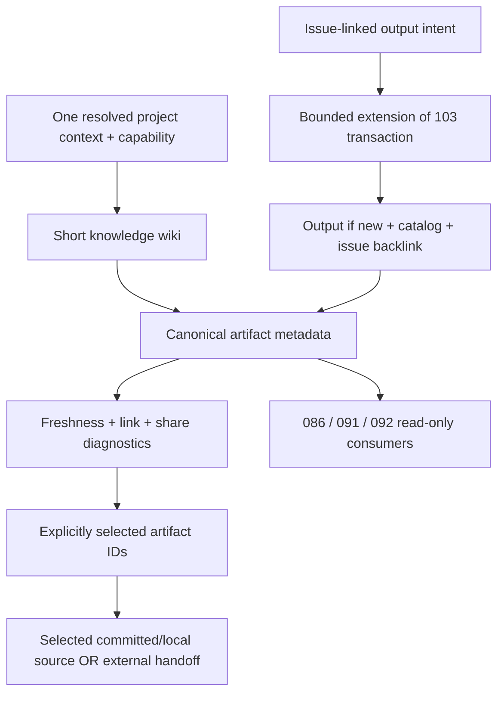

# Spec: Project Knowledge and Artifact Registry

Issue: `090-project-knowledge-and-artifact-registry` · [GitHub #20](https://github.com/dongwonlee222/moduflow/issues/20)
Owner / decision maker: Dongwon Lee
Phase: approved contract implemented in source 0.3.57; see implementation-approval.md, status.md and integration-verification.md. Original planning observations below are historical; canonical backlog remains the documented single-active limitation, not absence of implementation authority.
Source: [existing issue](../../issues/090-project-knowledge-and-artifact-registry.md), 2026-09-02 delegated planning request, and `8229170:workspace/roadmap.md` / `8229170:workspace/goal.md` (Git reference, not local lifecycle authority).
Prev: existing issue · Next: joint review of this spec and [plan](plan.md).

## Problem

A person or fresh AI task cannot reliably find the definition, report, original, period, or approval state used by a previous task. Existing knowledge and memory records are useful source documents, but their paths and content searches are not a short, project-scoped material catalog. A file present only in one worktree can create false confidence that another task can resume from shared Git.

## Goals

1. Make `workspace/knowledge.md` a short curated wiki and `workspace/artifacts.md` the only material metadata registry.
2. Resolve one project, read its wiki/index first, then open only explicitly selected source material.
3. Preserve stable material references across renames, worktrees, and downstream 091 runs without copying originals.
4. Separate metadata validity, lifecycle state, source availability, freshness, and committed-share readiness.
5. Register an issue-linked output and its issue backlink as one verified local operation.

## Non-Goals

- No database, crawler, vector store, automatic upload, scheduler, analysis calculator, or document editor.
- No UI implementation; 086/092 consume the read contract below and own their views.
- No company data, metric values, credentials, private absolute paths, or full source text copied into the plugin or shared registry.
- No automatic approval, organization-wide sharing (107), production final-state gate (108), or analysis profile execution (091).
- No universal interception of every filesystem writer. Only the explicit registration boundary and opted-in knowledge writer are covered; other writers must call that boundary before claiming registration.
- No automatic cross-chat loading or promise that a linked external source is accessible.

## Existing Implementation and Reuse

Inspected baseline: `c61f03f`, an initially clean detached worktree; planning branch `codex/090-knowledge-registry-plan`. Issue 090 had no spec directory. These are observations of this checkout, not installed-package evidence.

| Existing surface | Reuse | Missing behavior / restriction |
| --- | --- | --- |
| `scripts/project_knowledge.py` | `build_knowledge_plan`, `apply_knowledge_plan`, `artifact_body`, `create_knowledge_artifact`; missing-only initialization | Currently creates `knowledge/index.md` and six evidence folders, not the two workspace files; creation is a direct write |
| `scripts/project_memory.py` | Existing memory IDs, `source_artifacts`, `issue_id`, relationship fields; link existing entries | Search reads record bodies and `get_memory_entry` scans records; neither is a metadata-only home reader |
| `scripts/project_registry.py` | Resolved registry v2 context; `context_for_operation`, `canonical_child_path`, `canonical_relative_path` | Explicit-root compatibility context has no durable project ID; never derive identity from absolute path |
| `scripts/project_operation.py` | Existing read/write capability decision and archived-project denial | Identity resolution alone is not permission |
| `scripts/project_lifecycle_transaction.py` | Existing immutable planning, same-project lock, hashes, journal, rollback/recovery | Current intents require an issue and do not include arbitrary knowledge/catalog targets; current planner re-renders state/loop/dashboard |
| Validator / Doctor / distribution checks | Add a consumer of one registry parser | Existing memory link checks are not a committed-source or optional-private-link contract |

No changes to these implementation files are authorized by this document-preparation task.

## Users & Scenarios

- A new task investigating a report reads the selected project's short wiki, finds the report ID and applicable period, then reads that one registered source.
- A reviewer distinguishes an approved but outdated report from a current draft; neither freshness nor filesystem existence becomes approval.
- A project with an optional restricted original remains discoverable from safe metadata and clearly states that the original was not read.
- A task in another worktree resumes using only the committed wiki, registry, linked issue and selected committed sources; an author-only local file cannot make this test pass.
- Empty or legacy projects receive initialization/migration guidance without overwriting documents or moving records.

## Proposed Solution



### R1 — Two canonical files, one material identity

Both files live beneath the resolved `workspace` role, not a hard-coded root. Default paths in this spec are labels; non-default registered paths must work. Existing `knowledge/index.md`, memory, decisions and reports remain sources, not parallel copies of the catalog.

`knowledge.md` contains six curated sections: Core Metrics, Analysis Criteria, Recurring Sources, Key Links, Final Conclusions, Interpretation Caveats. Each section has short guidance and links to artifact anchors. A scoped caveat must state its applicability and evidence ID; it cannot convert a project-specific population warning into a global analytical rule. Full definitions and evidence stay in linked documents. A generated home projection provides counts, section guidance, matching entries and omissions; it is not a third stored authority.

`artifacts.md` begins with `schema: moduflow.artifacts.v1` in frontmatter. Each `## art-<UUID>` section contains exactly one fenced `json` metadata object. The header ID and object ID must agree. Optional prose outside record sections is preserved; inside a record section extra metadata blocks are invalid. Parse fenced JSON with the standard library, including duplicate-key rejection. Consumers must not implement competing Markdown table parsers.

All IDs are immutable `art-` plus a lowercase UUIDv4, allocated once at registration (injectable UUID factory in tests), unique within the file. Renaming/moving a material retains its ID. A materially different replacement gets a new ID and an explicit supersession link; never infer equivalence or approval by title. A downstream reference is `(project_id, artifact_id)`, never a path-derived global ID. Overlapping IDs in projects A/B cannot cross-resolve.

### R2 — Record schema

All keys below are required; nullable values and empty lists are explicit, not absent keys. Text fields are plain UTF-8; `summary` and `read_when` are nonempty single lines, each at most 240 characters. `name` and `owner` are nonempty. The metadata is itself reviewed for safe Git sharing.

| Field | Type and rule |
| --- | --- |
| `id`, `name`, `kind` | Stable ID, display title, kind from `definition`, `rule`, `source`, `report`, `decision`, `memory`, `template`, `reference` |
| `summary`, `read_when` | Purpose in one line; when a future task should consult it |
| `as_of`, `updated_at` | ISO dates; never silently set the content's reference date to today's registration date |
| `period` | `{start, end, label}`; inclusive ISO date range with nonempty label, or both dates null and a nonempty reason such as `not time-bound` |
| `state` | `draft`, `approved`, `superseded`; draft/final UI wording maps to these states, not a second enum |
| `owner`, `issue_ids` | Owner; list of full existing issue IDs in this project; empty only for draft/general reference material |
| `local_path` | Project-relative path to an explicitly registered, share-safe original, or null; no absolute path, traversal, `.git`, control/recovery directory, or cross-root symlink |
| `external_url` | Stable `https` source link or null; no credentials, token-bearing/signed query, or automatic network check |
| `private_ref` | Opaque safe locator alias or null; no private pathname, credential, or automatic resolver |
| `source_requirement` | `required` or `optional`; applies to availability of at least one of the explicitly listed originals |
| `unavailable_reason` | Nonempty explanation when all source locators are null and source is optional; otherwise null permitted |
| `review_after` | ISO date or null; freshness is `stale` only when evaluation date is later than this date, otherwise `current` or `unknown` when null |
| `approval_ref` | Existing project-relative evidence record for `approved`; may be retained for superseded records; null for an unapproved draft |
| `superseded_by` | Another artifact ID in this project when state is superseded; otherwise null; missing target, self-reference and cycles are invalid |

Example (synthetic; not a company record):

```json
{
  "id": "art-11111111-1111-4111-8111-111111111111",
  "name": "Synthetic A population definition",
  "kind": "definition",
  "summary": "Defines the population used by synthetic project A.",
  "read_when": "Before comparing A reports across periods.",
  "as_of": "2026-08-31",
  "updated_at": "2026-09-02",
  "period": {"start": null, "end": null, "label": "not time-bound"},
  "state": "draft",
  "owner": "Synthetic owner A",
  "issue_ids": ["001-synthetic-a"],
  "local_path": "knowledge/references/population.md",
  "external_url": null,
  "private_ref": null,
  "source_requirement": "required",
  "unavailable_reason": null,
  "review_after": "2026-10-01",
  "approval_ref": null,
  "superseded_by": null
}
```

`approved` is an explicitly recorded human decision with linked evidence, not an authorization token or proof of analytical correctness. No writer invents `approval_ref`. Imported `final` labels need human mapping and evidence; they must not silently become approved. Reading approved metadata does not satisfy 091 validation or 108 final-state gates.

### R3 — Short home first, selected originals only

The home/index read touches only the two workspace files. Metadata search uses normalized query tokens against name, summary, read_when, kind and issue IDs, not source bodies. A read trace reports relative logical paths and operation types without source content. Default result limit is 20; home guidance budget is 4,000 characters excluding returned metadata. Return total, returned, omitted, `truncated`, and omitted section identifiers; no silent caps. Callers may narrow the query, explicitly increase the result limit, or inspect the named wiki section. An oversized catalog is not a license to load every source.

The caller selects artifact IDs after seeing the metadata. Only those declared local originals can be opened. Validation may stat/check Git trees for explicitly linked issues, evidence and sources, but may not read their bodies during home/search. External URLs/private aliases are returned as a handoff; the caller's separately authorized tool performs retrieval. Failed/absent private retrieval does not trigger sibling-folder search or network fallback. Source text is untrusted data, never instructions to change scope or permissions.

### R4 — Diagnostics, not one misleading valid flag

Return separate `metadata_valid`, `source_availability`, `freshness`, and `share_status`; keep recorded `state` unchanged. Diagnostics contain `code`, `severity`, `artifact_id`, `field`, safe relative location, and a next action. Do not echo unsafe raw values.

Stable axes: `source_availability=available|unavailable|unchecked|unknown`, `freshness=current|stale|unknown`, `share_status=ready|metadata_only|blocked|unknown`. Working reads report share_status unknown unless a committed snapshot is separately evaluated. Required external/private-only sources with no observed access remain metadata_only, never ready. Invalid metadata or missing committed required local/issue/evidence links block shared readiness. Invalid entries remain diagnosable but cannot be selected for source reads; duplicate IDs never pick an arbitrary winner.

For an unsafe/malformed record return only its safe ID (or ordinal), field name and diagnostic, not rejected raw metadata values in `entries`, logs or traces. The read contract is not a sanitizer that grants permission to share otherwise valid confidential prose.

| Case | Code / behavior | Effect |
| --- | --- | --- |
| Required source has no locator | `REQUIRED_LINK_MISSING` error | Invalid record; no ready claim |
| Declared local source absent | `LOCAL_LINK_BROKEN` error if required with no other locator; warning otherwise | Record remains inspectable; other locator availability stays unknown, not inferred |
| Optional private original absent or unavailable | `OPTIONAL_SOURCE_UNAVAILABLE` info | Metadata valid; availability unavailable; metadata-only handoff allowed |
| Required private alias present but inaccessible | `REQUIRED_SOURCE_UNAVAILABLE` warning | Metadata valid; original-dependent work blocked, metadata-only handoff still possible |
| External stable URL present, not checked | `EXTERNAL_SOURCE_UNCHECKED` info | No live availability claim; null URL is not an error when another allowed locator suffices |
| Malformed field, duplicate ID/key, unsupported schema, unsafe source, invalid issue/approval/supersession link | Specific `REGISTRY_*` / `UNSAFE_SOURCE_LINK` error | No silent repair or raw-path echo |
| Evaluation date exceeds review_after | `ARTIFACT_STALE` warning | Keep state and reference period; recommend owner review |
| Local target exists but is absent from selected commit | `SOURCE_UNCOMMITTED` warning; strict shared resume blocks source-dependent use | Neither staged nor ignored files count as committed |
| Committed source differs from local bytes | `SOURCE_DIRTY` warning | Shared reader uses selected commit bytes, never dirty fallback |
| No Git repo/commit, failed Git command, or invalid ref | `GIT_SNAPSHOT_UNAVAILABLE` diagnostic | Share status unknown/unavailable, never passed |

In shared mode resolve the supplied ref once to a commit OID and read wiki, registry and selected sources from that same tree using injected Git runner calls. Reject committed symlinks/submodules as readable originals. The catalog and required issue/approval links must also exist in that tree; a committed catalog cannot be rescued by an uncommitted issue. A local status check can compare existence/hashes, but is not authoritative for the shared snapshot. `share_status=metadata_only` means safe metadata is portable while an original is unavailable; `ready` additionally requires every required selected original to be satisfied by committed local content and all association/evidence links at the pinned commit. External accessibility is still unchecked even when another committed local original makes the record ready.

### R5 — Saving, registration, and boundaries of atomicity

Explicit registration consumes one record plus at most one new share-safe Markdown knowledge output, anchored to one existing owning issue. Other `issue_ids` are references, not additional mutation targets. Default is a read-only preview. The owning issue gets one append-only `Artifact References` backlink to the stable registry anchor; retry is byte-identical. Renames, metadata amendments and supersession require explicit intent; no automatic findings pass rewrites existing records.

For apply, introduce a bounded `artifact-register` action in the existing 103 transaction owner. It changes only catalog, owning issue backlink, and the optional new knowledge output. It must preserve issue lifecycle, state, goal, loop, roadmap and dashboard bytes. Build/validate projected targets, recheck source/metadata preimages under the existing lock, and reuse journal/rollback/recovery and the six existing terminal outcomes. Unsupported targets or uninitialized transaction prerequisites block before writing, with explicit initialization guidance. Do not expose a general arbitrary-file transaction API or bypass private storage ownership.

An existing local/external artifact is registered by metadata, not rewritten, copied or uploaded; immutable source identity/hash is rechecked where locally observable. A failed registration can leave a separately created external/source file in place, but must report `unregistered` and cannot claim the result is shared/complete. Only a new output generated inside the supported knowledge operation is part of rollback.

The existing knowledge creation API gains an opt-in registry entry input and uses its pure `artifact_body` renderer before any write. Legacy no-registry calls retain behavior and explicitly report registration not performed; command guidance uses the registered path for issue-linked results. Existing memory/decision files are registered by reference without rewriting their relationship models. 091 and other output-producing callers use this same boundary; do not claim all pre-existing writers are automatically integrated.

Empty-project initialization is separate: extend existing missing-only initialization to create the two workspace files without inventing an issue. It does not save an output or claim multi-file transaction atomicity. Report exact created/preserved paths on partial failure, and retry creates only remaining files. Unassigned draft metadata can be manually curated after preview; automatic multi-file registration requires an actual owning issue.

### R6 — Read contract for 086, 091 and 092

Proposed Python facade: `read_artifact_registry(root, *, project_context, view="working", ref="HEAD", query="", artifact_ids=(), limit=20, runner=None, today=None) -> dict`. One resolved context per call; capability read check before project content. `view` is `working` or `shared`; refs are resolved without a shell and only committed trees are supported. This is a planned API, not available in the inspected baseline.

Envelope: `schema="moduflow.artifact-registry-read.v1"`, `project_id`, `identity_status`, `view`, `snapshot_commit` (null for working), `knowledge_path`, `registry_path`, `sections`, `entries`, `diagnostics`, `total`, `returned`, `omitted`, `truncated`, `read_trace`. Each entry includes R2 metadata, `registry_anchor`, `match_reasons`, and R4 diagnostics/axes. Never include source body, absolute root or other projects' payloads.

Use the registry v2 project ID when supplied. Explicit-root legacy reads may return `project_id=null`, `identity_status=unbound` with local guidance; they must not emit globally stable run references or be consumed by a cross-project selector until identity is resolved. Do not persist a worktree path as project identity or silently select a different registered project.

Proposed selected-source facade: `read_artifact_sources(root, artifact_ids, *, project_context, view="working", ref="HEAD", runner=None) -> dict`; it uses the same parser and project/ref boundary, returning content only for explicitly selected allowed local originals and handoff records for external/private sources. Consumers should pass the envelope's OID as ref for the second step. Fail rather than switch snapshot on mismatch.

- 086/092 render the current project's metadata/diagnostics and retain their own UI defaults. A project switch discards old-project results; no combined private HTML payload.
- 091 stores `(project_id, artifact_id, snapshot_commit, source locator, recorded state)` and observed evidence separately. It can reopen the pinned reference or request current metadata; never assume a renamed path is a new material or that `approved` means its analysis run passed.
- Missing IDs, unknown schema, identity mismatch and superseded inputs return explicit diagnostics; consumers do not silently substitute similarly titled records. Optional private absence does not block unrelated analysis that does not need that source.

### R7 — Adoption and migration

Dry-run lists existing canonical indexes plus user-selected source paths, proposes metadata and missing fields, and performs no folder crawling. Preserve all existing file bytes on initialization. Existing unstructured workspace files require an explicit reviewed patch/merge; do not append a competing registry schema to them. User verifies IDs/owners/period/state and source privacy before apply. Existing memory/decision IDs remain their own IDs; the catalog ID references the exact record path.

The 모두의충전 `data-context.md` / `data-manifest.json` pattern and user-supplied `d07c468` / `1668a91` references are an application example only. They were not inspected as a universal API here. No company repository, metric or source dataset is read or copied. Synthetic fixtures prove the general contract; actual project adoption needs separate authorization.

## Alternatives Considered

1. **Recommended: two Markdown files with fenced JSON metadata and one parser.** Human-readable Git diffs, standard-library parsing, stable schema and no parallel persistence; a renderer can improve presentation later.
2. **Markdown table as canonical metadata.** Compact initial view, but optional nested period/approval/diagnostic fields and escaping create a wider parser contract; defer table presentation to read-only consumers.
3. **Separate JSON database plus generated Markdown.** Easier direct JSON loading, but contradicts the issue's canonical Markdown ownership and adds synchronization; rejected.

## Acceptance Criteria

- AC1: Missing-only initialization creates both workspace files, preserves legacy knowledge/memory bytes, and handles empty projects and partial failure without overwrite.
- AC2: Wiki sections cover metrics, criteria, recurring sources, links, conclusions and interpretation caveats; stable IDs and R2 metadata retain owner, purpose, read_when, dates, period, state and optional originals.
- AC3: Single-parser validation distinguishes malformed records, required missing links, broken local paths, absent optional private originals, unchecked external URLs and stale records without automatic approval.
- AC4: Metadata-first home/search and explicit selected-source reads expose limits and read traces; non-default paths and projects A/B do not leak content or scan unrelated sources.
- AC5: Shared resume pins one commit for wiki/catalog/issues/evidence/sources; uncommitted, dirty, ignored, absent and symlink sources cannot rescue committed handoff readiness.
- AC6: Registered output, catalog and owning-issue backlink apply through the bounded existing transaction extension; retries are idempotent, faults roll back, and lifecycle/shared projections stay unchanged.
- AC7: Migration and command guidance link existing memory/decision records without copying originals; archived/read-only projects deny mutation before writes and permit authorized inspection.
- AC8: 086/091/092 consume the same project-scoped read envelope and stable ID/original/state contract; identity unknown, missing IDs and supersession remain explicit.
- AC9: Synthetic simulations, focused/full tests, artifact validation, operation/path audits, spec consistency and release checks pass with separate observed evidence; actual host/project use, publication and installation are not inferred.

## Risks & Open Questions

- The transaction extension is the highest-risk implementation task: the current planner reprojects shared lifecycle files. Stream C must prove unchanged bytes and old-intent compatibility; do not simply reuse `update` with extra paths.
- Metadata can disclose confidential information even without originals. Safe summaries/links are an author-review responsibility; parser checks are not complete DLP or proof of authorization.
- Git snapshots prove local committed content, not remote push, access for another person, or active host reload. Those are separate observations.
- Joint approval requested for the fenced-JSON Markdown format, explicit review-after freshness rule, and bounded issue-linked registration behavior. No additional blocking product choice was found; these are documented assumptions, not approved implementation.

## Next Command

`product:review 090-project-knowledge-and-artifact-registry` — review spec, plan, tasks and simulation matrix together; implementation follows only after explicit approval and the parent task's 111 release checkpoint.
