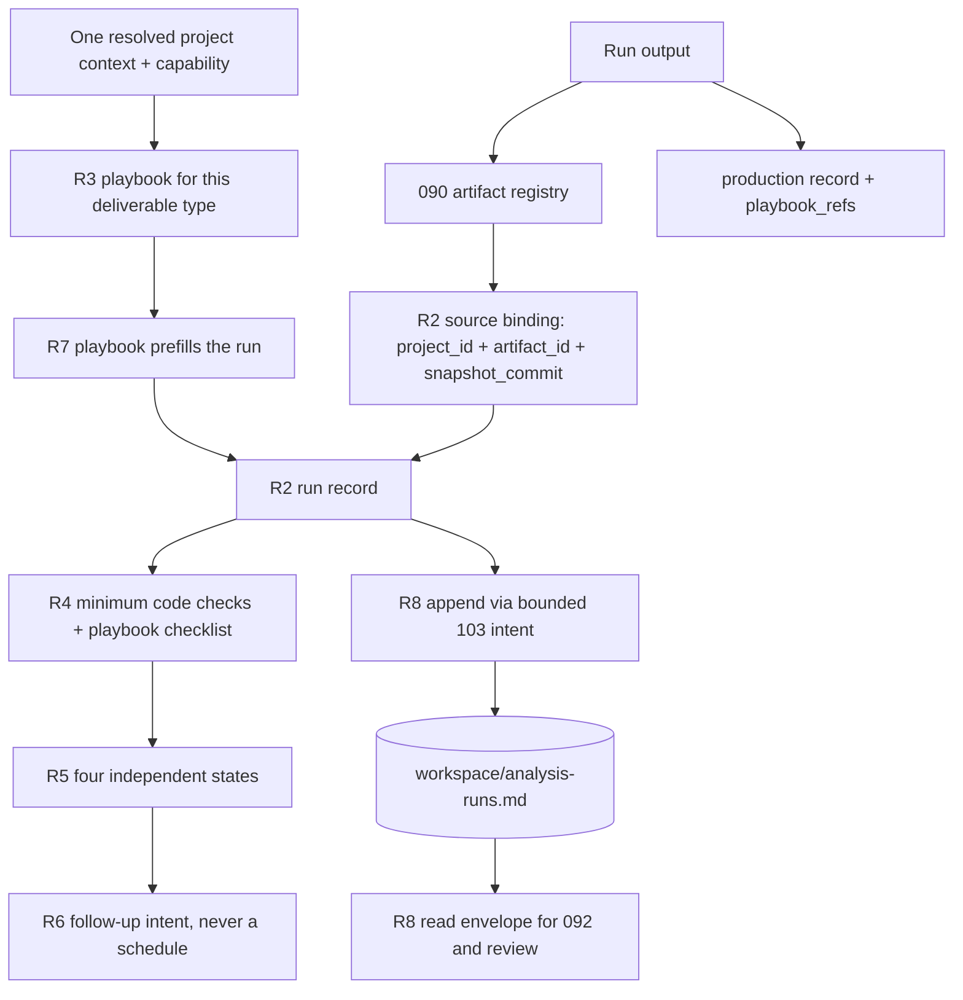

# Spec: Reproducible Analysis Runs and Template Pack

Issue: `091-reproducible-analysis-runs-and-template-pack` · [GitHub #21](https://github.com/dongwonlee222/moduflow/issues/21)
Owner / decision maker: Dongwon Lee
Phase: draft contract for review, revision 2 of 2026-09-03. No implementation, lifecycle transition, publication or installation is authorized by this document.
Source: [existing issue](../../issues/091-reproducible-analysis-runs-and-template-pack.md), `workspace/roadmap.md` scope reconciliation of 2026-09-02, the delivered [090 contract](../090-project-knowledge-and-artifact-registry/spec.md) R2/R4/R6, the delivered `moduflow.playbook.v1` and `moduflow.production-record.v1` templates, and [the 2026-09-03 benchmark](../../knowledge/benchmarks/2026-09-03-deliverable-playbook-and-analysis-run-benchmark.md).
Prev: 090 complete (0.3.57 published/installed) · Next: `product:plan` review, then explicitly approved implementation.

## Problem

The owner is re-explaining the same recurring request every time. A weekly usage analysis and an occasional off-cycle policy analysis both need the same thing said again: which population, which window, which checks, which document form, which approved wording. Nothing in the repository holds that per project and per deliverable, so it is re-spoken instead of reused.

Underneath that, three failures follow from analyses whose basis is not recorded.

1. **A conclusion cannot be re-derived.** The prior run's source tab, extraction time, exclusion rules and query are not stored where a later task can read them, so a repeat analysis produces a different number with no explanation.
2. **Unproven claims read as proven.** A completed run, a validated run, a human-approved run, and a run still waiting for mature data are all presented as "the analysis says X". Unknown costs read as zero; trend differences read as causal.
3. **Document form and approved wording drift.** `moduflow.playbook.v1` already holds `Approved Copy Blocks` and `Approved Structures`, but nothing connects an analysis run to the playbook it used, so consistency is not actually enforced.

Issue 090 made materials findable and pinnable. Nothing yet makes the analysis that consumed them repeatable.

## Goals

1. Make a recurring request reusable: the second run of the same deliverable needs no re-explanation.
2. Record every analysis as an append-only run keyed by `(project_id, issue_id, run_id)` with explicit source, method and evidence provenance.
3. Bind each run to 090 artifact records by `(project_id, artifact_id, snapshot_commit, locator, recorded_state)` and to the playbook version it used.
4. Keep run completion, validation, human approval and decision maturity as four independent states.
5. Carry per-deliverable process and verification in the existing playbook rather than a second template system.
6. Let a later run state what changed from the run it supersedes, and why.

## Non-Goals

- No calculation engine, notebook, SQL runner, chart renderer, crawler, vector store, database, lineage engine or upload. ModuFlow records the contract and evidence; replaceable external tools perform the analysis.
- No scheduler, queue, timer or automatic re-run. A stored follow-up date is intent only. Nothing here makes a weekly analysis start by itself.
- No second template system beside playbooks, and no ordered-process format invented inside ModuFlow.
- No company production data, metric values, cost formulas, KPI definitions or credentials in the plugin or in a shared record.
- No second registry, parser or transaction engine. 090 owns artifact registration; 103 owns lifecycle transactions; 085 owns the playbook and production record formats.
- No document-generation framework, no approval screen and no approval workflow. An approval is a date and a link.
- No organization-wide playbook promotion (owned by 107) and no production final-state gate (owned by 108).
- No external `company → project → issue` profile chain in this issue. See Deferred Scope.
- No UI. 086 and 092 consume the read contract below and own their views.

## Requirement Reconciliation

`E*` rows are existing issue requirements; `A*` rows are the 2026-09-02 roadmap additions. No existing requirement is dropped.

| Origin | Requirement | Status | Resolved in |
| --- | --- | --- | --- |
| E1 | Run schema: source, tab/range, extraction timestamp, hash, grain, period, filters, exclusions, processing, code/query, outputs, caveats, conclusion, decision links | Kept, extended by A2/A4 | R2 |
| E2 | Append-oriented history recording why a conclusion or method changed | Kept | R1, R2 `supersedes` / `change_reason` |
| E3 | Five templates: monthly trend, CPO change, amount band, slow/fast charging, policy impact | **Kept — delivered as default analysis playbooks, not dropped** | R7 |
| E4 | `product:analyze --template <name>` guidance or equivalent routing | Kept, resolves against playbooks | R8 |
| E5 | Links from runs to issues, knowledge entries, artifact records, reports, decision records | Kept, tightened to typed ID references | R2, R8 |
| E6 | Validation and examples on synthetic data; `release_check.py` passes | Kept | AC10, [simulation matrix](simulation-matrix.md) |
| A1 | External `company → project → issue` profile reference with version/hash; a lower level cannot relax a higher level's constraint | **Deferred** | Deferred Scope |
| A2 | Record decision question, population/comparison, numerator/denominator, window, maturity, applicable costs, method and checks | Extends E1 | R2 |
| A3 | Checks appropriate to exploratory / profitability / causal claims; explained non-applicability; unknown costs never zero | Kept, split between code and playbook | R4 |
| A4 | Record skill/adapter versions, query/code hashes and snapshots, with explicit missing evidence | Kept | R2 `execution_evidence` |
| A5 | Append-oriented runs keyed by project/issue/run, linked to analysis, metrics, validation and decisions | Kept | R1, R2 |
| A6 | Distinguish run completion, validation, human approval, and a decision waiting for mature data | Kept | R5 |
| A7 | A D+30 follow-up date is stored intent, not a registered schedule | Kept | R6 |
| A8 | A formal final result needs a real issue association; `unassigned` is an exploratory holding state | Kept | R5 |
| A9 | Company documents reuse existing workflows; 091 is not a document framework; 107/108 keep their boundaries | Constraint | Non-Goals, R3 |
| A10 | Simulation: profile selection, template applicability, missing validation, immature observation window | Kept, profile rows replaced by playbook rows | [simulation matrix](simulation-matrix.md) |

The only existing-issue wording whose meaning changes is E5: links become typed ID references, because 090 R6 forbids path-derived or title-matched references.

## Deferred Scope

**A1, the external profile chain, is deferred out of this issue.** It presumes an external company standards document with versions and hashes that does not exist yet, its only test material would be synthetic fixtures, and it is unrelated to the recurring-request problem this issue solves. When a real external standard exists, it attaches as one additional field on the playbook, not as a new mechanism. Deferring it also closes the spec's former open question Q1.

## Existing Implementation and Reuse

Inspected baseline: `3585e84` on `codex/090-knowledge-registry-integration`, equal to `origin/main`. Observations of this checkout, not installed-package evidence.

| Existing surface | Reuse | Missing behavior / restriction |
| --- | --- | --- |
| `scripts/project_artifact_registry.py` (090, delivered) | `read_artifact_registry`, `read_artifact_sources`, `plan_artifact_registration`, `apply_artifact_registration`, `validate_entry`, `parse_artifact_registry` | No run concept; **read-only for this issue.** Consumers must not add a second registry parser (C8) |
| `templates/production/playbook.md` (`moduflow.playbook.v1`) | `applies_to_types`, `applies_to_channels`, `audiences`, `version`, `status`, `approved_by/at`, `source_records`, `review_after`, `superseded_by`, `Approved Copy Blocks`, `Approved Structures`, `Do Not Repeat` | No process reference and no verification checklist. Adding them changes an 085-owned file — see Ownership Boundary |
| `templates/production/record.md` (`moduflow.production-record.v1`) | `deliverable_type`, `channel`, `audiences`, `variant`, `lifecycle`, `playbook_refs`, `Artifacts`, `Source Inputs`, `Decisions` | Not linked to any analysis run |
| `scripts/project_lifecycle_transaction.py` | Immutable planning, same-project lock, journal, rollback, recovery, six terminal outcomes, the bounded `artifact-register` precedent | No run-append intent; the planner must not re-render state/loop/roadmap/dashboard for a run append |
| `scripts/project_registry.py`, `scripts/project_operation.py` | Resolved registry v2 context; read/write capability decision | Identity is not permission; `project_id=null` runs emit no cross-project reference |
| `scripts/validate_project_artifacts.py`, `scripts/project_doctor.py`, `scripts/release_check.py`, `scripts/validate_moduflow.py`, `config/project-operation-entrypoints.json` | Single validation/diagnostic entry points and mutation-ownership registration | Must gain one run-schema consumer, not a competing validator |
| `commands/product-analyze.md`, `skills/data-analysis-bridge/SKILL.md` | Existing required-field list | No playbook selection, no run record, no claim class, no state separation |

Absent at this baseline and therefore new work: any `analysis_run` module, any analysis-run test, and any default analysis playbook.

## Ownership Boundary

R3 and R7 require two additive fields on `moduflow.playbook.v1`, which is owned by Issue 085 and also on the future path of Issues 107 and 108. `workspace/goal.md` states that Issues 085 and 086 are extended through follow-ups, not replaced.

**Resolved 2026-09-03 by Dongwon Lee.** [Issue 115](../../issues/115-playbook-process-and-checklist-extension.md) owns the additive `process_ref` and `Required Checks` change to `moduflow.playbook.v1` and `scripts/project_production.py` as a follow-up of Issue 085, and Issue 091 is blocked by it. Issue 091 consumes those two fields and does not modify either file. The known collision set for both issues is `scripts/project_production.py`, `templates/production/playbook.md`, `scripts/project_lifecycle_transaction.py`, `scripts/validate_moduflow.py`, `scripts/release_check.py` and `config/project-operation-entrypoints.json`; the first two are also on the path of Issues 107 and 108.

## Users & Scenarios

- The owner runs the weekly usage analysis for the second time and says only the week; population, window, checks, document structure and approved wording come from the playbook.
- An off-cycle policy request arrives, is captured as an issue, uses the policy-impact playbook, records `maturity=immature` and a D+30 follow-up condition that no scheduler has registered, and stays out of a settled conclusion.
- A reviewer sees a completed run that has not been validated and is not approved, and does not treat its number as a decision input.
- A profitability question with two unknown cost items is recorded as unknown-with-reason and cannot claim a margin result.
- An exploratory run with no owning issue is held as `unassigned`, is usable as a working note, and cannot become an approved final result until attached to a real issue.
- A fresh AI session reads the run, reopens the same pinned sources at the same commit, and reproduces the number rather than guessing.

## Proposed Solution



### R1 — One canonical run file, one parser, append-only

Runs live in `workspace/analysis-runs.md`, resolved through the canonical `workspace` role, not a hard-coded root. Non-default registered paths must work.

The file begins with `schema: moduflow.analysis-runs.v1` in frontmatter. Each `## run-<UUID>` section contains exactly one fenced `json` metadata object; the header ID and the object's `id` must agree. Prose outside record sections is preserved; a second metadata block inside a record section is invalid. Parsing uses the standard library with duplicate-key rejection, in exactly one module (C8).

IDs are immutable `run-` plus a lowercase UUIDv4, allocated once at preview through an injectable factory, reused on retry, unique within the file. A downstream reference is `(project_id, run_id)`; overlapping IDs in projects A and B never cross-resolve.

Writes are append-only (C5) in both directions. A new run is appended, and a correction to what the analysis *was* is a new run naming the run it supersedes. A change to what has since been *judged* about an existing run amends exactly the six fields listed in R5 in place and appends one entry to that record's own `state_history`. No existing text, source, method, conclusion or prior history entry is ever removed or rewritten, and a no-op leaves the file byte-identical.

### R2 — Run record schema

All keys are required. Nullable values and empty lists are explicit, never absent keys. Text fields are plain UTF-8; `title`, `decision_question` and `conclusion` are single lines of at most 240 characters. The metadata is itself reviewed for safe Git sharing: no production metric values, no credentials, no private absolute paths.

| Field | Type and rule |
| --- | --- |
| `id`, `title` | Stable `run-<uuid4>`; nonempty display title |
| `issue_id` | A full existing issue ID in this project, or the literal `unassigned` (R5) |
| `playbook_ref` | `{playbook_id, version, deliverable_type}` naming the playbook this run used, or null with a nonempty `playbook_absent_reason` (R3) |
| `decision_question` | One line stating the decision this run informs; nonempty |
| `claim_class` | `exploratory`, `profitability`, or `causal`; exactly one claim per run (R4) |
| `population` | `{definition, comparison, comparison_reason}`; `definition` nonempty; `comparison` nonempty or null with a reason |
| `measure` | `{numerator, denominator, denominator_reason, unit}`; `denominator` null only with a nonempty reason; `unit` nonempty |
| `time_window` | `{start, end, label, grain}`; inclusive ISO dates with nonempty label and grain, or both null with a nonempty label such as `not time-bound` |
| `maturity` | `{status, observation_until, reason}`; status `mature`, `immature`, `unknown`; `immature` requires both other fields |
| `costs` | `{applicable, items, unknown_items, reason}`; `items` are `{name, basis}` label-only entries with no amounts; a nonempty `unknown_items` forbids a settled profitability conclusion (R4) |
| `filters`, `exclusions` | Lists of `{rule, reason}`; may be empty |
| `method` | `{steps, tooling}`; `steps` is a nonempty ordered list of plain-language steps; `tooling` names the external tool without embedding its output |
| `sources` | List of `{project_id, artifact_id, snapshot_commit, locator, recorded_state, tab_or_range, extracted_at, content_hash}` per R8; empty only when `claim_class=exploratory` and `source_absence_reason` is nonempty |
| `execution_evidence` | `{skill_ref, skill_version, adapter_version, query_hash, code_hash, snapshot_ref, missing}`; every unavailable field is null **and** named in `missing` with a reason |
| `checks` | List of `{id, source, result, reason, evidence_ref}`; `source` is `code` or `playbook`; `result` is `pass`, `fail`, or `not_applicable`; `fail` and `not_applicable` require a nonempty reason (R4) |
| `outputs` | List of 090 artifact IDs registered for this run; empty for a run with no saved output |
| `production_record_ref` | Project-relative production record path when the output is a production deliverable, or null (R3) |
| `conclusion`, `caveats` | One-line conclusion; `caveats` is a list of nonempty lines, empty only when `claim_class=exploratory` |
| `decision_refs` | List of project-relative decision-record paths; may be empty |
| `run_state`, `validation_state`, `approval_state`, `decision_state` | Four independent enums per R5 |
| `approval_ref` | Existing project-relative human-approval evidence when `approval_state=approved`; otherwise null. No writer invents this value |
| `state_history` | Append-only list of `{field, from, to, reason, evidence_ref, recorded_at}` covering every amendment of the six mutable fields (R5). Entries are never edited or removed, and the newest entry for a field must equal that field's current value |
| `follow_up` | `{due_on, condition, scheduled}` or null; `scheduled` MUST be `false` (R6) |
| `supersedes`, `change_reason` | Another run ID in this project and a nonempty reason, or both null; missing target, self-reference and cycles are invalid |
| `created_at` | ISO date of the run record; never backdated to the source's reference date |

Example (synthetic; not a company record):

```json
{
  "id": "run-22222222-2222-4222-8222-222222222222",
  "title": "Synthetic A weekly usage, week 36",
  "issue_id": "001-synthetic-a",
  "playbook_ref": {"playbook_id": "pb-weekly-usage", "version": "1.0", "deliverable_type": "analysis"},
  "decision_question": "Did synthetic A usage change enough to revisit the plan?",
  "claim_class": "exploratory",
  "population": {"definition": "Synthetic A active records", "comparison": null, "comparison_reason": "single-cohort trend"},
  "measure": {"numerator": "session count", "denominator": "active record count", "denominator_reason": "", "unit": "sessions per record"},
  "time_window": {"start": "2026-08-31", "end": "2026-09-06", "label": "week 36", "grain": "week"},
  "maturity": {"status": "mature", "observation_until": null, "reason": "window closed"},
  "costs": {"applicable": false, "items": [], "unknown_items": [], "reason": "usage trend, no cost claim"},
  "filters": [{"rule": "synthetic region A only", "reason": "matches the question scope"}],
  "exclusions": [{"rule": "drop test records", "reason": "not real usage"}],
  "method": {"steps": ["extract tab", "aggregate by week", "compare to prior week"], "tooling": "external spreadsheet"},
  "sources": [{"project_id": "synthetic-a", "artifact_id": "art-11111111-1111-4111-8111-111111111111", "snapshot_commit": "0000000000000000000000000000000000000000", "locator": "knowledge/references/population.md", "recorded_state": "draft", "tab_or_range": "sheet1!A1:D200", "extracted_at": "2026-09-07", "content_hash": null}],
  "execution_evidence": {"skill_ref": null, "skill_version": null, "adapter_version": null, "query_hash": null, "code_hash": null, "snapshot_ref": null, "missing": [{"field": "skill_ref", "reason": "no external analysis skill declared by the playbook"}]},
  "checks": [{"id": "population-defined", "source": "code", "result": "pass", "reason": "", "evidence_ref": null}],
  "outputs": [],
  "production_record_ref": null,
  "conclusion": "Synthetic A usage rose week over week within the stated window.",
  "caveats": ["Synthetic fixture data; not a business measurement."],
  "decision_refs": [],
  "run_state": "completed",
  "validation_state": "unvalidated",
  "approval_state": "unapproved",
  "decision_state": "decided",
  "approval_ref": null,
  "state_history": [{"field": "run_state", "from": "draft", "to": "completed", "reason": "aggregation finished and reviewed by the author", "evidence_ref": null, "recorded_at": "2026-09-07"}],
  "follow_up": null,
  "supersedes": null,
  "change_reason": null,
  "created_at": "2026-09-07"
}
```

### R3 — The playbook is the per-deliverable carrier

A recurring request is fixed by a playbook, not by a new template format. `moduflow.playbook.v1` already scopes by `applies_to_types`, `applies_to_channels` and `audiences`, already lives in the project repository, and already carries `version`, `status`, `approved_by`, `source_records`, `review_after`, `superseded_by`, `Approved Copy Blocks` and `Approved Structures`. Analysis templates are playbooks with `applies_to_types: [analysis]`.

Two additive fields are required, owned per the Ownership Boundary above.

- `process_ref` — `{kind, ref, version, missing_evidence}` naming an external procedure such as an agent skill or an approved document, with its version. ModuFlow stores the reference; it does not store ordered steps and does not define a process format. A null `ref` is valid when `missing_evidence` explains the absence. A referenced procedure is never assumed installed.
- `Required Checks` — a numbered, human-owned checklist section (`CHK001`, `CHK002`, …), each item stating what a reviewer asserts. A checked item is a reviewer assertion, never proof that a run passed. Item IDs are stable across playbook versions; changing an item's meaning requires a new ID.

Copy and document form stay where they already are. When a run's output is a production deliverable, the run stores `production_record_ref`, and that record's existing `playbook_refs` names the same playbook. A run whose output claims a playbook different from the one recorded on its production record returns `PLAYBOOK_MISMATCH`. This is what actually holds document form and approved wording together across a weekly report and an off-cycle report.

Promoting a playbook across projects remains Issue 107. Enforcing a deliverable's final state remains Issue 108. Approval here is a recorded date and link, with no approval flow, screen or delegation.

### R4 — Minimum checks in code, deliverable checks in the playbook

Two layers, no duplication. Code enforces the general minimum for every analysis run; the playbook's `Required Checks` carries whatever a specific deliverable type needs.

| Check ID | exploratory | profitability | causal | Enforced by |
| --- | --- | --- | --- | --- |
| `population-defined` | required | required | required | code |
| `denominator-stated` | — | required | required | code |
| `cost-applicability-explicit` | — | required | — | code |
| anything else | playbook's choice | playbook's choice | playbook's choice | playbook checklist |

A required code check that is absent returns `CHECK_MISSING`, never a pass. A `not_applicable` with an empty reason returns `CHECK_UNEXPLAINED`. Any `fail`, from either layer, blocks `validation_state=passed`. Every `pass` on a `profitability` or `causal` run must carry an `evidence_ref` that already exists, because ModuFlow performs no calculation and a check result is the author's assertion, not a verification the tool made.

Cost handling is explicit in both directions. When `costs.applicable` is true, `unknown_items` must be enumerated, and a nonempty `unknown_items` with a settled profitability conclusion returns `COST_UNKNOWN_NOT_ZERO`. An unknown cost is never rendered, summed or defaulted as `0`. When `costs.applicable` is false, `reason` must state why the question carries no cost claim.

Exactly one claim per run. A question that yields both a trend and a margin is two runs, linked by `decision_refs`. The validator judges recorded structure only; it never rewrites or grades the author's prose.

### R5 — Four independent states, amendment boundary, unassigned holding

| State | Values | Meaning |
| --- | --- | --- |
| `run_state` | `draft`, `completed` | The analysis work itself is finished |
| `validation_state` | `unvalidated`, `passed`, `failed` | The required checks were evaluated and their outcome |
| `approval_state` | `unapproved`, `approved` | A human recorded an approval with linked evidence |
| `decision_state` | `decided`, `waiting_on_maturity`, `superseded` | Whether the decision this run informs has been taken |

No state implies another. `approval_state=approved` requires a nonempty `approval_ref` that already exists, and no writer invents it (C6). `decision_state=waiting_on_maturity` requires `maturity.status=immature` or a nonempty `follow_up.condition`. A read surface that collapses these four into one word is invalid.

**Amendment boundary.** Exactly six fields may be amended in place on an existing run; every other change is a new superseding run (R1).

| Amendable in place | New superseding run required |
| --- | --- |
| `run_state`, `validation_state`, `approval_state`, `approval_ref`, `decision_state`, and a one-time `issue_id` promotion out of `unassigned` | every other field, including `playbook_ref`, `sources`, `method`, `checks`, `conclusion` and `caveats` |

The six amendable fields record a judgment *about* a finished analysis; every other field records the analysis itself, and changing it in place would destroy reproducibility. Every amendment appends one `state_history` entry with a nonempty `reason`, and an `evidence_ref` that already exists whenever it sets `approval_state=approved` or `validation_state=passed`. An amendment with no history entry, a history entry disagreeing with its field's current value, an edit to an existing entry, or an amendment outside the left column returns `RUN_AMENDMENT_FORBIDDEN`.

`issue_id=unassigned` is an exploratory holding state. Such a run may be completed, validated and superseded, but cannot be approved or presented as a formal final result: both return `RUN_UNASSIGNED_NOT_FINAL`. Promotion to a real issue is allowed once, only from `unassigned`, and never rewrites an existing association. An explicit-root legacy context with `project_id=null` and `identity_status=unbound` emits no cross-project run reference at all.

### R6 — Follow-up is stored intent, never a schedule

`follow_up.scheduled` MUST be `false`; any other value returns `FOLLOW_UP_NOT_SCHEDULABLE`. Storing a `due_on` and a `condition` registers no timer, job, cron entry, queue message or external runner, and this spec authorizes none.

At read time, using the injected evaluation date, a run whose `follow_up.due_on` has passed returns `FOLLOW_UP_DUE` as a warning with the run ID and condition, and every run with a follow-up returns `FOLLOW_UP_INTENT_ONLY` as info. Neither re-runs anything, changes any state, or claims an automation exists. A D+30 date is a note to a human.

### R7 — The five accepted analyses, delivered as default playbooks

The five accepted templates ship as default analysis playbooks under `templates/analysis-playbooks/`, each a `moduflow.playbook.v1` document with `applies_to_types: [analysis]`, a declared default `claim_class`, a `process_ref` (null with explained absence is valid), a numbered `Required Checks` checklist, and the sections the playbook schema already defines.

| Default playbook | Analysis | Default claim class |
| --- | --- | --- |
| `monthly-trend` | Monthly trend | `exploratory` |
| `cpo-change` | CPO change | `exploratory`, escalating to `causal` only with a comparison and confounder statement |
| `amount-band` | Amount-band user analysis | `exploratory` |
| `charging-speed` | Slow/fast charging analysis | `exploratory` |
| `policy-impact` | Policy-change impact | `causal` |

**Resolution order.** A project's own playbook wins over a default of the same name; a project playbook with a new name is simply added. Defaults are read-only and are never edited in place by a project. Different projects therefore hold different playbooks without a shared mutable file.

**Prefill is the point.** Selecting a playbook fills the run's `claim_class`, `measure.unit`, the `Required Checks` skeleton, the default caveats and the document structure, so the second run of a recurring request needs only its window. This is the mechanism that removes the repeated explanation.

**Where a project playbook comes from.** A project override only helps if the project file exists, and hand-authoring the first one costs more than the explanation it replaces. Two explicit origination paths close that, and both are preview-first and reuse the existing playbook write path in `scripts/project_production.py` rather than adding a second writer.

- **Scaffold.** Copy a read-only default into the project as a starting point, under the same name, with `version: 0.1` and `status: candidate`. The default is never modified; the copy is an ordinary project playbook from that moment.
- **Promote a run.** Turn a completed run into a new project playbook, or into a proposed update of an existing one, by projecting fields the run already stores: `claim_class`, `measure.unit`, the `checks[]` IDs, `caveats`, and the structure the output used. Promotion never invents `Approved Copy Blocks`, never sets `approved_by` or `approved_at`, and produces `status: candidate` for human review. Nothing is promoted automatically; the author asks for it.

Both paths refuse to overwrite an existing project playbook silently: an existing file is either left alone or receives an explicit, reviewed update through the existing decision path. This is the mechanism that answers "I just explained this once — remember it".

**Validation strength differs by layer.** A default playbook naming a check ID that is neither a code check nor defined in its own checklist fails the build. A project playbook in the same condition returns a diagnostic, never a build failure — user-authored content must not be blocked by the plugin's build.

Defaults are vendor-neutral: they name required inputs as Sheet/CSV/XLSX/SQL-extract/local-file shapes and contain no company metric definition, cost formula, rate, threshold or KPI value.

### R8 — Read contract, bindings, append, routing

**Read facade.** `read_analysis_runs(root, *, project_context, view="working", ref="HEAD", query="", run_ids=(), issue_id=None, limit=20, runner=None, today=None) -> dict`. One resolved context per call; a capability read check precedes any project content. `view` is `working` or `shared`; refs resolve without a shell and only committed trees are supported.

Envelope: `schema="moduflow.analysis-run-read.v1"`, `project_id`, `identity_status`, `view`, `snapshot_commit` (null for working), `runs_path`, `entries`, `diagnostics`, `total`, `returned`, `omitted`, `truncated`, `read_trace`. Default limit is 20 and every bound reports itself (C11). Each entry carries R2 metadata, `run_anchor`, `match_reasons`, the four states kept separate, and R3–R6 diagnostics. The envelope never contains source bodies, absolute roots, or another project's payload.

**Source binding to 090.** Reopening a pinned source calls the delivered `read_artifact_registry` and `read_artifact_sources` with the run's stored `snapshot_commit` as `ref`; 091 implements no registry parser. A `project_id` mismatch, unknown `artifact_id`, unknown schema or superseded input returns an explicit diagnostic; a similarly titled record is never substituted, and the snapshot is never switched. A recorded `recorded_state` of `approved` describes the material at pin time and never means this run passed its checks.

**Playbook binding.** A run resolves its playbook through the R7 order, stores `{playbook_id, version, deliverable_type}`, and reports `PLAYBOOK_VERSION_CHANGED` as info when the current project playbook version differs from the pinned one. A missing or unresolvable playbook returns `PLAYBOOK_UNRESOLVED`; it does not silently fall back to a default of the same name.

**Output registration.** Outputs register through 090's existing boundary (`plan_artifact_registration` / `apply_artifact_registration`) and the run stores the returned artifact IDs. When the output is a production deliverable, the run stores `production_record_ref` and the mismatch check of R3 applies. 091 adds no second registration path and no arbitrary-file writer.

**Append.** Appending a run, and amending its six mutable fields, is a bounded `analysis-run-append` intent in the existing 103 transaction owner. It changes only `workspace/analysis-runs.md` and, when `issue_id` is a real issue, one append-only `Analysis Runs` backlink to the stable run anchor. Retry is byte-identical. It preserves issue lifecycle, state, goal, loop, roadmap and dashboard bytes, reuses the existing lock, journal, rollback, recovery and six terminal outcomes, and exposes no general file-transaction API. Default is a read-only preview.

**Routing.** `commands/product-analyze.md` gains playbook selection over resolved names, preview-before-apply, required claim class, and the four states reported separately. `skills/data-analysis-bridge/SKILL.md` extends its required-field list to the R2 fields. Neither introduces a runtime.

## Alternatives Considered

1. **Recommended: playbooks carry the deliverable contract; one append-only run file carries provenance.** Reuses the delivered playbook, production record, 090 registry and 103 transaction; adds one parser and two playbook fields. Cost: it depends on an 085-owned file, which the Ownership Boundary addresses.
2. **A separate `templates/analysis/` layer, as in revision 1 of this spec.** Rejected: a second per-project template system beside playbooks, with its own versioning and approval, contradicting C8 and the 2026-09-03 benchmark.
3. **Ordered process steps embedded in the playbook.** Rejected: duplicates what portable skill packages already carry versioned, and makes ModuFlow own a procedure format it does not need.
4. **Per-issue run files under `specs/<issue>/runs/`.** Rejected: an `unassigned` run has no issue directory, and cross-issue history becomes a directory walk.
5. **A JSON or SQLite run store.** Rejected: breaks Git-native review and adds a second persistence engine.

## Acceptance Criteria

- **AC1** A completed run records decision question, source binding, window and grain, filters, exclusions, method, output, caveats and conclusion, and a later run states what changed from the run it supersedes and why.
- **AC2** The five accepted analyses exist as default playbooks with a declared claim class, a numbered `Required Checks` checklist and a `process_ref` field, containing no company metric, cost or KPI logic.
- **AC3** A project playbook of the same name overrides a default, a new name is added, defaults are never edited in place, and two projects can hold different playbooks without a shared mutable file.
- **AC3b** A project playbook can be created two ways without hand-authoring: scaffolding a default into the project, and promoting a completed run. Both preview first, produce `status: candidate`, never set approval fields, never invent approved copy, and never silently overwrite an existing project playbook.
- **AC4** A run binds sources by `(project_id, artifact_id, snapshot_commit, locator, recorded_state)`, reopens them through 090's delivered facades, and never substitutes a renamed or similarly titled record.
- **AC5** A run stores the playbook id and version it used; a production deliverable whose production record names a different playbook returns `PLAYBOOK_MISMATCH`.
- **AC6** The three code checks cannot be absent or silently passed; `not_applicable` requires a reason; any `fail` blocks `validation_state=passed`; a `pass` on a profitability or causal run requires existing evidence.
- **AC7** An unknown cost is never treated as zero, and a profitability run with unresolved unknown cost items cannot record a settled profit conclusion.
- **AC8** Run completion, validation, human approval and decision maturity are stored and reported as four independent states; approval requires existing linked evidence; every state change appends a `state_history` entry whose newest value matches the current field, and no prior entry is edited or removed.
- **AC9** An `unassigned` run can be completed and validated but cannot be approved or presented as a formal final result; promotion is a one-time recorded amendment; amending any field outside the six mutable ones is rejected.
- **AC10** A stored follow-up registers no scheduler, `scheduled` is always false, and a due follow-up produces a read-time diagnostic only. Outputs register through 090, decision records stay separate and linked, validation uses non-sensitive fixtures, and `python3 scripts/release_check.py .` passes.

## Acceptance Demonstration

Tests passing is not the completion bar. On two synthetic projects, the following must be observed and recorded before Issue 091 is called done.

1. Create one project playbook for a weekly analysis deliverable, with a `Required Checks` checklist and a null `process_ref` with explained absence.
2. Run it once, supplying every field.
3. Run it a second time supplying **only the time window**, and observe that claim class, measure unit, checks skeleton, caveats and document structure came from the playbook without being restated.
4. Run the off-cycle policy-impact deliverable in the same project, and observe that its output's production record names the same playbook family and that `maturity=immature` with a D+30 condition is recorded without any scheduler.
5. Repeat step 3 in the second synthetic project with its own differing playbook, and observe no cross-project leakage.

If step 3 does not remove the re-explanation, the issue has not met its purpose regardless of test results.

## Risks & Open Questions

- **Shared-file risk.** The two playbook fields touch an 085-owned file that 107 and 108 also need. Ownership is now Issue 115, so the remaining risk is scheduling: Issue 115 must land before Issue 091's Stream E, and the collision set must be re-checked against the integration base before either starts.
- **Solo-approver risk.** Author and approver are the same person today, so `approval_state` can become a rubber stamp. Mitigation is deliberate minimalism: an approval is a date and an existing link, with no approval flow to perform.
- **Run-file growth.** A long-lived project accumulates runs in one file. R8's explicit limits bound the read; a compaction or sharding contract is out of scope and should be its own issue if it becomes a real problem.
- **Claim-class judgment.** The validator checks structure, not prose. A misclassified run can still carry an overreaching sentence; the playbook's interpretation cautions and human review are the mitigation, not automated language policing.
- **External procedure absence.** A `process_ref` may point at a skill that is never installed. Every run must stay valid with the reference recorded and its absence explained; the contract must not degrade into requiring an unavailable tool.

## Next Command

`product:spec 115-playbook-process-and-checklist-extension` first, since Issue 091 is blocked by it. Then review the [implementation plan](plan.md) and the [simulation matrix](simulation-matrix.md) and request explicit implementation approval for Issue 091. This spec authorizes no code change.
