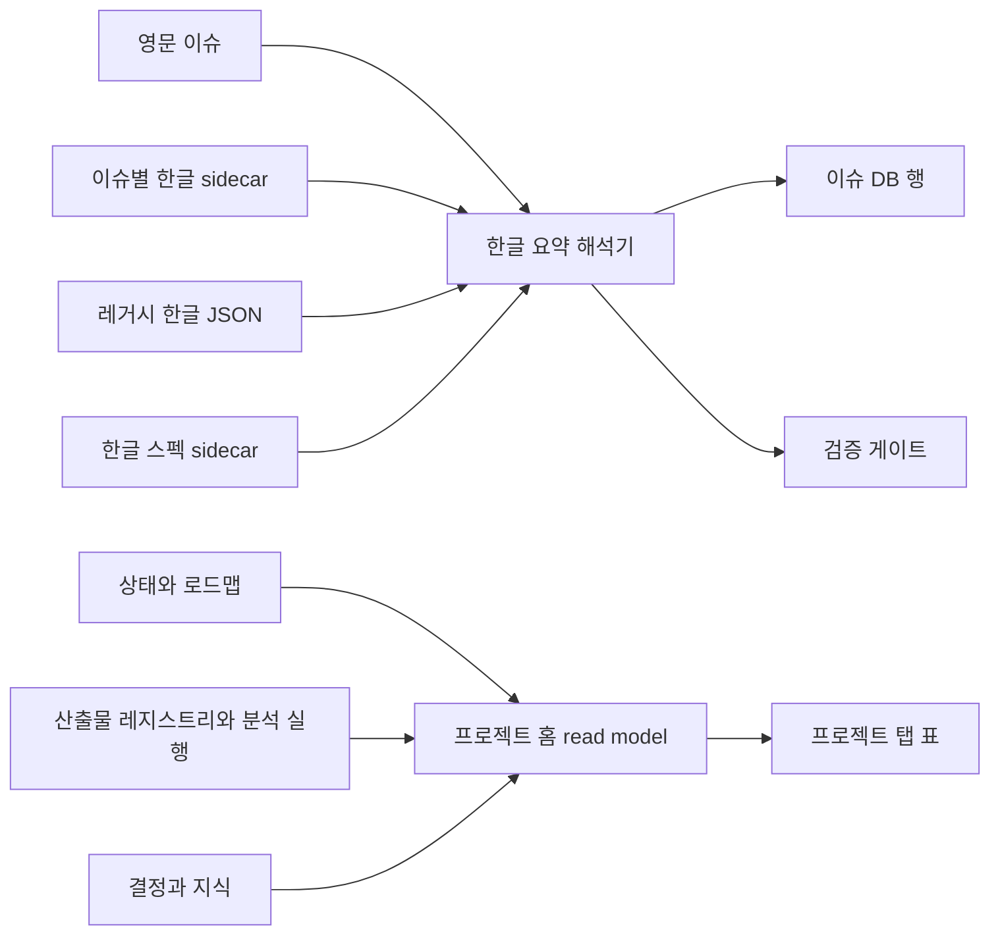

# 디자인: 현재 시각 셸을 유지하는 점진적 프로젝트 대시보드

이슈: `092-project-home-dashboard` · 스펙: `specs/092-project-home-dashboard/spec.md`

## 결정

현재 생성형 대시보드를 점진적으로 개선합니다. 카드 중심 신규 시안은 구현하지 않습니다. 기존 이슈 DB를 기본 화면으로 유지하고 현재 탭, 글꼴, 색상, 테두리, 배지, 다크 모드와 정보 밀도를 시각 기준으로 삼습니다.

## 정보 구조

탭 순서는 다음과 같습니다.

1. `이슈 DB` — 기존 기본 경로 `#issue-db` 유지
2. `프로젝트` — `#project`에서 작은 프로젝트 표 제공
3. `이슈 그래프` — 기존 동작 유지
4. `지식 그래프` — 기존 동작 유지

프로젝트 탭은 카드 대신 두 개의 표를 사용합니다.

- **현재 상태**: 진행 이슈, 막힘, 다음 행동, 담당자, 갱신일
- **최근 근거와 결론**: 산출물 종류, 제목, 최종/초안, 결론, canonical 원본, 담당자, 갱신일

필터와 빈 상태는 이슈 DB의 컨트롤과 간격을 재사용합니다. 프로젝트 홈 read model이 없는 경량 프로젝트에서는 프로젝트 탭 자체를 숨겨 빈 메뉴가 생기지 않게 합니다.

## 컴포넌트와 경계

### 한글 요약 해석기

`{text, language, source, stale}`을 반환하는 단일 해석기를 둡니다. 이슈별 한글 sidecar를 먼저 읽고 이후 레거시 원본을 사용합니다. 실시간 번역은 하지 않습니다. 대시보드와 검증기가 같은 해석기를 사용해 화면 정책과 릴리즈 정책이 어긋나지 않게 합니다.

### 프로젝트 홈 read model

canonical 상태, 이슈, 산출물 레지스트리, 지식, 분석 실행, 결정 기록을 읽어 렌더링용 JSON을 만듭니다. 브라우저 상태를 해석하거나 파일을 쓰지 않습니다.

### 기존 셸 렌더러

`PROJECT_VIEW_TEMPLATE`에 탭 하나와 표 두 개만 추가합니다. 기존 표 primitive를 재사용하며 카드 컴포넌트, 새 그리드 시스템, 별도 디자인 토큰을 도입하지 않습니다.

### 한글 필수 게이트

`product:issue` 문서와 템플릿은 영문 이슈와 한글 sidecar를 함께 요구합니다. 프로젝트 검증은 공통 해석기를 호출해 누락된 이슈 ID와 해결 경로를 오류로 반환합니다. 릴리즈 검사도 이 오류를 상속합니다. 기존 한글 원본은 계속 인정하므로 이미 현지화된 이슈를 기계적으로 다시 작성할 필요가 없습니다.

## 데이터 흐름

## 상호작용과 반응형 동작

- `#issue-db`를 계속 기본 화면으로 엽니다.
- `#project`는 링크 공유와 브라우저 뒤로/앞으로 이동을 지원합니다.
- 표 행은 canonical 로컬 또는 HTTPS 원본으로 연결합니다.
- 데스크톱은 기존 표 밀도를 유지합니다. 모바일은 같은 테두리와 레이블을 사용해 각 행을 key/value 블록으로 쌓으며 가로 페이지 넘침을 허용하지 않습니다.
- 방어적으로 영문을 표시할 때만 `EN` 배지와 한글 누락 플래그를 함께 보여줍니다.

## 오류와 빈 상태

- 한글 누락: 예상 sidecar 경로와 이슈 ID를 포함한 검증 오류를 내고, 대시보드 fallback에는 `EN`을 표시합니다.
- canonical 원본 누락: `연결 필요`를 표시하고 결론이나 링크를 만들어내지 않습니다.
- 오래된 기록: 원본 갱신일과 `오래됨` 배지를 표시합니다.
- 최근 산출물·결론 없음: 관련 다음 ModuFlow 명령을 포함한 작은 빈 표 행 하나를 보여줍니다.
- 프로젝트 혼합: 프로젝트 탭에서 해당 행을 제외하고 프로젝트 범위 검증 오류를 표시합니다.

## 검증

- 한글 탐색 우선순위, sidecar 파싱, 레거시 fallback, 누락 오류, 오래됨 표시 단위 테스트
- 보강 후 실제 91개 이슈가 모두 한글 요약을 반환하는 저장소 테스트
- 탭 순서, 기본 경로, 작은 표 구조, 원본 링크, 카드·사이드바 마크업 부재를 확인하는 대시보드 DOM 테스트
- 기존 이슈 DB·그래프·상세 화면 회귀 테스트
- 데이터 있음·빈 상태·오래됨·영문 fallback fixture의 데스크톱/모바일 Playwright 캡처
- `python3 scripts/validate_project_artifacts.py .`와 `python3 scripts/release_check.py .`

## 제외한 시안

`moduflow-dashboard-v1.png`는 참고 이미지로만 남기고 구현 원본으로 사용하지 않습니다. 큰 헤더 블록, 카드형 요약 띠, 넓은 빈 영역은 승인된 고밀도 운영 대시보드 방향과 맞지 않습니다.
