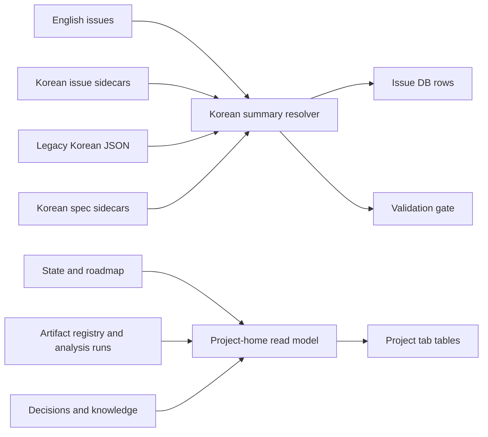

# Design: Incremental Project Dashboard in the Existing Visual Shell

Issue: `092-project-home-dashboard` · Spec: `specs/092-project-home-dashboard/spec.md`

## Decision

Evolve the current generated dashboard. Do not implement the card-heavy visual concept. The existing Issue DB remains the default view and the current tabs, typography, colors, borders, badges, dark mode, and information density remain the visual baseline.

## Information Architecture

The tab order becomes:

1. `이슈 DB` — unchanged default route `#issue-db`.
2. `프로젝트` — compact project-home tables at `#project`.
3. `이슈 그래프` — existing behavior.
4. `지식 그래프` — existing behavior.

The Project tab uses two tables rather than cards:

- **현재 상태**: active issue, blocker, next action, owner, updated date.
- **최근 근거와 결론**: artifact type, title, final/draft state, conclusion, canonical source, owner, updated date.

Filters and empty states reuse the Issue DB controls and spacing. The Project tab is omitted when no project-home read model exists, so lightweight projects do not gain an empty navigation item.

## Components and Boundaries

### Korean summary resolver

A focused resolver returns `{text, language, source, stale}`. It reads the issue-local Korean sidecar first, then legacy sources. It never translates at runtime. The dashboard and validators consume the same resolver so display and release policy cannot disagree.

### Project-home read model

A collector reads canonical state, issues, artifact registry, knowledge, analysis-run, and decision records. It emits plain JSON data for rendering. It does not parse browser state or write files.

### Existing-shell renderer

The renderer adds one tab and two table sections to `PROJECT_VIEW_TEMPLATE`. Existing table primitives are reused. No card component, grid system, or new visual token set is introduced.

### Localization gate

`product:issue` documentation/templates require an English issue plus Korean sidecar. Project validation calls the shared resolver and raises an actionable error listing missing issue IDs. Release checks inherit that failure. Legacy sources remain valid, which avoids forcing a mechanical rewrite of already localized issues.

## Data Flow

## Interaction and Responsive Behavior

- `#issue-db` continues to open by default.
- `#project` is shareable and browser back/forward safe.
- Table rows link to canonical local or HTTPS sources.
- Desktop uses the existing table density. Mobile renders each table row as a stacked key/value block using the same borders and labels; no horizontal page overflow is allowed.
- English fallback remains visible only as a defensive state and carries an `EN` badge plus a missing-Korean flag.

## Error and Empty States

- Missing Korean: validator error with issue ID and expected sidecar path; dashboard fallback is marked `EN`.
- Missing canonical source: show `연결 필요` and do not fabricate a conclusion or link.
- Stale record: show the source-derived updated date and `오래됨` badge.
- No recent artifacts or conclusions: one compact empty table row with the next relevant ModuFlow command.
- Mixed project data: reject the row from the Project tab and surface a project-scope validation error.

## Verification

- Unit tests for localization precedence, sidecar parsing, legacy fallback, missing-language errors, and stale markers.
- Real-repository assertion that all 91 current issues resolve Korean summaries after backfill.
- Dashboard DOM tests for tab order, default route, compact table structure, source links, and absence of card/sidebar markup.
- Existing Issue DB/graph/drill-down regression tests.
- Playwright desktop and mobile screenshots for populated, empty, stale, and English-fallback fixtures.
- `python3 scripts/validate_project_artifacts.py .` and `python3 scripts/release_check.py .`.

## Rejected Visual Concept

`moduflow-dashboard-v1.png` is reference-only and is not an implementation source. Its large header blocks, card-like summary band, and empty content region conflict with the approved dense operational dashboard direction.
