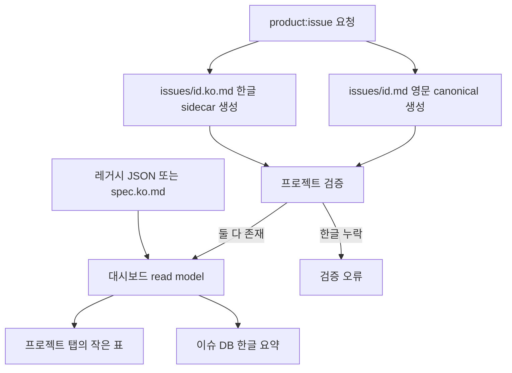

# 스펙: 현재 화면 기반 프로젝트 대시보드와 한글 요약 필수화

이슈: `092-project-home-dashboard`
이전: `056-dashboard-database-list-view`, `086-project-aware-production-library-dashboard`, `090-project-knowledge-and-artifact-registry`, `091-reproducible-analysis-runs-and-template-pack` · 다음: `product:plan 092-project-home-dashboard`

## 문제

현재 대시보드는 정보 밀도가 높고 표 중심이라 빠르게 훑기 좋습니다. 이후 만든 카드 중심 시안은 실제 탐색 속도를 높이지 않으면서 장식과 빈 공간을 늘리므로 구현 기준으로 사용하지 않습니다. 또한 한글 요약이 선택 사항이고 레거시 한글 설명 목록이 최근 이슈까지 갱신되지 않아 전체 91개 중 17개가 영문으로 표시됩니다. 영문 canonical 정책은 유지하되 사람이 보는 화면의 언어는 일관되게 만들어야 합니다.

## 목표

1. 현재 대시보드 셸, 탭, 표 밀도, 색상과 기본 이슈 DB 화면을 유지합니다.
2. 카드 그리드·사이드바·히어로 화면 없이 같은 표 문법으로 프로젝트 정보를 추가합니다.
3. 이슈와 스펙의 영문 canonical은 유지하면서 사람에게 보이는 한글 요약은 필수로 만듭니다.
4. 최근 `090~094`를 포함한 영문 전용 17개 이슈를 모두 보강합니다.
5. 한글 요약 누락을 검증 오류로 처리해 같은 문제가 다시 생기지 않게 합니다.

## 제외 범위

- `moduflow-dashboard-v1.png` 시안을 기반으로 대시보드를 새로 만드는 작업
- 대시보드 백엔드, 브라우저 Git 쓰기, 번역 API
- 영문 canonical 파일을 한글로 교체하는 작업
- 큰 요약 카드, 상시 사이드바, 장식용 차트, 대시보드 전용 상태 복제
- 이슈 DB·이슈 그래프·지식 그래프의 source-of-truth 변경

## 사용자 시나리오

- 한국어 사용자는 대시보드에서 모든 이슈 요약을 한글로 읽습니다.
- 유지보수자는 영문 canonical 이슈와 한글 읽기용 sidecar를 한 번에 만들며, 한쪽이 빠지면 검증이 실패합니다.
- 검토자는 기존 디자인과 같은 표 형식의 `프로젝트` 탭에서 진행 이슈, 막힘, 최근 분석·리포트, 기준 Sheet, 결론, 담당자, 날짜, 다음 행동을 확인합니다.
- 기존 프로젝트는 `workspace/issue-descriptions.ko.json`과 기존 스펙 sidecar를 계속 사용하고, 신규 작성부터 이슈별 sidecar로 이동합니다.

## 제안 해결책

### 기존 셸 유지

`이슈 DB`를 계속 기본 탭으로 사용합니다. 기존 탭·표·배지·빈 상태 스타일을 재사용하는 `프로젝트` 탭 하나만 추가합니다. 프로젝트 상태와 산출물은 작은 표로 표시하고, 카드나 새로운 내비게이션 셸은 만들지 않습니다. `이슈 그래프`와 `지식 그래프`는 그대로 유지합니다.

### 한글 요약 계약

`issues/<id>.md`는 영문 canonical로 유지합니다. 신규 이슈는 사람용 한글 제목과 요약을 담은 `issues/<id>.ko.md`도 함께 생성합니다. 대시보드의 한글 탐색 순서는 다음과 같습니다.

1. 이슈별 `issues/<id>.ko.md`
2. 레거시 `workspace/issue-descriptions.ko.json`
3. 한글 spec/design/review sidecar
4. `EN` 배지가 붙은 영문 fallback

첫 구현에서 현재 영문 전용 17개 이슈를 모두 이슈별 한글 sidecar로 보강합니다. 이후 프로젝트 검증과 릴리즈 검사는 유효한 한글 요약이 없으면 오류를 반환합니다. `product:issue`는 영문 이슈와 한글 sidecar를 반드시 함께 만들도록 변경합니다.

## 검토한 대안

- **카드 중심 신규 대시보드**: 빈 공간과 별도 시각 언어, 탐색 부담이 늘어나므로 제외합니다.
- **현재 표의 번역만 수정**: 영문 fallback은 해결하지만 이슈 092에서 합의한 프로젝트 정보가 제공되지 않아 제외합니다.
- **실시간 기계 번역**: 네트워크·비용·인증정보·비결정성·새 실패 경로가 생겨 제외합니다.
- **경고만 표시**: 기존 선택적 규칙으로 이미 17개 누락이 생겼으므로 제외합니다.

## 승인 기준

1. 기본 `#issue-db` 화면은 기존 탭, 정보 밀도, 표 스타일과 동작을 유지합니다.
2. 작은 표 형식의 `#project` 탭에서 진행 이슈, 막힘, 최근 분석·리포트, 주요 Sheet, 결론, 다음 행동, 담당자와 갱신일을 확인할 수 있습니다.
3. 카드 그리드, 상시 사이드바, 히어로 영역, 대시보드 전용 원본 데이터는 추가하지 않습니다.
4. 보강 후 현재 91개 이슈가 모두 유효한 한글 요약을 가집니다.
5. 신규 이슈 작성은 `issues/<id>.md`와 `issues/<id>.ko.md`를 함께 만듭니다.
6. 이슈 sidecar·레거시 설명·한글 산출물 중 어느 것도 없으면 프로젝트 검증이 실패합니다.
7. 방어적인 영문 fallback에는 `EN` 배지를 표시하지만, 릴리즈 게이트가 신규 fallback 행의 배포를 막습니다.
8. 기존 이슈 DB, 이슈 그래프, 지식 그래프, 이슈 상세, 제작 기록과 플레이북 기능을 유지합니다.
9. 데스크톱과 모바일에서 표·컨트롤·긴 링크가 잘리거나 겹치지 않습니다.
10. 대시보드 단위 테스트, 프로젝트 검증, `python3 scripts/release_check.py .`가 통과합니다.

## 위험과 확인 사항

- 영문 이슈 수정 후 한글 sidecar가 오래될 수 있습니다. 구현 계획에는 결정적인 드리프트 신호를 추가하거나 이슈 수정 과정에서 두 파일을 함께 변경하도록 강제해야 합니다.
- 이슈 092는 완전한 프로젝트 범위 및 산출물 데이터를 위해 이슈 086, 090, 091에 계속 의존합니다. UI는 임시 데이터를 만들지 않고 이들의 canonical 출력을 사용해야 합니다.
- 긴 리포트나 Sheet 제목은 표를 넓힐 수 있습니다. 제한된 열 너비와 줄바꿈, 원본 링크를 사용하며 전체 값을 확인할 수 없게 잘라내지 않습니다.
