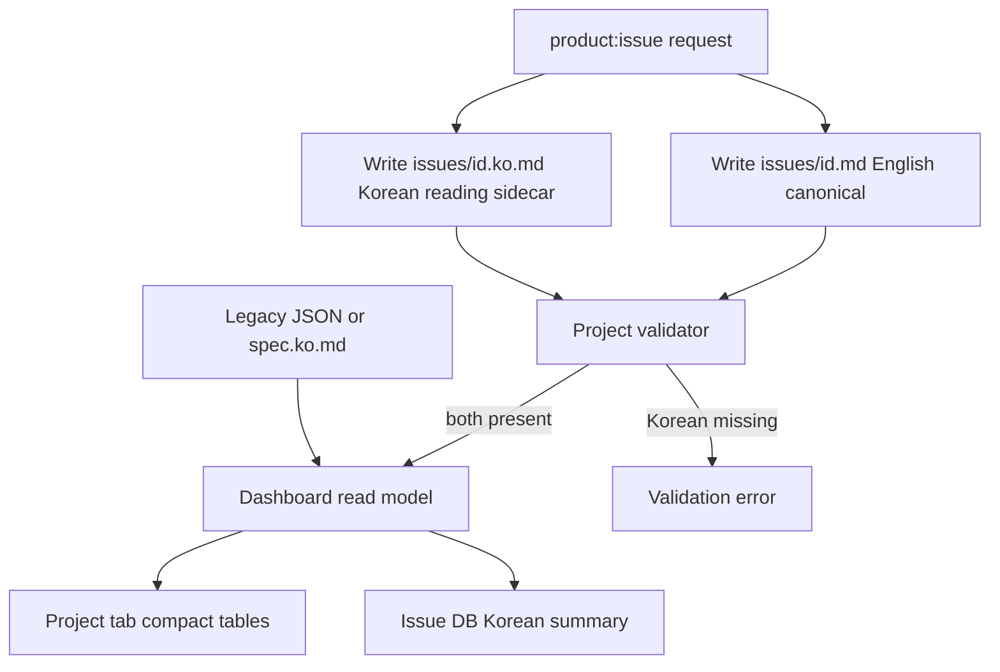

# Spec: Current-Shell Project Dashboard and Required Korean Summaries

Issue: `092-project-home-dashboard`
Prev: `056-dashboard-database-list-view`, `086-project-aware-production-library-dashboard`, `090-project-knowledge-and-artifact-registry`, `091-reproducible-analysis-runs-and-template-pack` · Next: `product:plan 092-project-home-dashboard`

## Problem

The current dashboard is useful because it is dense, table-oriented, and direct. A later card-heavy visual concept adds chrome and empty space without improving scan speed, so it should not become the implementation baseline. Separately, the dashboard falls back to English for 17 of 91 issues because Korean summaries are optional and the legacy override registry stops before the newest issues. This makes the human-facing view inconsistent even though English remains the correct canonical authoring language.

## Goals

1. Preserve the current dashboard shell, tabs, table density, colors, and default Issue DB view.
2. Add project-home information with the same compact table vocabulary rather than a card grid, sidebar, or hero layout.
3. Keep English issue/spec files canonical while making Korean summaries mandatory for human-facing issue rows.
4. Backfill the 17 current English-only rows, including recent issues `090` through `094`.
5. Make missing Korean summaries a validation error so the gap cannot silently return.

## Non-Goals

- Rebuilding the dashboard from the `moduflow-dashboard-v1.png` visual concept.
- Adding a dashboard backend, browser-side Git writes, or translation API.
- Translating canonical English files in place.
- Adding large summary cards, a permanent sidebar, decorative charts, or duplicated dashboard-only state.
- Changing the Issue DB, issue graph, or knowledge graph source-of-truth model.

## Users & Scenarios

- As a Korean product owner, I open the dashboard and read every issue summary in Korean without switching files.
- As a maintainer, I create a canonical English issue and its Korean reading sidecar in one workflow; validation refuses an incomplete pair.
- As a reviewer, I open the compact Project tab to find active issues, blockers, recent analyses/reports, canonical Sheets, conclusions, owners, dates, and next actions without leaving the existing visual system.
- As a legacy-project user, existing Korean descriptions from `workspace/issue-descriptions.ko.json` or spec sidecars continue to work while new authoring moves to issue-local sidecars.

## Proposed Solution

### Existing-shell dashboard

Keep `이슈 DB` as the default tab. Add one `프로젝트` tab using the existing tab, table, badge, and empty-state styles. It renders compact status and artifact tables; it does not introduce cards or a new navigation shell. Existing `이슈 그래프` and `지식 그래프` tabs remain unchanged.

### Korean summary contract

English remains canonical in `issues/<id>.md`. New issues also receive `issues/<id>.ko.md`, containing a concise Korean title/summary for human-facing views. Dashboard resolution order is:

1. issue-local `issues/<id>.ko.md`;
2. legacy `workspace/issue-descriptions.ko.json` entry;
3. Korean spec/design/review sidecar;
4. English summary fallback with a visible `EN` badge.

The first implementation backfills all 17 English-only dashboard rows with issue-local Korean sidecars. Project validation and release checks then treat a missing effective Korean summary as an error. The `product:issue` authoring contract requires the English canonical issue and Korean reading sidecar to be created together.

## Alternatives Considered

- **Card-heavy new dashboard**: rejected because it adds whitespace, a second visual language, and navigation weight.
- **Localization-only patch to the current table**: rejected because it fixes English fallback but does not provide the project-home information already accepted in Issue 092.
- **Runtime machine translation**: rejected because it adds network, cost, credentials, nondeterminism, and a new failure mode to a self-contained generated dashboard.
- **Warning-only localization policy**: rejected because the existing convention was already warning-level in practice and allowed 17 gaps to accumulate.

## Acceptance Criteria

1. The default `#issue-db` view keeps the existing tabs, density, table styling, and behavior.
2. A compact `#project` tab uses table/list styling and shows active issues, blockers, recent analyses/reports, key Sheets, conclusions, next actions, owners, and source-derived updated dates.
3. No card grid, permanent sidebar, hero region, or dashboard-only source data is added.
4. All 91 current issues resolve an effective Korean summary after backfill.
5. New issue authoring creates `issues/<id>.md` and `issues/<id>.ko.md` together.
6. Project validation fails when an issue has no issue sidecar, legacy override, or Korean artifact sidecar.
7. English fallback remains defensive and visibly marked `EN`, but the repository release gate prevents shipping a new fallback row.
8. Existing Issue DB, issue graph, knowledge graph, issue drill-down, production, and playbook behaviors remain available.
9. Desktop and mobile verification shows no clipped or overlapping tables, controls, or long source links.
10. Dashboard unit tests, project validation, and `python3 scripts/release_check.py .` pass.

## Risks & Open Questions

- A Korean sidecar can drift after its English issue changes. The plan must add a deterministic drift signal or require both files in the same issue-authoring/update workflow; silent drift is not acceptable.
- Issue 092 still depends on Issues 086, 090, and 091 for complete project scoping and artifact data. UI implementation must consume their canonical outputs rather than invent temporary dashboard records.
- Very long report and Sheet titles can widen tables. The design uses constrained columns, wrapping, and source links rather than truncating canonical titles without access to the full value.
