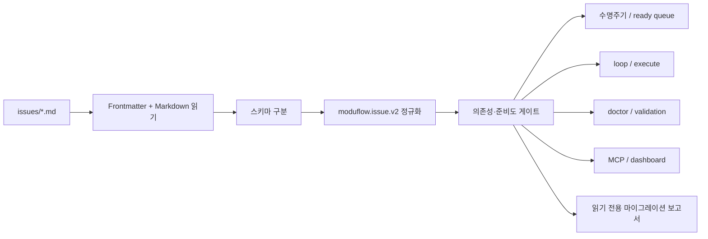

# 스펙: Frontmatter 이슈 스키마 및 실행 준비도·의존성 게이트

Issue: `093-frontmatter-issue-schema-readiness-gate`
이전: `048`, `069`, `077` · 다음: `product:plan`

## 문제

현재 ModuFlow는 이슈 파일을 한 가지 방식으로 해석하지 않습니다. 기본 수명주기 파서는 Markdown의 `Status`, `Priority`, `Blocked-by`를 읽지만, 모두페이 Biz 같은 프로젝트는 YAML frontmatter에 `canonical_state`, `status`, `definition_readiness`, `gate_state`, `depends_on`, `next_command`도 기록합니다.

두 영역이 모순돼도 현재 검증기는 이를 놓칠 수 있습니다.

- BIZ-038/039는 선행 이슈 BIZ-033이 아직 active인데도 `ready`, `product:execute`로 기록됐습니다.
- BIZ-040은 정의 준비도가 draft라서 먼저 스펙을 작성해야 합니다.
- 기존 검사는 frontmatter를 읽지 않아 이 상태를 정상으로 판단했습니다.

사용자 관점의 문제는 YAML 지원 자체가 아닙니다. **대시보드가 실행 가능한 것처럼 보이거나, 에이전트가 선행 작업과 스펙을 건너뛰는 것**이 문제입니다.

## 목표

1. Markdown 이슈와 버전 있는 frontmatter 이슈를 하나의 공통 모델로 해석합니다.
2. 상태, 의존성, 정의 준비도, 게이트, 산출물 단계, 다음 명령의 우선순위를 고정합니다.
3. 막혔거나 정의가 부족한 작업은 `product:execute`로 보내지 않습니다.
4. 기존 Markdown 프로젝트는 일괄 변환 없이 그대로 동작하게 합니다.
5. 수명주기, ready queue, loop, doctor, validation, MCP, 대시보드가 같은 해석을 사용하게 합니다.
6. 자동 수정 대신 사람이 이해할 수 있는 진단과 마이그레이션 제안을 제공합니다.

## 하지 않는 것

- 대시보드 화면 디자인 변경
- 기존 이슈 파일 자동 재작성
- 모든 프로젝트에 frontmatter 강제
- 상태·준비도·게이트를 같은 뜻으로 취급
- Issue 077 구현 준비도 검사를 대체
- 임의 필드로 게이트를 우회
- 범용 YAML 프레임워크 구축

## 핵심 결정

### 공통 파서 하나

`scripts/project_issue_schema.py`를 새 공통 경계로 둡니다. 이 모듈만 이슈 파일을 읽고, 스키마를 구분하고, `moduflow.issue.v2`로 정규화하고, 진단과 마이그레이션 보고서를 만듭니다.

기존 함수는 호환용 wrapper로 남길 수 있지만 내부적으로 반드시 공통 파서를 호출해야 합니다. lifecycle, MCP, dashboard가 별도 정규식을 유지하면 안 됩니다.

### 호환성 정책

| 입력 | 기준 상태 | 처리 |
| --- | --- | --- |
| frontmatter 없음 | Markdown `Status` | 기존 동작 유지 |
| 지원하는 `schema_version` 있음 | `canonical_state` | 본문 Status와 다르면 오류 |
| 버전 없는 frontmatter | Markdown `Status` | 경고·이관 제안만 생성; 준비도를 앞으로 진행시키지 못함 |
| 지원하지 않는 버전 | 이관 전 기준 없음 | 실행 차단 및 마이그레이션 보고 |

버전 없는 frontmatter는 기존 프로젝트를 깨지 않기 위해 Markdown을 기준으로 유지합니다. 단, 확인된 미완료 의존성은 안전을 위해 실행을 막을 수 있습니다.

### 상태는 서로 다른 값

- `lifecycle_state`: backlog, active, done, superseded
- `projection_status`: 사람이 보는 보조 상태
- `definition_readiness`: 스펙을 넘어갈 만큼 정의됐는지
- `gate_state`: 필요한 검토/게이트가 통과됐는지
- `declared_phase`: frontmatter가 주장하는 단계
- `artifact_phase`: 실제 spec/plan/tasks/review 파일 단계
- `declared_next_command`: 파일에 적힌 다음 명령
- `recommended_next_command`: 실제 사실로 계산한 다음 명령

`ready`는 누군가 적는 수명주기 값이 아니라 위 조건을 모두 확인해 계산하는 결과입니다.

지원 스키마 `0.1.0`의 보조 `status`는 다음과 같이만 투영합니다.

| status | 필요한 lifecycle 상태 |
| --- | --- |
| `backlog` | `backlog` |
| `in_progress` | `active` |
| `done` | `done` |

`ready`와 `blocked`는 직접 적는 수명주기 상태로 허용하지 않습니다. 의존성·정의 준비도·게이트·산출물로 계산해야 하므로, BIZ-038/039의 `canonical_state: backlog`와 `status: ready`는 명확한 모순입니다.

YAML 처리는 PyYAML 같은 새 배포 의존성을 추가하지 않고, top-level scalar와 scalar list만 읽는 표준 라이브러리 기반 제한 파서로 고정합니다. anchor, alias, tag, 다중 문서, 중첩 객체는 추측하지 않고 안정적인 오류로 거부합니다.

## 구조



공통 인터페이스:

- `parse_issue(path, project_root)`
- `list_normalized_issues(project_root)`
- `evaluate_issue(issue, issue_index, artifact_index)`
- `build_migration_report(project_root)`

## 검사 우선순위

1. 스키마가 깨졌거나 지원하지 않으면 실행 차단
2. 기준 상태와 본문 표시가 다르면 drift 오류
3. 의존성 누락·순환·미완료면 ready/active/execute 차단
4. 정의 준비도가 draft면 `product:spec`
5. 실제 spec/plan이 없으면 가장 먼저 빠진 산출물 단계 추천
6. gate가 pending/blocked면 execute 차단
7. 구조 검사를 통과한 뒤 Issue 077 구현 준비도 검사 수행
8. 파일에 적힌 다음 명령과 계산한 명령을 비교하고 건너뛰기를 오류로 표시

뒤 단계는 앞 단계의 차단 결과를 덮어쓸 수 없습니다.

## 진단 형식

진단은 최소한 다음을 포함합니다.

- 안정적인 오류 코드
- 이슈 ID와 파일
- 문제 필드
- 현재값과 기대값
- 쉬운 설명
- 구체적인 수정 방법

주요 오류 예:

- `ISSUE_FRONTMATTER_UNVERSIONED`
- `ISSUE_SCHEMA_UNSUPPORTED`
- `ISSUE_AUX_STATUS_INVALID`
- `ISSUE_STATE_PROJECTION_MISMATCH`
- `ISSUE_DEPENDENCY_UNMET`
- `ISSUE_DEFINITION_NOT_READY`
- `ISSUE_GATE_BLOCKED`
- `ISSUE_NEXT_COMMAND_INVALID`

## 마이그레이션 보고

예상 명령:

```bash
python3 scripts/project_issue_schema.py <project-path> --report
```

`moduflow.issue-migration-report.v1` JSON으로 현재 포맷, 충돌, 안전하게 옮길 수 있는 필드, 사람이 판단할 필드, 제안 변경, 변경 전후 실행 가능 상태를 보여줍니다.

`093`에는 파일을 수정하는 `--write`를 넣지 않습니다. 자동 이관은 별도 승인 이슈가 필요합니다.

## 적용 대상

- `project_lifecycle.py`: 상태, 우선순위, 의존성, ready queue, drift
- `project_loop.py`: 단계와 다음 명령
- `validate_project_artifacts.py`, `project_doctor.py`: 오류와 해결책
- `mcp_server.py`: 이슈/ready 조회
- `project_memory.py`: 대시보드 이슈 상태, 주의 플래그, 다음 명령
- `issue_generator.py`, 이슈 템플릿: 기존 Markdown 기본값 유지

## 실제 사례 기대 결과

| 사례 | 결과 |
| --- | --- |
| BIZ-033 | active 통합 QA 이슈. 자체 의존성과 게이트가 충족될 때만 execute 허용 |
| BIZ-038 | active BIZ-033 때문에 blocked. `ready`와 execute 기록은 모순으로 표시 |
| BIZ-039 | active BIZ-033 때문에 blocked. execute 차단 |
| BIZ-040 | 정의 준비도가 draft이므로 `product:spec BIZ-040` 추천 |
| 기존 Markdown 이슈 | 기존 상태·우선순위·MCP·대시보드 동작 유지 |

테스트 fixture는 모두페이 Biz 저장소를 직접 참조하지 않고 필요한 부분만 익명화해 ModuFlow 테스트에 포함합니다.

## 인수 조건

- [ ] 기존 Markdown 이슈 동작이 유지됩니다.
- [ ] 지원하는 frontmatter가 `moduflow.issue.v2`로 정규화됩니다.
- [ ] 버전 없는 frontmatter는 Markdown 기준을 유지하고 ready/execute를 앞으로 진행시키지 못합니다.
- [ ] versioned `depends_on`이 ready/blocked와 순환·누락 검사에 반영됩니다.
- [ ] 기준 상태와 본문 Status가 다르면 hard drift 오류가 됩니다.
- [ ] 미완료 의존성이 있으면 ready, active, execute가 모두 차단됩니다.
- [ ] `definition_readiness: draft`는 코드에 명시한 예외가 없으면 `product:spec`으로 이동합니다.
- [ ] 상태·게이트·산출물·다음 명령 모순이 안정적인 오류 코드로 표시됩니다.
- [ ] BIZ-038/039는 BIZ-033에 막히고 BIZ-040은 spec으로 이동합니다.
- [ ] lifecycle, loop, validation, doctor, MCP, dashboard가 공통 파서를 사용합니다.
- [ ] 마이그레이션 보고서는 파일을 수정하지 않습니다.
- [ ] 집중 테스트와 전체 `release_check`가 통과합니다.

## 위험과 대응

- 기존 프로젝트 회귀: Markdown fixture로 이전 결과를 고정합니다.
- 불완전한 frontmatter가 ready를 올리는 문제: 버전 없는 값은 준비도를 낮출 수만 있습니다.
- 이관 중 중복 파서: 기존 함수는 wrapper로만 유지하고 소비자 import를 검증합니다.
- YAML 안전성: 지원하는 버전·필드만 안전하게 읽고 나머지는 진단합니다.
- 077과 중복: 093은 구조적 안전, 077은 구현 내용의 준비도를 담당합니다.

## 검토한 대안

1. `project_lifecycle.py`만 확장: 처음은 작지만 모든 소비자가 lifecycle 구현에 묶이므로 제외했습니다.
2. 각 소비자에서 frontmatter 추가: 상태 불일치를 다시 만들기 때문에 제외했습니다.
3. 범용 플러그형 레지스트리: 실제 포맷이 두 개뿐이라 과도합니다. 세 번째 실제 스키마가 생길 때 분리합니다.

## 확정한 질문

- 버전 없는 frontmatter: Markdown 기준, 경고와 보수적 차단만 수행
- 기본 작성 포맷: Markdown 유지
- 자동 마이그레이션: 하지 않음
- 구조: 독립 공통 normalizer 사용

## 다음 명령

`product:plan 093-frontmatter-issue-schema-readiness-gate`
