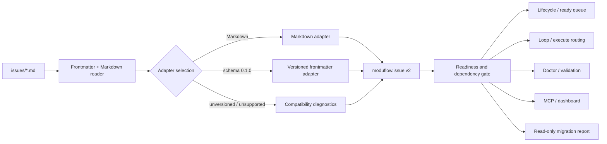

# Spec: Frontmatter Issue Schema and Readiness/Dependency Gate

Issue: `093-frontmatter-issue-schema-readiness-gate`
Prev: `048-artifact-lifecycle-sync`, `069-issue-dependency-priority-model`, `077-implementation-readiness-gate` · Next: `product:plan`

## Problem

ModuFlow currently has more than one interpretation of an issue. `project_lifecycle.py` reads bold Markdown metadata, while projects such as ModuPay Biz also carry versioned YAML frontmatter with `canonical_state`, `status`, `definition_readiness`, `gate_state`, `depends_on`, and `next_command`.

Those values can contradict one another without being detected. In the verified ModuPay Biz dogfood case:

- BIZ-038 and BIZ-039 were canonically backlog items whose dependency BIZ-033 was still active, but their auxiliary status and next command said they were ready to execute.
- BIZ-040 was canonically backlog with draft definition readiness and correctly needed a spec before execution.
- Existing validation reported no lifecycle drift because it ignored the frontmatter contract.

The user-facing failure is not “YAML support is missing.” The failure is that ModuFlow can show an issue as runnable, recommend execution, or render an inaccurate dashboard even when the same issue file proves that work is blocked or under-defined.

## Goals

1. Provide one normalized issue read model for Markdown-only and versioned-frontmatter issues.
2. Make dependency, definition-readiness, gate, lifecycle, artifact-phase, and next-command rules deterministic.
3. Prevent blocked or under-defined work from being routed to `product:execute`.
4. Preserve existing Markdown projects without requiring a bulk rewrite.
5. Make every consumer—lifecycle, ready queue, loop, doctor, validation, MCP, and dashboard—use the same interpretation.
6. Produce actionable diagnostics and read-only migration proposals instead of silently rewriting user files.

## Non-Goals

- Do not redesign the dashboard UI.
- Do not automatically rewrite existing issue files or add frontmatter to every project.
- Do not make YAML frontmatter the default ModuFlow authoring format.
- Do not treat lifecycle state, auxiliary status, definition readiness, and gate state as synonyms.
- Do not replace Issue 077's implementation-content readiness checks; Issue 093 runs before them.
- Do not add project-specific exceptions through arbitrary free-form fields.
- Do not build a general-purpose YAML framework or accept executable/custom YAML tags.

## Users & Scenarios

- **As a product owner**, I want the dashboard and next-step recommendation to agree with the issue's real dependencies and definition state, so I can trust “ready” and “blocked.”
- **As an executing agent**, I want one normalized contract before planning or execution, so I cannot bypass an active dependency or missing spec by reading only one field.
- **As a maintainer**, I want mixed-schema projects to receive precise migration suggestions without having their issue files changed automatically.

## Product Decisions

### 1. One Shared Normalizer

Add a dedicated module, planned as `scripts/project_issue_schema.py`. It owns issue-file parsing, schema adaptation, normalization, diagnostic generation, and read-only migration reporting.

Existing public helpers may remain as compatibility wrappers, but they must delegate to the shared normalizer. No lifecycle, MCP, dashboard, or validator consumer may maintain a second status/dependency parser.

### 2. Compatibility Policy

| Input shape | Canonical lifecycle source | Frontmatter behavior |
| --- | --- | --- |
| No frontmatter | Markdown `**Status:**` | Existing behavior preserved. |
| Recognized `schema_version` | Frontmatter `canonical_state` | Markdown status is a required human projection and must agree. |
| Frontmatter without `schema_version` | Markdown `**Status:**` | Known fields produce warnings and migration proposals; they cannot advance readiness. Unmet dependencies may conservatively block execution. |
| Unsupported `schema_version` | None until migrated | Hard diagnostic; no ready/execute routing. |

This intentionally chooses backward compatibility over guessing. Unversioned frontmatter can reduce readiness for safety, but cannot declare an issue ready, active, or executable.

### 3. Dependency Projection

- Markdown-only issues use `**Blocked-by:**`.
- Recognized versioned frontmatter uses `depends_on` as canonical.
- When a versioned issue also carries `**Blocked-by:**`, both projections must contain the same normalized IDs.
- For unversioned frontmatter, Markdown remains canonical; any known `depends_on` value is diagnostic-only except that an unfinished referenced issue conservatively blocks execute routing.
- Dangling references, self-dependencies, and cycles remain hard lifecycle errors.

### 4. Separate State Dimensions

The normalizer preserves these as different fields:

- `lifecycle_state`: durable work state such as `backlog`, `active`, `done`, or `superseded`.
- `projection_status`: optional human/legacy status that must map consistently to lifecycle state.
- `definition_readiness`: whether the issue definition is sufficient to move past spec.
- `gate_state`: whether a required review or execution gate is pending, in progress, blocked, or passed.
- `declared_phase`: the phase claimed by frontmatter, retained for comparison and diagnostics.
- `artifact_phase`: phase derived from actual spec/plan/tasks/review/release artifacts.
- `declared_next_command`: the command written in the issue.
- `recommended_next_command`: the command derived from normalized facts.

`ready` is a computed result, not a lifecycle state that a single field can assert.

For recognized schema `0.1.0`, auxiliary `status` projects as follows:

| Auxiliary `status` | Required lifecycle state |
| --- | --- |
| `backlog` | `backlog` |
| `in_progress` | `active` |
| `done` | `done` |

`ready` and `blocked` are rejected as lifecycle projections because readiness and blocking are derived from dependencies, definition readiness, gate state, and artifacts. This makes BIZ-038/039's `canonical_state: backlog` plus `status: ready` an actionable contradiction rather than a second source of truth.

## Proposed Architecture



### Module Boundary

`project_issue_schema.py` exposes a small stable interface:

- `parse_issue(path, project_root) -> normalized issue`
- `list_normalized_issues(project_root) -> normalized issues`
- `evaluate_issue(issue, issue_index, artifact_index) -> readiness result`
- `build_migration_report(project_root) -> report`

Consumers depend on this interface rather than its parsing internals.

### Supported Frontmatter Subset

Issue 093 only needs top-level scalar fields and top-level scalar lists used by the versioned issue contract. Implement a dependency-free, standard-library parser for that explicit subset; PyYAML is not currently part of the distributed ModuFlow runtime. Parsing must:

- never execute custom YAML tags or constructors;
- reject duplicate canonical keys;
- diagnose unsupported nested objects instead of guessing;
- preserve unknown fields without letting them affect routing;
- reject anchors, aliases, tags, multi-document YAML, and unsupported nested structures with a stable diagnostic.

## Normalized Read Model

The machine-readable shape is `moduflow.issue.v2`:

```json
{
  "schema": "moduflow.issue.v2",
  "issue_id": "BIZ-038",
  "source_path": "issues/BIZ-038.md",
  "source_format": "frontmatter-0.1.0",
  "title": "charging history shared boundary refactor",
  "lifecycle_state": "backlog",
  "projection_status": "ready",
  "priority": "p2",
  "blocked_by": ["BIZ-033"],
  "definition_readiness": "ready",
  "gate_state": "pending",
  "declared_phase": "post_release_qa_refactor",
  "artifact_phase": "issue",
  "declared_next_command": "product:execute BIZ-038 shared-charging-boundary",
  "recommended_next_command": "product:status",
  "readiness": "blocked",
  "diagnostics": [
    {
      "code": "ISSUE_AUX_STATUS_INVALID",
      "severity": "error",
      "field": "status",
      "current": "ready",
      "expected": "backlog for canonical_state backlog",
      "message": "Ready is derived and cannot be declared as the lifecycle projection.",
      "recommendation": "Set the projected status to backlog and let the readiness gate calculate ready."
    },
    {
      "code": "ISSUE_DEPENDENCY_UNMET",
      "severity": "error",
      "field": "depends_on",
      "current": "BIZ-033: active",
      "expected": "done or superseded",
      "message": "BIZ-038 cannot execute while BIZ-033 is active.",
      "recommendation": "Keep BIZ-038 blocked and continue BIZ-033."
    }
  ]
}
```

Existing CLI and MCP payloads may expose a backward-compatible subset plus additive v2 fields. The normalized record is the internal source for every projection.

## Gate and Command Precedence

The evaluator applies rules in this order. A later rule cannot override an earlier blocking result.

1. **Schema validity**: malformed or unsupported version → hard error, recommend `product:doctor` and migration report.
2. **Lifecycle projection consistency**: canonical and human-projected state disagreement → hard drift error.
3. **Dependency integrity**: dangling/cycle/self/unmet dependency → block ready, active, and execute routing.
4. **Definition readiness**: `draft` → recommend `product:spec <issue>`.
5. **Artifact phase**: missing required spec or plan → recommend the earliest missing artifact command.
6. **Gate state**: `blocked` or unresolved `pending` gate → no execute routing; recommend the gate's review/remediation step.
7. **Issue 077 readiness**: when the structural gate passes, existing implementation-readiness checks may still return warning/not-ready.
8. **Declared next command**: compare the declared command with the derived command and report any attempt to skip an earlier gate.

A versioned adapter may declare a definition-readiness exception only in code, with an issue-type allowlist, written rationale, and regression test. A free-form issue field cannot bypass the gate.

## Diagnostic Contract

Diagnostics use stable codes and include enough context to act without reading parser internals.

Initial codes:

- `ISSUE_FRONTMATTER_UNVERSIONED`
- `ISSUE_SCHEMA_UNSUPPORTED`
- `ISSUE_SCHEMA_MALFORMED`
- `ISSUE_DUPLICATE_FIELD`
- `ISSUE_AUX_STATUS_INVALID`
- `ISSUE_STATE_PROJECTION_MISMATCH`
- `ISSUE_DEPENDENCY_PROJECTION_MISMATCH`
- `ISSUE_DEPENDENCY_UNMET`
- `ISSUE_DEPENDENCY_DANGLING`
- `ISSUE_DEPENDENCY_CYCLE`
- `ISSUE_DEFINITION_NOT_READY`
- `ISSUE_GATE_BLOCKED`
- `ISSUE_NEXT_COMMAND_INVALID`

Every error includes file/issue identity, field, current value, expected value, a plain-language message, and a concrete recommendation. Warnings never silently become lifecycle truth.

## Migration Report

Provide a read-only report mode, planned as:

```bash
python3 scripts/project_issue_schema.py <project-path> --report
```

Output schema: `moduflow.issue-migration-report.v1`.

The report lists:

- detected source format and schema version;
- canonical/projection conflicts;
- fields that can be mapped safely;
- unsupported or ambiguous fields requiring human choice;
- proposed Markdown/frontmatter changes as data, not file writes;
- routing impact before and after the proposed migration.

Issue 093 does not provide `--write`. Any later write mode requires a separate approved issue.

## Consumer Migration

The implementation plan must migrate these consumers to the shared normalizer:

- `project_lifecycle.py`: lifecycle map, issue listing, priority, dependencies, ready queue, drift.
- `project_loop.py`: phase and next-command recommendation.
- `validate_project_artifacts.py` and `project_doctor.py`: hard errors and actionable recommendations.
- `mcp_server.py`: issue and ready payloads.
- `project_memory.py`: issue graph, Issue DB status, attention flags, and next command.
- `issue_generator.py` and templates: continue emitting valid canonical Markdown; do not switch defaults to frontmatter.

Temporary compatibility wrappers are allowed. Duplicate parsing logic is not.

## Dogfood Expectations

Use sanitized local fixtures derived from BIZ-033, BIZ-038, BIZ-039, and BIZ-040; tests must not depend on the external ModuPay Biz checkout.

Expected results:

| Fixture | Expected result |
| --- | --- |
| BIZ-033 | Active release-QA issue; dependency set is resolved from the fixture index; execute is allowed only if its gate/artifact rules pass. |
| BIZ-038 | Blocked by active BIZ-033; `status: ready` and execute command are diagnosed. |
| BIZ-039 | Blocked by active BIZ-033; execute routing is rejected. |
| BIZ-040 | Routed to `product:spec BIZ-040` because definition readiness is draft. |
| Legacy Markdown issue | Existing lifecycle, priority, dependency, MCP, and dashboard behavior remains unchanged. |

## Acceptance Criteria

- [ ] Markdown-only issue behavior remains backward compatible.
- [ ] Recognized versioned frontmatter produces a `moduflow.issue.v2` normalized record.
- [ ] Unversioned frontmatter keeps Markdown canonical, emits migration guidance, and cannot advance an issue to ready/execute.
- [ ] Frontmatter `depends_on` participates in ready/blocked queries and dangling/cycle validation for recognized schemas.
- [ ] A versioned issue's canonical state and Markdown projection disagreement is a hard drift error.
- [ ] An issue with an unfinished dependency cannot be ready, active, or routed to execute.
- [ ] `definition_readiness: draft` routes to `product:spec` unless a code-declared, tested issue-type exception exists.
- [ ] Contradictory lifecycle, projection status, gate state, artifact phase, and next command produce stable actionable diagnostics.
- [ ] BIZ-038 and BIZ-039 are blocked by active BIZ-033; BIZ-040 routes to spec.
- [ ] Lifecycle, loop, validation, doctor, MCP, and dashboard consume the shared normalizer with no independent issue-state parser remaining.
- [ ] Migration report mode proposes changes without writing issue files.
- [ ] Focused tests, dependency/loop regressions, project validation, and `python3 scripts/release_check.py .` pass.

## Verification

```bash
python3 -m unittest discover -s tests -p 'test_*issue*schema*.py' -v
python3 -m unittest tests.test_issue_dependencies tests.test_project_loop tests.test_mcp_server tests.test_project_memory -v
python3 scripts/validate_project_artifacts.py .
python3 scripts/release_check.py .
```

## Risks & Mitigations

- **Backward-compatibility regression**: preserve Markdown defaults and add fixture parity tests before migrating consumers.
- **False readiness from partial frontmatter**: unversioned metadata can only reduce readiness, never advance it.
- **Parser duplication during migration**: compatibility wrappers must delegate to the normalizer; static distribution tests check consumer imports.
- **Unsafe or over-broad YAML parsing**: use a dependency-free parser limited to the documented top-level scalar/list subset and reject all richer YAML features deterministically.
- **Issue 077 overlap**: 093 validates structural state first; 077 continues to judge implementation content afterward.
- **Dashboard disagreement**: dashboard rows must render normalized state and diagnostics, never re-parse source text.

## Alternatives Considered

1. **Extend `project_lifecycle.py` directly**: smaller initial diff, but it makes MCP, dashboard, and validation depend on a lifecycle-specific implementation and encourages more coupling.
2. **Let each consumer add frontmatter support**: fastest locally, rejected because it recreates the exact disagreement this issue fixes.
3. **Build a generic adapter registry now**: flexible but unnecessary for two supported input shapes. Start with one module and explicit version dispatch; extract a registry only when a third real schema arrives.

## Open Questions Resolved

- **Unversioned frontmatter**: Markdown remains canonical; warnings and conservative blocking only.
- **Default authoring format**: canonical Markdown remains the default.
- **Automatic migration**: excluded; report-only.
- **Primary architecture**: dedicated shared normalizer, not lifecycle-specific parsing.

## Next Command

`product:plan 093-frontmatter-issue-schema-readiness-gate`
