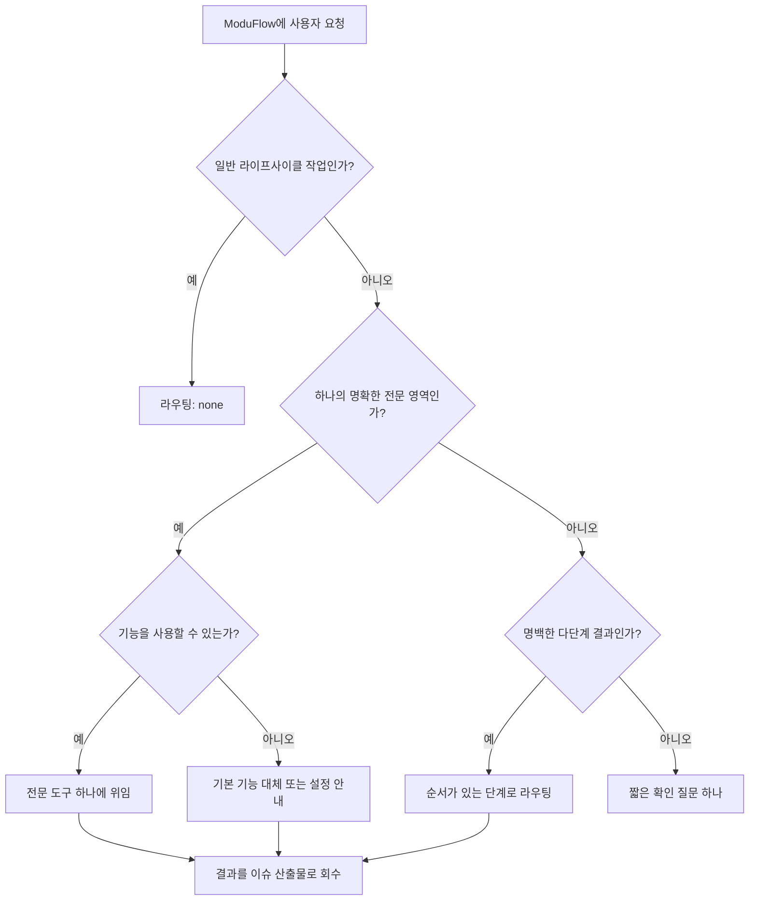

# 스펙: 단일 진입점 기능 라우팅 계약

이슈: `097-single-entry-capability-routing-contract`
이전: 사용자 제품 방향 세션, 이슈 026/055/067/076/079 · 다음: `product:plan`

## 문제

ModuFlow는 이미 `/moduflow`를 단일 진입점으로 제공하고 전문 기능을 필요할 때만
사용하도록 안내한다. 하지만 실제 선택 정책은 여러 명령·스킬 문서에 흩어져 있고
조정 에이전트의 판단에 의존한다. 공통 결정 형식, 명시적인 비호출 규칙, 일반적인
라이프사이클 요청이 전문 도구를 피하고 한정된 요청이 하나의 어댑터만 선택한다는
회귀 테스트가 없다.

그 결과 프롬프트 변경, 업스트림 업데이트, 겹치는 스킬, 불필요한 컨텍스트 로딩,
설명되지 않은 권한 확장에 영향을 받을 수 있다. 전문 구현을 ModuFlow 안에 복사하거나
새 플러그인 런타임을 추가하지 않고 현재의 가벼운 구조를 신뢰할 수 있게 만들어야 한다.

## 목표

1. 사용자가 기억할 진입점을 ModuFlow 하나로 유지한다.
2. 일반 라이프사이클 작업은 전문 도구를 호출하지 않고, 한정된 전문 요청은 최대 하나만
   선택한다.
3. 전문 도구 선택을 설명 가능하고, 권한·가용성을 인식하며, 테스트 가능하게 만든다.
4. 위임 결과를 정식 ModuFlow 이슈와 산출물 흐름으로 회수한다.
5. 업스트림이나 플러그인이 바뀌어도 제품 흐름을 다시 작성하지 않도록 어댑터 교체성을
   유지한다.
6. 어댑터나 프롬프트 변경을 받아들이기 전에 반복 가능한 오프라인 시뮬레이션으로
   라우팅 동작을 증명한다.

## 비목표

- 새로운 외부 플러그인을 설치하거나 활성화하지 않는다.
- 범용 플러그인 관리자, 워크플로 엔진, 데이터베이스, 마켓플레이스를 만들지 않는다.
- 직접 사용하는 `product:*` 명령을 없애지 않는다.
- 라이프사이클, 이슈, 로드맵, 메모리, 리뷰, Git, PR, 릴리스의 소유권을 ModuFlow 밖으로
  옮기지 않는다.
- 외부 쓰기 작업을 자동 승인하지 않는다.

## 사용자와 시나리오

- 제품 책임자는 어떤 플러그인을 선택할지 몰라도 ModuFlow에 자연어로 요청할 수 있다.
- 조정 에이전트는 상태·이슈 같은 일상 작업에 전문 도구를 호출하지 않는다.
- 명확한 분석·디자인·구현 요청에는 전문 도구 하나를 선택하고 이유를 설명한다.
- 사용할 수 없는 기능이나 추가 권한은 실행한 것처럼 처리하지 않고 사실대로 보고한다.
- 유지보수자는 어댑터나 프롬프트 업데이트가 라우팅을 바꾸면 회귀 테스트로 발견한다.

## 제안 해결책

기존 허브, 라우터 스킬, 어댑터 위에 얇은 라우팅 계약을 둔다.

### 기능 설명자

각 전문 도구는 ModuFlow가 라우팅에 필요한 메타데이터만 제공한다.

- 안정적인 어댑터 ID와 목적
- 호출 조건과 명시적인 제외 조건
- 가용성 확인
- 권한 등급: `read`, `write-local`, `write-external`
- 입력과 반환할 ModuFlow 산출물 유형
- 다단계 작업의 선택적 순서 제약

전문 도구의 구현 자체는 포함하거나 복사하지 않는다.

### 라우팅 결과

요청은 세 결과 중 하나로 결정된다.

- `none`: ModuFlow가 직접 처리한다.
- `delegate`: 사용 가능한 전문 도구 하나만 선택한다.
- `sequence`: 명백한 다단계 작업에만 순서를 정하고 현재 단계만 호출한다.

모든 위임 결과에는 선택된 어댑터, 선택 이유, 필요한 권한, 가용성, 이슈 ID, 결과를
저장할 산출물이 포함된다. 범위나 권한이 달라지는 모호함은 여러 도구를 고르는 대신
짧은 질문 하나로 확인한다.

### 회귀 테스트 묶음

다음 사례를 최소한 포함한다.

- 반드시 `none`이어야 하는 라이프사이클 요청
- 명확한 분석·디자인·구현 요청
- 여러 도구로 퍼지면 안 되는 겹치는 표현
- 사용할 수 없는 전문 도구
- 외부 쓰기 승인을 표시해야 하는 요청
- 안정된 순서와 산출물 인계가 필요한 다단계 요청
- 의미가 같은 한국어·영어 요청

### 오프라인 라우팅 시뮬레이션

라우팅 계약에 픽스처 기반 시뮬레이션 하니스를 추가한다. 각 픽스처는 다음을 포함한다.

- 요청 문장과 언어
- 사용 가능하거나 사용할 수 없는 기능 ID
- 권한 조건과 승인 여부
- 기대 결과: `none`, `delegate`, `sequence`, `clarify`
- 기대 어댑터 또는 어댑터 실행 순서
- 기대 권한 결과와 목적 산출물
- 같은 의도를 다르게 표현한 사례를 연결하는 의미 쌍 ID

하니스는 라우팅만 평가한다. 전문 도구를 실행하거나 외부 런타임을 불러오거나 로컬·외부
변경을 수행하지 않는다. 따라서 전문 도구의 결과 품질과 라우팅 품질을 분리하면서 빠르고
안전하며 반복 가능하게 실행할 수 있다.

최초 커밋에는 다음 8개 경계 유형을 아우르는 사례를 최소 24개 포함한다.

1. 일반 라이프사이클 작업
2. 한정된 데이터 분석
3. 한정된 제품 디자인
4. 한정된 구현
5. 겹치거나 모호한 영역
6. 사용할 수 없는 기능
7. 외부 쓰기 권한 경계
8. 명백한 다단계 작업

매 실행은 기계가 읽을 수 있는 사례별 결과와 다음 요약 지표를 출력한다.

- 기대 라우팅·어댑터 일치
- 불필요한 동시 호출 수
- 권한 위반 수
- 사용할 수 없는 기능을 실행했다고 판단한 수
- 필수 인계 필드 누락 수
- 한국어·영어 및 바꿔 쓴 표현 간 일관성

안전 실패는 릴리스 차단 조건이다. 불필요한 동시 호출, 권한 위반, 거짓 기능 실행 판단,
필수 인계 필드 누락은 모두 0이어야 한다. 제품 경계 픽스처는 기대 라우팅, 어댑터,
실행 순서, 권한 결과와 정확히 일치해야 한다. 기대 결과를 바꾸려면 스냅샷을 조용히
갱신하지 않고 픽스처 변경을 의도적으로 검토한다.

## 검토한 대안

### 문서 기반 라우팅 유지

현재의 저비용 기준선이지만 프롬프트 변화나 비호출 규칙을 검증할 수 없어 최종안으로는
선택하지 않았다.

### 전체 플러그인 레지스트리와 오케스트레이션 런타임 구축

호스트의 플러그인 기능을 중복하고 권한·유지보수 범위를 넓히며 온디맨드 사용 선호와
충돌하므로 제외했다.

### 관련 가능성이 있는 전문 도구를 모두 호출

컨텍스트, 지연, 비용, 결과 충돌, 권한 위험을 키우므로 제외했다.

### 선택안: 교체 가능한 어댑터 위의 얇은 계약

현재 구조를 유지하면서 신뢰성을 위해 필요한 최소한의 실행 가능한 동작만 추가한다.

## 인수 기준

- 상태·이슈·로드맵·목표·루프·검사 등 일반 요청은 전문 도구 없이 처리된다.
- 명확한 분석·디자인·구현 요청은 사용 가능한 전문 도구 하나를 선택한다.
- 다단계 작업은 순서와 산출물 인계가 있으며 기본적으로 동시에 실행하지 않는다.
- 모든 위임은 어댑터, 이유, 권한, 가용성, 이슈 ID, 결과 산출물을 기록한다.
- 기능을 사용할 수 없으면 사실에 맞는 대체 처리나 설정 안내를 제공한다.
- 한국어·영어 대표 요청이 결정론적인 회귀 테스트로 보호된다.
- 최소 24개의 오프라인 시뮬레이션 픽스처가 8개 경계 유형을 모두 포함하고, 의미가 같은
  한국어·영어 요청 쌍을 포함한다.
- 시뮬레이션은 사례별 기대 라우팅, 어댑터, 순서, 권한, 산출물 인계와 전체 안전·일관성
  지표를 보고한다.
- 불필요한 동시 호출, 권한 위반, 거짓 기능 실행 판단, 필수 인계 필드 누락이 모두 0이다.
- 시뮬레이션은 전문 도구를 실행하거나 외부 변경을 수행하지 않는다.
- 기존 직접 명령과 Git 기반 산출물이 호환된다.
- 새로운 필수 런타임, 데이터베이스, 플러그인을 추가하지 않는다.

## 위험과 미결 사항

- 자연어 의미를 완전히 결정론적으로 만들 수는 없다. 범용 분류기보다 제품 경계를
  보호하는 대표 사례에 집중한다.
- 호스트마다 기능 가용성이 다르므로 라우팅 적격성과 실제 실행 가능성을 분리해야 한다.
- 어댑터 메타데이터도 오래될 수 있으므로 기존 업스트림 최신성·리뷰 규칙에 포함한다.
- 구현 계획에서는 새 프레임워크보다 기존 어댑터 확장과 작은 라우터 도우미를 우선한다.

## 다음 명령

`/product:plan 097-single-entry-capability-routing-contract`
