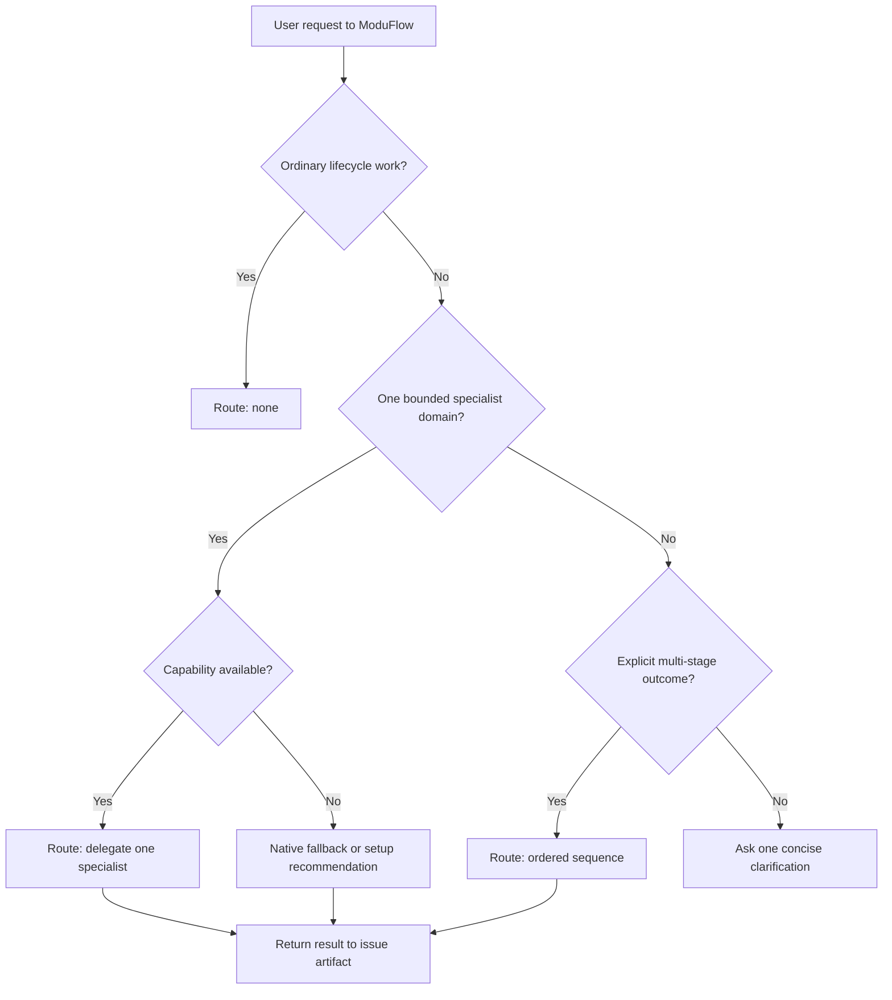

# Spec: Single-Entry Capability Routing Contract

Issue: `097-single-entry-capability-routing-contract`
Prev: user product-direction session, issues 026/055/067/076/079 · Next: `product:plan`

## Problem

ModuFlow already presents `/moduflow` as its single entry point and describes specialist
capabilities as on demand. The actual selection policy is still spread across command and skill
prose and depends on coordinator judgment. There is no common decision shape, no explicit
negative routing contract, and no regression matrix proving that ordinary lifecycle work avoids
specialists or that a bounded specialist request selects only one adapter.

This makes the experience vulnerable to prompt drift, upstream updates, overlapping skills,
unnecessary context loading, and unexplained permission expansion. The solution must make the
existing light architecture reliable without adding a plugin runtime or copying specialist
implementations into ModuFlow.

## Goals

1. Keep ModuFlow as the only entry point users need to remember.
2. Select no specialist for ordinary lifecycle work and at most one for a bounded specialist
   request.
3. Make specialist choice explainable, permission-aware, availability-aware, and testable.
4. Return delegated work to the canonical ModuFlow issue and artifact chain.
5. Preserve replaceable adapters so future source or plugin changes do not rewrite the product
   workflow.
6. Prove routing behavior with repeatable offline simulations before accepting adapter or prompt
   changes.

## Non-Goals

- Installing or activating a new external plugin.
- Creating a general plugin manager, workflow engine, database, or marketplace.
- Replacing direct `product:*` commands.
- Moving lifecycle, issue, roadmap, memory, review, Git, PR, or release ownership outside
  ModuFlow.
- Automatically approving external write actions.

## Users & Scenarios

- As a product owner, I want to ask ModuFlow in natural language without deciding which plugin
  to invoke, so that the workflow stays simple.
- As a coordinator, I want lifecycle requests to choose no specialist, so that routine status
  and issue work stays fast and inexpensive.
- As a coordinator, I want a bounded analytics, design, or implementation request to choose one
  specialist and explain why, so that routing is predictable.
- As a reviewer, I want unavailable capabilities and permission requirements reported honestly,
  so that a route cannot claim work that never ran.
- As a maintainer, I want representative routing cases to fail when an adapter or prompt update
  changes behavior unintentionally.

## Proposed Solution

Introduce a thin routing contract over the existing hub, router skill, and adapters.

### Capability descriptor

Each specialist exposes only routing metadata required by ModuFlow:

- stable adapter ID and human-readable purpose
- positive triggers and explicit exclusions
- host-confirmed availability check that defaults fail-closed when omitted
- permission class: `read`, `write-local`, or `write-external`
- expected input and returned ModuFlow artifact type
- optional ordering constraints for multi-stage work

The descriptor does not embed or copy the specialist implementation.

### Routing result

A request resolves to one of three outcomes:

- `none`: ModuFlow handles the request directly.
- `delegate`: exactly one available specialist is selected.
- `sequence`: explicitly multi-stage work receives an ordered list; only the current stage is
  invoked and its artifact gates the next stage.

Every delegated outcome includes the selected adapter, selection reason, required permission,
availability result, issue ID, and destination artifact. Ambiguity that changes scope or
permission asks one concise clarification instead of selecting multiple specialists.

The installed/bundled ModuFlow package owns the registry and router executable; the target
project is a separate input and only receives contained `specs/<issue-id>/...` artifact paths.
For a sequence, verified predecessor artifact paths are fed back into routing so the result can
advance one stage or report `ready`, `blocked`, or `complete` without activating stages together.

### Regression matrix

Tests cover at least:

- lifecycle requests that must route to `none`
- clear analytics, design, and implementation requests
- overlapping terms that must not fan out
- unavailable specialists
- external-write routes that must surface approval requirements
- genuine multi-stage requests with stable ordering and artifact handoffs
- semantically equivalent Korean and English requests

### Offline routing simulation

Add a fixture-driven simulation harness around the routing contract. A fixture contains:

- request text and locale
- available and unavailable capability IDs
- permission context and whether approval is present
- expected outcome: `none`, `delegate`, `sequence`, or `clarify`
- expected adapter or ordered adapters
- expected permission result and destination artifact
- semantic-pair ID when another fixture expresses the same intent differently

The harness evaluates routing only. It must not invoke a specialist, load an external runtime,
or perform local or external mutations. This keeps the suite fast, safe, and reproducible while
separating route quality from specialist output quality.

The initial committed corpus contains at least 24 cases across eight boundary classes:

1. ordinary lifecycle work
2. bounded analytics
3. bounded product design
4. bounded implementation
5. overlapping or ambiguous domains
6. unavailable capability
7. external-write permission boundary
8. explicit multi-stage work

Each run emits machine-readable case results and a concise summary with:

- expected-route and expected-adapter agreement
- unwanted fan-out count
- permission violation count
- false capability claim count
- missing handoff-field count
- Korean/English and paraphrase consistency

Safety failures are release blockers: unwanted fan-out, permission violations, false capability
claims, and missing required handoff fields must all be zero. Product-boundary fixtures must
exactly match the expected route, adapter, sequence order, and permission result. A changed
expectation requires an intentional fixture review rather than silently updating snapshots.

## Alternatives Considered

### Keep documentation-only routing

Rejected as the final state. It is the current low-cost baseline, but it cannot detect prompt
drift or prove negative routes.

### Build a full plugin registry and orchestration runtime

Rejected. It duplicates host/plugin infrastructure, increases permission and maintenance
surface, and conflicts with the user's on-demand usage preference.

### Always invoke every possibly relevant specialist

Rejected. It increases context, latency, cost, conflicting output, and permission risk while
making the single-entry experience less predictable.

### Selected: thin contract over replaceable adapters

This preserves the existing architecture while adding the smallest enforceable behavior needed
to make it trustworthy.

## Acceptance Criteria

- Ordinary ModuFlow status, issue, roadmap, goal, loop, doctor, and lifecycle requests resolve
  without a specialist.
- A bounded analytics, design, or implementation request chooses one matching available
  specialist.
- Multi-stage work is ordered and artifact-gated; specialists are not activated together by
  default.
- Every delegated route records adapter, reason, permission, availability, issue ID, and output
  artifact.
- Missing capability availability results in a truthful fallback or setup recommendation.
- Omitted capability availability is treated as unavailable until the host explicitly confirms
  it; unknown/non-boolean host availability and unsafe issue/artifact paths fail closed.
- Representative Korean and English routing fixtures are deterministic and regression-tested.
- At least 24 committed offline simulation fixtures cover all eight boundary classes and include
  semantically equivalent Korean and English pairs.
- The simulation reports expected route, adapter, order, permission, and artifact handoff per
  case plus aggregate safety and consistency metrics.
- Simulation produces zero unwanted fan-out, permission violations, false capability claims,
  and missing required handoff fields.
- Simulation never invokes a specialist or performs an external mutation.
- Existing direct commands and Git-native artifacts remain compatible.
- No new mandatory runtime, database, or plugin is introduced.

## Risks & Open Questions

- Prompt semantics cannot be made perfectly deterministic; fixtures should protect stable
  product boundaries rather than attempt a universal intent classifier.
- Capability availability differs by host. The contract must separate route eligibility from
  actual runtime availability.
- Adapter metadata can become another stale surface. Existing vendor freshness and review rules
  should cover routing metadata changes.
- The implementation plan must choose the smallest executable representation—extending current
  adapters and a focused router helper is preferred over introducing a new framework.

## Next Command

`/product:plan 097-single-entry-capability-routing-contract`
