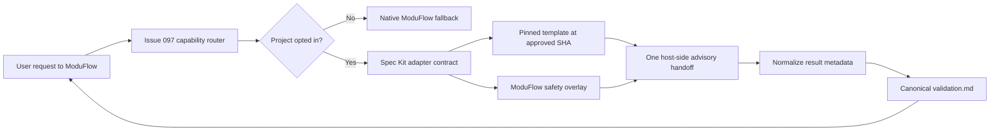

# Spec: Spec Kit Selective Validation Adapter

Issue: `098-speckit-selective-validation-adapter`
Prev: Issue 097 routing contract and user design approval · Next: `product:plan`

## Problem

Spec Kit 0.16.1 provides useful `clarify`, `analyze`, `checklist`, and `converge` command
templates, but they are agent prompt workflows rather than standalone `specify` CLI
subcommands. A full Spec Kit initialization would add `.specify`, scripts, hooks, generated
commands, and a second spec lifecycle to every opted-in project. That conflicts with the user's
on-demand usage preference and ModuFlow's Git-native ownership.

ModuFlow needs the reasoning value of those four workflows without installing the full runtime,
executing upstream scripts or hooks, or allowing Spec Kit to mutate implementation, Git, issue
state, review, or release artifacts.

## Decision

Use a **selective command-template adapter**:

1. Pin only the four reviewed upstream command templates at the approved Spec Kit version and
   SHA.
2. Apply a ModuFlow-owned safety overlay that replaces Spec Kit path discovery, hooks, scripts,
   and mutation rules.
3. Activate the adapter only when a project has explicitly opted in and the user requests one
   of the four functions.
4. Return advisory results to the canonical ModuFlow issue/spec chain.

This decision was approved by the user on 2026-08-10. Full Spec Kit installation and native
reimplementation were rejected.

## Goals

1. Make `clarify`, `analyze`, `checklist`, and `converge` available through ModuFlow natural
   language without requiring users to memorize Spec Kit commands.
2. Keep default cost at zero: no template or specialist context is loaded until explicit use.
3. Keep ModuFlow issues, specs, plans, tasks, Git state, review, and release authoritative.
4. Make every run explainable through source version, function, inputs, limitations, output,
   and fallback metadata.
5. Measure value and overlap before recommending any function more broadly.

## Non-Goals

- Installing or running the full `specify` CLI workflow in target projects.
- Creating `.specify`, agent command directories, extension configuration, or community
  extension state.
- Executing upstream prerequisite scripts, extension hooks, shell commands, PowerShell, Python
  helpers, Git commands, or implementation commands declared by upstream templates.
- Delegating `specify`, `plan`, `tasks`, `implement`, Git, issue state, roadmap, memory, PR,
  review, release, or deployment ownership to Spec Kit.
- Automatically editing `spec.md`, `plan.md`, or `tasks.md` from an advisory result.
- Making Spec Kit globally enabled or mandatory.

## Alternatives Considered

### A. Selected: four pinned templates plus a ModuFlow safety overlay

Smallest authentic use of the official workflows. Upstream remains replaceable and traceable,
while one template is loaded only for the requested function. The overlay prevents upstream
runtime assumptions from crossing ModuFlow boundaries.

### B. Full Spec Kit project initialization

Rejected. It would be the closest upstream experience, but it installs a parallel artifact and
command surface, enables hooks/scripts that ModuFlow does not own, and increases context and
maintenance cost.

### C. Reimplement all four functions as native ModuFlow checks

Rejected. It would be light, but the result would not actually expose Spec Kit's evolving
reasoning patterns and would duplicate native `spec_consistency.py` and `project_converge.py`.

## Architecture



### Components

| Component | Responsibility |
| --- | --- |
| `.moduflow/capabilities.json` | Project-scoped opt-in and allowed-function list; absent means disabled |
| `vendor/spec-kit/0.16.1/commands/` | Exact reviewed snapshots of the four official command templates |
| `overlays/spec-kit/selective-validation-policy.md` | Non-negotiable ModuFlow path, permission, mutation, and output rules |
| `adapters/spec-kit.yaml` | Source/version/function mapping, fallback map, ownership exclusions |
| `scripts/spec_kit_adapter.py` | Validate config and paths; emit deterministic status/handoff/normalization metadata |
| `skills/spec-kit-validation-bridge/SKILL.md` | Load exactly one selected template plus the overlay and return advisory output |
| `specs/<issue>/validation.md` | Append-only, human-reviewable canonical record of accepted runs |
| `specs/098-speckit-selective-validation-adapter/pilot-report.md` | Compare value, cost, false positives, and native overlap |

## Activation Contract

The project config is deliberately small:

```json
{
  "schema": "moduflow.capabilities.v1",
  "capabilities": {
    "spec-kit": {
      "enabled": true,
      "source_version": "0.16.1",
      "source_sha": "684b3d8e05263a7c1948d3d0699ab1cb4f77c3d5",
      "functions": ["clarify", "analyze", "checklist", "converge"]
    }
  }
}
```

Rules:

- Missing file, missing capability, `enabled: false`, version/SHA mismatch, missing asset, or a
  function outside the allowlist is unavailable and must use a truthful native fallback.
- Enabling or changing the config is an explicit local write; ordinary validation requests do
  not silently opt in.
- Unknown capability/function/config fields fail closed.
- The config contains no credentials, executable paths, shell commands, or host-specific
  secrets.
- Host availability and project opt-in are separate gates. Both must pass before Issue 097's
  router may mark Spec Kit available.

## Function Contract

### `clarify`

- Reads the owning issue and canonical `spec.md`.
- Produces at most five prioritized questions, one at a time, with rationale and a recommended
  answer when appropriate.
- Does not edit the spec. After the user answers, ModuFlow applies any approved clarification
  through its normal spec workflow.
- Falls back to ModuFlow's short shaping/spec clarification behavior.

### `analyze`

- Reads `spec.md`, `plan.md`, `tasks.md`, and the project constitution when available.
- Produces a read-only, severity-graded consistency and coverage report.
- Does not rewrite any artifact or create remediation tasks automatically.
- Falls back to `scripts/spec_consistency.py`.

### `checklist`

- Reads the canonical issue/spec and produces requirements-quality checklist candidates.
- Tests whether requirements are complete, clear, consistent, measurable, and scenario-covered;
  it does not test application implementation.
- Candidates enter `validation.md`; a separate explicit ModuFlow action may promote an approved
  checklist into the issue's artifact chain.
- Falls back to native acceptance/readiness checks.

### `converge`

- Reads `spec.md`, `plan.md`, `tasks.md`, constitution, and the bounded code scope declared in
  those artifacts.
- Produces remaining-work candidates classified as missing, partial, contradictory, or
  unrequested.
- Does not append to `tasks.md` and never invokes implementation. ModuFlow must explicitly approve
  and apply candidate tasks.
- Falls back to `scripts/project_converge.py` in report-only mode.

## Safety Overlay

The overlay has higher priority than upstream template text and must state:

1. Resolve all inputs from the explicit ModuFlow issue ID and target root; never infer a Spec Kit
   feature branch or `.specify` directory.
2. Ignore and never execute upstream frontmatter scripts, prerequisite helpers, extension hooks,
   handoff commands, Git operations, or implementation commands.
3. Read only declared canonical artifacts contained under the target project.
4. Treat upstream mutation instructions as advisory candidates. Only ModuFlow may write, after
   its existing permission and lifecycle gates.
5. Never load more than one function template per request.
6. Never claim Spec Kit executed when config, asset integrity, host availability, or user approval
   is missing.
7. Preserve existing findings. Accepted validation records are append-only; a duplicate run is a
   byte-stable no-op.

## Handoff and Result Shape

`scripts/spec_kit_adapter.py` emits metadata without invoking a model or writing a result:

```json
{
  "schema": "moduflow.spec-kit-handoff.v1",
  "outcome": "ready",
  "function": "analyze",
  "issue_id": "098-speckit-selective-validation-adapter",
  "source": {
    "version": "0.16.1",
    "sha": "684b3d8e05263a7c1948d3d0699ab1cb4f77c3d5",
    "template": "vendor/spec-kit/0.16.1/commands/analyze.md"
  },
  "permission": "read",
  "inputs": ["spec.md", "plan.md", "tasks.md", "constitution.md"],
  "output_artifact": "specs/098-speckit-selective-validation-adapter/validation.md",
  "limitations": ["advisory-only", "no upstream scripts or hooks"],
  "fallback": null
}
```

Allowed outcomes are `ready`, `disabled`, `unavailable`, `unsupported`, and `blocked`.
Every non-ready outcome sets `fallback` and leaves `output_artifact` unchanged.

An accepted host result appended to `validation.md` records:

- stable input/content hash and run ID
- issue ID and canonical source paths
- function, source version, source SHA, and template path
- permission and mutation mode
- findings/questions/candidates
- limitations and native overlap
- elapsed time and estimated loaded context
- user decision and next ModuFlow command

## Data Flow

1. ModuFlow resolves lifecycle aliases before specialist routing.
2. The capability router detects an explicit Spec Kit request.
3. The adapter validates target containment, opt-in config, allowed function, pinned assets, and
   host availability.
4. If any gate fails, it returns the mapped native fallback and loads no template.
5. If ready, the bridge loads the safety overlay and exactly one function template.
6. The host produces an advisory result; no upstream script or command is executed.
7. ModuFlow shows the result and asks for any mutation approval required by its native workflow.
8. Accepted evidence is appended to `validation.md`; rejected findings are still recorded with
   their disposition when the user requests a durable record.

## Error Handling

- Invalid JSON, unknown fields, unsafe paths, version drift, asset hash mismatch, unsupported
  functions, or unavailable host capability fail closed with structured JSON errors.
- Missing `plan.md`/`tasks.md` for `analyze` or `converge` returns a prerequisite fallback rather
  than a partial or falsely complete result.
- A bridge result missing source/version/issue/function/permission/output/limitations is rejected
  before persistence.
- A failed or interrupted run does not create an empty `validation.md` section.
- No-op reruns with the same source/input/function hash leave the file byte-for-byte unchanged.

## Pilot and Measurement

The pilot includes at least eight committed cases: one successful and one disabled/unavailable
case for each function, plus negative ownership cases covering implementation, lifecycle, Git,
review, and release language.

The pilot report records per function:

| Metric | Definition |
| --- | --- |
| Actionable value | Reviewer-confirmed unique useful questions/findings/candidates |
| Latency | Wall-clock time from accepted handoff to result |
| Context cost | Estimated characters/tokens loaded for overlay, one template, and inputs |
| False-positive rate | Rejected or factually invalid findings divided by total findings |
| Native overlap | Findings already produced by native ModuFlow checks divided by total findings |
| Boundary safety | Unauthorized writes, commands, fan-out, false claims, or ownership violations |

No function becomes automatic. A future issue may recommend a function more visibly only if the
pilot has zero boundary-safety violations and documents positive value beyond native checks.

## Acceptance Criteria

- A project with no capability config behaves exactly as before and receives a truthful native
  fallback without loading a Spec Kit template.
- An opted-in project can request each of the four functions through ModuFlow natural language.
- Only the requested function template is loaded; bounded requests never fan out.
- All four pinned templates match the approved upstream SHA/version and are validated by manifest
  hashes.
- Upstream scripts, hooks, extensions, Git operations, handoffs, and implementation commands are
  never executed.
- Every ready handoff records function, source version/SHA/template, issue ID, permission, inputs,
  limitations, fallback, and contained output artifact.
- `clarify` asks at most five questions; `analyze` is read-only; `checklist` produces advisory
  requirement checks; `converge` produces candidate work without mutating tasks or code.
- Implementation, lifecycle, Git, review, PR, release, and deployment requests remain owned by
  ModuFlow/Superpowers and route to no Spec Kit function.
- Accepted results append to canonical `validation.md`; duplicate runs are byte-stable no-ops.
- At least eight function/fallback fixtures and negative ownership fixtures pass offline.
- Pilot evidence reports value, latency, context cost, false positives, native overlap, and
  boundary safety for all four functions.
- Boundary violations, unauthorized writes, unwanted fan-out, and false execution claims are all
  zero.
- No mandatory runtime, database, community extension, or second source of truth is introduced.
- `python3 -m unittest discover -s tests` and `python3 scripts/release_check.py .` pass.

## Risks

- Upstream prompt templates can change semantics without a CLI API guarantee. Pinning SHA plus
  fixtures prevents silent drift.
- Raw upstream templates contain runtime assumptions and mutation instructions. The safety
  overlay and asset compatibility tests must fail closed if those assumptions are not neutralized.
- LLM output is non-deterministic. Tests validate selection, metadata, permissions, persistence,
  and fixture expectations; pilot results require human disposition rather than snapshotting prose.
- Four vendored templates add repository size. Only four files are pinned and only one loads per
  request, keeping runtime context on demand.

## Rollout

1. Implement config/status and fail-closed handoff generation.
2. Pin and integrity-check the four reviewed templates plus safety overlay.
3. Add the bridge and native fallback mappings.
4. Run offline boundary fixtures.
5. Pilot all four functions against representative ModuFlow artifacts and publish the comparison.
6. Keep activation explicit; wider recommendation requires a separate reviewed decision.

## Next Command

`product:plan 098-speckit-selective-validation-adapter`
